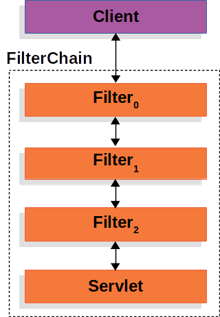
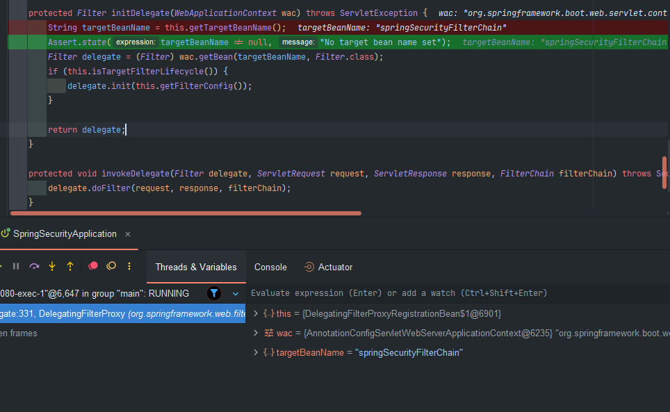
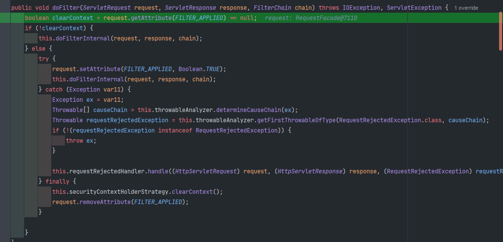

## 설정 클레스
### SecurityBuilder 와 SecurityConfigurer
**SecurityBuilder** 는 빌더 클래스로서 **웹 보안을 구성하는 빈 객체와 설정 클래스들을 생성**하는 역할이다. 대표적으로 `WebSecurity`, `HttpSecurity`가 있다.  

**SecurityConfigurer**는 Http 요청과 관련된 **보안처리를 담당하는 필터**를 `생성`, `초기화` 설정에 관여한다.  

**SecurityBuilder** 는 **SecurityConfigurer** 를 참조하고 있으며 인증 및 인가 초기화 작업은 **SecurityConfigurer** 에 의해 진행된다.
### SecurityBuilder

- **역할**: `SecurityBuilder`는 스프링 시큐리티의 핵심 인터페이스 중 하나로, 보안 객체를 구성하는 빌더 패턴을 제공합니다. 주로 보안 설정을 만들고 조립하는 데 사용됩니다.
- **주요 메서드**:
    - `build()`: 최종 보안 객체를 구성하고 반환합니다.
    - `setSharedObject(Class<T> sharedType, T object)`: 공유 객체를 설정합니다.
    - `getSharedObject(Class<T> sharedType)`: 공유 객체를 가져옵니다.
    - `getOrBuild()`: 빌더가 생성되었으면 해당 객체를 반환하고, 아니면 새로 빌드하여 반환합니다.

### SecurityConfigurer

- **역할**: `SecurityConfigurer`는 보안 설정을 구성하는 데 사용되는 인터페이스입니다. 보안 설정을 정의하고 이를 `SecurityBuilder`와 통합할 수 있습니다.
- **주요 메서드**:
    - `init(B builder)`: 초기화 작업을 수행합니다.
    - `configure(B builder)`: 실제 보안 설정을 적용합니다.
    - `setBuilder(B builder)`: 빌더를 설정합니다.

### 클래스 상속 관계도

아래는 `SecurityBuilder`와 `SecurityConfigurer`의 상속 관계 및 주요 관련 클래스들을 계층 구조로 나타낸 것입니다.

```scss
scss코드 복사
SecurityBuilder (인터페이스)
│
├── AbstractConfiguredSecurityBuilder (추상 클래스)
│   │
│   ├── WebSecurity (구체 클래스)
│   │
│   └── HttpSecurity (구체 클래스)
│
SecurityConfigurer (인터페이스)
│
├── SecurityConfigurerAdapter (추상 클래스)
│   │
│   ├── WebSecurityConfigurerAdapter (추상 클래스)
│   │   │
│   │   ├── DefaultSecurityConfig (구체 클래스 - 사용자 정의 설정)
│   │   └── 여러 사용자 정의 구체 클래스들
│   │
│   └── 여러 사용자 정의 구체 클래스들
│
└── 다양한 SecurityConfigurer 인터페이스 구현 클래스들

```

### 주요 클래스 간의 관계 설명

1. **SecurityBuilder** 인터페이스는 다양한 보안 구성 요소를 빌드하기 위한 핵심 인터페이스입니다.
2. **AbstractConfiguredSecurityBuilder**는 `SecurityBuilder` 인터페이스를 구현한 추상 클래스입니다. 주로 보안 구성의 기본 기능을 제공하며, 이를 확장하여 구체적인 보안 빌더가 만들어집니다.
3. **WebSecurity**와 **HttpSecurity**는 각각 웹 보안과 HTTP 보안 설정을 위한 구체적인 빌더 클래스입니다.
4. **SecurityConfigurer** 인터페이스는 보안 설정을 구성하는 데 사용되며, 이를 구현한 클래스들은 보안 설정의 세부 사항을 정의합니다.
5. **SecurityConfigurerAdapter**는 `SecurityConfigurer` 인터페이스를 구현한 추상 클래스입니다. 이 클래스는 주로 초기화 및 기본 설정을 처리하며, 이를 확장하여 사용자 정의 보안 설정을 만듭니다.
6. **WebSecurityConfigurerAdapter**는 `SecurityConfigurerAdapter`를 확장한 추상 클래스로, 웹 보안 설정을 위한 기본 구성을 제공합니다. 이 클래스를 확장하여 사용자 정의 보안 설정을 정의할 수 있습니다.
7. **DefaultSecurityConfig**는 사용자 정의 보안 설정의 예시로, `WebSecurityConfigurerAdapter`를 확장하여 구체적인 보안 설정을 정의합니다.

  
### 스프링 Security의 자동설정
```scss
scss코드 복사
AutoConfiguration (자동 설정)
│
├── SecurityAutoConfiguration
│   ├── SpringBootWebSecurityConfiguration
│   │   ├── WebSecurityConfigurerAdapter
│   │   │   ├── DefaultSecurityConfig
│   │   │   └── CustomSecurityConfigurer
│   │   └── 여러 WebSecurityConfigurer 구현 클래스들
│   │
│   └── UserDetailsServiceAutoConfiguration
│
SecurityBuilder (인터페이스)
│
├── AbstractConfiguredSecurityBuilder
│   ├── WebSecurity
│   └── HttpSecurity
│
SecurityConfigurer (인터페이스)
│
├── SecurityConfigurerAdapter
│   └── WebSecurityConfigurerAdapter
│       ├── DefaultSecurityConfig
│       └── 여러 사용자 정의 설정 클래스들
│
└── 다양한 SecurityConfigurer 구현 클래스들

```
### 흐름 설명

1. **자동 설정 시작**:
    - 스프링 부트가 시작되면 **SecurityAutoConfiguration**이 로드됩니다. 이 클래스는 **SpringBootWebSecurityConfiguration**을 포함한 다양한 보안 구성 클래스를 가져와 초기화합니다.
2. **SecurityBuilder 생성**:
    - **SpringBootWebSecurityConfiguration**은 `SecurityBuilder`(주로 `HttpSecurity`와 `WebSecurity`)를 생성합니다.
3. **SecurityConfigurer 초기화 및 구성**:
    - **SpringBootWebSecurityConfiguration**은 등록된 모든 **WebSecurityConfigurerAdapter**를 가져와 `init`과 `configure` 메서드를 호출합니다.
        - `init(B builder)`: 초기화 작업을 수행합니다.
        - `configure(B builder)`: 실제 보안 설정을 적용합니다.
4. **보안 설정 적용**:
    - **SecurityBuilder**는 `SecurityConfigurer`에서 제공하는 설정을 기반으로 최종 보안 객체를 빌드합니다.
    - `SecurityBuilder.build()` 메서드를 통해 최종 보안 구성이 완료됩니다.
5. **필터 생성**
   - SecurityBuilder 를 통해서 생성된 HeaderConfigurer, HttpBasicConfigurer 등을 생성하고 각 클레스 마다 해당하는 필터를 초기화 및 설정한다.

이 흐름을 통해 스프링 시큐리티는 자동으로 보안 설정을 초기화하고 구성하여 애플리케이션이 실행될 때 필요한 보안 기능을 제공합니다.
  
### 실습
스프링 부트를 동작하면 자동설정 클레스가 기본 인증, 인가와 관련된 설정을 하게된다.  
자동설정 에서 해당 설정을 생성한다.
`HttpSecurityConfiguration`:  
```java
    @Bean({"org.springframework.security.config.annotation.web.configuration.HttpSecurityConfiguration.httpSecurity"})
    @Scope("prototype")
    HttpSecurity httpSecurity() throws Exception {
        LazyPasswordEncoder passwordEncoder = new LazyPasswordEncoder(this.context);
        AuthenticationManagerBuilder authenticationBuilder = new DefaultPasswordEncoderAuthenticationManagerBuilder(this.objectPostProcessor, passwordEncoder);
        authenticationBuilder.parentAuthenticationManager(this.authenticationManager());
        authenticationBuilder.authenticationEventPublisher(this.getAuthenticationEventPublisher());
        HttpSecurity http = new HttpSecurity(this.objectPostProcessor, authenticationBuilder, this.createSharedObjects());
        WebAsyncManagerIntegrationFilter webAsyncManagerIntegrationFilter = new WebAsyncManagerIntegrationFilter();
        webAsyncManagerIntegrationFilter.setSecurityContextHolderStrategy(this.securityContextHolderStrategy);
        http.csrf(Customizer.withDefaults()).addFilter(webAsyncManagerIntegrationFilter).exceptionHandling(Customizer.withDefaults()).headers(Customizer.withDefaults()).sessionManagement(Customizer.withDefaults()).securityContext(Customizer.withDefaults()).requestCache(Customizer.withDefaults()).anonymous(Customizer.withDefaults()).servletApi(Customizer.withDefaults()).apply(new DefaultLoginPageConfigurer());
        http.logout(Customizer.withDefaults());
        this.applyCorsIfAvailable(http);
        this.applyDefaultConfigurers(http);
        return http;
    }

```
> @Scope("prototype")  
> 빈을 요청할 때마다 새로운 인스턴스를 생성하도록 스프링 컨테이너에 지시합니다.
  
기본 설정 부분을 따라 들어가 보면  
```java
 http.csrf(Customizer.withDefaults()).addFilter(webAsyncManagerIntegrationFilter).exceptionHandling(Customizer.withDefaults()).headers(Customizer.withDefaults()).sessionManagement(Customizer.withDefaults()).securityContext(Customizer.withDefaults()).requestCache(Customizer.withDefaults()).anonymous(Customizer.withDefaults()).servletApi(Customizer.withDefaults()).apply(new DefaultLoginPageConfigurer());
        http.logout(Customizer.withDefaults());
```
  
```java
    public HttpSecurity csrf(Customizer<CsrfConfigurer<HttpSecurity>> csrfCustomizer) throws Exception {
        ApplicationContext context = this.getContext();
        csrfCustomizer.customize((CsrfConfigurer)this.getOrApply(new CsrfConfigurer(context)));
        return this;
    }
```
```java
public final class CsrfConfigurer<H extends HttpSecurityBuilder<H>> extends AbstractHttpConfigurer<CsrfConfigurer<H>, H> {
    //...
}
``` 
참조 하고 있는 Configurer 클레스를 계속 타고가다보면 결국 SecurityConfigurer 클레스가 나온다.  
그래서 이 해당 설정 클레스를 지금 생성하면서 `this.getOrApply` 해당 메서드를 통해서 생서되는 설정 클레스를 어느 곳에다가 적용하고 있는 것을 볼 수 있다.  
  
그래서 이러한 과정들을 필요한 필터에 맞게 설정을 추가하여 `SecurityBuilder` 를 통해 생성한다.  
  
이렇게 생성된 설정클레스 HttpSecurity를 `SpringBootWebSecurityConfiguration` 에서 해당 빈을 주입 받아서 처리하게 된다.  
```java
    @ConditionalOnDefaultWebSecurity
    static class SecurityFilterChainConfiguration {
        SecurityFilterChainConfiguration() {
        }

        @Bean
        @Order(2147483642)
        SecurityFilterChain defaultSecurityFilterChain(HttpSecurity http) throws Exception {
            http.authorizeHttpRequests((requests) -> {
                ((AuthorizeHttpRequestsConfigurer.AuthorizedUrl)requests.anyRequest()).authenticated();
            });
            http.formLogin(Customizer.withDefaults());
            http.httpBasic(Customizer.withDefaults());
            return (SecurityFilterChain)http.build();
        }
    }
```
  
이렇게 설정파일 빈을 만들고 `SecurityFilterChain` 최종적으로 build 를 하게 되면 각 설정 클레스 안에 있는 초기화(init) 와 이를 적용(configure) 메서드를 호출하게 된다.  
  
```java
    public final O build() throws Exception {
        if (this.building.compareAndSet(false, true)) {
            this.object = this.doBuild();
            return this.object;
        } else {
            throw new AlreadyBuiltException("This object has already been built");
        }
    }
```
this.doBuild():
```java
    protected final O doBuild() throws Exception {
        synchronized(this.configurers) {
            this.buildState = AbstractConfiguredSecurityBuilder.BuildState.INITIALIZING;
            this.beforeInit();
            this.init(); // 초기화
            this.buildState = AbstractConfiguredSecurityBuilder.BuildState.CONFIGURING;
            this.beforeConfigure();
            this.configure(); // 설정 적용
            this.buildState = AbstractConfiguredSecurityBuilder.BuildState.BUILDING;
            O result = this.performBuild();
            this.buildState = AbstractConfiguredSecurityBuilder.BuildState.BUILT;
            return result;
        }
    }
```
  
## WebSecurity And HttpSecurity
  
### HttpSecurity (SecurityBuilder 의 구현체)
HttpSecurityConfiguration 에서 HttpSecurity 를 생성하고 초기화를 진행한다 해당 클레스는 보안에 필요한 각 설정 클레스와 필터들을 생성하고 최종적으로는 **`SecurityFilterChain`** 빈을 생성한다.  

HttpSecurity를 통해 **인증**, **인가**, 세션 관리, CSRF 보호 등의 다양한 보안 기능을 설정할 수 있습니다.  
  
### HttpSecurity 구성 다이어 그램
```scss

+--------------------------------------------+  +------------------------------------------------------+
|               HttpSecurity                 |  |                  Security Configuration              |
|                                            |  |------------------------------------------------------|
|  +-----------------+  +------------------+ |  | - WebSecurityConfigurerAdapter                       |
|  | Authentication  |  | Authorization    | |  | - @EnableWebSecurity                                 |
|  |                 |  |                  | |  | - HttpSecurity configuration                         |
|  | - formLogin()   |  | - antMatchers()  | |  +-------------------|----------------------------------+
|  | - httpBasic()   |  | - anyRequest()   | |                      |
|  +-----------------+  +------------------+ |                      v
|                                            |  +------------------------------------------------------+
|  +---------------+  +--------------------+ |  |                  SecurityFilterChain                 |
|  | CSRF Protection|  | Session Management| |  |------------------------------------------------------|
|  |               |  |                    | |  | - Configured with HttpSecurity settings              |
|  | - csrf()      |  | - sessionCreation  | |  | - Multiple security filters                          |
|  +---------------+  +--------------------+ |  +-------------------|----------------------------------+
|                                            |                      |
|  +---------------------+                   |                      v
|  | Exception Handling  |                   |  +------------------------------------------------------+
|  |                     |                   |  |                  Filter Chain                        |
|  | - authenticationEntry|                  |  |------------------------------------------------------|
|  | - accessDeniedHandler|                  |  | - SecurityContextPersistenceFilter                   |
|  +---------------------+                   |  | - UsernamePasswordAuthenticationFilter               |
+--------------------------------------------+  | - BasicAuthenticationFilter                          |
                                                 | - CsrfFilter                                         |
                                                 | - LogoutFilter                                       |
                                                 | - ExceptionTranslationFilter                         |
                                                 | - FilterSecurityInterceptor                          |
                                                 +-------------------|----------------------------------+
                                                                       |
                                                                       v
                                                 +------------------------------------------------------+
                                                 |                  Request Handling                    |
                                                 |------------------------------------------------------|
                                                 | - HTTP requests pass through the filter chain        |
                                                 | - Filters apply security logic                       |
                                                 | - Requests are processed and responses are returned  |
                                                 +------------------------------------------------------+

```
  
### SecurityFilterChain 
보안 필터들을 특정 순서대로 구성하여 HTTP 요청과 응답을 처리하는 역할을 담당한다. **SecurityFilterChain**은 인터페이스이며 기본 구현체로는 **DefaultSecurityFilterChain** 이 있다.  

HTTP 요청이 들어오면 SecurityFilterChain은 첫 번째 필터부터 마지막 필터까지 순차적으로 요청을 처리합니다. 각 필터는 요청을 가로채고 필요한 보안 작업을 수행한 후 다음 필터로 요청을 전달합니다. 만약 특정 필터에서 요청이 차단되거나 예외가 발생하면 그 즉시 필터 체인이 중단되고 적절한 응답이 반환됩니다.  

### 1. **`getFilters`**

```java
List<Filter> getFilters();

```

- **설명**: 이 메서드는 필터 체인에 포함된 `Filter` 객체들의 리스트를 반환합니다.
- **반환값**:
    - `List<Filter>`: 필터 체인에 포함된 필터들의 리스트.
### 2. **`matches`**

```java
boolean matches(HttpServletRequest request);

```

- **설명**: 이 메서드는 주어진 HTTP 요청이 이 **필터 체인에 매핑되는지 여부**를 확인합니다.
- **매개변수**:
    - `HttpServletRequest request`: 들어오는 HTTP 요청.
- **반환값**:
    - `boolean`: 요청이 이 필터 체인에 매핑되는 경우 `true`, 그렇지 않은 경우 `false`.
  
### WebSecurity (SecurityBuilder 의 구현체)
WebSecurityConfiguration 에서 WebSecurity를 생성하고 초기화한다. WebSecurity 는 HttpSecurity 에서 생성한 SecurityFilterChain 빈을 SecurityBuilder 에 저장하고 build() 되었을때 SecurityBuilder 에서 SecurityFilterChain을 꺼내어 FilterChainProxy 생성자에 전달한다.  


### WebSecurity 초기화 및 동작 흐름

```scss
+-------------------------------+
| Spring Application Context    |
|  +-------------------------+  |
|  | WebSecurityConfiguration |  |
|  +-------------------------+  |
+-------------------------------+
                |
                v
+-------------------------------+
| WebSecurity                  |
|  +-------------------------+  |
|  | HttpSecurity            |  |
|  +-------------------------+  |
+-------------------------------+
                |
                v
+----------------------------------------+
| HttpSecurity                           |
|  +----------------------------------+  |
|  | URL Authorization Rules          |  |
|  | Login/Logout Configuration       |  |
|  | CSRF Protection                  |  |
|  +----------------------------------+  |
|  | SecurityFilterChain (Bean)       |  |
|  +----------------------------------+  |
+----------------------------------------+
                |
                v
+----------------------------------------+
| SecurityBuilder                        |
|  +----------------------------------+  |
|  | Store SecurityFilterChain        |  |
|  +----------------------------------+  |
|  | Build SecurityFilterChain        |  |
|  +----------------------------------+  |
+----------------------------------------+
                |
                v
+----------------------------------------+
| FilterChainProxy                       |
|  +----------------------------------+  |
|  | SecurityFilterChains              |  |
|  |   SecurityFilterChain             |  |
|  +----------------------------------+  |
+----------------------------------------+
                |
                v
+-------------------------+
| HTTP Request            |
|  /secure/data           |
+-------------------------+
                |
                v
+-------------------------+
| FilterChainProxy        |
|  +-------------------+  |
|  | Auth Filter       |  |
|  +-------------------+  |
|  | CSRF Filter       |  |
|  +-------------------+  |
|  | Logout Filter     |  |
|  +-------------------+  |
+-------------------------+
                |
                v
+-------------------------+
| HTTP Response           |
|  (Authenticated Data)   |
+-------------------------+

```
### 설명
1. **Spring Application Context 초기화**: Spring 애플리케이션이 시작되고, `WebSecurityConfiguration` 빈이 생성되어 초기화됩니다.
2. **WebSecurityConfiguration**: `WebSecurityConfiguration`에서 `WebSecurity`가 생성되고 초기화됩니다.
3. **HttpSecurity 설정**: `HttpSecurity` 설정이 적용되고, `SecurityFilterChain` 빈이 생성됩니다.
4. **SecurityFilterChain 빈 저장**: 생성된 `SecurityFilterChain` 빈이 `SecurityBuilder`에 저장됩니다.
5. **SecurityBuilder 빌드**: `SecurityBuilder`가 빌드되면서 `SecurityFilterChain`을 가져옵니다.
6. **FilterChainProxy 생성**: `SecurityFilterChain`이 `FilterChainProxy` 생성자에 전달되어 `FilterChainProxy`가 생성됩니다.
7. **HTTP 요청 처리**: 요청이 `FilterChainProxy`를 통해 필터링되고, 각 필터가 순차적으로 실행되어 인증 및 인가 검사가 수행됩니다. 최종적으로 응답이 반환됩니다.
  
즉 `HttpSecurity` 가 여러설정들을 가지고 `SecurityFilterChain` 빈을 생성한다. 이렇게 생성된 필터들을 Client 에서 요청이 들어오면 해당 요청에 맞는 필터를 꺼내서 사용해야 하는데 이 작업을 `SecurityFilterChain` 이 직접 수행 하지 않고 `FilterChainProxy` 빈이 그 작업을 수행하게 된다.

  
### 코드 확인
HttpSecurityConfiguration: 에서  HttpSecurity 빈을 생성
```java
    @Bean({"org.springframework.security.config.annotation.web.configuration.HttpSecurityConfiguration.httpSecurity"})
    @Scope("prototype")
    HttpSecurity httpSecurity() throws Exception {
        LazyPasswordEncoder passwordEncoder = new LazyPasswordEncoder(this.context);
        AuthenticationManagerBuilder authenticationBuilder = new DefaultPasswordEncoderAuthenticationManagerBuilder(this.objectPostProcessor, passwordEncoder);
        authenticationBuilder.parentAuthenticationManager(this.authenticationManager());
        authenticationBuilder.authenticationEventPublisher(this.getAuthenticationEventPublisher());
        HttpSecurity http = new HttpSecurity(this.objectPostProcessor, authenticationBuilder, this.createSharedObjects());
        WebAsyncManagerIntegrationFilter webAsyncManagerIntegrationFilter = new WebAsyncManagerIntegrationFilter();
        webAsyncManagerIntegrationFilter.setSecurityContextHolderStrategy(this.securityContextHolderStrategy);
        http.csrf(Customizer.withDefaults()).addFilter(webAsyncManagerIntegrationFilter).exceptionHandling(Customizer.withDefaults()).headers(Customizer.withDefaults()).sessionManagement(Customizer.withDefaults()).securityContext(Customizer.withDefaults()).requestCache(Customizer.withDefaults()).anonymous(Customizer.withDefaults()).servletApi(Customizer.withDefaults()).apply(new DefaultLoginPageConfigurer());
        http.logout(Customizer.withDefaults());
        this.applyCorsIfAvailable(http);
        this.applyDefaultConfigurers(http);
        return http;
    }
```
`HttpSecurity` 빈을 생성함과 동시에 `WebSecurityConfiguration` 에서 webSecurity와 관련된 객체를 생성한다.:
```java
public void setFilterChainProxySecurityConfigurer(ObjectPostProcessor<Object> objectPostProcessor, ConfigurableListableBeanFactory beanFactory) throws Exception {
        this.webSecurity = (WebSecurity)objectPostProcessor.postProcess(new WebSecurity(objectPostProcessor));
        if (this.debugEnabled != null) {
            this.webSecurity.debug(this.debugEnabled);
        }

        List<SecurityConfigurer<Filter, WebSecurity>> webSecurityConfigurers = (new AutowiredWebSecurityConfigurersIgnoreParents(beanFactory)).getWebSecurityConfigurers();
        webSecurityConfigurers.sort(WebSecurityConfiguration.AnnotationAwareOrderComparator.INSTANCE);
        Integer previousOrder = null;
        Object previousConfig = null;

        Iterator var6;
        SecurityConfigurer config;
        for(var6 = webSecurityConfigurers.iterator(); var6.hasNext(); previousConfig = config) {
            config = (SecurityConfigurer)var6.next();
            Integer order = WebSecurityConfiguration.AnnotationAwareOrderComparator.lookupOrder(config);
            if (previousOrder != null && previousOrder.equals(order)) {
                throw new IllegalStateException("@Order on WebSecurityConfigurers must be unique. Order of " + order + " was already used on " + previousConfig + ", so it cannot be used on " + config + " too.");
            }

            previousOrder = order;
        }

        var6 = webSecurityConfigurers.iterator();

        while(var6.hasNext()) {
            config = (SecurityConfigurer)var6.next();
            this.webSecurity.apply(config);
        }

        this.webSecurityConfigurers = webSecurityConfigurers;
    }
```
이렇게 생성된 `HttpSecurity` 빈을 주입 받아서 `SecurityFilterChain`빈을 생성한다:  
SpringBootWebSecurityConfiguration:  
```java
        SecurityFilterChain defaultSecurityFilterChain(HttpSecurity http) throws Exception {
            http.authorizeHttpRequests((requests) -> {
                ((AuthorizeHttpRequestsConfigurer.AuthorizedUrl)requests.anyRequest()).authenticated();
            });
            http.formLogin(Customizer.withDefaults());
            http.httpBasic(Customizer.withDefaults());
            return (SecurityFilterChain)http.build();
        }
```
이렇게 최종적으로 build() 메서드가 호출되면  
HttpSecurity:  
```java 
    protected DefaultSecurityFilterChain performBuild() {
        ExpressionUrlAuthorizationConfigurer<?> expressionConfigurer = (ExpressionUrlAuthorizationConfigurer)this.getConfigurer(ExpressionUrlAuthorizationConfigurer.class);
        AuthorizeHttpRequestsConfigurer<?> httpConfigurer = (AuthorizeHttpRequestsConfigurer)this.getConfigurer(AuthorizeHttpRequestsConfigurer.class);
        boolean oneConfigurerPresent = expressionConfigurer == null ^ httpConfigurer == null;
        Assert.state(expressionConfigurer == null && httpConfigurer == null || oneConfigurerPresent, "authorizeHttpRequests cannot be used in conjunction with authorizeRequests. Please select just one.");
        this.filters.sort(OrderComparator.INSTANCE);
        List<Filter> sortedFilters = new ArrayList(this.filters.size());
        Iterator var5 = this.filters.iterator();

        while(var5.hasNext()) {
            Filter filter = (Filter)var5.next();
            sortedFilters.add(((OrderedFilter)filter).filter);
        }

        return new DefaultSecurityFilterChain(this.requestMatcher, sortedFilters);
    }
```
우리가 앞에서 설정했던 필터들을 사용자 요청에 맞게 사용하게 위해서 기본적으로 `DefaultSecurityFilterChain`을 생성한다. 생성자로 `RequestMatcher`(요청에 맞는 필터를 처리여부를 판단) 와 `List<Filter>` 를 전달한다.  
  
기본적으로 `RequestMatcher` 의값을 확인해 보면:  
```java

    public HttpSecurity(ObjectPostProcessor<Object> objectPostProcessor, AuthenticationManagerBuilder authenticationBuilder, Map<Class<?>, Object> sharedObjects) {
        super(objectPostProcessor);
        this.requestMatcher = AnyRequestMatcher.INSTANCE; // 이부분
        this.filterOrders = new FilterOrderRegistration();
        Assert.notNull(authenticationBuilder, "authenticationBuilder cannot be null");
        this.setSharedObject(AuthenticationManagerBuilder.class, authenticationBuilder);
        Iterator var4 = sharedObjects.entrySet().iterator();

        while(var4.hasNext()) {
            Map.Entry<Class<?>, Object> entry = (Map.Entry)var4.next();
            this.setSharedObject((Class)entry.getKey(), entry.getValue());
        }

        ApplicationContext context = (ApplicationContext)sharedObjects.get(ApplicationContext.class);
        this.requestMatcherConfigurer = new RequestMatcherConfigurer(context);
    }
```
  
```java 
public final class AnyRequestMatcher implements RequestMatcher {
    public static final RequestMatcher INSTANCE = new AnyRequestMatcher();

    private AnyRequestMatcher() {
    }
    //....
}
```
기본적으로 `AnyRequestMatcher`  객체러를 생성하고 이는 모든 요청에 대해서 처리를 의미한다.  
  
여기까지 해서 HttpSecurity가 기본적인 SecurityFilterChain 빈을 만드는 것을 확인했고 이를 `WebSecurity` 에서 받아서 이를 활용하는 `FilterChainProxy`를 생성을 알아봅시다.  
  
WebSecurityConfiguration 클레스에서 빈 주입 부분을 확인해 보면  
```java
    @Autowired(
        required = false
    )
    void setFilterChains(List<SecurityFilterChain> securityFilterChains) {
        this.securityFilterChains = securityFilterChains;
    }
```
Setter 주입을 통해서 `securityFilterChains` 을 주입받고 있는 것을 확인해 볼 수 있다.  
이렇게 주입받은 securityFilterChains을 WebSecurity에 설정을 한다.  
```java 
 Iterator var2 = this.securityFilterChains.iterator();

        while(var2.hasNext()) {
            SecurityFilterChain securityFilterChain = (SecurityFilterChain)var2.next();
            this.webSecurity.addSecurityFilterChainBuilder(() -> {
                return securityFilterChain;
            });
        }
```
  
이렇게 설정을 마무리 하면 최종적으로 Websecurity를 build()한다.  
```java 
 @Bean(
        name = {"springSecurityFilterChain"}
    )
    public Filter springSecurityFilterChain() throws Exception {
    //..
    return (Filter)this.webSecurity.build();
    }

```
WebSecurity 역시 최종적으로 performBuild() 를 통해서 빈을 완성한다.  
```java 
protected Filter performBuild() throws Exception {
    //...
    var4 = this.securityFilterChainBuilders.iterator();

    while(var4.hasNext()) {
        SecurityBuilder<? extends SecurityFilterChain> securityFilterChainBuilder = (SecurityBuilder)var4.next();
        SecurityFilterChain securityFilterChain = (SecurityFilterChain)securityFilterChainBuilder.build(); // 우리가 생성한 필터 체인을 꺼낸다
        securityFilterChains.add(securityFilterChain); // 그 꺼낸 필터 체인을 securityFilterChains 라는 속성에 추가한다.
        requestMatcherPrivilegeEvaluatorsEntries.add(this.getRequestMatcherPrivilegeEvaluatorsEntry(securityFilterChain));
    }
    if (this.privilegeEvaluator == null) {
        this.privilegeEvaluator = new RequestMatcherDelegatingWebInvocationPrivilegeEvaluator(requestMatcherPrivilegeEvaluatorsEntries);
    }

    FilterChainProxy filterChainProxy = new FilterChainProxy(securityFilterChains); // 추가한 속성을 프록시필터 체인에 추가한다.
    if (this.httpFirewall != null) {
        filterChainProxy.setFirewall(this.httpFirewall);
    }
    //....

    Filter result = filterChainProxy;
    if (this.debugEnabled) {
        this.logger.warn("\n\n********************************************************************\n**********        Security debugging is enabled.       *************\n**********    This may include sensitive information.  *************\n**********      Do not use in a production system!     *************\n********************************************************************\n\n");
        result = new DebugFilter(filterChainProxy);
    }

    this.postBuildAction.run();
    return (Filter)result;
}

```
이렇게 최종적으로 `FilterChainProxy`가 생성된다.  
  
## DelegatingFilterProxy 와 FilterChainProxy
### Filter
서블릿 필터는 웹 애플리케이션에서 클라이언트 요청과 서버의 응답을 가공하거나 검사하는데 사용되는 구성 요소로 클라이언트 요청이 서블릿에 도달하기 전이나 응답을 클라이언트에게 보내기 전에 특정 작업을 수행할 수 있다.  
  
서블릿 필터는 서블릿 컨테이너(WAS)에서 생성되고 실행되고 종료된다.  
  

```java 
public interface Filter {
    default void init(FilterConfig filterConfig) throws ServletException {
    }

    void doFilter(ServletRequest var1, ServletResponse var2, FilterChain var3) throws IOException, ServletException;

    default void destroy() {
    }
}
```
1. **`init(FilterConfig filterConfig)`**

```java
void init(FilterConfig filterConfig) throws ServletException;

```

- **설명**: 필터가 서블릿 컨테이너에 의해 초기화될 때 호출됩니다. 필터가 서비스에 투입될 때 필요한 초기화 작업을 수행하는 데 사용됩니다.
- **매개변수**:
    - `FilterConfig filterConfig`: 필터에 대한 초기화 매개변수를 포함하는 객체입니다. 이를 통해 초기화 파라미터나 서블릿 컨텍스트에 접근할 수 있습니다.
- **예외**:
    - `ServletException`: 초기화 과정에서 발생할 수 있는 예외입니다.
- **용도**:
    - 필터가 시작될 때 리소스 설정, 초기화 파라미터 읽기, 초기 상태 설정 등을 수행합니다.

**예제**:

```java
@Override
public void init(FilterConfig filterConfig) throws ServletException {
    String initParam = filterConfig.getInitParameter("exampleParam");
    // 초기화 작업 수행
}

```

1. **`doFilter(ServletRequest request, ServletResponse response, FilterChain chain)`**

```java
void doFilter(ServletRequest request, ServletResponse response, FilterChain chain)
        throws IOException, ServletException;

```

- **설명**: 클라이언트 요청이 필터를 통과할 때마다 호출됩니다. 요청과 응답을 필터링하거나 수정할 수 있습니다.
- **매개변수**:
    - `ServletRequest request`: 클라이언트로부터의 요청을 나타내는 객체입니다.
    - `ServletResponse response`: 클라이언트에게 보낼 응답을 나타내는 객체입니다.
    - `FilterChain chain`: 다음 필터를 호출하거나 최종적으로 서블릿을 호출하는 데 사용됩니다.
- **예외**:
    - `IOException`: 입출력 예외입니다.
    - `ServletException`: 서블릿 예외입니다.
- **용도**:
    - 요청을 전처리하거나 응답을 후처리합니다.
    - 로깅, 인증, 인가, 데이터 압축, 응답 수정 등 다양한 용도로 사용됩니다.

**예제**:

```java
@Override
public void doFilter(ServletRequest request, ServletResponse response, FilterChain chain)
        throws IOException, ServletException {
    // 요청 전처리 작업 수행
    chain.doFilter(request, response);
    // 응답 후처리 작업 수행
}

```

1. **`destroy()`**

```java
void destroy();

```

- **설명**: 필터가 서블릿 컨테이너에 의해 제거될 때 호출됩니다. 필터가 서비스에서 제거될 때 필요한 정리 작업을 수행하는 데 사용됩니다.
- **용도**:
    - 필터가 종료될 때 리소스를 해제하거나 정리 작업을 수행합니다.
    - 데이터베이스 연결 해제, 스레드 종료, 메모리 정리 등.

**예제**:

```java
@Override
public void destroy() {
    // 정리 작업 수행
}

```

### 전체 예제

아래는 세 메서드를 모두 포함하는 필터의 전체 예제입니다:

```java
import javax.servlet.Filter;
import javax.servlet.FilterChain;
import javax.servlet.FilterConfig;
import javax.servlet.ServletException;
import javax.servlet.ServletRequest;
import javax.servlet.ServletResponse;
import java.io.IOException;

public class ExampleFilter implements Filter {

    @Override
    public void init(FilterConfig filterConfig) throws ServletException {
        String initParam = filterConfig.getInitParameter("exampleParam");
        // 초기화 작업 수행
    }

    @Override
    public void doFilter(ServletRequest request, ServletResponse response, FilterChain chain)
            throws IOException, ServletException {
        // 요청 전처리 작업 수행, ServletRequest 수정
        System.out.println("Request processing starts");

        chain.doFilter(request, response);

        // 응답 후처리 작업 수행, ServletResponse 수정
        System.out.println("Response processing starts");
    }

    @Override
    public void destroy() {
        // 정리 작업 수행, 필터가 제거될 때 필요한 작업 수행
        System.out.println("Filter is being destroyed");
    }
}

```

### 요약

- **`init(FilterConfig filterConfig)`**: 필터 초기화 메서드로, 초기 설정 작업을 수행합니다.
- **`doFilter(ServletRequest request, ServletResponse response, FilterChain chain)`**: 요청/응답을 처리하는 메서드로, 필터 체인의 중심 역할을 합니다.
- **`destroy()`**: 필터 종료 시 호출되는 메서드로, 정리 작업을 수행합니다.  
   
### 서블릿 컨테이너 와 웹 컨테이너
### 서블릿 컨테이너 (Servlet Container)

서블릿 컨테이너는 Java 서블릿을 실행하고 관리하는 컴포넌트입니다. 서블릿 컨테이너는 주로 다음과 같은 작업을 수행합니다:

- **서블릿 생명주기 관리**: 서블릿의 생성, 초기화, 요청 처리, 소멸을 관리합니다.
- **요청/응답 처리**: HTTP 요청을 서블릿에 전달하고, 서블릿의 응답을 클라이언트에게 반환합니다.
- **서블릿 환경 제공**: 서블릿이 실행될 수 있는 환경을 제공합니다. 예를 들어, HTTP 요청 및 응답 객체, 세션 관리 등을 제공합니다.

대표적인 서블릿 컨테이너:

- Apache Tomcat
- Jetty

### 웹 컨테이너 (Web Container)

웹 컨테이너는 더 넓은 범위의 개념으로, 서블릿 컨테이너를 포함하는 개념입니다. 웹 컨테이너는 Java EE (Enterprise Edition) 애플리케이션 서버의 일부로, 다음과 같은 컴포넌트를 포함하고 관리합니다:

- **서블릿**: Java 서블릿을 관리하고 실행합니다 (서블릿 컨테이너의 역할).
- **JSP (JavaServer Pages)**: JSP 파일을 서블릿으로 컴파일하고 실행합니다.
- **웹 서비스**: SOAP 및 RESTful 웹 서비스 등을 관리합니다.
- **다른 웹 관련 컴포넌트**: 필터, 리스너, 웹 소켓 등 다양한 웹 기술을 지원합니다.

대표적인 웹 컨테이너:

- Apache Tomcat (서블릿 컨테이너이면서 웹 컨테이너로도 사용됨)
- Jetty (서블릿 컨테이너이면서 웹 컨테이너로도 사용됨)
- JBoss/WildFly
- GlassFish
- WebSphere

### 요약 및 차이점

- **서블릿 컨테이너**:
    - 주로 Java 서블릿을 관리하고 실행합니다.
    - HTTP 요청/응답 처리를 중심으로 서블릿의 생명주기를 관리합니다.
- **웹 컨테이너**:
    - 서블릿 컨테이너를 포함하는 더 넓은 개념입니다.
    - JSP, 웹 서비스, 필터, 리스너 등 다양한 웹 관련 기술을 지원합니다.
    - Java EE 애플리케이션 서버의 일부분으로 작동합니다.
  
  
### DelegatingFilterProxy
`DelegatingFilterProxy`는 스프링에서 사용되는 특별한 서블릿 필터로, 서블릿 컨테이너와 스프링 애플리케이션 컨텍스트 간의 연결고리 역할을 하는 필터이다. `DelegatingFilterProxy`는 서블릿 필터의 기능을 수행하는 동시에 스프링의 의존성 주입 및 빈 관리 기능과 연동되도록 설계된 필터이다.  

`DelegatingFilterProxy`는 `SpringSecurityFilerChain` 이름으로 생성된 빈을 `ApplicationContext` 에서 찾아서 요청을 위임한다. 즉, 직접 보안 처리를 수행하지는 않는다.  
  

스프링 시큐리티는**서블릿의 필터**를 기반으로 동작한다. 사용자의 요청이 서블릿에 전달되기 전, 스프링 시큐리티는 필터의 생명주기를 이용해서 인증과 권한 작업을 수행 하지만, **서블릿 컨테이너는 스프링 컨테이너에 등록된 빈을 인식할 수 없다.** 그렇기 때문에 스프링 시큐리티에서는 **DelegatingFilterProxy** 라는 서블릿 필터의 구현체를 제공한다.  

`DelegatingFilterProxy` 는 **서블릿 매커니즘으로 서블릿의 필터로 등록될 수 있으며**, 스프링에 등록된 빈을 가져와서 의존성을 주입할 수도 있다. 결론적으로 서블릿 컨테이너의 생명주기와 스프링의 ApplicationContext 사이를 연결하는 다리 역할을 하게된다.  
  
### FilterChainProxy
`SprigSecurityFilterChain`의 이름으로 생성된 필터 빈으로 `DelegatingFilterProxy`로 부터 요청을 위임받고 실제 보안처리 역할을 담당한다. 내부적으로 하나 의상의 SecurityFilterChain 객체들을 가지고 있으며 요청 URL 정보를 기준으로 적절한 `SecurityFilterChain`을 선택하여 필터를 호출한다.  
  
HttpSecurity 를 통해서 API추가시 관련된 필터들이 추가되고 사용자의 요청을 필터 순서대로 호출함으로 보안 기능을 동작시키고 **필요 시 직접 필터를 생성해서 기존 필터 전,후로 추가 가능**하다.  

  
  
  
### 코드 확인
SecurityFilterAutoConfiguration(스프링 자동설정) 에서 DelegatingFilterProxy를 생성하는 부분을 보자:  
```java
    @Bean
    @ConditionalOnBean(
        name = {"springSecurityFilterChain"}
    )
    public DelegatingFilterProxyRegistrationBean securityFilterChainRegistration(SecurityProperties securityProperties) {
        DelegatingFilterProxyRegistrationBean registration = 
                new DelegatingFilterProxyRegistrationBean("springSecurityFilterChain", new ServletRegistrationBean[0]); // DelegatingFilterProxy 에서 "springSecurityFilterChain"이름의 빈을 찾아서 요청을 위임
        registration.setOrder(securityProperties.getFilter().getOrder());
        registration.setDispatcherTypes(this.getDispatcherTypes(securityProperties));
        return registration;
    }
```

`DelegatingFilterProxyRegistrationBean` 해당 클레스에서 `DelegatingFilterProxy`를 생성한다.:  
```java
public class DelegatingFilterProxyRegistrationBean extends AbstractFilterRegistrationBean<DelegatingFilterProxy> implements ApplicationContextAware {
    //..
    public DelegatingFilterProxy getFilter() { // DelegatingFilterProxy 를 생성할때 빈 이름과, getWebApplicationContext 를 넘겨줌으로써 특정 빈 이름을 스프링에서 찾겠다는 의미이고 여기서는 springSecurityFilterChain 이라는 빈 이름을 찾는다.
        return new DelegatingFilterProxy(this.targetBeanName, this.getWebApplicationContext()) {
            protected void initFilterBean() throws ServletException {
            }
        };
    }
}
```
이렇게 생성된 객체를 `servletContext`에 등록하는 것을 확인할 수 있다.
```java
public abstract class AbstractFilterRegistrationBean<T extends Filter> extends DynamicRegistrationBean<FilterRegistration.Dynamic> {
    //..
    protected FilterRegistration.Dynamic addRegistration(String description, ServletContext servletContext) {
        Filter filter = this.getFilter();
        return servletContext.addFilter(this.getOrDeduceName(filter), filter);
    }
}
```
`DelegatingFilterProxy` 는 스프링에서 활용은 하지만 실질적으로 `servletContext`에 추가되는 필터임을 소스상에서 확인할 수 있다.  
  
앞에서 우리는 `WebSecurityConfiguration`에서 `WebSecurity` 에서 build() 메서드를 통해서 `FilterChinProxy`를 생성함을 확인했다.  
근데 여기서 우리가 생성하는 이 `FilterChinProxy`의 빈 이름을 확인해보면  
```java
    @Bean(
        name = {"springSecurityFilterChain"}
    )
    public Filter springSecurityFilterChain() throws Exception {
    boolean hasFilterChain = !this.securityFilterChains.isEmpty();
    if (!hasFilterChain) {
        this.webSecurity.addSecurityFilterChainBuilder(() -> {
            this.httpSecurity.authorizeHttpRequests((authorize) -> {
                ((AuthorizeHttpRequestsConfigurer.AuthorizedUrl) authorize.anyRequest()).authenticated();
            });
            this.httpSecurity.formLogin(Customizer.withDefaults());
            this.httpSecurity.httpBasic(Customizer.withDefaults());
            return (SecurityFilterChain) this.httpSecurity.build();
        });
    }
}
```
`springSecurityFilterChain`이라는 이름으로 빈을 생성하는 것을 확인할 수 있다. 그렇기 때문에 `DelegatingFilterProxy`는 `springSecurityFilterChain`이라는 이름의 빈을 스프링에서 찾을 수 있는 것이다.  
  
실제 요청을 보내서 `DelegatingFilterProxy`의 doFilter에서  
```java
    public void doFilter(ServletRequest request, ServletResponse response, FilterChain filterChain) throws ServletException, IOException {
        Filter delegateToUse = this.delegate;
        if (delegateToUse == null) {
            synchronized(this.delegateMonitor) {
                delegateToUse = this.delegate; // 위임할 필터를 찾음
                if (delegateToUse == null) { // 없다면
                    WebApplicationContext wac = this.findWebApplicationContext(); // 스프링 컨텍스트에서 필터를 찾음
                    if (wac == null) {
                        throw new IllegalStateException("No WebApplicationContext found: no ContextLoaderListener or DispatcherServlet registered?");
                    }

                    delegateToUse = this.initDelegate(wac); // 빈이름 찾음
                }

                this.delegate = delegateToUse;
            }
        }

        this.invokeDelegate(delegateToUse, request, response, filterChain);
    }
```
```java
    protected Filter initDelegate(WebApplicationContext wac) throws ServletException {
        String targetBeanName = this.getTargetBeanName();
        Assert.state(targetBeanName != null, "No target bean name set");
        Filter delegate = (Filter)wac.getBean(targetBeanName, Filter.class);
        if (this.isTargetFilterLifecycle()) {
            delegate.init(this.getFilterConfig());
        }

        return delegate;
    }

```  
  
위에 처럼 `springSecurityFilterChain`이라는 이름으로 빈을 가지고 와서 해당 필터를 호출한다.  
  
이렇게 요청에 대해서 해당 필터에 위임을 하면 해당 필터에서 요청에 대해 처리한다.  
  
이렇게 위임받은 요청을 FilterChinProxy 에서 설정되어있는 필터를 순차적으로 호출하면서 요청에 대해 처리를 한다.  
```java 
private void doFilterInternal(ServletRequest request, ServletResponse response, FilterChain chain) throws IOException, ServletException {
    FirewalledRequest firewallRequest = this.firewall.getFirewalledRequest((HttpServletRequest) request);
    HttpServletResponse firewallResponse = this.firewall.getFirewalledResponse((HttpServletResponse) response);
    List<Filter> filters = this.getFilters((HttpServletRequest) firewallRequest);
    if (filters != null && filters.size() != 0) {
        if (logger.isDebugEnabled()) {
            logger.debug(LogMessage.of(() -> {
                return "Securing " + requestLine(firewallRequest);
            }));
        }

        FilterChain reset = (req, res) -> {
            if (logger.isDebugEnabled()) {
                logger.debug(LogMessage.of(() -> {
                    return "Secured " + requestLine(firewallRequest);
                }));
            }

            firewallRequest.reset();
            chain.doFilter(req, res);
        };
        this.filterChainDecorator.decorate(reset, filters).doFilter(firewallRequest, firewallResponse);
    }//....
    
    //....

    private static final class VirtualFilterChain implements FilterChain {
        private final FilterChain originalChain;
        private final List<Filter> additionalFilters;
        private final int size;
        private int currentPosition = 0;

        private VirtualFilterChain(FilterChain chain, List<Filter> additionalFilters) {
            this.originalChain = chain;
            this.additionalFilters = additionalFilters;
            this.size = additionalFilters.size();
        }

        public void doFilter(ServletRequest request, ServletResponse response) throws IOException, ServletException {
            if (this.currentPosition == this.size) {
                this.originalChain.doFilter(request, response);
            } else {
                ++this.currentPosition;
                Filter nextFilter = (Filter)this.additionalFilters.get(this.currentPosition - 1);
                if (FilterChainProxy.logger.isTraceEnabled()) {
                    String name = nextFilter.getClass().getSimpleName();
                    FilterChainProxy.logger.trace(LogMessage.format("Invoking %s (%d/%d)", name, this.currentPosition, this.size));
                }

                nextFilter.doFilter(request, response, this); // 필터를 순차적으로 처리
            }
        }
    }
}
```
이렇게 모든 작업을 완료한 후에 `servlet`에 전달된다.  
  
## 사용자 정의 구현
한 개 이상의 SecurityFilterChain 타입의 빈을 정의한 후 인증 API 및 인가 API를 설정  
0. **`@EnableWebSecurity 어노테이션을 먼저 선언한다.`**
1. **`SecurityFilterChain 빈을 정의`**
2. **`HttpSecurity`** 빈생성시 의존성으로 주입 받은 **`SecurityFilterChain`** 설정을 이용해서 웹 보안을 구성(인증, 인가)

### 인증 (Authentication) 설정

### 1.1. 폼 로그인 설정 (Form Login)

```java
http
    .formLogin()
        .loginPage("/login")
        .loginProcessingUrl("/perform_login")
        .defaultSuccessUrl("/home", true)
        .failureUrl("/login?error=true")
        .permitAll();

```

- **`loginPage("/login")`**: 사용자 정의 로그인 페이지의 URL을 지정합니다.
- **`loginProcessingUrl("/perform_login")`**: 로그인 폼의 action 속성 URL을 지정합니다.
- **`defaultSuccessUrl("/home", true)`**: 로그인 성공 시 이동할 페이지를 지정합니다.
- **`failureUrl("/login?error=true")`**: 로그인 실패 시 이동할 페이지를 지정합니다.
- **`permitAll()`**: 로그인 페이지는 인증되지 않은 사용자도 접근할 수 있도록 허용합니다.

### 1.2. 로그아웃 설정 (Logout)

```java
http
    .logout()
        .logoutUrl("/logout")
        .logoutSuccessUrl("/login?logout=true")
        .deleteCookies("JSESSIONID")
        .invalidateHttpSession(true)
        .permitAll();

```

- **`logoutUrl("/logout")`**: 로그아웃을 처리할 URL을 지정합니다.
- **`logoutSuccessUrl("/login?logout=true")`**: 로그아웃 성공 시 이동할 페이지를 지정합니다.
- **`deleteCookies("JSESSIONID")`**: 로그아웃 시 삭제할 쿠키를 지정합니다.
- **`invalidateHttpSession(true)`**: 로그아웃 시 현재 세션을 무효화합니다.
- **`permitAll()`**: 로그아웃 URL은 모든 사용자가 접근할 수 있도록 허용합니다.

### 1.3. CSRF 보호 설정 (CSRF Protection)

```java
http
    .csrf()
        .csrfTokenRepository(CookieCsrfTokenRepository.withHttpOnlyFalse());

```

- **`csrfTokenRepository(CookieCsrfTokenRepository.withHttpOnlyFalse())`**: CSRF 토큰을 쿠키에 저장하고, HttpOnly 속성을 `false`로 설정합니다. 기본적으로 CSRF 보호를 활성화합니다.

### 1.4. HTTP 기본 인증 설정 (HTTP Basic Authentication)

```java
http
    .httpBasic();

```

- **`httpBasic()`**: HTTP Basic 인증을 활성화합니다. 이 방식은 HTTP 요청의 헤더에 사용자 이름과 비밀번호를 Base64로 인코딩하여 전송합니다.

### 1.5. 세션 관리 설정 (Session Management)

```java
http
    .sessionManagement()
        .sessionCreationPolicy(SessionCreationPolicy.IF_REQUIRED)
        .maximumSessions(1)
        .expiredUrl("/session-expired")
        .and()
        .sessionFixation().migrateSession();

```

- **`sessionCreationPolicy(SessionCreationPolicy.IF_REQUIRED)`**: 필요 시에만 세션을 생성합니다.
- **`maximumSessions(1)`**: 동시에 하나의 세션만 허용합니다.
- **`expiredUrl("/session-expired")`**: 세션이 만료되었을 때 이동할 페이지를 지정합니다.
- **`sessionFixation().migrateSession()`**: 인증 후에 새로운 세션을 생성하고 기존 세션 속성을 새 세션으로 복사합니다.

### 1.6. 기억하기 설정 (Remember Me)

```java
http
    .rememberMe()
        .tokenValiditySeconds(86400)
        .key("mySecretKey")
        .rememberMeParameter("remember-me");

```

- **`tokenValiditySeconds(86400)`**: Remember Me 쿠키의 유효기간을 초 단위로 지정합니다. 여기서는 1일(86400초)입니다.
- **`key("mySecretKey")`**: Remember Me 기능을 위한 키를 지정합니다.
- **`rememberMeParameter("remember-me")`**: Remember Me 기능을 활성화하는 파라미터를 지정합니다.

### 인가 (Authorization) 설정

### 2.1. 접근 권한 설정 (URL Access Control)

```java
http
    .authorizeRequests()
        .antMatchers("/admin/**").hasRole("ADMIN")
        .antMatchers("/user/**").hasRole("USER")
        .antMatchers("/public/**").permitAll()
        .anyRequest().authenticated();

```

- **`antMatchers("/admin/**").hasRole("ADMIN")`**: `/admin/**` 경로는 `ADMIN` 역할을 가진 사용자만 접근할 수 있습니다.
- **`antMatchers("/user/**").hasRole("USER")`**: `/user/**` 경로는 `USER` 역할을 가진 사용자만 접근할 수 있습니다.
- **`antMatchers("/public/**").permitAll()`**: `/public/**` 경로는 모든 사용자가 접근할 수 있습니다.
- **`anyRequest().authenticated()`**: 위에 명시되지 않은 모든 요청은 인증된 사용자만 접근할 수 있습니다.

### 2.2. 특정 URL 요청 설정 (Specific URL Requests)

```java
http
    .authorizeRequests()
        .antMatchers("/api/**").hasAuthority("API_USER")
        .antMatchers("/management/**").access("hasRole('ADMIN') and hasIpAddress('192.168.1.0/24')")
        .anyRequest().authenticated();

```

- **`antMatchers("/api/**").hasAuthority("API_USER")`**: `/api/**` 경로는 `API_USER` 권한을 가진 사용자만 접근할 수 있습니다.
- **`antMatchers("/management/**").access("hasRole('ADMIN') and hasIpAddress('192.168.1.0/24')")`**: `/management/**` 경로는 `ADMIN` 역할을 가지며 특정 IP 주소 범위에서 접근한 사용자만 접근할 수 있습니다.
- **`anyRequest().authenticated()`**: 위에 명시되지 않은 모든 요청은 인증된 사용자만 접근할 수 있습니다.

### 2.3. 접근 거부 처리 (Access Denied Handling)

```java
http
    .exceptionHandling()
        .accessDeniedPage("/403");

```

- **`accessDeniedPage("/403")`**: 접근 거부(Authorization) 시 이동할 페이지를 지정합니다.

### 2.4. 사용자 정의 접근 결정 (Custom Access Decision)

```java
http
    .authorizeRequests()
        .antMatchers("/custom/**").access("@customAccessDecisionService.hasPermission(request, authentication)")
        .anyRequest().authenticated();

```

- **`access("@customAccessDecisionService.hasPermission(request, authentication)")`**: 커스텀 접근 결정 서비스를 사용하여 접근 권한을 결정합니다.

### 2.5. 필터 기반 인가 설정 (Filter-Based Authorization)

```java
http
    .authorizeRequests()
        .antMatchers("/filter/**").hasRole("FILTER_USER")
        .anyRequest().authenticated()
        .and()
    .addFilterBefore(new CustomFilter(), UsernamePasswordAuthenticationFilter.class);

```

- **`addFilterBefore(new CustomFilter(), UsernamePasswordAuthenticationFilter.class)`**: 커스텀 필터를 특정 필터 앞에 추가합니다.  
  
  
### 구현

```java

@EnableWebSecurity
@Configuration
public class SecurityConfig {

    @Bean
    public SecurityFilterChain securityFilterChain(HttpSecurity http) throws Exception {
        http.authorizeRequests(auth -> auth.anyRequest().authenticated())
                .formLogin(Customizer.withDefaults());
        return http.build();
    }
}

```
`@EnableWebSecurity` 어노테이션 클레스를 정의하고 모든 설정은 람다형식으로 작성해야한다(스프링 시큐리티 7 버전부터는 람다 형식만 지원) 하나 이상의 SecurityFilterChain 빈을 정의하게 되면 자동설정에 의한 SecurityFilterChain 빈은 생성되지 않는다.

> ### @EnableWebSecurity  
> Spring Security 설정을 활성화하는 어노테이션입니다. 이 어노테이션을 사용함으로써 Spring Security의 기본 설정이 활성화되고, 이를 통해 애플리케이션의 보안을 관리할 수 있습니다.  
> ### 주요 기능
> 1. **Spring Security 설정 활성화**:
     - `@EnableWebSecurity`는 Spring Security 설정을 활성화합니다. 이 어노테이션이 선언된 클래스는 Spring Security의 설정을 정의하는 클래스가 됩니다.
> 2. **WebSecurityConfigurerAdapter 확장 지원**:
     - `@EnableWebSecurity`를 사용하면 `WebSecurityConfigurerAdapter`를 확장하여 보안 설정을 커스터마이징할 수 있습니다. `WebSecurityConfigurerAdapter`는 Spring Security의 설정을 오버라이드하여 원하는 대로 커스터마이징할 수 있는 메서드들을 제공합니다.
     - 하지만 Spring Security 5.4부터는 `WebSecurityConfigurerAdapter` 대신 `SecurityFilterChain`을 사용하는 방식으로 변경되었습니다.
> 3. **보안 필터 체인 등록**:
     - `@EnableWebSecurity`는 애플리케이션의 보안 필터 체인을 등록합니다. 이를 통해 애플리케이션의 모든 요청은 Spring Security 필터를 거치게 됩니다.
     - 보안 필터 체인은 인증(Authentication)과 인가(Authorization) 등 다양한 보안 기능을 처리합니다.
> 4. **기본 보안 설정 제공**:
     - 이 어노테이션을 사용하면 Spring Security의 기본 설정이 적용됩니다. 기본 설정에는 세션 관리, CSRF 보호, 폼 로그인 등이 포함됩니다.
     - 기본 설정을 사용자가 원하는 대로 커스터마이징할 수 있습니다.
  

### 사용자 추가 설정
스프링 시큐리티가 제공하는 기본 사용자 뿐만아니라 우리가 직접 사용자에 대한 추가 설정을 할 수 있다.  
application.properties 또는 application.yml 파일 설정:
```yml
spring:
  security:
    user:
      name: YOUR_USER
      password: YOUR_PASSWORD
      role: USER
```
  
자바 설정 클래스에 직접 정의:  
```java
 @Bean
    public UserDetailsService userDetailsService() {
        UserDetails user = User.withDefaultPasswordEncoder()
            .username("user")
            .password("password")
            .roles("USER")
            .build();

    UserDetails admin = User.withDefaultPasswordEncoder()
            .username("admin")
            .password("admin")
            .roles("ADMIN")
            .build();
        
        return new InMemoryUserDetailsManager(user,admin);
    }
```
