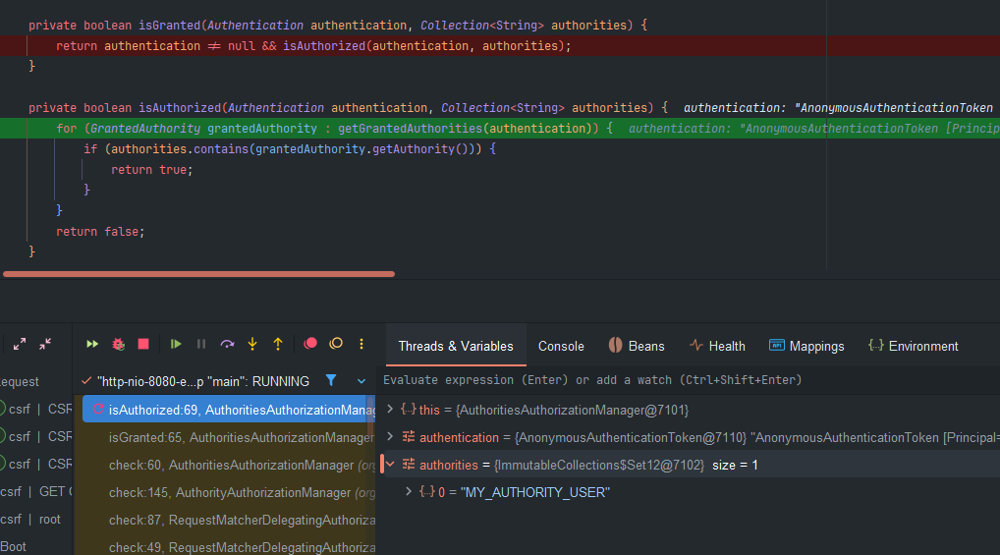

# 인가 아키텍쳐

## 시큐리티 인가(Authorization) 상세 흐름도

```scss


[SecurityContextHolder]
    |   (인증된 Authentication 객체 저장)
    v
[Authentication]
    |   (Principal, Authorities 포함)
    v
[AuthorizationFilter]
    |   (Spring Security 6.0+ 기본 인가 필터)
    |
    v
[AuthorizationManager]
    |   (인가 결정 로직의 중심)
    |
    ├─> RequestMatcherDelegatingAuthorizationManager
    |       (URL 패턴별 인가 규칙 관리)
    |
    ├─> AuthorityAuthorizationManager
    |       (권한 기반 인가 결정)
    |
    └─> AuthenticatedAuthorizationManager
            (인증 상태 기반 인가 결정)
    |
    v
[AuthorizationDecision]
    |   (granted: boolean, confidence: int)
    |
    v
[접근 허용/거부 결정]
    |
    ├─> 허용: Controller로 요청 전달
    └─> 거부: AccessDeniedException 발생
              |
              v
         [ExceptionTranslationFilter]
              |
              ├─> 인증되지 않음: AuthenticationEntryPoint
              └─> 권한 없음: AccessDeniedHandler

```

---


## 인가 Authorization

### Authorization

인가는 인증된 사용자가 특정 자원에 접근할 수 있는 권한이 있는지를 확인하는 과정입니다. Spring Security에서는 인증이 완료된 후, 사용자가 요청한 자원에 대한 접근 권한을 검증하여 허용 또는 거부를 결정합니다.

Spring Security 는 `GrantedAuthority` 클래스를 통해 권한 목록을 관리하있으며 `Authentication` 객체와 연결한다.

## 권한 체크 흐름

```

사용자 요청: "DELETE /api/users/123"
         │
         ▼
┌─────────────────────┐
│ AuthorizationFilter │
└─────────────────────┘
         │
         ▼
┌─────────────────────────────────────┐
│ SecurityContextHolder               │
│  .getContext()                      │
│  .getAuthentication()               │
│  .getAuthorities() ──────────────┐  │
└─────────────────────────────────┘  │
                                     │
                                     ▼
                        ┌─────────────────────────┐
                        │ authorities 컬렉션      │
                        │ - ROLE_USER             │
                        │ - ROLE_ADMIN            │
                        │ - DELETE_USER           │
                        └─────────────────────────┘
                                     │
                                     ▼
┌─────────────────────────────────────────────────┐
│ AuthorizationManager                            │
│                                                 │
│ 필요 권한: "ROLE_ADMIN" 또는 "DELETE_USER"      │
│                        ↓                        │
│ 사용자 권한과 비교:                             │
│ ✓ ROLE_ADMIN 있음 → 접근 허용                  │
└─────────────────────────────────────────────────┘

```
   

---


## GrantedAuthority

스프링 시큐리티는 Authentication 에 `GrantedAuthority` 권한 목록을 저장하며 이를 통해 인증 주체에게 부여된 권한을 사용하도록 한다.`GrantedAuthority` 객체는 `AuthenticationManger`에 의해 `Authentication` 객체에 삽입되며 스프링 시큐리티는 인가 결정을 내 때 `AuthenticationManger` 를 사용하여 `Authentication` 즉, 인증 주체로부터 `GrantedAuthority` 객체를 읽어들여 처리하게 된다.

## 계층적 권한 구조

```

Authentication
    │
    └── authorities: Collection<GrantedAuthority>
            │
            ├── SimpleGrantedAuthority("ROLE_ADMIN")
            │       │
            │       └── String authority = "ROLE_ADMIN"
            │
            ├── SimpleGrantedAuthority("ROLE_USER")
            │       │
            │       └── String authority = "ROLE_USER"
            │
            └── SimpleGrantedAuthority("READ_DOCUMENTS")
                    │
                    └── String authority = "READ_DOCUMENTS"

```

`getAuthority()` 메세드를 통해 `AuthenticationManger`가 `GrantedAuthority`의 정확한 문자열을 표현을 얻기 위해 사용된다.  

## 사용자 정의 역할 접두사

기본적으로 역할 기반의 인가 규칙은 역할 앞에 `ROLE_` 를 접두사로 사용한다. 즉, `USER` 역할을 가진 보안 컨텍스트가 필요한 인가 규칙이 있다면 Spring Security는 기본적으로 `“ROLE_USER”` 를 반환하는 `GrantedAuthority.getAuthority()` 를 찾는다.

`GrantedAuthorityDefaults` 로 사용자 지정할 수 있으며 `GrantedAuthorityDefaults` 는 역할 기반 인가 규칙에 사용할 접두사를 사용자 정의하는데 사용된다.  

```java
    @Bean
    public GrantedAuthorityDefaults grantedAuthorityDefaults() {
        return new GrantedAuthorityDefaults("MY_AUTHORITY"); // 빈 문자열로 설정하여 접두사 제거
    }
    
    @Bean
    public UserDetailsService userDetailsService() {
        UserDetails user = User.withUsername("user").password("{noop}1111").authorities("MY_AUTHORITY_USER").build();
        return new InMemoryUserDetailsManager(user, manager, admin);
    }    
```  
  

## 시각적 구조 설명

```

┌─────────────────────────────────────────────────────────────┐
│                     Authentication                           │
│                                                             │
│  ┌─────────────────┐                                       │
│  │   Principal     │  ← 사용자 식별 정보 (UserDetails)      │
│  │                 │     - username: "user123"              │
│  │                 │     - userId: 12345                    │
│  └─────────────────┘                                       │
│                                                             │
│  ┌─────────────────┐                                       │
│  │  Credentials    │  ← 인증 수단 (비밀번호 등)            │
│  │                 │     - 인증 후 보안상 null 처리         │
│  └─────────────────┘                                       │
│                                                             │
│  ┌─────────────────────────────────────────────────────┐   │
│  │           Collection<GrantedAuthority>               │   │
│  │                                                      │   │
│  │  ┌──────────────────────┐  ┌──────────────────────┐ │   │
│  │  │  GrantedAuthority    │  │  GrantedAuthority    │ │   │
│  │  │                      │  │                      │ │   │
│  │  │  getAuthority():     │  │  getAuthority():     │ │   │
│  │  │  "ROLE_USER"         │  │  "ROLE_ADMIN"        │ │   │
│  │  └──────────────────────┘  └──────────────────────┘ │   │
│  │                                                      │   │
│  │  ┌──────────────────────┐  ┌──────────────────────┐ │   │
│  │  │  GrantedAuthority    │  │  GrantedAuthority    │ │   │
│  │  │                      │  │                      │ │   │
│  │  │  getAuthority():     │  │  getAuthority():     │ │   │
│  │  │  "READ_PRIVILEGE"    │  │  "WRITE_PRIVILEGE"   │ │   │
│  │  └──────────────────────┘  └──────────────────────┘ │   │
│  │                                                      │   │
│  └─────────────────────────────────────────────────────┘   │
│                                                             │
│  ┌─────────────────┐                                       │
│  │    Details      │  ← 추가 정보 (IP, SessionId 등)       │
│  └─────────────────┘                                       │
│                                                             │
│  ┌─────────────────┐                                       │
│  │  Authenticated  │  ← 인증 상태 (true/false)             │
│  └─────────────────┘                                       │
└─────────────────────────────────────────────────────────────┘

```  

---
  
## 구현 코드
### GrantedAuthority
```java 
public interface GrantedAuthority extends Serializable {
    
	String getAuthority();

}
```
  
```java 

public final class SimpleGrantedAuthority implements GrantedAuthority {

    private static final long serialVersionUID = SpringSecurityCoreVersion.SERIAL_VERSION_UID;

    private final String role;

    public SimpleGrantedAuthority(String role) {
        Assert.hasText(role, "A granted authority textual representation is required");
        this.role = role;
    }

    @Override
    public String getAuthority() {
        return this.role;
    }
}

```
  
우리가 계속 테스할때 만들던 사용자를 확인해보자  
```java 

    @Bean
    public UserDetailsService userDetailsService() {
        UserDetails user = User.withUsername("user").password("{noop}1111").roles("USER").build();
        UserDetails manager = User.withUsername("db").password("{noop}1111").roles("DB").build();
        UserDetails admin = User.withUsername("admin").password("{noop}1111").roles("ADMIN","SECURE").build();
        return new InMemoryUserDetailsManager(user, manager, admin);
    }
```  
```java 
public UserBuilder roles(String... roles) {
    List<GrantedAuthority> authorities = new ArrayList<>(roles.length);
    for (String role : roles) {
        Assert.isTrue(!role.startsWith("ROLE_"),
                () -> role + " cannot start with ROLE_ (it is automatically added)");
        //자동으로 PREFIX로 ROLE_ 이 붙는걸 확인
        authorities.add(new SimpleGrantedAuthority("ROLE_" + role));
    }
    return authorities(authorities);
}

```