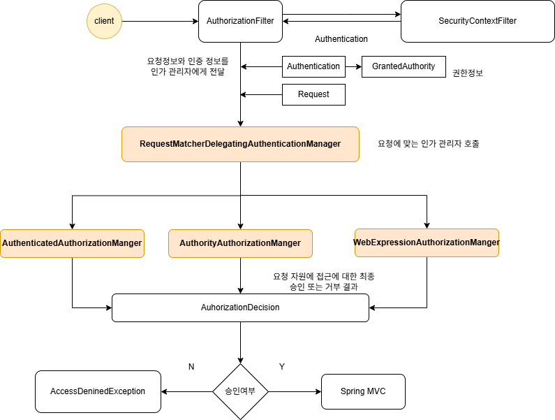
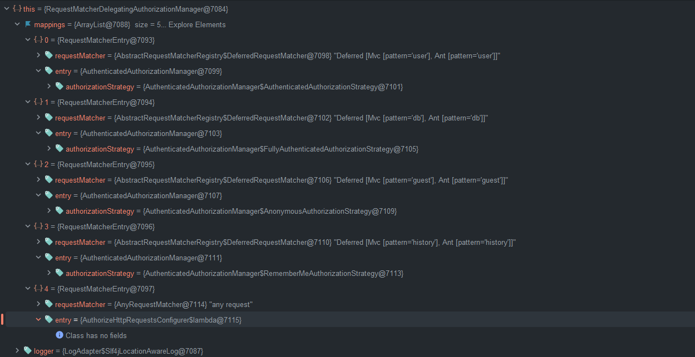

## 인가 관리자
### AuthorizationManager

인가 결정의 핵심 인터페이스로, 주어진 `Authentication`과 인증된 사용자의요청 정보를 바탕으로 접근 허용 여부를 결정합니다.  
  
해당 인터페이스는 Spring Security의 요청기반, 메서드 기반의 인가 구성 요서에서 호출되며 최종 엑세스 제어 결정을 수행한다.  
  
`AuthorizationManager`는 Spring Security의 필수 구성요소로서 권한 여부 처리는 `AuthorizationFilter`를 통해 이루어 지며 `AuthorizationFilter`는 `AuthorizationManager`를 호출하여 권한 부여 결정을 내린다.

### 주요 메서드

- **`AuthorizationDecision check(Supplier<Authentication> authentication, T object)`**
    - **설명**: 인가 결정을 수행하는 핵심 메서드입니다. `Authentication`과 보호된 객체(일반적으로 `HttpServletRequest`)를 받아 `AuthorizationDecision`을 반환합니다.
    - **반환값**: `AuthorizationDecision` - 접근 허용/거부 여부와 신뢰도를 포함
- **`default void verify(Supplier<Authentication> authentication, T object)`**
    - **설명**: `check` 메서드를 호출하고, 접근이 거부된 경우 `AccessDeniedException`을 발생시킵니다.
    - **예외**: 접근 거부 시 `AccessDeniedException` 발생

### AuthorizationFilter

Spring Security 6.0부터 `FilterSecurityInterceptor`를 대체하는 기본 인가 필터입니다. 모든 요청에 대해 인가 검사를 수행합니다.


### AuthorizationDecision

인가 결정 결과를 나타내는 클래스로, 접근 허용 여부와 결정의 신뢰도를 포함합니다.

### 속성

- **`boolean granted`**: 접근 허용 여부 (true: 허용, false: 거부)
- **`int confidence`**: 결정의 신뢰도 수준 (선택적)  


## 주요 구현체 계층구조

```

AuthorizationManager<T> (interface)
    │
    ├─── RequestMatcherDelegatingAuthorizationManager<T>
    │        │
    │        └─── URL 패턴별로 다른 AuthorizationManager를 위임
    │
    ├─── AuthorityAuthorizationManager<T>
    │        │
    │        ├─── hasAuthority(String authority)
    │        ├─── hasAnyAuthority(String... authorities)
    │        ├─── hasRole(String role)
    │        └─── hasAnyRole(String... roles)
    │
    ├─── AuthenticatedAuthorizationManager<T>
    │        │
    │        ├─── authenticated()
    │        ├─── fullyAuthenticated()
    │        └─── rememberMeAuthenticated()
    │
    ├─── WebExpressionAuthorizationManager
    │        │
    │        └─── SpEL 표현식 기반 인가 (예: hasRole('ADMIN') and hasIpAddress('..'))
    │
    ├─── SecuredAuthorizationManager
    │        │
    │        └─── @Secured 어노테이션 처리
    │
    ├─── Jsr250AuthorizationManager
    │        │
    │        └─── @RolesAllowed 등 JSR-250 어노테이션 처리
    │
    ├─── PreAuthorizeAuthorizationManager
    │        │
    │        └─── @PreAuthorize 어노테이션 처리
    │
    ├─── PostAuthorizeAuthorizationManager
    │        │
    │        └─── @PostAuthorize 어노테이션 처리
    │
    └─── AllowAllAuthorizationManager<T>
             │
             └─── 항상 접근 허용 (permitAll)

```

### 요청 기반 권한 부여 관리자
- RequestMatcherDelegatingAuthorizationManager
  : URL 패턴에 따라 적절한 AuthorizationManager에게 인가 결정을 위임하는 매니저

- WebExpressionAuthorizationManager
  : SpEL(Spring Expression Language) 표현식을 사용하여 복잡한 인가 규칙을 평가하는 매니저

- AuthorityAuthorizationManager
  : 사용자의 권한(Authority)이나 역할(Role)을 기반으로 접근 허용 여부를 결정하는 매니저

- AuthenticatedAuthorizationManager
  : 사용자의 인증 상태(인증됨, 완전인증, Remember-Me 등)를 기반으로 접근을 제어하는 매니저

### 메서드 기반 권한 부여 관리자
- PreAuthorizeAuthorizationManager
  : @PreAuthorize 어노테이션을 처리하여 메서드 실행 전에 권한을 검사하는 매니저

- PostAuthorizeAuthorizationManager
  : @PostAuthorize 어노테이션을 처리하여 메서드 실행 후 반환값을 기반으로 권한을 검사하는 매니저

- Jsr250AuthorizationManager
  : @RolesAllowed, @PermitAll, @DenyAll 등 JSR-250 표준 어노테이션을 처리하는 매니저

- SecuredAuthorizationManager
  : @Secured 어노테이션을 처리하여 지정된 권한을 가진 사용자만 메서드를 실행할 수 있도록 하는 매니저


---

## 구현 코드  
### AuthorizationManager
```java 
public interface AuthorizationManager<T> {


	default void verify(Supplier<Authentication> authentication, T object) {
		AuthorizationDecision decision = check(authentication, object);
		if (decision != null && !decision.isGranted()) {
			throw new AccessDeniedException("Access Denied");
		}
	}


	@Nullable
	AuthorizationDecision check(Supplier<Authentication> authentication, T object);

}


```

### AuthorizationFilter 동작 과정

`AuthorizationFilter`:

```java

java
public class AuthorizationFilter extends GenericFilterBean {

    private final AuthorizationManager<HttpServletRequest> authorizationManager;
    private AuthorizationEventPublisher eventPublisher = AuthorizationFilter::noPublish;
    private boolean observeOncePerRequest = false;
    private boolean filterErrorDispatch = true;
    private boolean filterAsyncDispatch = true;

    @Override
    public void doFilter(ServletRequest servletRequest, ServletResponse servletResponse, FilterChain chain)
            throws ServletException, IOException {

        HttpServletRequest request = (HttpServletRequest) servletRequest;
        HttpServletResponse response = (HttpServletResponse) servletResponse;

// 이미 처리된 요청인지 확인
        if (this.observeOncePerRequest && isApplied(request)) {
            chain.doFilter(request, response);
            return;
        }

// ERROR 디스패치 타입 처리
        if (skipDispatch(request)) {
            chain.doFilter(request, response);
            return;
        }

// 한 번만 실행되도록 표시
        if (this.observeOncePerRequest) {
            request.setAttribute(FILTER_APPLIED, Boolean.TRUE);
        }

        try {
// 인가 검사 수행
            AuthorizationDecision decision = this.authorizationManager.check(this::getAuthentication, request);
            this.eventPublisher.publishAuthorizationEvent(this::getAuthentication, request, decision);

            if (decision != null && !decision.isGranted()) {
                throw new AccessDeniedException("Access Denied");
            }

            chain.doFilter(request, response);
        }
        finally {
            if (this.observeOncePerRequest) {
                request.removeAttribute(FILTER_APPLIED);
            }
        }
    }

    private Authentication getAuthentication() {
        Authentication authentication = SecurityContextHolder.getContext().getAuthentication();
        if (authentication == null) {
            throw new AuthenticationCredentialsNotFoundException(
                    "An Authentication object was not found in the SecurityContext");
        }
        return authentication;
    }
}

```

### RequestMatcherDelegatingAuthorizationManager

URL 패턴별로 다른 인가 규칙을 적용하는 `AuthorizationManager` 구현체입니다.

```java

java
public final class RequestMatcherDelegatingAuthorizationManager<T> implements AuthorizationManager<T> {

    private final List<RequestMatcherEntry<AuthorizationManager<T>>> mappings;

    @Override
    public AuthorizationDecision check(Supplier<Authentication> authentication, T object) {
// 요청에 매칭되는 AuthorizationManager 찾기
        for (RequestMatcherEntry<AuthorizationManager<T>> mapping : this.mappings) {
            RequestMatcher matcher = mapping.getRequestMatcher();
            MatchResult matchResult = matcher.matcher((HttpServletRequest) object);

            if (matchResult.isMatch()) {
                AuthorizationManager<T> manager = mapping.getEntry();
                return manager.check(authentication, object);
            }
        }

// 매칭되는 규칙이 없으면 접근 거부
        return new AuthorizationDecision(false);
    }

// 내부 클래스: 요청 매처와 AuthorizationManager를 연결
    private static final class RequestMatcherEntry<T> {
        private final RequestMatcher requestMatcher;
        private final T entry;

        RequestMatcherEntry(RequestMatcher requestMatcher, T entry) {
            this.requestMatcher = requestMatcher;
            this.entry = entry;
        }

        RequestMatcher getRequestMatcher() {
            return this.requestMatcher;
        }

        T getEntry() {
            return this.entry;
        }
    }
}

```
### AuthorityAuthorizationManager

권한(Authority) 기반으로 인가를 결정하는 구현체입니다.

```java

java
public final class AuthorityAuthorizationManager<T> implements AuthorizationManager<T> {

    private final List<GrantedAuthority> authorities;
    private RoleHierarchy roleHierarchy = new NullRoleHierarchy();

    private AuthorityAuthorizationManager(String... authorities) {
        this.authorities = AuthorityUtils.createAuthorityList(authorities);
    }

    public static <T> AuthorityAuthorizationManager<T> hasAuthority(String authority) {
        Assert.notNull(authority, "authority cannot be null");
        return new AuthorityAuthorizationManager<>(authority);
    }

    public static <T> AuthorityAuthorizationManager<T> hasAnyAuthority(String... authorities) {
        Assert.notEmpty(authorities, "authorities cannot be empty");
        return new AuthorityAuthorizationManager<>(authorities);
    }

    public static <T> AuthorityAuthorizationManager<T> hasRole(String role) {
        Assert.notNull(role, "role cannot be null");
        return hasAuthority("ROLE_" + role);
    }

    public static <T> AuthorityAuthorizationManager<T> hasAnyRole(String... roles) {
        Assert.notEmpty(roles, "roles cannot be empty");
        for (int i = 0; i < roles.length; i++) {
            roles[i] = "ROLE_" + roles[i];
        }
        return hasAnyAuthority(roles);
    }

    @Override
    public AuthorizationDecision check(Supplier<Authentication> authentication, T object) {
        boolean granted = isGranted(authentication.get());
        return new AuthorizationDecision(granted);
    }

    private boolean isGranted(Authentication authentication) {
        Collection<? extends GrantedAuthority> authorities = getAuthorities(authentication);

        for (GrantedAuthority authority : authorities) {
            if (this.authorities.contains(authority)) {
                return true;
            }
        }
        return false;
    }

    private Collection<? extends GrantedAuthority> getAuthorities(Authentication authentication) {
// RoleHierarchy를 사용하여 상위 권한도 포함
        return this.roleHierarchy.getReachableGrantedAuthorities(authentication.getAuthorities());
    }
}

```

### AuthenticatedAuthorizationManager

인증 상태에 따라 인가를 결정하는 구현체입니다.

```java

java
public final class AuthenticatedAuthorizationManager<T> implements AuthorizationManager<T> {

    private final AuthenticationTrustResolver trustResolver = new AuthenticationTrustResolverImpl();

    enum AuthenticatedAuthorizationStrategy {
        FULLY_AUTHENTICATED,
        REMEMBER_ME_AUTHENTICATED,
        ANONYMOUS_AUTHENTICATED
    }

    private final AuthenticatedAuthorizationStrategy strategy;

    @Override
    public AuthorizationDecision check(Supplier<Authentication> authentication, T object) {
        boolean granted = isGranted(authentication.get());
        return new AuthorizationDecision(granted);
    }

    private boolean isGranted(Authentication authentication) {
        return switch (this.strategy) {
            case FULLY_AUTHENTICATED -> isFullyAuthenticated(authentication);
            case REMEMBER_ME_AUTHENTICATED -> isRememberMe(authentication) || isFullyAuthenticated(authentication);
            case ANONYMOUS_AUTHENTICATED -> isAnonymous(authentication) || isRememberMe(authentication) || isFullyAuthenticated(authentication);
        };
    }

    private boolean isFullyAuthenticated(Authentication authentication) {
        return !this.trustResolver.isAnonymous(authentication)
            && !this.trustResolver.isRememberMe(authentication);
    }

    private boolean isRememberMe(Authentication authentication) {
        return this.trustResolver.isRememberMe(authentication);
    }

    private boolean isAnonymous(Authentication authentication) {
        return this.trustResolver.isAnonymous(authentication);
    }

    public static <T> AuthenticatedAuthorizationManager<T> fullyAuthenticated() {
        return new AuthenticatedAuthorizationManager<>(AuthenticatedAuthorizationStrategy.FULLY_AUTHENTICATED);
    }

    public static <T> AuthenticatedAuthorizationManager<T> rememberMeAuthenticated() {
        return new AuthenticatedAuthorizationManager<>(AuthenticatedAuthorizationStrategy.REMEMBER_ME_AUTHENTICATED);
    }

    public static <T> AuthenticatedAuthorizationManager<T> authenticated() {
        return new AuthenticatedAuthorizationManager<>(AuthenticatedAuthorizationStrategy.ANONYMOUS_AUTHENTICATED);
    }
}

```

## 요약정리

1. **AuthorizationFilter가 요청 가로채기**: 모든 HTTP 요청이 `AuthorizationFilter`를 통과하며 인가 검사가 시작됩니다.
2. **SecurityContext에서 Authentication 조회**: `SecurityContextHolder`에서 현재 인증된 사용자의 `Authentication` 객체를 가져옵니다.
3. **AuthorizationManager에게 인가 결정 요청**: `AuthorizationFilter`가 `AuthorizationManager`에게 접근 권한 확인을 요청합니다.
4. **RequestMatcherDelegatingAuthorizationManager가 URL 패턴 매칭**: 요청 URL에 맞는 인가 규칙을 찾아 해당하는 `AuthorizationManager`를 선택합니다.
5. **적절한 AuthorizationManager가 권한 검사**: `AuthorityAuthorizationManager`, `AuthenticatedAuthorizationManager` 등이 실제 권한을 검사합니다.
6. **Authentication의 Authorities와 요구되는 권한 비교**: 사용자가 가진 권한과 자원이 요구하는 권한을 비교합니다.
7. **AuthorizationDecision 생성 및 반환**: 접근 허용/거부 결정을 담은 `AuthorizationDecision` 객체를 생성합니다.
8. **접근 허용 시 다음 필터로 진행**: 인가가 성공하면 요청이 컨트롤러로 전달됩니다.
9. **접근 거부 시 AccessDeniedException 발생**: 인가가 실패하면 예외가 발생하고 `ExceptionTranslationFilter`가 이를 처리합니다.
10. **적절한 응답 반환**: `AccessDeniedHandler`가 403 Forbidden 응답을 생성하거나, 인증되지 않은 경우 `AuthenticationEntryPoint`가 401 Unauthorized 응답을 생성합니다.
  
---

# AuthorizationManager 구조와 이해

스프링 시큐리티는 요청기반의 인증된 사용자 및 특정권한을 가진 사용자의 자원접근 허용여부를 결정하는 클레스들을 제공한다.  
  
`AuthorityAuthorizationManager`, `AuthenticatedAuthorizationManager`,와 대리자인 `RequestMatcherDelegatingAuthorizationManager`가 있다.  
  
## 인가처리

```java
  http.authorizeHttpRequests(authorize -> authorize
        .requestMatchers("/user").hasRole("USER")
```
  
- **Request**
  - `/user`**엔드포인트** 접근은
- **Authentication**
  - **인증객체**에서
- **GrantedAuthority**
  - **ROLE_USER**권한을 필요로 한다.
  
이때 인가의 처리는 Spring Security가 **내부적으로 저장하고 있는 정보와**  
```java
authorizeHttpRequests(authorize -> authorize
        .requestMatchers("/user").hasRole("USER")
```
  
사용자가 전달한 정보와 서로 비교를 통해 인가처리 결정을 심사한다.  
```
Request (엔드포인트)
Authentication (인증객체정보)
GrantedAuthority (권한정보)
```
  
### 내부구조
```java 
        http
                .authorizeHttpRequests(authorize -> authorize
                        .requestMatchers("user").hasRole("USER")
                        .requestMatchers("db").hasRole("DB")
                        .requestMatchers("admin").access(new WebExpressionAuthorizationManager("hasRole('ADMIN') or hasRole('DB')"))
                        .anyRequest().permitAll());
```
  

### 1단계: 보안 컨텍스트 확인

- **SecurityContextFilter**에서 현재 사용자의 인증 정보(`Authentication`)와 권한 정보(`GrantedAuthority`)를 가져옵니다.
- `SecurityContextHolder.getContext().getAuthentication()`을 통해 현재 인증된 사용자 정보를 확인합니다.

### 2단계: 요청 매칭 및 위임

**RequestMatcherDelegatingAuthenticationManager**가 핵심 역할을 수행합니다:

```java

public class RequestMatcherDelegatingAuthorizationManager implements AuthorizationManager<HttpServletRequest> {

    @Override
    public AuthorizationDecision check(Supplier<Authentication> authentication, HttpServletRequest request) {
// 요청에 맞는 적절한 AuthorizationManager를 선택하여 위임
        for (RequestMatcherEntry<AuthorizationManager<RequestAuthorizationContext>> mapping : this.mappings) {
            RequestMatcher matcher = mapping.getRequestMatcher();
            if (matcher.matches(request)) {
                AuthorizationManager<RequestAuthorizationContext> manager = mapping.getEntry();
                return manager.check(authentication, new RequestAuthorizationContext(request));
            }
        }
        return null;
    }
}

```

## 세 가지 AuthorizationManager 유형

### 1. AuthenticatedAuthorizationManager

```java

// 단순히 인증된 사용자인지만 확인
public class AuthenticatedAuthorizationManager implements AuthorizationManager<RequestAuthorizationContext> {
    @Override
    public AuthorizationDecision check(Supplier<Authentication> authentication, RequestAuthorizationContext object) {
        Authentication auth = authentication.get();
        boolean authenticated = auth != null && auth.isAuthenticated() && !(auth instanceof AnonymousAuthenticationToken);
        return new AuthorizationDecision(authenticated);
    }
}

```

### 2. AuthorityAuthorizationManager

```java

// 특정 권한(ROLE)을 가지고 있는지 확인
public class AuthorityAuthorizationManager implements AuthorizationManager<RequestAuthorizationContext> {
    private final Set<String> authorities;

    @Override
    public AuthorizationDecision check(Supplier<Authentication> authentication, RequestAuthorizationContext object) {
        Authentication auth = authentication.get();
        Set<String> userAuthorities = AuthorityUtils.authorityListToSet(auth.getAuthorities());
        boolean granted = userAuthorities.containsAny(this.authorities);
        return new AuthorizationDecision(granted);
    }
}

```

### 3. WebExpressionAuthorizationManager

```java

// SpEL(Spring Expression Language)을 사용한 복잡한 권한 검사
public class WebExpressionAuthorizationManager implements AuthorizationManager<RequestAuthorizationContext> {

    @Override
    public AuthorizationDecision check(Supplier<Authentication> authentication, RequestAuthorizationContext object) {
// hasRole('ADMIN') and hasIpAddress('192.168.1.0/24') 같은 복잡한 표현식 평가
        EvaluationContext ctx = this.expressionHandler.createEvaluationContext(authentication.get(), object);
        boolean granted = ExpressionUtils.evaluateAsBoolean(this.expression, ctx);
        return new AuthorizationDecision(granted);
    }
}

```

## 최종 결정 과정

### AuthorizationDecision

```java

public class AuthorizationDecision {
    private final boolean granted;

    public AuthorizationDecision(boolean granted) {
        this.granted = granted;
    }

    public boolean isGranted() {
        return this.granted;
    }
}

```

### 결과 처리

- **승인(Y)**: 요청이 Spring MVC로 전달되어 정상 처리
- **거부(N)**: `AccessDeniedException` 발생하여 403 Forbidden 응답

## 핵심 포인트

1. **위임 패턴**: 하나의 필터가 여러 AuthorizationManager에게 책임을 위임
2. **전략 패턴**: 요청의 특성에 따라 적절한 인가 전략을 선택
3. **확장 가능성**: 커스텀 AuthorizationManager 구현으로 복잡한 비즈니스 로직 적용 가능

---
  
## AuthenticatedAuthorizationManager 구조
## 클래스 계층 구조

```java

// 최상위 인터페이스
public interface AuthorizationManager<T> {
    @Nullable
    AuthorizationDecision check(Supplier<Authentication> authentication, T object);

    default AuthorizationManager<T> verify(Supplier<Authentication> authentication, T object) {
        AuthorizationDecision decision = check(authentication, object);
        if (decision != null && !decision.isGranted()) {
            throw new AccessDeniedException("Access Denied");
        }
        return this;
    }
}

// 구현 클래스
public final class AuthenticatedAuthorizationManager implements AuthorizationManager<RequestAuthorizationContext> {
// 구현 내용
}

```

- `AuthorizationManager<T>`는 Spring Security의 인가 시스템의 핵심 인터페이스입니다.
- `check()` 메서드는 실제 인가 로직을 수행하고 `@Nullable`을 통해 null 반환 가능성을 명시합니다.
- `verify()` 디폴트 메서드는 `check()` 결과가 거부일 때 즉시 예외를 발생시키는 편의 메서드입니다.

## AuthenticatedAuthorizationManager 내부 구조

### 핵심 필드와 전략 패턴

```java

public final class AuthenticatedAuthorizationManager implements AuthorizationManager<RequestAuthorizationContext> {

// 인증 전략을 나타내는 열거형
    private AuthenticationTrustResolver trustResolver = new AuthenticationTrustResolverImpl();

// 내부 전략 열거형
    public enum AuthenticationStrategy {
        AUTHENTICATED,// 단순 인증된 사용자
        FULLY_AUTHENTICATED,// 완전히 인증된 사용자 (Remember-Me 제외)
        REMEMBER_ME,// Remember-Me 인증 포함
        ANONYMOUS// 익명 사용자
    }

    private final AuthenticationStrategy strategy;

// 생성자를 통한 전략 주입
    private AuthenticatedAuthorizationManager(AuthenticationStrategy strategy) {
        this.strategy = strategy;
    }

// 팩토리 메서드들
    public static AuthenticatedAuthorizationManager authenticated() {
        return new AuthenticatedAuthorizationManager(AuthenticationStrategy.AUTHENTICATED);
    }

    public static AuthenticatedAuthorizationManager fullyAuthenticated() {
        return new AuthenticatedAuthorizationManager(AuthenticationStrategy.FULLY_AUTHENTICATED);
    }

    public static AuthenticatedAuthorizationManager rememberMe() {
        return new AuthenticatedAuthorizationManager(AuthenticationStrategy.REMEMBER_ME);
    }

    public static AuthenticatedAuthorizationManager anonymous() {
        return new AuthenticatedAuthorizationManager(AuthenticationStrategy.ANONYMOUS);
    }
}

```

- `AuthenticationTrustResolver`는 인증 토큰의 타입을 구분하는 핵심 컴포넌트입니다. `AnonymousAuthenticationToken`과 `RememberMeAuthenticationToken`을 식별할 수 있습니다.
- `AuthenticationStrategy` 열거형은 Strategy 패턴의 구체적인 전략들을 정의합니다. 각 전략은 서로 다른 인증 수준을 나타냅니다.

### check() 메서드 - 전략 패턴 적용

```java

@Override
public AuthorizationDecision check(Supplier<Authentication> authentication, RequestAuthorizationContext object) {
    boolean granted = isGranted(authentication.get());
    return new AuthorizationDecision(granted);
}

// 전략에 따른 인증 상태 확인
private boolean isGranted(Authentication authentication) {
    return switch (this.strategy) {
        case AUTHENTICATED -> isAuthenticated(authentication);
        case FULLY_AUTHENTICATED -> isFullyAuthenticated(authentication);
        case REMEMBER_ME -> isRememberMe(authentication);
        case ANONYMOUS -> isAnonymous(authentication);
    };
}

```

- `Supplier<Authentication>`을 사용하여 lazy evaluation을 지원합니다. 실제로 필요할 때만 인증 객체를 가져옵니다.
- `AuthorizationDecision`은 불변 객체로 인가 결과를 캡슐화합니다.

## 인증 전략별 구현 세부사항

### 1. AUTHENTICATED 전략

```java

private boolean isAuthenticated(Authentication authentication) {
    return authentication != null &&
           authentication.isAuthenticated() &&
           !this.trustResolver.isAnonymous(authentication);
}

```

- 가장 기본적인 인증 수준으로, 단순히 "로그인된 상태"인지만 확인합니다.
- Remember-Me 인증도 포함됩니다. 편의성을 위해 자동 로그인된 사용자도 "인증된 상태"로 간주합니다.

### 2. FULLY_AUTHENTICATED 전략

```java

private boolean isFullyAuthenticated(Authentication authentication) {
    return authentication != null &&
           authentication.isAuthenticated() &&
           !this.trustResolver.isAnonymous(authentication) &&
           !this.trustResolver.isRememberMe(authentication);
}

```

- 가장 엄격한 인증 수준으로, 사용자가 실제로 아이디/패스워드를 입력해서 로그인한 경우만 허용합니다.
- Remember-Me 인증을 제외하는 이유는 보안상 중요한 작업(비밀번호 변경, 결제 등)에서는 명시적인 인증이 필요하기 때문입니다.
- `trustResolver.isRememberMe()`는 `RememberMeAuthenticationToken` 타입인지 확인합니다.

### 3. REMEMBER_ME 전략

```java

private boolean isRememberMe(Authentication authentication) {
    return authentication != null &&
           authentication.isAuthenticated() &&
           this.trustResolver.isRememberMe(authentication);
}

```

- Remember-Me 토큰으로만 인증된 사용자를 대상으로 하는 특별한 전략입니다.
- 일반적으로는 거의 사용되지 않으며, Remember-Me 사용자에게만 특별한 권한을 부여하고 싶을 때 사용합니다.

### 4. ANONYMOUS 전략

```java

private boolean isAnonymous(Authentication authentication) {
    return this.trustResolver.isAnonymous(authentication);
}

```

- 익명 사용자(로그인하지 않은 사용자)만을 허용하는 전략입니다.
- 로그인 페이지, 회원가입 페이지처럼 로그인하지 않은 사용자만 접근해야 하는 경우에 사용합니다.

## 구체적인 Strategy 구현체들

### 1. AuthenticatedStrategy - authenticated() 메서드용

```java

public class AuthenticatedStrategy extends AbstractAuthorizationStrategy {

    @Override
    public boolean isGranted(Authentication authentication) {
        return verify(authentication);
    }

    @Override
    protected boolean checkSpecificConditions(Authentication authentication) {
// 단순히 인증되었고 익명이 아닌지만 확인
        return !trustResolver.isAnonymous(authentication);
    }

/**
     * 인증된 사용자 여부 확인
     * - 인증 객체가 존재해야 함
     * - isAuthenticated()가 true여야 함
     * - 익명 사용자가 아니어야 함
     */
    public boolean isAuthenticated(Authentication authentication) {
        return isValidAuthentication(authentication) &&
               !trustResolver.isAnonymous(authentication);
    }
}

```

### 2. FullyAuthenticatedStrategy - fullyAuthenticated() 메서드용

```java

public class FullyAuthenticatedStrategy extends AbstractAuthorizationStrategy {

    @Override
    public boolean isGranted(Authentication authentication) {
        return verify(authentication);
    }

    @Override
    protected boolean checkSpecificConditions(Authentication authentication) {
// 완전 인증: 익명도 아니고 Remember-Me도 아니어야 함
        return !trustResolver.isAnonymous(authentication) &&
               !trustResolver.isRememberMe(authentication);
    }

/**
     * 완전히 인증된 사용자 여부 확인
     * - 기본 인증 조건 만족
     * - 익명 사용자 아님
     * - Remember-Me 인증 아님 (실제 로그인 필요)
     */
    public boolean isFullyAuthenticated(Authentication authentication) {
        if (!isValidAuthentication(authentication)) {
            return false;
        }

// Remember-Me 토큰과 익명 토큰 모두 제외
        boolean isNotAnonymous = !trustResolver.isAnonymous(authentication);
        boolean isNotRememberMe = !trustResolver.isRememberMe(authentication);

        return isNotAnonymous && isNotRememberMe;
    }

/**
     * Remember-Me 인증 여부 확인
     */
    private boolean isRememberMeAuthentication(Authentication authentication) {
        return authentication instanceof RememberMeAuthenticationToken;
    }

/**
     * 실제 사용자 입력으로 인한 인증인지 확인
     */
    public boolean isInteractiveAuthentication(Authentication authentication) {
        return isFullyAuthenticated(authentication) &&
               hasRecentAuthenticationTime(authentication);
    }

    private boolean hasRecentAuthenticationTime(Authentication authentication) {
// 세션에서 인증 시간 확인 로직
        Object details = authentication.getDetails();
        if (details instanceof WebAuthenticationDetails) {
// 인증 시간이 최근인지 확인하는 로직 구현
            return true;// 구현 필요
        }
        return true;
    }
}

```

### 3. RememberMeStrategy - rememberMe() 메서드용

```java

public class RememberMeStrategy extends AbstractAuthorizationStrategy {

    @Override
    public boolean isGranted(Authentication authentication) {
        return verify(authentication);
    }

    @Override
    protected boolean checkSpecificConditions(Authentication authentication) {
// Remember-Me 인증인지 확인
        return trustResolver.isRememberMe(authentication);
    }

/**
     * Remember-Me 인증 여부 확인
     */
    public boolean isRememberMeAuthenticated(Authentication authentication) {
        return isValidAuthentication(authentication) &&
               trustResolver.isRememberMe(authentication);
    }

/**
     * Remember-Me 토큰의 유효성 추가 검증
     */
    public boolean isValidRememberMeToken(Authentication authentication) {
        if (!isRememberMeAuthenticated(authentication)) {
            return false;
        }

        if (authentication instanceof RememberMeAuthenticationToken rememberMeToken) {
// Remember-Me 토큰의 만료 시간 및 서명 검증
            return validateTokenSignature(rememberMeToken) &&
                   !isTokenExpired(rememberMeToken);
        }

        return false;
    }

    private boolean validateTokenSignature(RememberMeAuthenticationToken token) {
// 토큰 서명 검증 로직
        return true;// 구현 필요
    }

    private boolean isTokenExpired(RememberMeAuthenticationToken token) {
// 토큰 만료 검증 로직
        return false;// 구현 필요
    }
}

```

### 4. AnonymousStrategy - anonymous() 메서드용

```java

public class AnonymousStrategy extends AbstractAuthorizationStrategy {

    @Override
    public boolean isGranted(Authentication authentication) {
        return verify(authentication);
    }

    @Override
    protected boolean checkSpecificConditions(Authentication authentication) {
// 익명 사용자인지 확인
        return trustResolver.isAnonymous(authentication);
    }

/**
     * 익명 사용자 여부 확인
     */
    public boolean isAnonymousUser(Authentication authentication) {
        return trustResolver.isAnonymous(authentication);
    }

/**
     * 익명 토큰의 유효성 확인
     */
    public boolean isValidAnonymousToken(Authentication authentication) {
        if (!trustResolver.isAnonymous(authentication)) {
            return false;
        }

        if (authentication instanceof AnonymousAuthenticationToken anonymousToken) {
// 익명 토큰의 키 검증
            return validateAnonymousKey(anonymousToken);
        }

        return false;
    }

    private boolean validateAnonymousKey(AnonymousAuthenticationToken token) {
// 익명 토큰의 키가 예상되는 값과 일치하는지 확인
        Object key = token.getKeyHash();
        return key != null && key.equals(getExpectedAnonymousKey());
    }

    private Object getExpectedAnonymousKey() {
// 설정된 익명 키 반환
        return "anonymousKey".hashCode();// 실제로는 설정에서 가져옴
    }
}

```

## AuthenticatedAuthorizationManager의 check() 메서드

```java

java
public final class AuthenticatedAuthorizationManager implements AuthorizationManager<RequestAuthorizationContext> {

    private final AbstractAuthorizationStrategy strategy;

    @Override
    public AuthorizationDecision check(Supplier<Authentication> authentication, RequestAuthorizationContext object) {
        Authentication auth = authentication.get();

// Strategy 패턴을 통한 위임
        boolean granted = strategy.isGranted(auth);

// 추가 컨텍스트 정보 로깅
        logAuthorizationAttempt(auth, granted, object);

        return new AuthorizationDecision(granted);
    }

    private void logAuthorizationAttempt(Authentication auth, boolean granted, RequestAuthorizationContext context) {
        if (logger.isDebugEnabled()) {
            logger.debug("Authorization attempt: user={}, strategy={}, granted={}, uri={}",
                        auth != null ? auth.getName() : "anonymous",
                        strategy.getClass().getSimpleName(),
                        granted,
                        context.getRequest().getRequestURI());
        }
    }
}

```

- Strategy 패턴의 핵심인 "위임"이 `strategy.isGranted(auth)` 호출에서 이루어집니다.
- `logAuthorizationAttempt()`는 보안 감사(Security Audit)를 위한 로깅 기능을 제공합니다.
- `RequestAuthorizationContext`에서 HTTP 요청 정보를 추출하여 컨텍스트를 제공합니다.
- 이 메서드는 thread-safe하며, 동시에 여러 요청을 처리할 수 있습니다.

이러한 Strategy 패턴 구현을 통해 Spring Security는 다양한 인증 수준을 유연하게 처리하면서도 코드의 확장성과 유지보수성을 크게 향상시켰습니다.  
  
### AuthenticatedAuthorizationManger 매핑
  
```java
    public SecurityFilterChain securityFilterChain(HttpSecurity http, HandlerMappingIntrospector introspector) throws Exception {
  http
          .authorizeHttpRequests(authorize -> authorize
                  .requestMatchers("user").authenticated()
                  .requestMatchers("db").fullyAuthenticated()
                  .requestMatchers("guest").anonymous()
                  .requestMatchers("history").rememberMe()
                  .anyRequest().permitAll())
          .formLogin(Customizer.withDefaults())
          .csrf(AbstractHttpConfigurer::disable);
```

  

`AuthenticatedAuthorizationManger`는 각 인증방식에 따라 적절한 `AbstractAuthorizationStrategy를 선택해서 인증 여부를 확인한다.  
  
처음에 `RequestMatcherDelegatingAuthenticationManager`에서 요청 URL패턴과 일치하는 패턴을 먼저 찾는다. 패턴이 일치한다면 그 패턴에 일치하는 인가 관리자를(entry) 찾아서 인가를 위임한다.  
  
위임 받은 관리자는 내부적으로 어떤 전략 클레스에게 위임하여 최종적으로 해당 요청에 대해 인가할 것인지 거부할 것인지에 대한 정보를 반환해야한다.  
  

---

## AuthorityAuthorizationManager 구조
```java 
        http
                .authorizeHttpRequests(authorize -> authorize
                        .requestMatchers("/user").hasRole("USER")
                        .requestMatchers("/db").hasRole("DB")
                        .requestMatchers("/admin").hasRole("ADMIN")
                        .anyRequest().permitAll())
                .formLogin(Customizer.withDefaults())
                .csrf(AbstractHttpConfigurer::disable);
```
`AuthorityAuthorizationManager` 클레스 `check()` 메서드를 통해 실제 인가에 대한 처리를 위임받아 처리한다.

```java

public final class AuthorityAuthorizationManager implements AuthorizationManager<RequestAuthorizationContext> {

  // 검증할 권한들을 저장하는 핵심 필드
  private final Set<String> authorities;

  // 생성자 - 권한 목록을 불변으로 저장
  private AuthorityAuthorizationManager(String... authorities) {
    this.authorities = AuthorityUtils.authorityListToSet(
            AuthorityUtils.createAuthorityList(authorities)
    );
  }

  // 정적 팩토리 메서드들
  public static AuthorityAuthorizationManager hasAuthority(String authority) {
    return new AuthorityAuthorizationManager(authority);
  }

  public static AuthorityAuthorizationManager hasAnyAuthority(String... authorities) {
    return new AuthorityAuthorizationManager(authorities);
  }

  public static AuthorityAuthorizationManager hasRole(String role) {
    return hasAuthority("ROLE_" + role);
  }

  public static AuthorityAuthorizationManager hasAnyRole(String... roles) {
    String[] roleAuthorities = new String[roles.length];
    for (int i = 0; i < roles.length; i++) {
      roleAuthorities[i] = "ROLE_" + roles[i];
    }
    return new AuthorityAuthorizationManager(roleAuthorities);
  }
}

```
- `AuthorityAuthorizationManager`는 권한(Authority) 기반 인가를 전담하는 클래스입니다.
- `Set<String> authorities` 필드에 검증해야 할 권한 목록을 불변으로 저장합니다.
- 정적 팩토리 메서드들이 각각 다른 권한 검증 시나리오에 맞는 인스턴스를 생성합니다.
- Role 관련 메서드들은 내부적으로 "ROLE_" 접두사를 자동으로 추가하여 Authority로 변환합니다.

## check() 메서드의 인가 처리 위임 구조

## check() 메서드를 통한 인가 처리 위임

### 핵심 check() 메서드 구현

```java

@Override
public AuthorizationDecision check(Supplier<Authentication> authentication, RequestAuthorizationContext object) {
// 1. 인증 객체 획득
    Authentication auth = authentication.get();

// 2. 권한 매칭 로직 수행
    boolean granted = isGranted(auth);

// 3. 결과 반환
    return new AuthorizationDecision(granted);
}

```


- `check()` 메서드가 `AuthorizationManager` 인터페이스로부터 실제 인가 처리를 위임받는 핵심 메서드입니다.
- `Supplier<Authentication>`를 통해 필요할 때만 인증 객체를 가져오는 지연 로딩을 구현합니다.
- 실제 권한 검증 로직은 `isGranted()` 메서드에 다시 위임합니다.
- 최종 결과를 `AuthorizationDecision` 객체로 래핑하여 반환합니다.

### 실제 권한 검증 로직

```java


private boolean isGranted(Authentication authentication) {
// 기본 인증 상태 확인
    if (authentication == null || !authentication.isAuthenticated()) {
        return false;
    }

// 사용자의 권한 목록 추출
    Collection<? extends GrantedAuthority> userAuthorities = authentication.getAuthorities();

// 권한 매칭 수행
    return hasAnyAuthorityName(userAuthorities, this.authorities);
}

```


- 먼저 인증 객체의 유효성을 검사합니다.
- `authentication.getAuthorities()`로 현재 사용자가 가진 모든 권한을 가져옵니다.
- `hasAnyAuthorityName()` 메서드에서 실제 권한 매칭을 수행합니다.

### 권한 매칭 알고리즘

```java


private static boolean hasAnyAuthorityName(Collection<? extends GrantedAuthority> authorities,
                                         Set<String> targetAuthorities) {
// 사용자 권한을 문자열 Set으로 변환
    Set<String> authorityNames = AuthorityUtils.authorityListToSet(authorities);

// 교집합 확인 - 효율적인 매칭
    return !Collections.disjoint(authorityNames, targetAuthorities);
}

```


- `AuthorityUtils.authorityListToSet()`으로 GrantedAuthority 객체들을 문자열 Set으로 변환합니다.
- `Collections.disjoint()`를 사용하여 두 Set의 교집합 여부를 효율적으로 확인합니다.
- 교집합이 존재하면(`!disjoint`) 필요한 권한 중 하나 이상을 사용자가 보유하고 있음을 의미합니다.  
  
## 구체적인 권한 검증 시나리오별 처리

### 1. 단일 권한 확인 (hasAuthority)

```java

// 생성: AuthorityAuthorizationManager.hasAuthority("READ_DOCUMENT")// 내부 authorities = ["READ_DOCUMENT"]

private boolean checkSingleAuthority(Authentication auth) {
    return auth.getAuthorities().stream()
            .map(GrantedAuthority::getAuthority)
            .anyMatch("READ_DOCUMENT"::equals);
}

```

- 단일 권한 검증 시 사용자가 정확히 해당 권한을 보유하고 있는지 확인합니다.
- 문자열 정확 매칭을 통해 권한을 검증합니다.

### 2. 다중 권한 확인 (hasAnyAuthority)

```java

// 생성: AuthorityAuthorizationManager.hasAnyAuthority("READ_DOCUMENT", "WRITE_DOCUMENT")// 내부 authorities = ["READ_DOCUMENT", "WRITE_DOCUMENT"]

private boolean checkMultipleAuthorities(Authentication auth) {
    Set<String> userAuthorities = auth.getAuthorities().stream()
            .map(GrantedAuthority::getAuthority)
            .collect(Collectors.toSet());

// OR 로직: 하나라도 매칭되면 허용
    return this.authorities.stream()
            .anyMatch(userAuthorities::contains);
}

```


- 여러 권한 중 하나라도 보유하면 접근을 허용하는 OR 로직입니다.
- Set 기반 검색으로 O(1) 성능을 확보합니다.

### 3. 역할 기반 확인 (hasRole)

```java

// 생성: AuthorityAuthorizationManager.hasRole("ADMIN")// 내부 authorities = ["ROLE_ADMIN"]  // 자동으로 ROLE_ 접두사 추가

private boolean checkRole(Authentication auth) {
    return auth.getAuthorities().stream()
            .map(GrantedAuthority::getAuthority)
            .anyMatch("ROLE_ADMIN"::equals);
}

```


- Role은 내부적으로 "ROLE_" 접두사가 자동 추가된 Authority로 처리됩니다.
- Spring Security의 표준 역할 규칙을 따라 일관된 처리가 가능합니다.

## AuthorityAuthorizationManager의 실제 동작 과정

### 전체 처리 흐름

```java

// Spring Security FilterChain에서의 호출
public class AuthorizationFilter extends OncePerRequestFilter {

    @Override
    protected void doFilterInternal(HttpServletRequest request,
                                   HttpServletResponse response,
                                   FilterChain filterChain) {

// 1. 요청에 매칭되는 AuthorityAuthorizationManager 찾기
        AuthorityAuthorizationManager manager = findMatchingManager(request);

// 2. 현재 인증 정보 준비
        Supplier<Authentication> authSupplier = () ->
            SecurityContextHolder.getContext().getAuthentication();

// 3. RequestAuthorizationContext 생성
        RequestAuthorizationContext context = new RequestAuthorizationContext(request);

// 4. 실제 인가 처리 위임
        AuthorizationDecision decision = manager.check(authSupplier, context);

// 5. 결과에 따른 후속 처리
        if (!decision.isGranted()) {
            throw new AccessDeniedException("Insufficient authorities");
        }

        filterChain.doFilter(request, response);
    }
}

```

**상세 설명:**

- Spring Security 필터 체인에서 `AuthorityAuthorizationManager`의 `check()` 메서드가 호출됩니다.
- 요청별로 적절한 Manager 인스턴스가 선택되어 권한 검증을 수행합니다.
- 인가 실패 시 `AccessDeniedException`이 발생하여 403 Forbidden 응답이 반환됩니다.