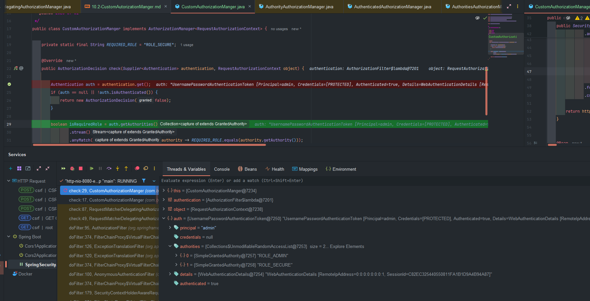

## Custom AuthorizationManager
스프링 시큐리티 인가 설정시 선언적 방식이 아닌 프로그래밍 방식으로 구현할 수 있으면 `access(AuthorizationManger)`을 사용한다.  
  
- `access()` 에는 `AuthorizationManager<RequestAuthorizationContext>` 타입 객체를 전달, 사용자의 요청에 대한 권한 검사를 지정한 AuthorizationManger 가 처리한다.
- 이때 지정한 `AuthorizationManager` 객체는 `RequestMatcherDelegatingAuthorizationManger`의 매핑 속성에 저장도니다.

```java
        http
                .authorizeHttpRequests(authorize -> authorize
                        .requestMatchers("/api/db").access(new CustomAuthorizationManger)

```
특정 엔드포인트에 대한 권한 검사를 수행하기 위한 `AuthorizationManager`를 구현하여 설정한다.
  
```java 
public class CustomAuthorizationManger implements AuthorizationManager<RequestAuthorizationContext> {

    private static final String ROLE = "ROLE_SECURE";
    
    @Override
    public AuthorizationDecision check(Supplier<Authentication> authentication, RequestAuthorizationContext object) {

        Authentication auth = authentication.get();
        if (auth == null || !auth.isAuthenticated()) {
            return new AuthorizationDecision(false);
        }

        boolean requiredRole = auth.getAuthorities()
                .stream()
                .anyMatch(authority -> ROLE.equals(authority.getAuthority()));

        return new  AuthorizationDecision(requiredRole);
    }
}


```
  
