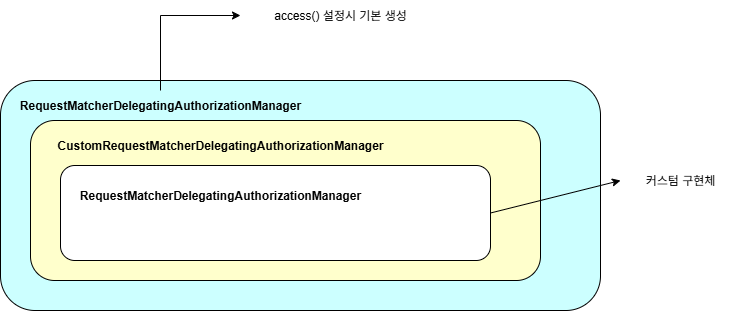

# 응용하기

## RequestMatcherDelegatingAuthorizationManager 인가 설정 응용
`RequestMatcherDelegatingAuthorizationManager`의 mappings 속성에 직접 `RequestMatcherEntry` 객체를 생성, 추가한다.
  
```java 
public class RequestMatcherEntry<T> {

	private final RequestMatcher requestMatcher;

	private final T entry;

	public RequestMatcherEntry(RequestMatcher requestMatcher, T entry) {
		this.requestMatcher = requestMatcher;
		this.entry = entry;
	}

	public RequestMatcher getRequestMatcher() {
		return this.requestMatcher;
	}

	public T getEntry() {
		return this.entry;
	}

}


```
- `getEntry()`: 요청 패턴에 매핑된 AuthorizationManger 객체를 반환한다.
- `getRequestMatcher()`: 요청 패턴을 저장한 RequestMatcher 객체를 반환한다.

```java 

import java.util.ArrayList;

List<RequestMatcherEntry<AuthorizationManager<RequestAuthorizationContext>>> mappings = new ArrayList<>();

RequestMatcherEntry<AuthorizationManager<RequestAuthorizationContext>> requestMatcherEntry 
        = new RequestMatcherEntry(new MvcRequestMatcher(introspector,"/user"),AuthorityAuthorizationManager.hasAnyAuthority("ROLE_USER"));

mapping.add(requestMatcherEntry);

```

```java
RequestMatcherDelegatingAuthorizationManager.builder().mappings(maps -> maps.addAll(mappings)).build();
```

`RequestMatcherDelegatingAuthorizationManager`를 감싸는 `CustomRequestMatcherDelegatingAuthorizationManager`를 구현하면 된다.  
  
모든 요청에 대한 권한심사를 `CustomRequestMatcherDelegatingAuthorizationManager`가 처리하도록 설정한다.
```java 
        http
                .authorizeHttpRequests(authorize -> authorize
                        .anyRequest().access(new CustomRequestMatcherDelegatingAuthorizationManager()))

```  
  
### 이해를 위한 구조
  
해당 구조는 구조적으로 동일한 객체에서 위임받고 다시 위임하고 있다. 추후 개선의 여지가 있고 현재는 해당 구조의 이해를 위해 편의상 이런 방식의 구조로 테스트를 한다.