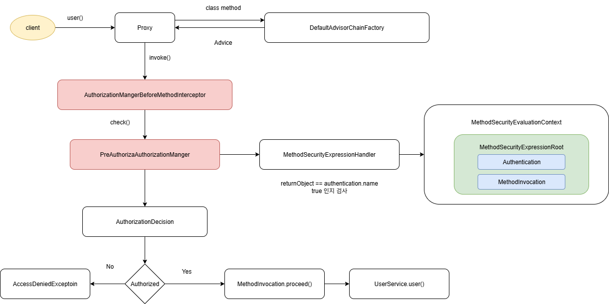

# PreAuthorizeAuthorizationManager 구조와 이해

## AOP와 메서드 인터셉터 기본 개념

### AOP(Aspect-Oriented Programming) 기초

```java

// 메서드 호출 전후에 부가 기능을 삽입하는 개념
public class BusinessService {

// 실제 비즈니스 로직
    public void processData() {
// 핵심 로직
    }
}

// AOP를 통한 보안 기능 추가
@Aspect
@Component
public class SecurityAspect {

    @Before("@annotation(PreAuthorize)")
    public void checkAuthorization(JoinPoint joinPoint) {
// 메서드 실행 전 권한 검사
    }
}

```

**핵심 개념:**

- **Cross-cutting Concerns**: 보안, 로깅, 트랜잭션 등 여러 모듈에 걸쳐 나타나는 공통 관심사
- **JoinPoint**: 메서드 호출 시점 같은 프로그램 실행 지점
- **Advice**: 특정 JoinPoint에서 실행되는 코드 (Before, After, Around 등)

### 메서드 인터셉터 패턴

```java

public interface MethodInterceptor {
    Object invoke(MethodInvocation invocation) throws Throwable;
}

// 메서드 호출을 가로채서 추가 로직 수행
public class SecurityMethodInterceptor implements MethodInterceptor {

    @Override
    public Object invoke(MethodInvocation invocation) throws Throwable {
// 1. 사전 검사 (PreAuthorize)
        checkPreAuthorization(invocation);

// 2. 실제 메서드 실행
        Object result = invocation.proceed();

// 3. 사후 검사 (PostAuthorize)
        checkPostAuthorization(result);

        return result;
    }
}

```

---

## Spring 자동 프록시 생성 메커니즘

### 1. AbstractAutoProxyCreator - 자동 프록시 생성의 핵심

```java

// Spring의 자동 프록시 생성 추상 클래스
public abstract class AbstractAutoProxyCreator
    implements SmartInstantiationAwareBeanPostProcessor, BeanFactoryAware {

// 프록시 생성 여부를 결정하는 캐시
    private final Map<Object, Object> advisedBeans = new ConcurrentHashMap<>();

// 순환 참조 처리용 캐시
    private final Map<Object, Object> earlyProxyReferences = new ConcurrentHashMap<>();

    @Override
    public Object postProcessAfterInitialization(Object bean, String beanName) throws BeansException {
        if (bean != null) {
// 1. 캐시 키 생성
            Object cacheKey = getCacheKey(bean.getClass(), beanName);

// 2. 순환 참조 처리
            if (this.earlyProxyReferences.remove(cacheKey) != bean) {
// 3. 프록시 생성 여부 결정 및 생성
                return wrapIfNecessary(bean, beanName, cacheKey);
            }
        }
        return bean;
    }

// 추상 메서드 - 구현체에서 어드바이스 결정
    protected abstract Object[] getAdvicesAndAdvisorsForBean(Class<?> beanClass, String beanName,
                                                           TargetSource targetSource) throws BeansException;
}

```

### 2. wrapIfNecessary() - 프록시 생성 결정 로직

```java

protected Object wrapIfNecessary(Object bean, String beanName, Object cacheKey) {
// 1. 이미 처리된 빈인지 확인
    if (StringUtils.hasLength(beanName) && this.targetSourcedBeans.contains(beanName)) {
        return bean;
    }

// 2. 프록시 생성이 필요하지 않은 빈인지 확인
    if (Boolean.FALSE.equals(this.advisedBeans.get(cacheKey))) {
        return bean;
    }

// 3. 인프라스트럭처 클래스거나 프록시 생성을 건너뛸 빈인지 확인
    if (isInfrastructureClass(bean.getClass()) || shouldSkip(bean.getClass(), beanName)) {
        this.advisedBeans.put(cacheKey, Boolean.FALSE);
        return bean;
    }

// 4. 해당 빈에 적용할 어드바이스/어드바이저 찾기
    Object[] specificInterceptors = getAdvicesAndAdvisorsForBean(bean.getClass(), beanName, null);

// 5. 어드바이스가 있으면 프록시 생성
    if (specificInterceptors != DO_NOT_PROXY) {
        this.advisedBeans.put(cacheKey, Boolean.TRUE);

// 6. 실제 프록시 생성
        Object proxy = createProxy(bean.getClass(), beanName, specificInterceptors, new SingletonTargetSource(bean));
        this.proxyTypes.put(cacheKey, proxy.getClass());
        return proxy;
    }

// 7. 어드바이스가 없으면 원본 빈 반환
    this.advisedBeans.put(cacheKey, Boolean.FALSE);
    return bean;
}

```

### 3. Spring Security 전용 AutoProxyCreator

```java

// Spring Security 메서드 보안 전용 자동 프록시 생성기
public class MethodSecurityAdvisorAutoProxyCreator extends AbstractBeanFactoryAwareAdvisingPostProcessor {

    private String adviceMode = "proxy";
    private int order = Ordered.LOWEST_PRECEDENCE;

    @Override
    protected boolean isEligible(Object bean, String beanName) {
// 1. 보안 어노테이션 확인
        return hasSecurityAnnotations(bean.getClass());
    }

    @Override
    protected Object[] getAdvicesAndAdvisorsForBean(Class<?> beanClass, String beanName,
                                                   TargetSource targetSource) throws BeansException {
// 2. 메서드 보안 어드바이저 수집
        List<Advisor> advisors = findEligibleAdvisors(beanClass, beanName);

        if (advisors.isEmpty()) {
            return DO_NOT_PROXY;
        }

        return advisors.toArray();
    }

    private boolean hasSecurityAnnotations(Class<?> clazz) {
// 클래스 레벨 어노테이션 확인
        if (AnnotationUtils.findAnnotation(clazz, PreAuthorize.class) != null ||
            AnnotationUtils.findAnnotation(clazz, PostAuthorize.class) != null ||
            AnnotationUtils.findAnnotation(clazz, Secured.class) != null ||
            AnnotationUtils.findAnnotation(clazz, RolesAllowed.class) != null) {
            return true;
        }

// 메서드 레벨 어노테이션 확인
        return hasMethodLevelAnnotations(clazz);
    }

    private boolean hasMethodLevelAnnotations(Class<?> clazz) {
        return Arrays.stream(clazz.getDeclaredMethods())
                .anyMatch(method ->
                    method.isAnnotationPresent(PreAuthorize.class) ||
                    method.isAnnotationPresent(PostAuthorize.class) ||
                    method.isAnnotationPresent(Secured.class) ||
                    method.isAnnotationPresent(RolesAllowed.class) ||
                    method.isAnnotationPresent(PreFilter.class) ||
                    method.isAnnotationPresent(PostFilter.class)
                );
    }
}

```

---

## 프록시 팩토리와 프록시 생성 과정

### 1. 프록시 팩토리와 프록시 생성 메커니즘

```java

// Spring의 프록시 생성 핵심 클래스
public class ProxyFactory extends AdvisedSupport {

    public Object getProxy() {
        return createAopProxy().getProxy();
    }

    protected final synchronized AopProxy createAopProxy() {
        if (this.proxyTargetClass || hasNoUserSuppliedProxyInterfaces()) {
// CGLIB 프록시 생성
            return new CglibAopProxy(this);
        } else {
// JDK 동적 프록시 생성
            return new JdkDynamicAopProxy(this);
        }
    }
}

```

### 2. 프록시 생성 전략

```java

// JDK 동적 프록시 - 인터페이스 기반
public class JdkDynamicAopProxy implements AopProxy, InvocationHandler {

    @Override
    public Object getProxy() {
        return Proxy.newProxyInstance(
            classLoader,
            proxiedInterfaces,// 인터페이스 배열
            this// InvocationHandler
        );
    }

    @Override
    public Object invoke(Object proxy, Method method, Object[] args) throws Throwable {
// 메서드 인터셉터 체인 실행
        List<Object> chain = this.advised.getInterceptorsAndDynamicInterceptionAdvice(method, targetClass);

        if (chain.isEmpty()) {
            return method.invoke(target, args);
        } else {
// 인터셉터 체인을 통한 메서드 호출
            MethodInvocation invocation = new ReflectiveMethodInvocation(proxy, target, method, args, targetClass, chain);
            return invocation.proceed();
        }
    }
}

```

```java

// CGLIB 프록시 - 클래스 기반
public class CglibAopProxy implements AopProxy, Serializable {

    @Override
    public Object getProxy() {
        Enhancer enhancer = new Enhancer();
        enhancer.setSuperclass(this.advised.getTargetClass());
        enhancer.setCallback(new DynamicAdvisedInterceptor(this.advised));
        return enhancer.create();
    }

    private static class DynamicAdvisedInterceptor implements MethodInterceptor {

        @Override
        public Object intercept(Object proxy, Method method, Object[] args, MethodProxy methodProxy) throws Throwable {
// 메서드 인터셉터 체인 실행
            List<Object> chain = this.advised.getInterceptorsAndDynamicInterceptionAdvice(method, targetClass);

            if (chain.isEmpty()) {
                return methodProxy.invoke(target, args);
            } else {
                return new CglibMethodInvocation(proxy, target, method, args, targetClass, chain, methodProxy).proceed();
            }
        }
    }
}

```

### 3. 프록시 타입 결정 로직

```java

public class DefaultAopProxyFactory implements AopProxyFactory {

    @Override
    public AopProxy createAopProxy(AdvisedSupport config) throws AopConfigException {
// 1. 프록시 타입 결정
        if (config.isOptimize() || config.isProxyTargetClass() || hasNoUserSuppliedProxyInterfaces(config)) {
            Class<?> targetClass = config.getTargetClass();

            if (targetClass == null) {
                throw new AopConfigException("TargetSource cannot determine target class");
            }

// 인터페이스이거나 Proxy 클래스면 JDK 프록시
            if (targetClass.isInterface() || Proxy.isProxyClass(targetClass)) {
                return new JdkDynamicAopProxy(config);
            }

// 그 외는 CGLIB 프록시
            return new CglibAopProxy(config);
        } else {
// 인터페이스가 있으면 JDK 프록시
            return new JdkDynamicAopProxy(config);
        }
    }
}

```

---

## 빈 생성 라이프사이클과 자동 프록시 생성

### 1. 빈 생성 과정에서의 프록시 생성

```java

public class DefaultListableBeanFactory extends AbstractAutowireCapableBeanFactory {

    protected Object doCreateBean(String beanName, RootBeanDefinition mbd, Object[] args) {
// 1. 인스턴스 생성
        Object bean = createBeanInstance(beanName, mbd, args);

// 2. 프로퍼티 설정
        populateBean(beanName, mbd, bean);

// 3. 초기화 및 BeanPostProcessor 적용
        Object exposedObject = initializeBean(beanName, bean, mbd);

        return exposedObject;
    }

    protected Object initializeBean(String beanName, Object bean, RootBeanDefinition mbd) {
// BeanPostProcessor.postProcessBeforeInitialization 호출
        Object wrappedBean = applyBeanPostProcessorsBeforeInitialization(bean, beanName);

// 초기화 메서드 실행
        invokeInitMethods(beanName, wrappedBean, mbd);

// BeanPostProcessor.postProcessAfterInitialization 호출// 여기서 AbstractAutoProxyCreator가 프록시 생성
        wrappedBean = applyBeanPostProcessorsAfterInitialization(wrappedBean, beanName);

        return wrappedBean;
    }
}

```

### 2. 어드바이저(Advisor) 기반 프록시 생성

```java

public class MethodSecurityMetadataSourceAdvisor extends AbstractPointcutAdvisor {

    private final MethodSecurityInterceptor methodSecurityInterceptor;
    private final MethodSecurityMetadataSource metadataSource;

    @Override
    public Pointcut getPointcut() {
        return new MethodSecurityPointcut(metadataSource);
    }

    @Override
    public Advice getAdvice() {
        return methodSecurityInterceptor;
    }

// 포인트컷 - 어떤 메서드에 적용할지 결정
    private static class MethodSecurityPointcut extends StaticMethodMatcherPointcut {

        private final MethodSecurityMetadataSource metadataSource;

        @Override
        public boolean matches(Method method, Class<?> targetClass) {
// 메서드에 보안 어노테이션이 있는지 확인
            return metadataSource.getAttributes(method, targetClass) != null;
        }
    }
}

```

### 3. 자동 프록시 생성 설정

```java

@Configuration
@EnableMethodSecurity(prePostEnabled = true)
public class MethodSecurityConfig {

// 자동 프록시 생성기 빈 등록
    @Bean
    public MethodSecurityAdvisorAutoProxyCreator methodSecurityAdvisorAutoProxyCreator() {
        MethodSecurityAdvisorAutoProxyCreator creator = new MethodSecurityAdvisorAutoProxyCreator();
        creator.setProxyTargetClass(true);// CGLIB 프록시 강제 사용
        creator.setOrder(Ordered.HIGHEST_PRECEDENCE);// 우선순위 설정
        return creator;
    }

// 메서드 보안 어드바이저 등록
    @Bean
    public MethodSecurityMetadataSourceAdvisor methodSecurityAdvisor() {
        return new MethodSecurityMetadataSourceAdvisor(
            "methodSecurityInterceptor",
            methodSecurityMetadataSource(),
            "methodSecurityMetadataSource"
        );
    }

// 인터셉터 체인 구성
    @Bean
    public MethodSecurityInterceptor methodSecurityInterceptor() {
        MethodSecurityInterceptor interceptor = new MethodSecurityInterceptor();

// 인터셉터 체인 구성
        List<MethodInterceptor> interceptors = Arrays.asList(
            new AuthorizationManagerBeforeMethodInterceptor(preAuthorizeAuthorizationManager()),
            new PreFilterAuthorizationMethodInterceptor(preFilterAuthorizationManager()),
            new PostFilterAuthorizationMethodInterceptor(postFilterAuthorizationManager()),
            new AuthorizationManagerAfterMethodInterceptor(postAuthorizeAuthorizationManager())
        );

        interceptor.setMethodInterceptors(interceptors);
        return interceptor;
    }
}

```

---

## 프록시 빈과 원본 빈의 관계

### 1. 프록시 빈의 구조

```java

// 원본 서비스 클래스
@Service
public class DocumentService {

    @PreAuthorize("hasRole('USER')")
    public Document findById(Long id) {
        return documentRepository.findById(id);
    }
}

// AbstractAutoProxyCreator가 생성하는 프록시 빈 (개념적 표현)
public class DocumentService$$EnhancerBySpringCGLIB extends DocumentService {

    private final DocumentService target;// 원본 빈
    private final List<MethodInterceptor> interceptors;// 인터셉터 체인

    @Override
    public Document findById(Long id) {
// 1. 메서드 인터셉터 체인 생성
        MethodInvocation invocation = new ReflectiveMethodInvocation(
            this,// 프록시 객체
            target,// 원본 객체
            findByIdMethod,// 메서드 정보
            new Object[]{id},// 파라미터
            DocumentService.class,// 타겟 클래스
            interceptors// 인터셉터 체인
        );

// 2. 인터셉터 체인 실행
        return (Document) invocation.proceed();
    }
}

```

### 2. 의존성 주입과 프록시

```java

@RestController
public class DocumentController {

// 주입되는 것은 프록시 빈 (AbstractAutoProxyCreator가 생성)
    private final DocumentService documentService;// 실제로는 DocumentService$$EnhancerBySpringCGLIB

    @GetMapping("/documents/{id}")
    public Document getDocument(@PathVariable Long id) {
// 프록시를 통한 메서드 호출
        return documentService.findById(id);// 보안 검사 → 원본 메서드 실행
    }
}

```

### 3. 프록시 생성 과정 시퀀스

```java

// 1. 빈 생성 요청ApplicationContext context = ...;
DocumentService service = context.getBean(DocumentService.class);
// 2. 내부 처리 과정/*
DocumentService 빈 생성 요청
    ↓
DefaultListableBeanFactory.doCreateBean()
    ↓
createBeanInstance() - 원본 인스턴스 생성
    ↓
populateBean() - 프로퍼티 설정
    ↓
initializeBean() - 초기화 및 BeanPostProcessor 적용
    ↓
applyBeanPostProcessorsAfterInitialization()
    ↓
MethodSecurityAdvisorAutoProxyCreator.postProcessAfterInitialization()
    ↓
wrapIfNecessary() - 프록시 생성 여부 결정
    ↓
hasSecurityAnnotations() - 보안 어노테이션 확인
    ↓
createProxy() - 프록시 생성
    ↓
ProxyFactory.getProxy()
    ↓
CglibAopProxy.getProxy() - CGLIB 프록시 생성
    ↓
프록시 빈 반환
*/

```

---

## Spring Security 메서드 보안 인터셉터 구조

### 전체 처리 흐름

```

요청 → 자동 프록시 빈 → MethodInterceptor 체인 → 원본 메서드

┌─────────────────────────────────────────────────────────────┐
│              자동 생성된 프록시 빈                           │
│        (AbstractAutoProxyCreator에 의해 생성)               │
├─────────────────────────────────────────────────────────────┤
│              MethodInterceptor 체인                          │
├─────────────────────────────────────────────────────────────┤
│ 1. AuthorizationManagerBeforeMethodInterceptor             │
│    - @PreAuthorize 처리                                     │
│    - @Secured 처리                                          │
│    - @RolesAllowed 처리                                     │
├─────────────────────────────────────────────────────────────┤
│ 2. PreFilterAuthorizationMethodInterceptor                 │
│    - @PreFilter 처리                                        │
│    - 메서드 파라미터 필터링                                    │
├─────────────────────────────────────────────────────────────┤
│ 3. 원본 메서드 실행                                          │
│    - 실제 비즈니스 로직 수행                                   │
├─────────────────────────────────────────────────────────────┤
│ 4. PostFilterAuthorizationMethodInterceptor                │
│    - @PostFilter 처리                                       │
│    - 반환값 필터링                                           │
├─────────────────────────────────────────────────────────────┤
│ 5. AuthorizationManagerAfterMethodInterceptor              │
│    - @PostAuthorize 처리                                    │
│    - 반환값 기반 권한 검사                                    │
└─────────────────────────────────────────────────────────────┘

```

---

## 1. AuthorizationManagerBeforeMethodInterceptor

### 개요

메서드 실행 **전에** 권한을 검사하는 인터셉터입니다.

### 핵심 구조

```java

public final class AuthorizationManagerBeforeMethodInterceptor implements MethodInterceptor {

    private final AuthorizationManager<MethodInvocation> authorizationManager;

    @Override
    public Object invoke(MethodInvocation invocation) throws Throwable {
// 1. 권한 검사 수행
        Authentication auth = SecurityContextHolder.getContext().getAuthentication();
        AuthorizationDecision decision = authorizationManager.check(() -> auth, invocation);

// 2. 접근 거부 시 예외 발생
        if (decision != null && !decision.isGranted()) {
            throw new AccessDeniedException("Access denied");
        }

// 3. 권한 통과 시 다음 인터셉터로 진행
        return invocation.proceed();
    }
}

```

### 처리 대상 어노테이션

- `@PreAuthorize("hasRole('ADMIN')")`
- `@Secured({"ROLE_USER", "ROLE_ADMIN"})`
- `@RolesAllowed("ADMIN")`

---

## 2. AuthorizationManagerAfterMethodInterceptor

### 개요

메서드 실행 **후에** 반환값을 기반으로 권한을 검사하는 인터셉터입니다.

### 핵심 구조

```java

public final class AuthorizationManagerAfterMethodInterceptor implements MethodInterceptor {

    private final AuthorizationManager<MethodInvocationResult> authorizationManager;

    @Override
    public Object invoke(MethodInvocation invocation) throws Throwable {
// 1. 다음 인터셉터 체인 실행 (원본 메서드 포함)
        Object result = invocation.proceed();

// 2. 반환값을 포함한 컨텍스트 생성
        MethodInvocationResult invocationResult = new MethodInvocationResult(invocation, result);

// 3. 반환값 기반 권한 검사
        Authentication auth = SecurityContextHolder.getContext().getAuthentication();
        AuthorizationDecision decision = authorizationManager.check(() -> auth, invocationResult);

// 4. 접근 거부 시 예외 발생
        if (decision != null && !decision.isGranted()) {
            throw new AccessDeniedException("Access denied");
        }

        return result;
    }
}

```

### 처리 대상 어노테이션

- `@PostAuthorize("returnObject.owner == principal.username")`

---

## 3. PreFilterAuthorizationMethodInterceptor

### 개요

메서드 실행 **전에** 컬렉션 타입 파라미터를 필터링하는 인터셉터입니다.

### 핵심 구조

```java

public final class PreFilterAuthorizationMethodInterceptor implements MethodInterceptor {

    private final PreFilterAuthorizationManager authorizationManager;

    @Override
    public Object invoke(MethodInvocation invocation) throws Throwable {
// 1. @PreFilter 어노테이션 확인
        PreFilter preFilter = findPreFilterAnnotation(invocation);
        if (preFilter == null) {
            return invocation.proceed();
        }

// 2. 필터링 대상 파라미터 식별
        Object[] arguments = invocation.getArguments();
        String filterTarget = preFilter.filterTarget();

// 3. 컬렉션 필터링 수행
        Object filteredCollection = filterCollection(arguments, filterTarget, preFilter.value());

// 4. 필터링된 파라미터로 다음 인터셉터 실행
        replaceArgument(invocation, filteredCollection);
        return invocation.proceed();
    }
}

```

### 처리 대상 어노테이션

- `@PreFilter("hasPermission(filterObject, 'read')")`

---

## 4. PostFilterAuthorizationMethodInterceptor

### 개요

메서드 실행 **후에** 반환값 컬렉션을 필터링하는 인터셉터입니다.

### 핵심 구조

```java

public final class PostFilterAuthorizationMethodInterceptor implements MethodInterceptor {

    private final PostFilterAuthorizationManager authorizationManager;

    @Override
    public Object invoke(MethodInvocation invocation) throws Throwable {
// 1. 다음 인터셉터 체인 실행 (원본 메서드 포함)
        Object result = invocation.proceed();

// 2. @PostFilter 어노테이션 확인
        PostFilter postFilter = findPostFilterAnnotation(invocation);
        if (postFilter == null) {
            return result;
        }

// 3. 반환값이 컬렉션인지 확인
        if (!(result instanceof Collection)) {
            return result;
        }

// 4. 컬렉션 필터링 수행
        Collection<?> filteredResult = filterCollection((Collection<?>) result, postFilter.value());

        return filteredResult;
    }
}

```

### 처리 대상 어노테이션

- `@PostFilter("hasPermission(filterObject, 'read')")`

---

## 핵심 포인트 정리

### 1. 자동 프록시 생성 과정

- **AbstractAutoProxyCreator**: BeanPostProcessor를 통해 자동으로 프록시 생성
- **어노테이션 감지**: 보안 어노테이션이 있는 빈만 프록시 생성 대상으로 선별
- **어드바이저 매칭**: 해당 빈에 적용할 어드바이스/어드바이저를 찾아 프록시에 연결

### 2. 프록시 생성 과정

- **빈 생성 시점**: BeanPostProcessor에서 보안 어노테이션 감지
- **프록시 타입**: 인터페이스 유무에 따라 JDK/CGLIB 프록시 선택
- **인터셉터 체인**: 메서드 보안 관련 인터셉터들이 순차적으로 연결

### 3. 처리 순서의 중요성

- **Before** → **PreFilter** → **원본 메서드** → **PostFilter** → **After**
- 각 단계에서 실패 시 후속 단계는 실행되지 않음
- 프록시를 통해 투명하게 보안 기능 제공


---

## 개요

`PreAuthorizeAuthorizationManager`는 Spring Security의 메서드 기반 보안에서 `@PreAuthorize` 어노테이션을 처리하는 핵심 구성 요소입니다. 이 클래스는 SpEL(Spring Expression Language) 표현식을 평가하여 메서드 실행 전에 권한을 검사합니다.
```java
@PreAuthorize("hasAuthority('ROLE_USER')")
public vod user(){..}
```
  


  

## 클래스 계층 구조

```java

// 최상위 인터페이스
public interface AuthorizationManager<T> {
    @Nullable
    AuthorizationDecision check(Supplier<Authentication> authentication, T object);
}

// 구현 클래스
public final class PreAuthorizeAuthorizationManager implements AuthorizationManager<MethodInvocation> {
// 구현 내용
}

```

- `AuthorizationManager<MethodInvocation>`을 구현하여 메서드 호출 컨텍스트에서 인가 처리를 담당합니다.
- 제네릭 타입 `T`가 `MethodInvocation`인 것이 특징으로, 메서드 기반 보안의 특성을 보여줍니다.

## PreAuthorizeAuthorizationManager 내부 구조

### 핵심 필드와 의존성

```java

public final class PreAuthorizeAuthorizationManager implements AuthorizationManager<MethodInvocation> {

// SpEL 표현식 핸들러
    private final MethodSecurityExpressionHandler expressionHandler;

// 메서드별 표현식 캐시
    private final Map<Method, Expression> expressionCache = new ConcurrentHashMap<>();

// 빈 검증을 위한 BeanResolver
    private BeanResolver beanResolver;

// 생성자
    public PreAuthorizeAuthorizationManager(MethodSecurityExpressionHandler expressionHandler) {
        this.expressionHandler = expressionHandler;
    }

// BeanResolver 설정
    public void setBeanResolver(BeanResolver beanResolver) {
        this.beanResolver = beanResolver;
    }
}

```

**상세 설명:**

- `MethodSecurityExpressionHandler`는 SpEL 표현식을 파싱하고 평가하는 핵심 컴포넌트입니다.
- `expressionCache`는 메서드별로 파싱된 표현식을 캐시하여 성능을 향상시킵니다.
- `BeanResolver`는 SpEL 표현식에서 Spring Bean을 참조할 수 있게 해줍니다.

## check() 메서드 - 핵심 인가 로직

```java

@Override
public AuthorizationDecision check(Supplier<Authentication> authentication, MethodInvocation methodInvocation) {
// 1. @PreAuthorize 어노테이션 추출
    PreAuthorize preAuthorize = findPreAuthorizeAnnotation(methodInvocation);

    if (preAuthorize == null) {
        return null;// 어노테이션이 없으면 다른 Manager에게 위임
    }

// 2. SpEL 표현식 파싱 및 캐싱
    Expression expression = getExpression(methodInvocation.getMethod(), preAuthorize);

// 3. 평가 컨텍스트 생성
    EvaluationContext evaluationContext = createEvaluationContext(
        authentication.get(),
        methodInvocation
    );

// 4. 표현식 평가
    boolean granted = evaluateExpression(expression, evaluationContext);

// 5. 결과 반환
    return new AuthorizationDecision(granted);
}

```

**상세 설명:**

- 메서드에서 `@PreAuthorize` 어노테이션을 찾아 SpEL 표현식을 추출합니다.
- 표현식은 메서드별로 캐싱되어 성능 최적화를 구현합니다.
- `EvaluationContext`에 인증 정보와 메서드 파라미터를 포함시켜 표현식 평가에 필요한 컨텍스트를 제공합니다.

## 어노테이션 추출 로직

```java

private PreAuthorize findPreAuthorizeAnnotation(MethodInvocation methodInvocation) {
    Method method = methodInvocation.getMethod();

// 1. 메서드 레벨에서 어노테이션 확인
    PreAuthorize preAuthorize = AnnotationUtils.findAnnotation(method, PreAuthorize.class);

    if (preAuthorize != null) {
        return preAuthorize;
    }

// 2. 클래스 레벨에서 어노테이션 확인
    Class<?> targetClass = methodInvocation.getThis().getClass();
    return AnnotationUtils.findAnnotation(targetClass, PreAuthorize.class);
}

```

**상세 설명:**

- 메서드 레벨 어노테이션이 클래스 레벨 어노테이션보다 우선순위가 높습니다.
- `AnnotationUtils.findAnnotation()`은 상속 관계까지 고려하여 어노테이션을 찾습니다.

## 표현식 파싱 및 캐싱

```java

private Expression getExpression(Method method, PreAuthorize preAuthorize) {
// 1. 캐시에서 표현식 조회
    return expressionCache.computeIfAbsent(method, key -> {
// 2. 표현식 문자열 추출
        String expressionString = preAuthorize.value();

// 3. SpEL 표현식 파싱
        return expressionHandler.getExpressionParser().parseExpression(expressionString);
    });
}

```

**상세 설명:**

- `ConcurrentHashMap`을 사용하여 스레드 안전한 캐싱을 구현합니다.
- `computeIfAbsent()`로 원자적인 캐시 연산을 보장합니다.
- 표현식 파싱은 비용이 큰 작업이므로 캐싱이 필수적입니다.

## 평가 컨텍스트 생성

```java

private EvaluationContext createEvaluationContext(Authentication authentication,
                                                 MethodInvocation methodInvocation) {
// 1. 기본 보안 컨텍스트 생성
    MethodSecurityEvaluationContext context = expressionHandler.createEvaluationContext(
        authentication,
        methodInvocation
    );

// 2. 메서드 파라미터 바인딩
    bindMethodParameters(context, methodInvocation);

// 3. 빈 참조 설정
    if (beanResolver != null) {
        context.setBeanResolver(beanResolver);
    }

    return context;
}

private void bindMethodParameters(MethodSecurityEvaluationContext context,
                                MethodInvocation methodInvocation) {
    Method method = methodInvocation.getMethod();
    Object[] arguments = methodInvocation.getArguments();
    Parameter[] parameters = method.getParameters();

    for (int i = 0; i < parameters.length; i++) {
        Parameter parameter = parameters[i];
        String paramName = parameter.getName();

// 파라미터를 SpEL 변수로 바인딩
        context.setVariable(paramName, arguments[i]);
    }
}

```

**상세 설명:**

- `MethodSecurityEvaluationContext`는 메서드 보안 전용 평가 컨텍스트입니다.
- 메서드 파라미터가 SpEL 변수로 바인딩되어 표현식에서 참조할 수 있습니다.
- `BeanResolver`를 통해 Spring Bean을 SpEL 표현식에서 참조할 수 있습니다.

## 표현식 평가

```java

private boolean evaluateExpression(Expression expression, EvaluationContext context) {
    try {
// 1. 표현식 평가
        Object result = expression.getValue(context);

// 2. Boolean 결과 확인
        if (result instanceof Boolean) {
            return (Boolean) result;
        }

// 3. 타입 변환
        return Boolean.TRUE.equals(result);

    } catch (EvaluationException ex) {
// 4. 평가 실패 시 접근 거부
        logEvaluationFailure(expression, context, ex);
        return false;
    }
}

private void logEvaluationFailure(Expression expression, EvaluationContext context,
                                EvaluationException ex) {
    if (logger.isDebugEnabled()) {
        logger.debug("Failed to evaluate expression: {} - {}",
                    expression.getExpressionString(), ex.getMessage());
    }
}

```

**상세 설명:**

- 표현식 평가 결과는 Boolean 타입이어야 합니다.
- 평가 실패 시 보안상 안전한 기본값(false)을 반환합니다.
- 디버깅을 위한 로깅 기능을 제공합니다.

## 구체적인 @PreAuthorize 표현식 처리 시나리오

### 1. 단순 역할 확인

```java

@PreAuthorize("hasRole('ADMIN')")
public void deleteUser(Long userId) {
// 메서드 구현
}

// 내부 처리 과정
private boolean handleSimpleRoleCheck(Authentication auth) {
// 표현식: "hasRole('ADMIN')"// 평가: auth.getAuthorities().contains("ROLE_ADMIN")
    return auth.getAuthorities().stream()
            .map(GrantedAuthority::getAuthority)
            .anyMatch("ROLE_ADMIN"::equals);
}

```

### 2. 메서드 파라미터 활용

```java

@PreAuthorize("hasRole('USER') and #userId == principal.id")
public void updateProfile(Long userId, UserProfile profile) {
// 메서드 구현
}

// 내부 처리 과정
private boolean handleParameterBasedCheck(Authentication auth, Long userId) {
// 표현식: "hasRole('USER') and #userId == principal.id"// 1. hasRole('USER') 평가
    boolean hasRole = auth.getAuthorities().stream()
            .map(GrantedAuthority::getAuthority)
            .anyMatch("ROLE_USER"::equals);

// 2. #userId == principal.id 평가
    Object principal = auth.getPrincipal();
    boolean ownerCheck = false;
    if (principal instanceof UserDetails) {
        Long principalId = ((CustomUserDetails) principal).getId();
        ownerCheck = userId.equals(principalId);
    }

    return hasRole && ownerCheck;
}

```

### 3. 복잡한 SpEL 표현식

```java

@PreAuthorize("hasAuthority('READ_DOCUMENT') and @documentService.canAccess(#docId, principal)")
public Document getDocument(Long docId) {
// 메서드 구현
}

// 내부 처리 과정 (documentService Bean 참조)
private boolean handleBeanMethodCheck(Authentication auth, Long docId) {
// 표현식: "hasAuthority('READ_DOCUMENT') and @documentService.canAccess(#docId, principal)"

// 1. hasAuthority('READ_DOCUMENT') 평가
    boolean hasAuthority = auth.getAuthorities().stream()
            .map(GrantedAuthority::getAuthority)
            .anyMatch("READ_DOCUMENT"::equals);

// 2. @documentService.canAccess(#docId, principal) 평가
    DocumentService documentService = applicationContext.getBean(DocumentService.class);
    boolean canAccess = documentService.canAccess(docId, auth.getPrincipal());

    return hasAuthority && canAccess;
}

```

## MethodSecurityExpressionHandler와의 상호작용

```java

public class DefaultMethodSecurityExpressionHandler implements MethodSecurityExpressionHandler {

    @Override
    public MethodSecurityEvaluationContext createEvaluationContext(Authentication authentication,
                                                                  MethodInvocation methodInvocation) {
// 1. 기본 보안 컨텍스트 생성
        MethodSecurityEvaluationContext context = new MethodSecurityEvaluationContext(
            authentication,
            methodInvocation,
            getParameterNameDiscoverer()
        );

// 2. 기본 보안 표현식 등록
        context.setVariable("principal", authentication.getPrincipal());
        context.setVariable("authentication", authentication);

// 3. 메서드 보안 표현식 루트 설정
        SecurityExpressionRoot root = createExpressionRoot(authentication, methodInvocation);
        context.setRootObject(root);

        return context;
    }

    private SecurityExpressionRoot createExpressionRoot(Authentication authentication,
                                                      MethodInvocation methodInvocation) {
        MethodSecurityExpressionRoot root = new MethodSecurityExpressionRoot(authentication);

// 기본 보안 메서드 등록
        root.setPermissionEvaluator(getPermissionEvaluator());
        root.setRoleHierarchy(getRoleHierarchy());

        return root;
    }
}

```

**상세 설명:**

- `MethodSecurityEvaluationContext`는 메서드 보안 전용 평가 컨텍스트를 제공합니다.
- `principal`, `authentication` 등 기본 변수들이 자동으로 바인딩됩니다.
- `SecurityExpressionRoot`를 통해 `hasRole()`, `hasAuthority()` 등의 보안 메서드를 사용할 수 있습니다.

## 전체 동작 과정

### AOP 기반 메서드 인터셉션

```java

@Component
public class MethodSecurityInterceptor implements MethodInterceptor {

    private final PreAuthorizeAuthorizationManager preAuthorizeManager;

    @Override
    public Object invoke(MethodInvocation invocation) throws Throwable {
// 1. 현재 인증 정보 준비
        Supplier<Authentication> authSupplier = () ->
            SecurityContextHolder.getContext().getAuthentication();

// 2. PreAuthorize 검사
        AuthorizationDecision decision = preAuthorizeManager.check(authSupplier, invocation);

// 3. 접근 거부 처리
        if (decision != null && !decision.isGranted()) {
            throw new AccessDeniedException("Access denied for method: " +
                invocation.getMethod().getName());
        }

// 4. 메서드 실행
        return invocation.proceed();
    }
}

```

**상세 설명:**

- Spring AOP를 통해 메서드 호출을 인터셉트합니다.
- `@PreAuthorize`가 적용된 메서드만 인가 검사를 수행합니다.
- 인가 실패 시 `AccessDeniedException`을 발생시켜 메서드 실행을 차단합니다.

## 성능 최적화 고려사항

### 표현식 캐싱 전략

```java

// 메서드별 표현식 캐싱
private final Map<Method, Expression> expressionCache = new ConcurrentHashMap<>();

// 평가 결과 캐싱 (선택적)
private final Map<String, AuthorizationDecision> resultCache = new ConcurrentHashMap<>();

private AuthorizationDecision getCachedDecision(String cacheKey) {
    return resultCache.computeIfAbsent(cacheKey, key -> {
// 실제 평가 로직 수행
        return performActualEvaluation(key);
    });
}

```

**상세 설명:**

- 표현식 파싱은 메서드별로 한 번만 수행되도록 캐싱됩니다.
- 동일한 조건의 반복 평가를 피하기 위해 결과 캐싱도 고려할 수 있습니다.
- 메모리 사용량과 성능 간의 균형을 맞춰야 합니다.

이러한 구조를 통해 `PreAuthorizeAuthorizationManager`는 유연하고 강력한 메서드 레벨 보안을 제공하며, SpEL 표현식을 통해 복잡한 비즈니스 로직까지 보안 규칙에 포함시킬 수 있습니다.  

| 어노테이션 | 인터셉터 | 매니저 | 실행 시점 | 처리 내용 |
| --- | --- | --- | --- | --- |
| `@PreAuthorize` | `AuthorizationManagerBeforeMethodInterceptor` | `PreAuthorizeAuthorizationManager` | 메서드 실행 **전** | SpEL 표현식 기반 권한 검사 |
| `@PostAuthorize` | `AuthorizationManagerAfterMethodInterceptor` | `PostAuthorizeAuthorizationManager` | 메서드 실행 **후** | 반환값 기반 SpEL 표현식 권한 검사 |
| `@Secured` | `AuthorizationManagerBeforeMethodInterceptor` | `SecuredAuthorizationManager` | 메서드 실행 **전** | 정적 권한 문자열 검사 |
| `@RolesAllowed` | `AuthorizationManagerBeforeMethodInterceptor` | `Jsr250AuthorizationManager` | 메서드 실행 **전** | JSR-250 표준 역할 검사 |
| `@PreFilter` | `PreFilterAuthorizationMethodInterceptor` | `PreFilterAuthorizationManager` | 메서드 실행 **전** | 입력 파라미터 컬렉션 필터링 |
| `@PostFilter` | `PostFilterAuthorizationMethodInterceptor` | `PostFilterAuthorizationManager` | 메서드 실행 **후** | 반환값 컬렉션 필터링 |
| `@DenyAll` | `AuthorizationManagerBeforeMethodInterceptor` | `Jsr250AuthorizationManager` | 메서드 실행 **전** | 모든 접근 거부 |
| `@PermitAll` | `AuthorizationManagerBeforeMethodInterceptor` | `Jsr250AuthorizationManager` | 메서드 실행 **전** | 모든 접근 허용 |