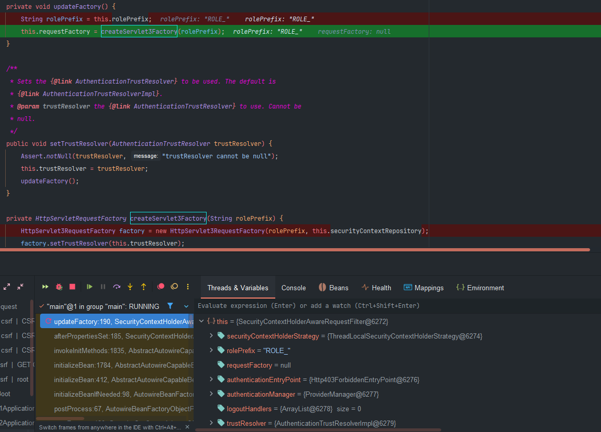
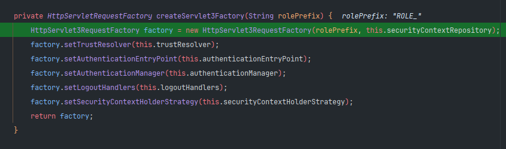
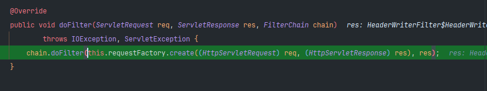
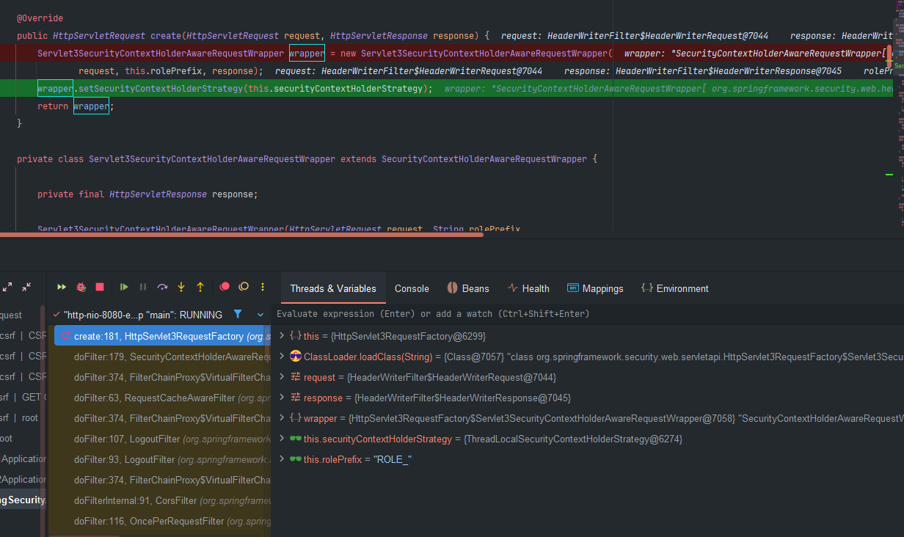

# Spring Security 통합하기

## 개요

Spring Security는 다양한 프레임워크 및 API와의 통합을 제공하고 있으며 `Servlet 3`과 `Spring MVC`와 통합을 통해 여러 편리한 기능들을 사용할 수 있습니다. 인증관련 기능들을 필터가 아닌 서블릿 영역에서 처리할 수 있습니다.

---

### 전체 통합 흐름과 연관관계

```
HTTP 요청
    ↓
1) SecurityContextHolderAwareRequestFilter
    ↓ (HttpServletRequestFactory 사용)
2) HttpServlet3RequestFactory
    ↓ (래퍼 객체 생성)
3) Servlet3SecurityContextHolderAwareRequestWrapper
    ↓ (추가 보안 메서드 제공)
4) 서블릿/컨트롤러 (보안 기능 사용)
```

---

## 1. SecurityContextHolderAwareRequestFilter

### 역할과 추가 보안 기능

- **주요 역할**: HTTP 요청을 보안 기능이 강화된 래퍼 객체로 감싸는 필터
- **연관관계**: `HttpServletRequestFactory`를 사용하여 래퍼 객체 생성

### 추가 보안 메서드 및 기능
  
  

```java
public class SecurityContextHolderAwareRequestFilter extends GenericFilterBean {
    
    // 🔥 보안 관련 설정들
    private String rolePrefix = "ROLE_";                    // 역할 접두사 설정
    private AuthenticationEntryPoint authenticationEntryPoint;  // 인증 진입점
    private AuthenticationManager authenticationManager;        // 인증 관리자
    private List<LogoutHandler> logoutHandlers;                // 로그아웃 핸들러들
    private AuthenticationTrustResolver trustResolver;         // 인증 신뢰 해결사
    
    @Override
    public void doFilter(ServletRequest req, ServletResponse res, FilterChain chain)
            throws IOException, ServletException {
        
        HttpServletRequest request = (HttpServletRequest) req;
        HttpServletResponse response = (HttpServletResponse) res;
        
        // 🔥 핵심 기능: 원본 요청을 보안 래퍼로 감싸기
        HttpServletRequest wrappedRequest = this.requestFactory.create(request, response);
        
        // 🔥 추가 보안 컨텍스트 검증
        if (logger.isDebugEnabled()) {
            logger.debug("보안 래퍼 적용: " + wrappedRequest.getClass().getSimpleName());
        }
        
        chain.doFilter(wrappedRequest, response);
    }
    
    // 🔥 추가 보안 설정 메서드들
    public void setRolePrefix(String rolePrefix) {
        Assert.notNull(rolePrefix, "rolePrefix cannot be null");
        this.rolePrefix = rolePrefix;
        updateFactory();  // 팩토리 갱신
    }
    
    public void setAuthenticationEntryPoint(AuthenticationEntryPoint authenticationEntryPoint) {
        this.authenticationEntryPoint = authenticationEntryPoint;
        updateFactory();
    }
    
    public void setAuthenticationManager(AuthenticationManager authenticationManager) {
        this.authenticationManager = authenticationManager;
        updateFactory();
    }
    
    public void setLogoutHandlers(List<LogoutHandler> logoutHandlers) {
        this.logoutHandlers = logoutHandlers;
        updateFactory();
    }
    
    public void setTrustResolver(AuthenticationTrustResolver trustResolver) {
        Assert.notNull(trustResolver, "trustResolver cannot be null");
        this.trustResolver = trustResolver;
        updateFactory();
    }
    
    // 🔥 팩토리 업데이트 - 설정 변경 시 자동 적용
    private void updateFactory() {
        if (this.requestFactory instanceof HttpServlet3RequestFactory) {
            HttpServlet3RequestFactory factory = (HttpServlet3RequestFactory) this.requestFactory;
            factory.setRolePrefix(this.rolePrefix);
            factory.setTrustResolver(this.trustResolver);
            factory.setAuthenticationEntryPoint(this.authenticationEntryPoint);
            factory.setAuthenticationManager(this.authenticationManager);
            factory.setLogoutHandlers(this.logoutHandlers);
        }
    }
}
```

---

## 2. HttpServlet3RequestFactory

### 역할과 연관관계

- **주요 역할**: Servlet 3 호환 래퍼 객체를 생성하는 팩토리
- **연관관계**: `SecurityContextHolderAwareRequestFilter`에서 사용되며, `Servlet3SecurityContextHolderAwareRequestWrapper`를 생성

### 추가 보안 기능
  
  
  
  
  


```java
public final class HttpServlet3RequestFactory implements HttpServletRequestFactory {
    
    // 🔥 보안 설정들 (필터에서 전달받음)
    private String rolePrefix = "ROLE_";
    private AuthenticationTrustResolver trustResolver = new AuthenticationTrustResolverImpl();
    private AuthenticationEntryPoint authenticationEntryPoint;
    private AuthenticationManager authenticationManager;
    private List<LogoutHandler> logoutHandlers = Collections.emptyList();
    
    @Override
    public HttpServletRequest create(HttpServletRequest request, HttpServletResponse response) {
        // 🔥 보안 검증 로직
        validateSecurityConfiguration();
        
        // 🔥 Servlet 3 지원 래퍼 생성
        return new Servlet3SecurityContextHolderAwareRequestWrapper(
            request, 
            response,
            this.rolePrefix,
            this.trustResolver,
            this.authenticationEntryPoint,
            this.authenticationManager,
            this.logoutHandlers
        );
    }
    
    // 🔥 보안 설정 검증 메서드
    private void validateSecurityConfiguration() {
        if (logger.isDebugEnabled()) {
            logger.debug("보안 설정 검증:");
            logger.debug("- 역할 접두사: " + this.rolePrefix);
            logger.debug("- 인증 관리자: " + (this.authenticationManager != null ? "설정됨" : "미설정"));
            logger.debug("- 인증 진입점: " + (this.authenticationEntryPoint != null ? "설정됨" : "미설정"));
            logger.debug("- 로그아웃 핸들러 수: " + this.logoutHandlers.size());
        }
        
        // 🔥 필수 설정 검증
        if (this.authenticationManager == null) {
            logger.warn("AuthenticationManager가 설정되지 않음 - login() 기능 비활성화");
        }
        
        if (this.authenticationEntryPoint == null) {
            logger.warn("AuthenticationEntryPoint가 설정되지 않음 - authenticate() 기능 제한");
        }
    }
    
    // 🔥 설정 메서드들 (SecurityContextHolderAwareRequestFilter에서 호출)
    public void setRolePrefix(String rolePrefix) {
        Assert.notNull(rolePrefix, "rolePrefix cannot be null");
        this.rolePrefix = rolePrefix;
        logger.debug("역할 접두사 변경: " + rolePrefix);
    }
    
    public void setTrustResolver(AuthenticationTrustResolver trustResolver) {
        Assert.notNull(trustResolver, "trustResolver cannot be null");
        this.trustResolver = trustResolver;
        logger.debug("신뢰 해결사 설정: " + trustResolver.getClass().getSimpleName());
    }
    
    public void setAuthenticationEntryPoint(AuthenticationEntryPoint authenticationEntryPoint) {
        this.authenticationEntryPoint = authenticationEntryPoint;
        logger.debug("인증 진입점 설정: " + (authenticationEntryPoint != null ? 
                    authenticationEntryPoint.getClass().getSimpleName() : "null"));
    }
    
    public void setAuthenticationManager(AuthenticationManager authenticationManager) {
        this.authenticationManager = authenticationManager;
        logger.debug("인증 관리자 설정: " + (authenticationManager != null ? 
                    authenticationManager.getClass().getSimpleName() : "null"));
    }
    
    public void setLogoutHandlers(List<LogoutHandler> logoutHandlers) {
        this.logoutHandlers = logoutHandlers != null ? logoutHandlers : Collections.emptyList();
        logger.debug("로그아웃 핸들러 설정: " + this.logoutHandlers.size() + "개");
    }
}
```

---

## 3. Servlet3SecurityContextHolderAwareRequestWrapper

### 역할과 연관관계

- **주요 역할**: `HttpServletRequest`에 Spring Security 기능을 추가하는 래퍼 클래스
- **연관관계**: `HttpServlet3RequestFactory`에서 생성되며, 실제 보안 메서드들을 구현

### 추가 보안 메서드들

```java
public class Servlet3SecurityContextHolderAwareRequestWrapper extends SecurityContextHolderAwareRequestWrapper {
    
    private final AuthenticationManager authenticationManager;
    private final List<LogoutHandler> logoutHandlers;
    
    // 🔥 Servlet 3.0 표준 보안 메서드들 구현
    
    // 1. 프로그래밍 방식 로그인
    @Override
    public void login(String username, String password) throws ServletException {
        // 🔥 중복 로그인 방지
        if (isAuthenticated()) {
            throw new ServletException("사용자가 이미 인증되었습니다: " + getRemoteUser() + 
                                      ". 먼저 logout()을 호출하세요.");
        }
        
        // 🔥 AuthenticationManager 필수 검증
        if (this.authenticationManager == null) {
            throw new ServletException("AuthenticationManager가 구성되지 않았습니다. " +
                                      "HttpSecurity의 .servletApi()를 확인하세요.");
        }
        
        // 🔥 로그인 시도 로깅
        logger.debug("프로그래밍 방식 로그인 시도: " + username);
        
        Authentication authRequest = new UsernamePasswordAuthenticationToken(username, password);
        
        try {
            // 🔥 인증 수행
            Authentication authResult = this.authenticationManager.authenticate(authRequest);
            
            // 🔥 SecurityContext 설정
            SecurityContext context = SecurityContextHolder.createEmptyContext();
            context.setAuthentication(authResult);
            SecurityContextHolder.setContext(context);
            
            // 🔥 성공 로깅
            logger.debug("프로그래밍 방식 로그인 성공: " + username);
            
        } catch (AuthenticationException ex) {
            // 🔥 실패 처리
            SecurityContextHolder.clearContext();
            logger.debug("프로그래밍 방식 로그인 실패: " + username + " - " + ex.getMessage());
            throw new ServletException("인증 실패", ex);
        }
    }
    
    // 2. 프로그래밍 방식 로그아웃
    @Override
    public void logout() throws ServletException {
        Authentication auth = getAuthentication();
        
        // 🔥 로그아웃 로깅
        logger.debug("프로그래밍 방식 로그아웃: " + (auth != null ? auth.getName() : "익명"));
        
        // 🔥 로그아웃 핸들러들 실행
        for (LogoutHandler handler : this.logoutHandlers) {
            try {
                handler.logout(this, getHttpServletResponse(), auth);
                logger.debug("로그아웃 핸들러 실행: " + handler.getClass().getSimpleName());
            } catch (Exception ex) {
                logger.warn("로그아웃 핸들러 실행 중 오류: " + handler.getClass().getSimpleName(), ex);
            }
        }
        
        // 🔥 SecurityContext 정리
        SecurityContextHolder.clearContext();
        
        // 🔥 세션 무효화 (선택적)
        HttpSession session = getSession(false);
        if (session != null) {
            session.invalidate();
            logger.debug("세션 무효화 완료");
        }
    }
    
    // 3. 인증 상태 확인 및 인증 요청
    @Override
    public boolean authenticate(HttpServletResponse response) throws IOException, ServletException {
        // 🔥 이미 인증된 경우
        if (isAuthenticated()) {
            logger.debug("이미 인증된 사용자: " + getRemoteUser());
            return true;
        }
        
        // 🔥 AuthenticationEntryPoint 필수 검증
        if (this.authenticationEntryPoint == null) {
            throw new ServletException("AuthenticationEntryPoint가 구성되지 않았습니다.");
        }
        
        // 🔥 인증 진입점 호출
        logger.debug("인증 진입점 호출: " + this.authenticationEntryPoint.getClass().getSimpleName());
        
        AuthenticationException authException = new AuthenticationCredentialsNotFoundException(
            "사용자 인증이 필요합니다.");
        
        this.authenticationEntryPoint.commence(this, response, authException);
        return false;
    }
    
    // 🔥 추가 보안 헬퍼 메서드들
    
    // 현재 사용자 인증 여부 확인
    private boolean isAuthenticated() {
        Authentication authentication = getAuthentication();
        return authentication != null && 
               authentication.isAuthenticated() && 
               !this.trustResolver.isAnonymous(authentication);
    }
    
    // SecurityContext에서 Authentication 획득
    private Authentication getAuthentication() {
        return SecurityContextHolder.getContext().getAuthentication();
    }
    
    // HttpServletResponse 획득
    private HttpServletResponse getHttpServletResponse() {
        return (HttpServletResponse) getResponse();
    }
    
    // 🔥 기존 HttpServletRequest 보안 메서드들 오버라이드
    
    @Override
    public String getRemoteUser() {
        Authentication auth = getAuthentication();
        if (auth != null && auth.isAuthenticated()) {
            return auth.getName();
        }
        return super.getRemoteUser();
    }
    
    @Override
    public Principal getUserPrincipal() {
        Authentication auth = getAuthentication();
        if (auth != null && auth.isAuthenticated()) {
            return auth;  // Authentication은 Principal을 구현
        }
        return super.getUserPrincipal();
    }
    
    @Override
    public boolean isUserInRole(String role) {
        Authentication auth = getAuthentication();
        if (auth == null || !auth.isAuthenticated()) {
            return super.isUserInRole(role);
        }
        
        // 🔥 역할 접두사 처리
        String roleToCheck = role;
        if (!role.startsWith(this.rolePrefix)) {
            roleToCheck = this.rolePrefix + role;
        }
        
        // 🔥 사용자 권한과 비교
        return auth.getAuthorities().stream()
                .anyMatch(authority -> authority.getAuthority().equals(roleToCheck));
    }
    
    @Override
    public String getAuthType() {
        Authentication auth = getAuthentication();
        if (auth != null && auth.isAuthenticated()) {
            // 🔥 인증 타입 반환
            if (auth instanceof UsernamePasswordAuthenticationToken) {
                return HttpServletRequest.FORM_AUTH;
            } else if (auth instanceof RememberMeAuthenticationToken) {
                return "REMEMBER_ME";
            } else if (auth instanceof AnonymousAuthenticationToken) {
                return null;  // 익명 사용자는 인증 타입 없음
            } else {
                return auth.getClass().getSimpleName();
            }
        }
        return super.getAuthType();
    }
    
    // 🔥 비동기 처리 지원
    @Override
    public AsyncContext startAsync() {
        AsyncContext asyncContext = super.startAsync();
        return wrapAsyncContext(asyncContext);
    }
    
    @Override
    public AsyncContext startAsync(ServletRequest servletRequest, ServletResponse servletResponse) {
        AsyncContext asyncContext = super.startAsync(servletRequest, servletResponse);
        return wrapAsyncContext(asyncContext);
    }
    
    // 🔥 AsyncContext에 SecurityContext 전파
    private AsyncContext wrapAsyncContext(AsyncContext asyncContext) {
        return new SecurityContextPropagatingAsyncContext(asyncContext, SecurityContextHolder.getContext());
    }
}
```

---

## 4. 실제 서블릿/컨트롤러에서 사용되는 추가 보안 메서드들

### 연관관계와 사용 방법

- **연관관계**: `Servlet3SecurityContextHolderAwareRequestWrapper`에서 제공하는 메서드들을 실제 애플리케이션에서 사용
- **사용 위치**: 서블릿, 컨트롤러, 필터 등 `HttpServletRequest`를 사용하는 모든 곳

### 실제 사용 예제

```java
@RestController
@RequestMapping("/security-methods")
public class SecurityMethodsController {
    
    // 🔥 1. 기본 인증 정보 메서드들
    @GetMapping("/basic-info")
    public Map<String, Object> getBasicSecurityInfo(HttpServletRequest request) {
        Map<String, Object> info = new HashMap<>();
        
        // Servlet3SecurityContextHolderAwareRequestWrapper에서 제공하는 메서드들
        info.put("remoteUser", request.getRemoteUser());          // 현재 사용자명
        info.put("userPrincipal", request.getUserPrincipal());    // 사용자 Principal
        info.put("authType", request.getAuthType());              // 인증 타입
        
        return info;
    }
    
    // 🔥 2. 역할 기반 접근 제어 메서드들
    @GetMapping("/role-check")
    public Map<String, Boolean> checkUserRoles(HttpServletRequest request) {
        Map<String, Boolean> roles = new HashMap<>();
        
        // isUserInRole() - Servlet3SecurityContextHolderAwareRequestWrapper에서 구현
        roles.put("isAdmin", request.isUserInRole("ADMIN"));
        roles.put("isUser", request.isUserInRole("USER"));
        roles.put("isModerator", request.isUserInRole("MODERATOR"));
        roles.put("isGuest", request.isUserInRole("GUEST"));
        
        return roles;
    }
    
    // 🔥 3. 프로그래밍 방식 인증 메서드들
    @PostMapping("/programmatic-login")
    public ResponseEntity<Map<String, Object>> programmaticLogin(
            @RequestBody LoginRequest loginRequest, 
            HttpServletRequest request) {
        
        Map<String, Object> result = new HashMap<>();
        
        try {
            // login() - Servlet3SecurityContextHolderAwareRequestWrapper에서 구현
            request.login(loginRequest.getUsername(), loginRequest.getPassword());
            
            result.put("success", true);
            result.put("message", "로그인 성공");
            result.put("user", request.getRemoteUser());
            result.put("authType", request.getAuthType());
            
            return ResponseEntity.ok(result);
            
        } catch (ServletException ex) {
            result.put("success", false);
            result.put("message", "로그인 실패: " + ex.getMessage());
            
            return ResponseEntity.status(HttpStatus.UNAUTHORIZED).body(result);
        }
    }
    
    @PostMapping("/programmatic-logout")
    public ResponseEntity<Map<String, Object>> programmaticLogout(HttpServletRequest request) {
        Map<String, Object> result = new HashMap<>();
        
        String currentUser = request.getRemoteUser();
        
        try {
            // logout() - Servlet3SecurityContextHolderAwareRequestWrapper에서 구현
            request.logout();
            
            result.put("success", true);
            result.put("message", "로그아웃 성공");
            result.put("previousUser", currentUser);
            
            return ResponseEntity.ok(result);
            
        } catch (ServletException ex) {
            result.put("success", false);
            result.put("message", "로그아웃 실패: " + ex.getMessage());
            
            return ResponseEntity.status(HttpStatus.INTERNAL_SERVER_ERROR).body(result);
        }
    }
    
    // 🔥 4. 인증 상태 확인 및 인증 요청
    @GetMapping("/authenticate")
    public void authenticateUser(HttpServletRequest request, HttpServletResponse response) 
            throws IOException, ServletException {
        
        // authenticate() - Servlet3SecurityContextHolderAwareRequestWrapper에서 구현
        boolean isAuthenticated = request.authenticate(response);
        
        if (!isAuthenticated) {
            // authenticate() 메서드가 false를 반환하면 인증 진입점이 이미 호출됨
            // 예: 로그인 페이지로 리다이렉트 또는 401 응답 전송
            return;
        }
        
        // 인증된 경우 계속 처리
        response.getWriter().write("인증 완료: " + request.getRemoteUser());
    }
    
    // 🔥 5. 세션 보안 메서드들
    @GetMapping("/session-info")
    public Map<String, Object> getSessionSecurityInfo(HttpServletRequest request) {
        Map<String, Object> info = new HashMap<>();
        
        HttpSession session = request.getSession(false);
        if (session != null) {
            info.put("sessionId", session.getId());
            info.put("creationTime", new Date(session.getCreationTime()));
            info.put("lastAccessedTime", new Date(session.getLastAccessedTime()));
            info.put("maxInactiveInterval", session.getMaxInactiveInterval());
            
            // SecurityContext가 세션에 저장되어 있는지 확인
            Object securityContext = session.getAttribute("SPRING_SECURITY_CONTEXT");
            info.put("hasSecurityContext", securityContext != null);
        } else {
            info.put("message", "세션이 존재하지 않습니다");
        }
        
        return info;
    }
    
    // 🔥 6. 보안 헤더 및 속성 메서드들
    @GetMapping("/security-attributes")
    public Map<String, Object> getSecurityAttributes(HttpServletRequest request) {
        Map<String, Object> attributes = new HashMap<>();
        
        // 보안 관련 요청 속성들
        attributes.put("secure", request.isSecure());                    // HTTPS 여부
        attributes.put("remoteAddr", request.getRemoteAddr());          // 클라이언트 IP
        attributes.put("remoteHost", request.getRemoteHost());          // 클라이언트 호스트
        attributes.put("serverName", request.getServerName());          // 서버명
        attributes.put("serverPort", request.getServerPort());          // 서버 포트
        
        // 보안 헤더들
        Map<String, String> securityHeaders = new HashMap<>();
        securityHeaders.put("X-Forwarded-For", request.getHeader("X-Forwarded-For"));
        securityHeaders.put("X-Real-IP", request.getHeader("X-Real-IP"));
        securityHeaders.put("User-Agent", request.getHeader("User-Agent"));
        securityHeaders.put("Authorization", request.getHeader("Authorization") != null ? "존재함" : "없음");
        
        attributes.put("securityHeaders", securityHeaders);
        
        return attributes;
    }
}

// 로그인 요청 DTO
class LoginRequest {
    private String username;
    private String password;
    
    public String getUsername() { return username; }
    public void setUsername(String username) { this.username = username; }
    public String getPassword() { return password; }
    public void setPassword(String password) { this.password = password; }
}
```

---

## 구성 요소별 연관관계 요약

### 1→2 연관관계: Filter → Factory

```java
// SecurityContextHolderAwareRequestFilter
this.requestFactory.create(request, response)  // Factory에 위임
    ↓
// HttpServlet3RequestFactory  
new Servlet3SecurityContextHolderAwareRequestWrapper(...)  // 래퍼 생성
```

### 2→3 연관관계: Factory → Wrapper

```java
// HttpServlet3RequestFactory
return new Servlet3SecurityContextHolderAwareRequestWrapper(
    request, response,
    this.rolePrefix,           // 설정 전달
    this.trustResolver,        // 설정 전달
    this.authenticationEntryPoint,  // 설정 전달
    this.authenticationManager,     // 설정 전달
    this.logoutHandlers        // 설정 전달
);
```

### 3→4 연관관계: Wrapper → Application

```java
// 애플리케이션 코드에서 래퍼의 메서드 사용
request.login(username, password);        // 래퍼에서 구현
request.logout();                         // 래퍼에서 구현
request.isUserInRole("ADMIN");           // 래퍼에서 구현
request.getUserPrincipal();              // 래퍼에서 구현
```

### 설정 전파 흐름

```
Spring Security Config
    ↓ (설정)
SecurityContextHolderAwareRequestFilter
    ↓ (설정 전달)
HttpServlet3RequestFactory  
    ↓ (설정 주입)
Servlet3SecurityContextHolderAwareRequestWrapper
    ↓ (기능 제공)
애플리케이션 코드
```

이러한 연관관계를 통해 Spring Security는 표준 Servlet API를 확장하여 보안 기능을 제공하며, 각 단계에서 설정이 전파되고 최종적으로 애플리케이션에서 편리한 보안 메서드들을 사용할 수 있게 됩니다.

---

## 주요 장점 및 특징

### 1. **편리한 API 제공**

- Servlet 표준 API (`request.getUserPrincipal()`, `request.isUserInRole()`)로 Spring Security 기능 사용
- 별도의 Spring Security API 학습 불필요

### 2. **비동기 처리 지원**

- Servlet 3.0 비동기 처리에서 자동으로 SecurityContext 전파
- 멀티스레드 환경에서 안전한 보안 컨텍스트 관리

### 3. **프로그래밍 방식 인증**

- `request.login()`, `request.logout()` 메서드로 프로그래밍 방식 인증/로그아웃
- REST API에서 유연한 인증 처리 가능

### 4. **기존 코드와의 호환성**

- 기존 Servlet 기반 애플리케이션에 Spring Security 쉽게 통합
- 점진적 마이그레이션 가능