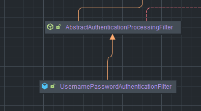
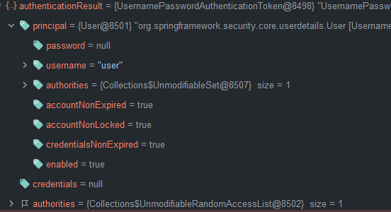

# 인증 프로세스
## 폼인증
HTTP 기반의 폼 로그인 인증 메커니즘을 활성화하는 API로 사용자 인증을 위한 사용자 정의 로그인 페이지를 쉽게 구현할 수 있다. 또한 기본적으로 스프링 시큐리티가 제공하는 기본 로그인 페이지를 이용하면 사용자 이름과 비밀번호 필드가 포함된 간단한 폼 로그인 양식을 제공한다.  
  
사용자는 웹 폼을 통해 자격 증명(사용자 이름 및 비밀번호)을 제공하고 스프링 시큐리티는 HttpServletRequest 에서 이 값을 읽어온다.  
```
1. 클라이언트 요청 (Request Get)
   └─────────────→
2. 필터 체인 통과
   └─────────────→
3. 권한 검사 (AuthorizationFilter)
   └─────────────→
4. 접근 예외 발생 (AcessDeniedException)
   └─────────────→
5. 예외 처리 (ExceptionTranslationFilter)
   └─────────────→
6. 로그인 페이지로 리다이렉트
   └─────────────→
7. 로그인 페이지에서 인증 시도
   └─────────────→
8. 서버 도착
   └─────────────→
9. 인증 처리
   └─── UsernamePasswordAuthenticationFilter
   └─── AuthenticationManager
   └─── UserDetailsService
   └─── AuthenticationProvider
   └─────────────→
10. 인증 성공 시
    └─── SecurityContextHolder에 인증 정보 저장
    └─── AuthenticationSuccessHandler 호출
   └─────────────→
11. 인증 실패 시
    └─── AuthenticationFailureHandler 호출
```  

### formLogin()
FormLoginConfigurer 설정 클레스를 통해 설정할 수 있다. 내부적으로는 **`UsernamePasswordAuthenticationFilter`** 가 생성되어 처리를 담당한다.  
  
```java
@Configuration
@EnableWebSecurity
public class SecurityConfig {

    @Bean
    public SecurityFilterChain securityFilterChain(HttpSecurity http) throws Exception {
        http
                .authorizeRequests(authorizeRequests ->
                        authorizeRequests
                                .anyRequest().authenticated()  // 모든 요청에 대해 인증 필요
                )
                .formLogin(httpSecurityFormLoginConfigurer ->
                        httpSecurityFormLoginConfigurer
                                .loginPage("/login")  // 사용자 정의 로그인 페이지 URL
                                .loginProcessingUrl("/perform_login")  // 로그인 폼의 action URL(사용자 이름과 비밀번호를 검증할 URL 지점)
                                .defaultSuccessUrl("/home", true)  // 로그인 성공 후 리다이렉트할 기본 URL(true 이면 무조건 지정된 위치로 이동 기본 false)
                                                                  // false 일때는 인증 전에 요청했던 페이지로 redirect한다.
                                .failureUrl("/login?error=true")  // 로그인 실패 시 리다이렉트할 URL
                                .usernameParameter("username")  // 로그인 폼에서 사용자 이름 입력 필드 이름
                                .passwordParameter("password")  // 로그인 폼에서 비밀번호 입력 필드 이름
                                .failureHandler(AuthenticationFailureHandler )  // 사용자 정의 실패 핸들러(AuthenticationFailureHandler) 지정
                                                                                // 기본 값은 SimpleUrlAuthenticationFailureHandler 를 사용 /login?error로 리다이렉트
                                .successHandler(AuthenticationSuccessHandler )  // 사용자 정의 성공 핸들러(AuthenticationSuccessHandler) 지정
                                                                                // 기본 값은 SavedRequestAwareAuthenticationSuccessHandler
                                .permitAll()  // failureUrl(), loginPage(), loginProcessUrl 에 대한 URL 에 모든 사용자 접근 허용
                );
        return http.build();
    }
}
```
추가적으로 defaultSuccessUrl() 과 failureHandler()  API는 내부적으로:   
```java 
    public final T defaultSuccessUrl(String defaultSuccessUrl) {
        return this.defaultSuccessUrl(defaultSuccessUrl, false);
    }

    public final T defaultSuccessUrl(String defaultSuccessUrl, boolean alwaysUse) {
        SavedRequestAwareAuthenticationSuccessHandler handler = new SavedRequestAwareAuthenticationSuccessHandler();
        handler.setDefaultTargetUrl(defaultSuccessUrl);
        handler.setAlwaysUseDefaultTargetUrl(alwaysUse);
        this.defaultSuccessHandler = handler;
        return this.successHandler(handler);
    }

public final T failureUrl(String authenticationFailureUrl) {
    T result = this.failureHandler(new SimpleUrlAuthenticationFailureHandler(authenticationFailureUrl));
    this.failureUrl = authenticationFailureUrl;
    return result;
}

public final T failureHandler(AuthenticationFailureHandler authenticationFailureHandler) {
    this.failureUrl = null;
    this.failureHandler = authenticationFailureHandler;
    return this.getSelf();
}
```
**successHandler** 와 **failureHandler**를 호출해서 우리가 지정한 URL 로 redirect 하게된다.  

이때 사용자가 failureHandler() 와 successHandler() API 를통해서 사용자 정의 핸들러를 지정한경우 이 사용자정의 핸들러가 우선순위가 더 높다.  
  
### 초기화 과정
formLogin() API를 후출하는 경우 :    
```java
    public FormLoginConfigurer<HttpSecurity> formLogin() throws Exception {
        return (FormLoginConfigurer)this.getOrApply(new FormLoginConfigurer());
    }


```
코드를 확인해 보면 new FormLoginConfigurer() 객체를 생성하는 것을 볼 수 있다:  
```java 
    public FormLoginConfigurer() {
        super(new UsernamePasswordAuthenticationFilter(), (String)null);
        this.usernameParameter("username");
        this.passwordParameter("password");
    }
```
기본 생성자에서 인증에 필요한 필터인 **UsernamePasswordAuthenticationFilter**를 생성해서 부모 클레스에 전달하고 기본적은 username 과 password의 명을 설정한다.  
  
부모 클레스인 **AbstractAuthenticationFilterConfigurer** 를 확인해보면 스프링 시큐리티에서 기본적으로 설정하는 기본 로그인 페이지 경로와 핸들러등이 설정되는 것을 확인할 수 있고 configurer 클레스에서 가장 중요한 메서드인 configure() 메서드와 초기화 메서드 init()을 확인해보자  
  
init:  
```java 
    public void init(B http) throws Exception {
        this.updateAuthenticationDefaults();
        this.updateAccessDefaults(http);
        this.registerDefaultAuthenticationEntryPoint(http);
    }

protected final void updateAuthenticationDefaults() {
    if (this.loginProcessingUrl == null) { // 로그인 페이지 URL
        this.loginProcessingUrl(this.loginPage);
    }

    if (this.failureHandler == null) { // 실패 처리 핸들러
        this.failureUrl(this.loginPage + "?error");
    }

    LogoutConfigurer<B> logoutConfigurer = (LogoutConfigurer)((HttpSecurityBuilder)this.getBuilder()).getConfigurer(LogoutConfigurer.class);
    if (logoutConfigurer != null && !logoutConfigurer.isCustomLogoutSuccess()) {
        logoutConfigurer.logoutSuccessUrl(this.loginPage + "?logout");
    }

}
```  

configure:  
```java 
 public void configure(B http) throws Exception {
        PortMapper portMapper = (PortMapper)http.getSharedObject(PortMapper.class);
        if (portMapper != null) {
            this.authenticationEntryPoint.setPortMapper(portMapper);
        }

        RequestCache requestCache = (RequestCache)http.getSharedObject(RequestCache.class);
        if (requestCache != null) {
            this.defaultSuccessHandler.setRequestCache(requestCache);
        }

        this.authFilter.setAuthenticationManager((AuthenticationManager)http.getSharedObject(AuthenticationManager.class)); //위에서 생성된 UsernamePasswordAuthenticationFilter 필터가 전달
        this.authFilter.setAuthenticationSuccessHandler(this.successHandler);
        this.authFilter.setAuthenticationFailureHandler(this.failureHandler);
        if (this.authenticationDetailsSource != null) {
            this.authFilter.setAuthenticationDetailsSource(this.authenticationDetailsSource);
        }

        SessionAuthenticationStrategy sessionAuthenticationStrategy = (SessionAuthenticationStrategy)http.getSharedObject(SessionAuthenticationStrategy.class);
        if (sessionAuthenticationStrategy != null) {
            this.authFilter.setSessionAuthenticationStrategy(sessionAuthenticationStrategy);
        }

        RememberMeServices rememberMeServices = (RememberMeServices)http.getSharedObject(RememberMeServices.class);
        if (rememberMeServices != null) {
            this.authFilter.setRememberMeServices(rememberMeServices);
        }

        SecurityContextConfigurer securityContextConfigurer = (SecurityContextConfigurer)http.getConfigurer(SecurityContextConfigurer.class);
        if (securityContextConfigurer != null && securityContextConfigurer.isRequireExplicitSave()) {
            SecurityContextRepository securityContextRepository = securityContextConfigurer.getSecurityContextRepository();
            this.authFilter.setSecurityContextRepository(securityContextRepository);
        }

        this.authFilter.setSecurityContextHolderStrategy(this.getSecurityContextHolderStrategy());
        F filter = (AbstractAuthenticationProcessingFilter)this.postProcess(this.authFilter);
        http.addFilter(filter);
    }
```
  
## 폼 인증 필터
스프링 시큐리티 AbstractAuthenticationProcessingFilter 클래스를 사용자의 자격 증명을 인증하는 기본 필터로 사용된다. 폼인증에서 사용하는 필터인 **UsernamePasswordAuthenticationFilter**는 AbstractAuthenticationProcessingFilter를 확장한 클래스로 HttpServletRequest 에서 제출된 사용자 이름과 비밀번호로부터 인증을 수행한다.  
  
인증 프로세스가 초기화 될때 로그인 페이지와 로그아웃 페이지를 생성을 위한 DefaultLoginPageGeneratingFilter 및 DefaultLogoutPageGeneratingFilter 가 초기화된다.  
  
  
만약 커스텀 클레스로 구현한 경우 AbstractAuthenticationProcessingFilter를 상속하여 attemptAuthentication() 메서드를 재정의해서 구현하면 된다.
### UsernamePasswordAuthenticationFilter
스프링 시큐리티에서 제공하는 필터로, 폼 기반 로그인 인증을 처리하는 데 사용됩니다. 사용자가 로그인 폼을 통해 제출한 사용자 이름과 비밀번호를 처리하여 인증을 수행합니다. 이 필터는 주로 스프링 시큐리티 설정에서 formLogin() 메서드를 호출할 때 자동으로 등록됩니다.  

### 시각적 흐름도

`UsernamePasswordAuthenticationFilter`의 동작을 시각적으로 설명한 흐름도는 다음과 같습니다:

```css
1. 클라이언트가 로그인 요청을 보냄 (예: /perform_login)
   └─────────────→
2. `UsernamePasswordAuthenticationFilter`가 요청을 가로챔
   └─────────────→
3. 사용자 이름 및 비밀번호 추출
   └─────────────→
   └─ `request.getParameter("username")`
   └─ `request.getParameter("password")`
4. `UsernamePasswordAuthenticationToken` 생성 : 인증처리를 하기위해서 사용되는 인증 객체
   └─────────────→
   └─ `new UsernamePasswordAuthenticationToken(username, password)`
5. `AuthenticationManager`에 전달하여 인증 수행 : 해당 객체가 토큰을 이용해서 인증처리를 진행
   └─────────────→
   └─ `this.getAuthenticationManager().authenticate(authRequest)`
6. 인증 결과 처리
   └─────────────→
   └─ 성공: 인증 성공 처리
   └─ 실패: 인증 실패 처리

7. 인증 성공 처리
   └───→ UsernamePasswordAuthenticationToken 생성 [userDetails (유저 정보 객체) + Authorities (사용자 권한)]
   └───→ SessionAuthenticationStrategy 객체에 새로운 로그인을 알리고 세션 관련 작업들을 수행
   └───→ SecurityContextHolder에 인증 정보 저장 (Authentication 세션 정보를 저장) -> 사용자의 인증 상태를 유지하기 위해서
    └───→ RememberMeServcie 객체가 설정되어 있는 경우 해당 객체의 loginSucess를 호출한다. -> 일반 포털에서 기억하기 선택했을때 자동으로 로그인 패스워드가 입력하지 않아도 로그인되는 기능 
   └───→ ApplicationEventPublisher 에서 인증 성공 이벤트를 개시한다.
   └───→ AuthenticationSuccessHandler 호출
   └─ `SecurityContextHolder.getContext().setAuthentication(authResult)`
   └─ `successHandler.onAuthenticationSuccess(request, response, authResult)`

8. 인증 실패 처리
   └───→ SecurityContextHolder 가 삭제 된다.(이전에 저장되어 있을 수도 있는 인증 관련 객체를 삭제)
   └───→ RememberMeServcie 객체가 설정되어 있는 경우 해당 객체의 loginFail이 호출한다.
   └───→ AuthenticationFailureHandler 호출
   └─ `failureHandler.onAuthenticationFailure(request, response, failed)`

```

### 각 단계 설명

1. **클라이언트가 로그인 요청을 보냄**: 클라이언트가 사용자 이름과 비밀번호를 포함한 로그인 요청을 지정된 URL(예: `/perform_login`)로 보냅니다.
2. **`UsernamePasswordAuthenticationFilter`가 요청을 가로챔**: 스프링 시큐리티의 `UsernamePasswordAuthenticationFilter`가 해당 요청을 가로채고 처리하기 시작합니다.
3. **사용자 이름 및 비밀번호 추출**: 요청에서 사용자 이름과 비밀번호를 추출합니다. 기본적으로 폼 필드 이름은 `username`과 `password`입니다.
4. **`UsernamePasswordAuthenticationToken` 생성**: 추출한 사용자 이름과 비밀번호를 사용하여 `UsernamePasswordAuthenticationToken` 객체를 생성합니다.
5. **`AuthenticationManager`에 전달하여 인증 수행**: 생성된 토큰을 `AuthenticationManager`에 전달하여 인증을 수행합니다.
6. **인증 결과 처리**: 인증이 성공하거나 실패한 결과에 따라 후속 작업을 수행합니다.
7. **인증 성공 처리**: 인증이 성공하면 `SecurityContextHolder`에 인증 정보를 저장하고, `AuthenticationSuccessHandler`를 호출하여 적절한 페이지로 리다이렉트합니다.
8. **인증 실패 처리**: 인증이 실패하면 `AuthenticationFailureHandler`를 호출하여 로그인 페이지로 리다이렉트하거나 실패 메시지를 표시합니다.

`UsernamePasswordAuthenticationFilter`는 스프링 시큐리티의 핵심 컴포넌트 중 하나로, 폼 기반 인증을 처리하여 사용자 인증을 간편하게 구현할 수 있도록 도와줍니다. 이를 통해 사용자 로그인 요청을 처리하고 인증 성공 및 실패에 대한 후속 작업을 정의할 수 있습니다.  

### 주요 기능

- **로그인 요청 처리**: 로그인 폼에서 제출된 사용자 이름과 비밀번호를 처리하여 인증을 수행합니다.
- **인증 성공 처리**: 인증이 성공하면 사용자 정보를 `SecurityContextHolder`에 저장하고, 성공 핸들러를 통해 적절한 페이지로 리다이렉트합니다.
- **인증 실패 처리**: 인증이 실패하면 실패 핸들러를 통해 로그인 페이지로 리다이렉트하거나 실패 메시지를 표시합니다.

### 동작 과정

1. **요청 캡처**: 로그인 폼의 `action` URL이 `UsernamePasswordAuthenticationFilter`에 의해 캡처됩니다. 기본 URL은 `/login`입니다.
2. **사용자 이름 및 비밀번호 추출**: 요청에서 사용자 이름과 비밀번호를 추출합니다. 기본 파라미터 이름은 `username`과 `password`입니다.
3. **인증 토큰 생성**: 추출한 사용자 이름과 비밀번호를 사용하여 `UsernamePasswordAuthenticationToken`을 생성합니다.
4. **인증 매니저 호출**: 생성된 토큰을 `AuthenticationManager`에 전달하여 인증을 수행합니다.
5. **인증 성공 처리**: 인증이 성공하면 `SecurityContextHolder`에 인증 정보를 저장하고, `AuthenticationSuccessHandler`를 호출합니다.
6. **인증 실패 처리**: 인증이 실패하면 `AuthenticationFailureHandler`를 호출하여 실패 처리를 수행합니다.  
  
  
### 구현 코드
클라이언트에서 로그인 요청을 하게되면 **`AbstractAuthenticationProcessingFilter`** **`doFilter`** 가 호출된다.  
```java 
  private void doFilter(HttpServletRequest request, HttpServletResponse response, FilterChain chain) throws IOException, ServletException {
        if (!this.requiresAuthentication(request, response)) {
            chain.doFilter(request, response);
        } else {
            try {
                Authentication authenticationResult = this.attemptAuthentication(request, response);
                if (authenticationResult == null) {
                    return;
                }

                this.sessionStrategy.onAuthentication(authenticationResult, request, response);
                if (this.continueChainBeforeSuccessfulAuthentication) {
                    chain.doFilter(request, response);
                }

                this.successfulAuthentication(request, response, chain, authenticationResult);
            } catch (InternalAuthenticationServiceException var5) {
                InternalAuthenticationServiceException failed = var5;
                this.logger.error("An internal error occurred while trying to authenticate the user.", failed);
                this.unsuccessfulAuthentication(request, response, failed);
            } catch (AuthenticationException var6) {
                AuthenticationException ex = var6;
                this.unsuccessfulAuthentication(request, response, ex);
            }

        }
    }
```
**requiresAuthentication** 메서드를 통해서 해당 요청에 대한 인증을 해당 필터(UsernamePasswordAuthenticationFilter)에서 처리하는지 여부를 확인한다.  
```java
    protected boolean requiresAuthentication(HttpServletRequest request, HttpServletResponse response) {
        if (this.requiresAuthenticationRequestMatcher.matches(request)) {
            return true;
        } else {
            if (this.logger.isTraceEnabled()) {
                this.logger.trace(LogMessage.format("Did not match request to %s", this.requiresAuthenticationRequestMatcher));
            }

            return false;
        }
    }
```
실제 인증객체를 생성하는 코드인 `this.attemptAuthentication(request, response)` 메서드를 UsernamePasswordAuthenticationFilter 에서 재정의하고 있다.  
```java 
public Authentication attemptAuthentication(HttpServletRequest request, HttpServletResponse response) throws AuthenticationException {
        if (this.postOnly && !request.getMethod().equals("POST")) {
            throw new AuthenticationServiceException("Authentication method not supported: " + request.getMethod());
        } else {
            String username = this.obtainUsername(request);
            username = username != null ? username.trim() : "";
            String password = this.obtainPassword(request);
            password = password != null ? password : "";
            UsernamePasswordAuthenticationToken authRequest = UsernamePasswordAuthenticationToken.unauthenticated(username, password);
            this.setDetails(request, authRequest);
            return this.getAuthenticationManager().authenticate(authRequest);
        }
    }

```
request 에서 username 과 password 를 가져와서 UsernamePasswordAuthenticationToken 객체를 생성한다(인증전).  
```java 
    public static UsernamePasswordAuthenticationToken unauthenticated(Object principal, Object credentials) {
        return new UsernamePasswordAuthenticationToken(principal, credentials);
    }

```
이렇게 생성된 인증관련 토큰을 **AuthenticationManager** 에게 인증을 위임한다.  
  
인증에 성공하게되면 최종적으로 생성된 **Authentication** 객체를 확인해보면 인증에 성공한 사용자에 대한 정보를 담고 있다.:  
  

**`this.sessionStrategy.onAuthentication()`** 코드에서 새로운 로그인을 알리고 세션관련 작업을 수행한다.  
  
마지막으로 **`this.successfulAuthentication`** 호출한다:  
```java 
    protected void successfulAuthentication(HttpServletRequest request, HttpServletResponse response, FilterChain chain, Authentication authResult) throws IOException, ServletException {
        SecurityContext context = this.securityContextHolderStrategy.createEmptyContext();
        context.setAuthentication(authResult);
        this.securityContextHolderStrategy.setContext(context);
        this.securityContextRepository.saveContext(context, request, response);
        if (this.logger.isDebugEnabled()) {
            this.logger.debug(LogMessage.format("Set SecurityContextHolder to %s", authResult));
        }

        this.rememberMeServices.loginSuccess(request, response, authResult);
        if (this.eventPublisher != null) {
            this.eventPublisher.publishEvent(new InteractiveAuthenticationSuccessEvent(authResult, this.getClass()));
        }

        this.successHandler.onAuthenticationSuccess(request, response, authResult);
    }
```
해당 메서드에서 성공한 인증 객체를 SecurityContextHolder 에 저장한다.(인증 상태를 유지하기 위해서) 최종적으로 이 SecurityContext를 세션에 저장한다.(this.securityContextRepository.saveContext)  
```java
    private void saveContextInHttpSession(SecurityContext context, HttpServletRequest request) {
        if (!this.isTransient(context) && !this.isTransient(context.getAuthentication())) {
            SecurityContext emptyContext = this.generateNewContext();
            if (emptyContext.equals(context)) {
                HttpSession session = request.getSession(false);
                this.removeContextFromSession(context, session);
            } else {
                boolean createSession = this.allowSessionCreation;
                HttpSession session = request.getSession(createSession);
                this.setContextInSession(context, session);
            }

        }
    }
```
이렇게 최종적으로 인증에 성공하게 되면 **successHandler**를 호출하고 인증처리를 종료한다.