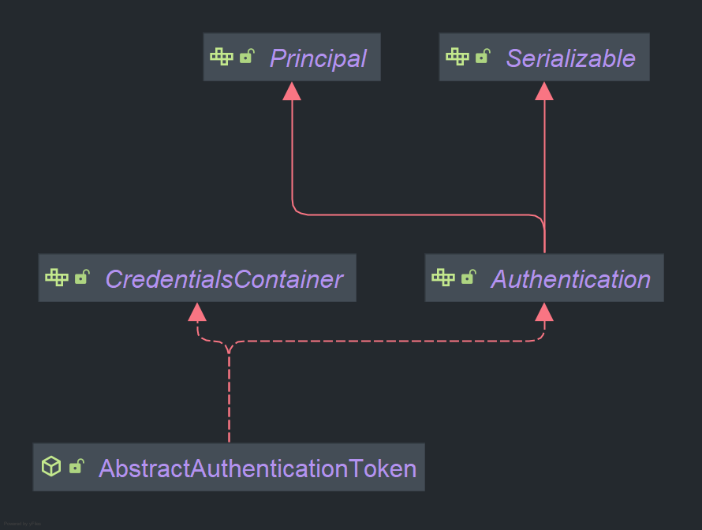

# 인증 아키텍쳐
  
## 시큐리트 인증/ 인가 흐름도

```scss
사용자 요청 (Request)
|
   v
HTTP 요청 (URL, 메서드, 헤더 등)
|
   v
[DelegatingFilterProxy]
|   (Spring Security의 필터 체인을 서블릿 컨테이너에 연결)
|
   v
[FilterChainProxy]
|   (Security Filter Chain 관리)
|
   v
[Security Filter Chain]
|   (다양한 보안 필터들로 구성)
|    |
|    v
|   UsernamePasswordAuthenticationFilter
|    |   (폼 로그인 인증 처리)
|    v
|   BasicAuthenticationFilter
|    |   (HTTP 기본 인증 처리)
|    v
|   OAuth2LoginAuthenticationFilter
|        (OAuth2 로그인 인증 처리)
[FilterChainProxy] (계속)
|
v
[AuthenticationFilter]
|   (인증 요청을 가로채고 처리)
|
v
[Authentication Manager]
|   (다양한 AuthenticationProvider를 통해 인증 시도)
|
v
[AuthenticationProvider]
|   (실제 인증 로직을 구현)
|    |
|    v
|   [UserDetailsService]
|    |   (사용자 정보를 로드)
|    v
|   [UserDetails]
|        (인증 과정에서 사용되는 사용자 정보)
|
v
[SecurityContextHolder]
|   (인증된 사용자 정보를 저장)
|
v
[Authentication]
|   (인증된 사용자 정보 및 권한 포함)
[SecurityContextHolder] (계속)
|
v
[AuthorizationFilter]
|   (인가 요청을 가로채고 처리)
|
v
[AuthorizationManager]
|   (인가를 관리하고 접근 권한을 평가)
|
v
[AccessDecisionManager]
|   (AccessDecisionVoter를 사용하여 접근 권한 결정)
|
v
[AuthorizationDecision]
|   (최종적으로 접근 허용 또는 거부 결정)
[AuthorizationDecision] (계속)
|
v
[Handler Mapping]
|   (요청에 대해 적절한 핸들러 매핑)
|
v
[Controller]
|   (비즈니스 로직 처리)
|
v
[View or Response]
|   (결과 반환)
|
v
응답 반환 (Response)

```
  
위에 흐름도를 크게 4가지로 구분지어 볼 수 있다.  

### 1. Servlet Filter

**Servlet Filter** 단계는 Spring Security의 필터 체인이 서블릿 컨테이너에 등록되어 모든 HTTP 요청을 처리하는 부분입니다.

- **DelegatingFilterProxy**: Spring Security의 필터 체인을 서블릿 컨테이너에 연결하는 역할을 합니다. 이 필터는 Spring 애플리케이션 컨텍스트에서 관리하는 `FilterChainProxy`를 서블릿 컨테이너에 위임합니다.
- **FilterChainProxy**: Spring Security에서 핵심 역할을 하는 필터 체인 관리자로, 실제로 여러 보안 필터들을 관리합니다. 이 필터는 요청을 가로채어 필터 체인에 등록된 각 보안 필터들을 순차적으로 실행합니다.
- **Security Filter Chain**: `FilterChainProxy`에 의해 관리되는 필터들의 모음으로, 각 요청이 보안 필터 체인을 거쳐가면서 인증 및 인가가 처리됩니다.

### 2. Authentication

**Authentication** 단계는 사용자가 실제로 누구인지 확인하는 과정입니다.

- **SecurityContextHolder**: 현재 인증된 사용자 정보를 저장하는 컨텍스트입니다. `Authentication` 객체는 이 컨텍스트에 저장되어 애플리케이션 전반에서 사용될 수 있습니다.
- **AuthenticationFilter**: 이 필터는 사용자 인증을 처리합니다. 예를 들어, `UsernamePasswordAuthenticationFilter`는 사용자 이름과 비밀번호를 받아 인증을 시도합니다.
- **Authentication Manager**: Spring Security의 중심 인증 관리자 역할을 합니다. 여러 `AuthenticationProvider`를 통해 다양한 인증 방식을 지원할 수 있습니다.
- **AuthenticationProvider**: 실제로 인증 로직을 구현하는 곳입니다. 이 컴포넌트는 `UserDetailsService`를 사용하여 사용자 정보를 로드하고, 그 정보를 바탕으로 인증을 수행합니다.
- **UserDetailsService**: `AuthenticationProvider`가 사용자의 세부 정보를 가져오기 위해 호출하는 서비스입니다. 이 서비스는 `UserDetails` 객체를 반환하며, 이는 인증 과정에서 사용됩니다.
- **UserDetails** : 일반적으로 UserDetails는 UserDetailsService를 통해 로드된 후 AuthenticationProvider에 의해 인증됩니다. 기본 구현체로는 User 클래스가 있으며, 이는 일반적인 사용자 정보를 다루는 데 적합합니다.
- **Authentication**: 인증이 성공하면, 인증된 사용자의 정보와 권한이 포함된 `Authentication` 객체가 생성되어 `SecurityContextHolder`에 저장됩니다.

### 3. Authorization

**Authorization** 단계에서는 인증된 사용자가 요청한 자원에 접근할 권한이 있는지를 결정합니다.

- **AuthorizationFilter**: 이 필터는 인증된 사용자가 요청하는 자원에 접근할 권한이 있는지를 확인하는 역할을 합니다.
- **AuthorizationManager**: Spring Security에서 인가 결정을 관리하는 컴포넌트입니다. 이 컴포넌트는 인가 결정을 내리기 위해 다양한 접근 제어 규칙을 평가합니다.
- **AuthorizationDecision**: 인가 결정을 최종적으로 내리는 과정입니다. `AuthorizationManager`는 `AuthorizationDecision` 객체를 반환하며, 이 객체는 요청된 자원에 대한 접근이 허용되었는지 또는 거부되었는지를 나타냅니다.
- **AccessDecisionManager**: `AuthorizationManager`의 일부로서, 인가 결정을 내리기 위해 한 개 이상의 `AccessDecisionVoter`와 협력합니다. 투표 결과에 따라 자원에 대한 접근이 허용될지 결정됩니다.

### 4. Spring MVC

**Spring MVC** 단계는 Spring Security가 아닌 일반적인 Spring MVC 흐름으로 돌아가, 사용자의 요청을 처리하고 응답을 생성하는 부분입니다.

- **Handler Mapping**: 인증 및 인가를 통과한 요청이 Spring MVC에서 적절한 컨트롤러 메서드에 매핑됩니다.
- **Controller**: 요청된 비즈니스 로직을 처리하는 곳입니다. 인가된 사용자의 요청에 따라 적절한 로직을 실행하고, 그 결과를 모델과 뷰로 전달합니다.
- **View or Response**: 컨트롤러에서 처리된 결과를 사용하여 사용자에게 응답을 반환합니다. 이 응답은 HTML, JSON, XML 등 다양한 형태일 수 있습니다.


## 인증 Authentication
### Authentication
인증은 특정 자원에 접근하려는 사람의 시원을 확인하는 방법을 의미합니다. 사용자 인증의 일반적인 방법은 사용자 인증의 일반적인 방법은 사용자 이름과 비밀번호를 입력하게 하는 것으로 인증이 수행되며 신원을 알고 권한을 부여 할 수 있습니다.  
  
Authentication 은 사용자의 인증 정보를 저장하는 토큰 개념의 객체로 활용되며 인증 이후 `SecurityContext`에 저장되어 전역적으로 참조가 가능합니다.  
  
#### 메서드
- **`Object getPrincipal()`**
    - **설명**: 이 메서드는 인증된 사용자에 대한 주체(Principal) 정보를 반환합니다. 주로 사용자 이름이나 `UserDetails` 객체를 반환하며, 이 값은 `UserDetailsService`에서 로드된 사용자 정보와 관련이 있습니다.
    - **예시**: 인증된 사용자의 `username` 또는 `UserDetails` 객체.
- **`Object getCredentials()`**
    - **설명**: 이 메서드는 사용자의 인증 자격 증명(Credentials)을 반환합니다. 일반적으로 비밀번호를 반환하며, 인증 과정에서는 이를 사용해 사용자 자격을 검증합니다.
    - **예시**: 사용자의 비밀번호 (일반적으로 인증 이후에는 null이 될 수 있습니다).
- **`Collection<? extends GrantedAuthority> getAuthorities()`**
    - **설명**: 이 메서드는 사용자가 가진 권한(Authorities) 목록을 반환합니다. 권한은 역할(예: ROLE_USER, ROLE_ADMIN) 또는 권한(예: read, write)으로 표현될 수 있습니다.
    - **예시**: `[ROLE_USER, ROLE_ADMIN]`, `[read, write]`.
- **`boolean isAuthenticated()`**
    - **설명**: 이 메서드는 현재 인증 객체가 인증되었는지 여부를 나타냅니다. `true`이면 인증이 성공적으로 완료된 상태를 의미합니다.
    - **예시**: `true` 또는 `false`.
- **`void setAuthenticated(boolean isAuthenticated)`**
    - **설명**: 이 메서드는 인증 상태를 설정합니다. 일반적으로 프레임워크 내부에서 사용되며, 직접 호출하지 않는 것이 좋습니다. 만약 `false`로 설정하면 인증 객체는 더 이상 인증되지 않은 것으로 간주됩니다.
    - **예시**: `authentication.setAuthenticated(false);`
- **`String getName()`**
    - **설명**: 이 메서드는 인증 객체의 이름을 반환합니다. 일반적으로 사용자의 이름이나 ID를 반환하며, `getPrincipal()` 메서드와 유사한 결과를 제공할 수 있습니다.
    - **예시**: 사용자의 `username` 또는 `ID`.
- **`Object getDetails()`**
    - **설명**: 이 메서드는 추가적인 부가 정보를 반환합니다. 예를 들어, 인증 요청 시의 IP 주소나 세션 ID 등이 포함될 수 있습니다. `Authentication` 객체에 추가적인 정보를 담기 위해 사용됩니다.
    - **예시**: `WebAuthenticationDetails` 객체 (IP 주소, 세션 ID 등).

## 구현 코드
사용자가 인증을 요청하게 되면 먼저 **AbstractAuthenticationProcessingFilter** 필터를 통해서 인증필터인 `UsernamePasswordAuthenticationFilter` 로 전달된다.    
`AbstractAuthenticationProcessingFilter`:
```java
private void doFilter(HttpServletRequest request, HttpServletResponse response, FilterChain chain) throws IOException, ServletException {
        if (!this.requiresAuthentication(request, response)) {
            chain.doFilter(request, response);
        } else {
            try {
                Authentication authenticationResult = this.attemptAuthentication(request, response);
                if (authenticationResult == null) {
                    return;
                }

                this.sessionStrategy.onAuthentication(authenticationResult, request, response);
                if (this.continueChainBeforeSuccessfulAuthentication) {
                    chain.doFilter(request, response);
                }

                this.successfulAuthentication(request, response, chain, authenticationResult);
            } catch (InternalAuthenticationServiceException var5) {
                InternalAuthenticationServiceException failed = var5;
                this.logger.error("An internal error occurred while trying to authenticate the user.", failed);
                this.unsuccessfulAuthentication(request, response, failed);
            } catch (AuthenticationException var6) {
                AuthenticationException ex = var6;
                this.unsuccessfulAuthentication(request, response, ex);
            }

        }
    }
```

`UsernamePasswordAuthenticationFilter`:  
**this.attemptAuthentication**:
```java
    public Authentication attemptAuthentication(HttpServletRequest request, HttpServletResponse response) throws AuthenticationException {
        if (this.postOnly && !request.getMethod().equals("POST")) {
            throw new AuthenticationServiceException("Authentication method not supported: " + request.getMethod());
        } else {
            String username = this.obtainUsername(request); // 요청 정보에서 username 정보 파싱
            username = username != null ? username.trim() : "";
            String password = this.obtainPassword(request);
            password = password != null ? password : "";// 요청 정보에서 password 정보 파싱
            UsernamePasswordAuthenticationToken authRequest = UsernamePasswordAuthenticationToken.unauthenticated(username, password); // 인증전 토큰 객체를 생성
            this.setDetails(request, authRequest);
            return this.getAuthenticationManager().authenticate(authRequest);
        }
    }
```
`UsernamePasswordAuthenticationToken` 해당 토큰은 앞에서 학습했던 Authentication 인터페이스를 상속받아 구현한 구현체 이다.
  
이렇게 생성된 `Authentication` 객체인 `UsernamePasswordAuthenticationToken` 을 this.getAuthenticationManager().authenticate(authRequest) 구문을 통해서 `AuthenticationManager`에 전달하고 있다.

`ProviderManager` (AuthenticationManager 구현체):
```java
    public Authentication authenticate(Authentication authentication) throws AuthenticationException {
        Class<? extends Authentication> toTest = authentication.getClass();
        AuthenticationException lastException = null;
        AuthenticationException parentException = null;
        Authentication result = null;
        Authentication parentResult = null;
        int currentPosition = 0;
        int size = this.providers.size();
        Iterator var9 = this.getProviders().iterator();

        while(var9.hasNext()) {
            AuthenticationProvider provider = (AuthenticationProvider)var9.next();
            if (provider.supports(toTest)) {
                if (logger.isTraceEnabled()) {
                    Log var10000 = logger;
                    String var10002 = provider.getClass().getSimpleName();
                    ++currentPosition;
                    var10000.trace(LogMessage.format("Authenticating request with %s (%d/%d)", var10002, currentPosition, size));
                }

                try {
                    result = provider.authenticate(authentication); // AuthenticationProvider 에 전달하여 인증로직을 수행
                    if (result != null) {
                        this.copyDetails(authentication, result);
                        break;
                    }
                } catch (InternalAuthenticationServiceException | AccountStatusException var14) {
                    this.prepareException(var14, authentication);
                    throw var14;
                } catch (AuthenticationException var15) {
                    AuthenticationException ex = var15;
                    lastException = ex;
                }
            }
        }

        if (result == null && this.parent != null) {
            try {
                parentResult = this.parent.authenticate(authentication);
                result = parentResult;
            } catch (ProviderNotFoundException var12) {
            } catch (AuthenticationException var13) {
                parentException = var13;
                lastException = var13;
            }
        }

        if (result != null) {
            if (this.eraseCredentialsAfterAuthentication && result instanceof CredentialsContainer) {
                ((CredentialsContainer)result).eraseCredentials();
            }

            if (parentResult == null) {
                this.eventPublisher.publishAuthenticationSuccess(result);
            }

            return result;
        } else {
            if (lastException == null) {
                lastException = new ProviderNotFoundException(this.messages.getMessage("ProviderManager.providerNotFound", new Object[]{toTest.getName()}, "No AuthenticationProvider found for {0}"));
            }

            if (parentException == null) {
                this.prepareException((AuthenticationException)lastException, authentication);
            }

            throw lastException;
        }
    }
```
`provider.authenticate(authentication);` 을 통해서 `AuthenticationProvider`에 `Authentication`객체를 전달하여 인증 절차를 수행한다.

`AbstractUserDetailsAuthenticationProvider`: `AuthenticationManger` 를통해서 `Authentication` 객체를 인자로 받아서 인증 로직을 수행
```java
public Authentication authenticate(Authentication authentication) throws AuthenticationException {
        Assert.isInstanceOf(UsernamePasswordAuthenticationToken.class, authentication, () -> {
            return this.messages.getMessage("AbstractUserDetailsAuthenticationProvider.onlySupports", "Only UsernamePasswordAuthenticationToken is supported");
        });
        String username = this.determineUsername(authentication);
        boolean cacheWasUsed = true;
        UserDetails user = this.userCache.getUserFromCache(username);
        if (user == null) {
            cacheWasUsed = false;

            try {
                user = this.retrieveUser(username, (UsernamePasswordAuthenticationToken)authentication); //UserDetailsService 에서 user 정보를 조회
            } catch (UsernameNotFoundException var6) {
                UsernameNotFoundException ex = var6;
                this.logger.debug("Failed to find user '" + username + "'");
                if (!this.hideUserNotFoundExceptions) {
                    throw ex;
                }

                throw new BadCredentialsException(this.messages.getMessage("AbstractUserDetailsAuthenticationProvider.badCredentials", "Bad credentials"));
            }

            Assert.notNull(user, "retrieveUser returned null - a violation of the interface contract");
        }

        try {
            this.preAuthenticationChecks.check(user);
            this.additionalAuthenticationChecks(user, (UsernamePasswordAuthenticationToken)authentication);
        } catch (AuthenticationException var7) {
            AuthenticationException ex = var7;
            if (!cacheWasUsed) {
                throw ex;
            }

            cacheWasUsed = false;
            user = this.retrieveUser(username, (UsernamePasswordAuthenticationToken)authentication); // username 확인
            this.preAuthenticationChecks.check(user);
            this.additionalAuthenticationChecks(user, (UsernamePasswordAuthenticationToken)authentication); // password 확인
        }

        this.postAuthenticationChecks.check(user);
        if (!cacheWasUsed) {
            this.userCache.putUserInCache(user);
        }

        Object principalToReturn = user;
        if (this.forcePrincipalAsString) {
            principalToReturn = user.getUsername();
        }

        return this.createSuccessAuthentication(principalToReturn, authentication, user); //Authentication(인증X) 객체를 인자로 받아서 성공하면 Authentication(인증 O) 객체를 반환
    }
```
`this.retrieveUser(username, (UsernamePasswordAuthenticationToken)authentication)` 구문에서 UserDetailsService 에서 UserDetails 정보를 가져온다.

`DaoAuthenticationProvider`:  
username 검증
```java
    protected final UserDetails retrieveUser(String username, UsernamePasswordAuthenticationToken authentication) throws AuthenticationException {
        this.prepareTimingAttackProtection();

        try {
            UserDetails loadedUser = this.getUserDetailsService().loadUserByUsername(username);
            if (loadedUser == null) {
                throw new InternalAuthenticationServiceException("UserDetailsService returned null, which is an interface contract violation");
            } else {
                return loadedUser;
            }
        } catch (UsernameNotFoundException var4) {
            UsernameNotFoundException ex = var4;
            this.mitigateAgainstTimingAttack(authentication);
            throw ex;
        } catch (InternalAuthenticationServiceException var5) {
            InternalAuthenticationServiceException ex = var5;
            throw ex;
        } catch (Exception var6) {
            Exception ex = var6;
            throw new InternalAuthenticationServiceException(ex.getMessage(), ex);
        }
    }
```
password 검증 :  
```java
    protected void additionalAuthenticationChecks(UserDetails userDetails, UsernamePasswordAuthenticationToken authentication) throws AuthenticationException {
        if (authentication.getCredentials() == null) {
            this.logger.debug("Failed to authenticate since no credentials provided");
            throw new BadCredentialsException(this.messages.getMessage("AbstractUserDetailsAuthenticationProvider.badCredentials", "Bad credentials"));
        } else {
            String presentedPassword = authentication.getCredentials().toString();
            if (!this.passwordEncoder.matches(presentedPassword, userDetails.getPassword())) {
                this.logger.debug("Failed to authenticate since password does not match stored value");
                throw new BadCredentialsException(this.messages.getMessage("AbstractUserDetailsAuthenticationProvider.badCredentials", "Bad credentials"));
            }
        }
    }

```
`this.passwordEncoder` 에서 사용자가 전달한 password 와 userDetails 의 password 가 동일한지 검증한다.
  
이렇게 username 과 password 검증을 통해서 인증에 성공하면 인증에 성공한 Authentication 객체를 반환한다. `return this.createSuccessAuthentication(principalToReturn, authentication, user);`  

`AbstractUserDetailsAuthenticationProvider`:  
```java
    protected Authentication createSuccessAuthentication(Object principal, Authentication authentication, UserDetails user) {
        UsernamePasswordAuthenticationToken result = UsernamePasswordAuthenticationToken.authenticated(principal, authentication.getCredentials(), this.authoritiesMapper.mapAuthorities(user.getAuthorities()));
        result.setDetails(authentication.getDetails());
        this.logger.debug("Authenticated user");
        return result;
    }
```
최종적으로 인증에 성공한 Authentication 객체를 필터에 전달하여 `SecurityConext`에 저장

```java
private void doFilter(HttpServletRequest request, HttpServletResponse response, FilterChain chain) throws IOException, ServletException {
        if (!this.requiresAuthentication(request, response)) {
            chain.doFilter(request, response);
        } else {
            try {
                Authentication authenticationResult = this.attemptAuthentication(request, response); // 위에 로직을 처리하고 인증성공 객체를 받음
                if (authenticationResult == null) {
                    return;
                }

                this.sessionStrategy.onAuthentication(authenticationResult, request, response);
                if (this.continueChainBeforeSuccessfulAuthentication) {
                    chain.doFilter(request, response);
                }

                this.successfulAuthentication(request, response, chain, authenticationResult); //SecurityConext에 저장
            } catch (InternalAuthenticationServiceException var5) {
                InternalAuthenticationServiceException failed = var5;
                this.logger.error("An internal error occurred while trying to authenticate the user.", failed);
                this.unsuccessfulAuthentication(request, response, failed);
            } catch (AuthenticationException var6) {
                AuthenticationException ex = var6;
                this.unsuccessfulAuthentication(request, response, ex);
            }

        }
    }

protected void successfulAuthentication(HttpServletRequest request, HttpServletResponse response, FilterChain chain, Authentication authResult) throws IOException, ServletException {
  SecurityContext context = this.securityContextHolderStrategy.createEmptyContext();
  context.setAuthentication(authResult);
  this.securityContextHolderStrategy.setContext(context);
  this.securityContextRepository.saveContext(context, request, response);
  if (this.logger.isDebugEnabled()) {
    this.logger.debug(LogMessage.format("Set SecurityContextHolder to %s", authResult));
  }

  this.rememberMeServices.loginSuccess(request, response, authResult);
  if (this.eventPublisher != null) {
    this.eventPublisher.publishEvent(new InteractiveAuthenticationSuccessEvent(authResult, this.getClass()));
  }

  this.successHandler.onAuthenticationSuccess(request, response, authResult);
}
```
  
### 요약정리
1. **사용자가 인증을 요청**: 사용자가 로그인 폼이나 API를 통해 자격 증명(사용자명과 비밀번호)을 제출합니다.
2. **DelegatingFilterProxy에서 FilterChainProxy에게 업무를 위임**: 서블릿 컨테이너에서 Spring Security의 필터 체인으로 요청 처리가 전달됩니다.
3. **AbstractAuthenticationProcessingFilter에서 인증 필터로 전달**: `AbstractAuthenticationProcessingFilter`가 요청을 가로채고 인증이 필요한지 확인합니다.
4. **UsernamePasswordAuthenticationFilter에서 인증 처리**: `UsernamePasswordAuthenticationFilter`가 요청에서 사용자명과 비밀번호를 추출하고 `Authentication` 객체를 생성합니다.
5. **Authentication 객체를 AuthenticationManager에게 전달**: 생성된 `Authentication` 객체가 인증을 위해 `AuthenticationManager`에게 전달됩니다.
6. **AuthenticationManager에서 AuthenticationProvider에게 인증 로직 수행 요청**: `AuthenticationManager`가 `AuthenticationProvider`를 통해 인증 로직을 수행합니다.
7. **AuthenticationProvider에서 UserDetailsService를 통해 UserDetails 정보 조회**: `UserDetailsService`가 데이터베이스나 외부 시스템에서 사용자 정보를 조회하고 검증합니다.
8. **UserDetails의 비밀번호를 입력된 비밀번호와 비교**: `AuthenticationProvider`가 `UserDetails`의 비밀번호를 사용자가 입력한 비밀번호와 비교하여 인증을 수행합니다.
9. **인증 성공 시 Authentication 객체 생성 및 반환**: 인증이 성공하면 인증된 `Authentication` 객체를 생성하여 반환합니다.
10. **SecurityContext에 인증된 Authentication 객체 저장**: 반환된 인증된 `Authentication` 객체를 `SecurityContext`에 저장하여 이후의 요청에 사용합니다.