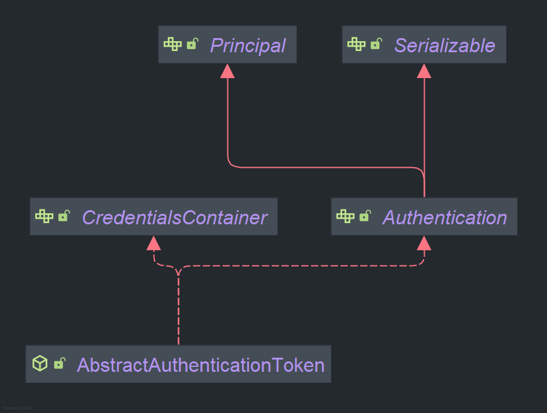

## 흐름도 확인
```scss
사용자 요청 (Request)
|
   v
HTTP 요청 (URL, 메서드, 헤더 등)
|
   v
[DelegatingFilterProxy]
|   (Spring Security의 필터 체인을 서블릿 컨테이너에 연결)
|
   v
[FilterChainProxy]
|   (Security Filter Chain 관리)
|
   v
[Security Filter Chain]
|   (다양한 보안 필터들로 구성)
|    |
|    v
|   UsernamePasswordAuthenticationFilter
|    |   (폼 로그인 인증 처리)
|    v
|   BasicAuthenticationFilter
|    |   (HTTP 기본 인증 처리)
|    v
|   OAuth2LoginAuthenticationFilter
|        (OAuth2 로그인 인증 처리)
[FilterChainProxy] (계속)
|
v
[AuthenticationFilter]
|   (인증 요청을 가로채고 처리)
|
v
[Authentication Manager]
|   (다양한 AuthenticationProvider를 통해 인증 시도)
|
v
[AuthenticationProvider]
|   (실제 인증 로직을 구현)
|    |
|    v
|   [UserDetailsService]
|    |   (사용자 정보를 로드)
|    v
|   [UserDetails]
|        (인증 과정에서 사용되는 사용자 정보)
|
v
[SecurityContextHolder] <- 여기부분
|   (인증된 사용자 정보를 저장)
|
v
[Authentication]
|   (인증된 사용자 정보 및 권한 포함)
[SecurityContextHolder] (계속)
|
v
[AuthorizationFilter]
|   (인가 요청을 가로채고 처리)
|
v
[AuthorizationManager]
|   (인가를 관리하고 접근 권한을 평가)
|
v
[AccessDecisionManager]
|   (AccessDecisionVoter를 사용하여 접근 권한 결정)
|
v
[AuthorizationDecision]
|   (최종적으로 접근 허용 또는 거부 결정)
[AuthorizationDecision] (계속)
|
v
[Handler Mapping]
|   (요청에 대해 적절한 핸들러 매핑)
|
v
[Controller]
|   (비즈니스 로직 처리)
|
v
[View or Response]
|   (결과 반환)
|
v
응답 반환 (Response)

```
## SecurityContext  

`SecurityContext`는 Spring Security의 핵심 구성 요소 중 하나로, 애플리케이션 내에서 인증 및 권한과 관련된 보안 정보를 관리하는 역할을 합니다. 이를 통해 애플리케이션이 현재 사용자에 대한 인증 상태 및 권한을 쉽게 확인할 수 있으며, 사용자 요청이 인증되었는지, 그리고 특정 리소스에 접근할 수 있는 권한이 있는지 등을 처리할 수 있습니다.

### `SecurityContext`의 주요 역할

1. **인증 정보 저장**:
   `SecurityContext`는 사용자의 인증 정보를 저장하는 역할을 합니다. 인증 정보는 일반적으로 `Authentication` 객체에 저장되며, 이 객체는 사용자의 이름, 비밀번호, 역할(권한) 등을 포함합니다.
2. **권한 확인**:
   사용자가 시스템의 특정 리소스에 접근할 때, `SecurityContext`를 통해 해당 사용자의 권한을 확인할 수 있습니다. `SecurityContextHolder`는 `SecurityContext`를 전역적으로 접근할 수 있도록 제공하여 애플리케이션 어느 곳에서나 쉽게 권한을 확인할 수 있게 해줍니다.
3. **세션과 통합**:
   스프링 시큐리티는 `SecurityContext`를 HTTP 세션에 저장하여 사용자가 동일한 세션에서 일관된 보안 컨텍스트를 유지할 수 있도록 합니다. 이로 인해, 한 번 로그인된 사용자는 세션이 유효한 동안 계속해서 인증된 상태를 유지할 수 있습니다.

### 구성 요소 설명

1. **`SecurityContext`**: 인증된 사용자 정보를 저장하고 관리하는 인터페이스입니다. `getAuthentication()` 메서드를 통해 현재 인증된 사용자의 `Authentication` 객체를 반환합니다.
2. **`Authentication`**: 사용자 인증 정보가 담긴 객체입니다. `Authentication` 객체는 주로 다음의 속성들을 가집니다:
    - `Principal`: 일반적으로 사용자의 이름 또는 사용자 객체.
    - `Credentials`: 인증에 사용된 비밀번호 또는 토큰.
    - `Authorities`: 사용자가 가진 권한 목록(예: ROLE_USER, ROLE_ADMIN 등).
    - `Authenticated`: 사용자가 인증되었는지 여부.
3. **`SecurityContextHolder`**: `SecurityContext` 객체를 전역적으로 접근할 수 있도록 제공하는 클래스입니다. `SecurityContextHolder`는 현재 쓰레드에 `SecurityContext`를 저장하고, 이를 통해 애플리케이션 어디에서든지 보안 컨텍스트에 접근할 수 있습니다.
  
### 정리
현재 인증된 사용자의 Authentication을 객체에 저장하며 SecurityContextHolder를 통해 ThreadLocal 저장소를 사용하여 스레드가 자시만의 보안 컨텍스트를 유지한다.
  
## SecurityContextHolder
`SecurityContextHolder`는 Spring Security에서 현재 애플리케이션의 **보안 컨텍스트**(`SecurityContext`)에 접근하기 위한 전역적인 접근 지점을 제공합니다. 이를 통해 애플리케이션의 어디에서든 현재 사용자에 대한 인증 정보에 접근할 수 있습니다. 즉, `SecurityContextHolder`는 인증된 사용자의 세부 정보와 권한을 제공하여 인증과 권한 검사에 사용됩니다.

### `SecurityContextHolder`의 역할

1. **보안 컨텍스트 저장**:
   `SecurityContextHolder`는 `SecurityContext`를 저장하고 관리하는 책임을 가집니다. 기본적으로는 `ThreadLocal`에 보안 컨텍스트를 저장하여, 각 쓰레드마다 독립된 컨텍스트를 유지하게 합니다. 이를 통해 멀티쓰레드 환경에서도 각 쓰레드가 별도의 보안 정보를 유지할 수 있습니다.
2. **현재 인증 정보 접근**:
   애플리케이션에서 현재 인증된 사용자의 정보를 얻기 위해 `SecurityContextHolder.getContext()`를 호출하여 `SecurityContext` 객체에 접근할 수 있습니다. 이 객체는 다시 `Authentication` 객체를 통해 사용자 세부 정보를 제공하게 됩니다.
3. **보안 컨텍스트 초기화 및 제거**:
   스프링 시큐리티는 HTTP 요청이 들어올 때마다 새로운 `SecurityContext`를 생성하고, 요청이 종료되면 이를 정리합니다. `SecurityContextHolder.clearContext()` 메서드를 사용하면 현재 쓰레드의 보안 컨텍스트를 명시적으로 삭제할 수 있습니다.
  
### SecurityContextHolder 저장 모드
Spring Security는 기본적으로 **ThreadLocal**을 이용해 보안 컨텍스트를 저장하지만, 이를 변경해 특정 요구 사항에 맞는 다른 저장 모드를 사용할 수도 있습니다. `SecurityContextHolder`에서 지원하는 저장 모드에는 다음과 같은 세 가지가 있습니다:

### 1. `MODE_THREADLOCAL` (기본값)

- **설명**: `ThreadLocal`을 사용해 보안 컨텍스트를 각 쓰레드마다 독립적으로 저장하는 기본 전략입니다. 이를 통해 각 쓰레드가 다른 쓰레드의 보안 컨텍스트와 격리된 상태로 인증 정보를 관리할 수 있습니다.
- **장점**: 멀티쓰레드 환경에서 안전하게 작동하며, 각 요청마다 별도의 인증 상태를 유지할 수 있습니다.
- **사용 예**: 웹 애플리케이션에서 각 HTTP 요청이 독립적인 보안 컨텍스트를 유지해야 하는 경우 적합합니다.

**사용 방법** (기본값이므로 명시적으로 설정하지 않아도 됩니다):

```java
SecurityContextHolder.setStrategyName(SecurityContextHolder.MODE_THREADLOCAL);

```

### 2. `MODE_INHERITABLETHREADLOCAL`

- **설명**: 이 모드는 `InheritableThreadLocal`을 사용하여 부모 쓰레드의 보안 컨텍스트가 자식 쓰레드로 전파될 수 있도록 합니다. 즉, 자식 쓰레드가 생성될 때 부모 쓰레드의 보안 컨텍스트를 상속받게 됩니다.
- **장점**: 부모와 자식 쓰레드 간의 보안 컨텍스트를 공유해야 할 때 유용합니다. 멀티쓰레드 환경에서 특정 쓰레드가 다른 쓰레드의 인증 정보를 상속받아야 하는 경우 적합합니다.
- **단점**: 자식 쓰레드가 부모 쓰레드의 보안 컨텍스트를 변경하면 부모 쓰레드의 보안 상태에도 영향을 미칠 수 있으므로 주의가 필요합니다.

**사용 방법**:

```java
SecurityContextHolder.setStrategyName(SecurityContextHolder.MODE_INHERITABLETHREADLOCAL);

```

### 3. `MODE_GLOBAL`

- **설명**: 모든 쓰레드에서 하나의 전역 `SecurityContext`를 공유하는 방식입니다. 즉, 여러 쓰레드가 동일한 보안 컨텍스트를 공유하게 됩니다.
- **장점**: 단일 인증 정보를 여러 쓰레드에서 공유해야 하는 특수한 상황에서 사용될 수 있습니다.
- **단점**: 여러 쓰레드가 동일한 보안 컨텍스트를 공유하므로, 한 쓰레드에서 보안 정보를 변경하면 다른 쓰레드에도 영향을 미칩니다. 이는 멀티쓰레드 환경에서 예상치 못한 동작을 야기할 수 있으므로 일반적인 웹 애플리케이션에서는 권장되지 않습니다.

**사용 방법**:

```java
SecurityContextHolder.setStrategyName(SecurityContextHolder.MODE_GLOBAL);

```

### 저장 모드 변경 방법

Spring Security에서는 기본적으로 `MODE_THREADLOCAL`을 사용하지만, 애플리케이션의 요구에 따라 위의 전략 중 하나로 변경할 수 있습니다. 이를 위해 `SecurityContextHolder.setStrategyName(String strategy)` 메서드를 호출하여 원하는 전략을 지정할 수 있습니다.

예를 들어, `MODE_INHERITABLETHREADLOCAL`로 변경하려면 다음과 같이 설정할 수 있습니다:

```java
SecurityContextHolder.setStrategyName(SecurityContextHolder.MODE_INHERITABLETHREADLOCAL);

```

이 코드는 애플리케이션이 시작될 때 또는 특정 구간에서 실행되어야 하며, 이 설정이 적용된 이후에 생성되는 모든 쓰레드에서 이 전략이 사용됩니다.

### 정리

- `SecurityContextHolder`는 스프링 시큐리티의 `SecurityContext`를 저장하는 데 사용됩니다.
- 기본적으로 **ThreadLocal**을 사용하지만, `InheritableThreadLocal`이나 전역 컨텍스트 공유 전략을 선택할 수도 있습니다.
- 각 전략은 멀티쓰레드 환경에서 인증 정보의 전파 또는 격리 여부에 따라 선택적으로 사용됩니다.
  
## 참조 및 삭제
- SecurityContext 참조 : SecurityContextHolder.getContextHolderStrategy().getContext();
  - 현재 ThreadLocal에 저장되어 있는 SecurityContext 객체를 가져옵니다.
- SecurityContext 삭제 : SecurityContextHolder.getContextHolderStrategy().clearContext();
  - 현재 ThreadLocal에 저장되어 있는 SecurityContext 객체를 삭제합니다.

Spring Security의 최신 버전에서 `SecurityContextHolder.getContext()` 메서드에 **중간에 `getContextHolderStrategy()` 메서드가 추가된 이유**는, 보안 컨텍스트를 관리하는 전략을 보다 유연하게 제어하고 확장 가능하게 만들기 위함입니다. 이러한 설계 변경은 보안 컨텍스트의 저장 방식이나 관리 방식을 쉽게 변경할 수 있도록 하는 것이 주요 목적입니다.

### 주요 이유

1. **전략의 유연성 증가**:
   과거에는 `SecurityContextHolder`가 고정된 방식(`ThreadLocal`)으로 보안 컨텍스트를 관리했습니다. 하지만 더 복잡한 애플리케이션 환경(예: 서버리스, 멀티쓰레드 환경, 클라우드 애플리케이션 등)이 등장하면서 상황에 따라 다른 저장 전략을 사용해야 할 필요성이 커졌습니다. `getContextHolderStrategy()`를 통해 보안 컨텍스트를 관리하는 전략을 추상화함으로써, 다양한 시나리오에 맞는 전략을 동적으로 선택할 수 있게 되었습니다.
2. **확장성**:
   기존의 `getContext()` 방식은 `ThreadLocal` 기반의 컨텍스트 관리만을 허용하는 구조였으나, `getContextHolderStrategy()`는 이러한 접근 방식을 추상화하여, `SecurityContextHolderStrategy` 인터페이스를 통해 전략을 확장하거나 교체할 수 있습니다. 이를 통해 개발자는 기존의 `ThreadLocal` 외에도 다른 전략을 쉽게 적용할 수 있습니다.
3. **테스트 용이성**:
   테스트 시나리오에서는 종종 보안 컨텍스트를 커스터마이징해야 할 때가 있습니다. `getContextHolderStrategy()`를 통해, 테스트 환경에서 필요에 맞는 보안 컨텍스트 저장 전략을 쉽게 변경할 수 있습니다. 예를 들어, 특정 테스트 시나리오에서는 전역적으로 보안 컨텍스트를 공유하는 전략을 사용할 수도 있고, 다른 시나리오에서는 쓰레드별로 격리된 보안 컨텍스트가 필요할 수 있습니다. 이런 확장 가능성이 테스트 작성 시 유용합니다.
4. **코드 가독성 및 유지보수성 향상**:
   보안 컨텍스트 저장 및 관리 방식에 대한 책임을 `SecurityContextHolder`가 직접 지는 대신, `SecurityContextHolderStrategy`라는 별도의 인터페이스로 분리함으로써, 코드가 더 모듈화되고 유지보수가 쉬워졌습니다. 새로운 전략을 추가하거나 기존 전략을 수정할 때도 해당 인터페이스만 수정하면 되므로, 코드 변경이 최소화됩니다.
5. **멀티 쓰레드 및 비동기 환경 지원**:
   현대 애플리케이션은 멀티 쓰레드와 비동기 처리를 많이 사용합니다. `ThreadLocal` 방식은 일반적인 상황에서는 유용하지만, 비동기 처리나 서버리스 아키텍처에서는 부적합할 수 있습니다. 이 문제를 해결하기 위해 `SecurityContextHolderStrategy` 인터페이스를 통해 다른 방식으로 보안 컨텍스트를 관리할 수 있게 되었습니다.
  
## SecurityContextHolder 와 SecurityContext
스프링 시큐리티에서 여러 요청이 들어오면, 서버는 이를 받아들여 각각의 요청을 처리하기 위해 서블릿 컨테이너(Tomcat, Jetty 등)가 관리하는 **스레드 풀**에서 스레드를 할당합니다. 각 스레드는 해당 요청에 대한 인증 정보를 처리하고, 그 결과로 생성된 인증 정보를 `SecurityContextHolder`에 저장합니다.

이때, **`SecurityContextHolder`**는 각 스레드마다 고유한 **`ThreadLocal`**을 사용하여 인증 정보를 관리합니다. `ThreadLocal`은 각 스레드에 독립된 변수를 할당하기 때문에, 여러 요청이 동시에 처리되는 상황에서도 **동시성 문제**를 방지할 수 있습니다. 즉, 요청을 처리하는 각 스레드가 서로의 인증 정보에 접근하거나 이를 덮어쓰는 등의 문제가 발생하지 않도록 보장됩니다.

### 상세 보완된 내용

1. **서버 요청 수신**:
   클라이언트가 서버에 요청을 보내면, 서블릿 컨테이너는 요청을 수신하고 이를 처리하기 위한 스레드를 스레드 풀에서 할당합니다. 이때, 각 스레드는 독립적으로 할당되어 요청을 처리합니다.
2. **SecurityContextHolder 및 ThreadLocal 사용**:
   스프링 시큐리티는 각 스레드마다 고유한 보안 컨텍스트(`SecurityContext`)를 유지하기 위해 **`ThreadLocal`*을 사용합니다. 스레드가 할당될 때마다 `SecurityContextHolder`는 `ThreadLocal`을 이용해 각 스레드에 독립적인 `SecurityContext` 객체를 저장하며, 이 객체는 해당 스레드가 처리하는 요청에 대한 인증 및 권한 정보를 담고 있습니다.
3. **인증 처리 및 저장**:
   각 요청은 스프링 시큐리티의 필터 체인(예: `UsernamePasswordAuthenticationFilter`)을 통해 인증이 처리됩니다. 인증이 성공하면, 생성된 **`Authentication` 객체**가 현재 스레드의 **`SecurityContext`*에 저장됩니다. 이 과정에서 `SecurityContextHolder`는 `ThreadLocal`을 사용하여 현재 스레드에 인증 정보를 안전하게 보관합니다.
4. **동시성 문제 해결**:
   `ThreadLocal`은 각 스레드가 고유한 보안 컨텍스트를 가지므로, 동시에 여러 요청이 들어와도 각각의 스레드가 서로의 인증 정보에 영향을 미치지 않습니다. 즉, **동시성 문제**가 발생하지 않으며, 각 스레드는 독립적으로 인증과 권한을 처리합니다.
5. **요청 종료 후 클린업**:
   요청 처리가 완료되면, 스프링 시큐리티는 `SecurityContextHolder.clearContext()` 메서드를 호출하여 해당 스레드에 저장된 보안 컨텍스트를 제거합니다. 이를 통해 다음 요청에서 이전 요청의 보안 정보가 남지 않도록 보장합니다.

```plaintext
+----------------------------------------------------+
|                     클라이언트 요청                |
+----------------------------------------------------+
                     |
                     v
+----------------------------------------------------+
|                서버(서블릿 컨테이너)                |
+----------------------------------------------------+
                     |
                     v
+---------------------+    +---------------------+    +---------------------+
|      스레드 1        |    |      스레드 2        |    |      스레드 3        |
+---------------------+    +---------------------+    +---------------------+
         |                        |                        |
         v                        v                        v
+--------------------+    +--------------------+    +--------------------+
| SecurityContext     |    | SecurityContext     |    | SecurityContext     |
| (ThreadLocal 1)     |    | (ThreadLocal 2)     |    | (ThreadLocal 3)     |
+--------------------+    +--------------------+    +--------------------+
         |                        |                        |
         v                        v                        v
+---------------------+    +---------------------+    +---------------------+
|  인증 처리(Filter)  |    |  인증 처리(Filter)  |    |  인증 처리(Filter)  |
|  - 사용자 인증        |    |  - 사용자 인증        |    |  - 사용자 인증        |
|  - 권한 부여          |    |  - 권한 부여          |    |  - 권한 부여          |
+---------------------+    +---------------------+    +---------------------+
         |                        |                        |
         v                        v                        v
+---------------------+    +---------------------+    +---------------------+
|  Authentication     |    |  Authentication     |    |  Authentication     |
|  (SecurityContext)  |    |  (SecurityContext)  |    |  (SecurityContext)  |
+---------------------+    +---------------------+    +---------------------+
         |                        |                        |
         v                        v                        v
+---------------------+    +---------------------+    +---------------------+
|    요청 처리 완료     |    |    요청 처리 완료     |    |    요청 처리 완료     |
+---------------------+    +---------------------+    +---------------------+
         |                        |                        |
         v                        v                        v
+---------------------+    +---------------------+    +---------------------+
| SecurityContext     |    | SecurityContext     |    | SecurityContext     |
|  클리어(ThreadLocal) |    |  클리어(ThreadLocal) |    |  클리어(ThreadLocal) |
+---------------------+    +---------------------+    +---------------------+

```
  
### 구현코드
`UsernamePasswordAuthenticationFilter`:  
**this.attemptAuthentication**:
```java
    public Authentication attemptAuthentication(HttpServletRequest request, HttpServletResponse response) throws AuthenticationException {
        if (this.postOnly && !request.getMethod().equals("POST")) {
            throw new AuthenticationServiceException("Authentication method not supported: " + request.getMethod());
        } else {
            String username = this.obtainUsername(request); // 요청 정보에서 username 정보 파싱
            username = username != null ? username.trim() : "";
            String password = this.obtainPassword(request);
            password = password != null ? password : "";// 요청 정보에서 password 정보 파싱
            UsernamePasswordAuthenticationToken authRequest = UsernamePasswordAuthenticationToken.unauthenticated(username, password); // 인증전 토큰 객체를 생성
            this.setDetails(request, authRequest);
            return this.getAuthenticationManager().authenticate(authRequest);
        }
    }
```
`UsernamePasswordAuthenticationToken` 해당 토큰은 앞에서 학습했던 Authentication 인터페이스를 상속받아 구현한 구현체 이다.
  
이렇게 생성된 `Authentication` 객체인 `UsernamePasswordAuthenticationToken` 을 this.getAuthenticationManager().authenticate(authRequest) 구문을 통해서 `AuthenticationManager`에 전달하고 있다.

`ProviderManager` (AuthenticationManager 구현체):
```java
    public Authentication authenticate(Authentication authentication) throws AuthenticationException {
        Class<? extends Authentication> toTest = authentication.getClass();
        AuthenticationException lastException = null;
        AuthenticationException parentException = null;
        Authentication result = null;
        Authentication parentResult = null;
        int currentPosition = 0;
        int size = this.providers.size();
        Iterator var9 = this.getProviders().iterator();

        while(var9.hasNext()) {
            AuthenticationProvider provider = (AuthenticationProvider)var9.next();
            if (provider.supports(toTest)) {
                if (logger.isTraceEnabled()) {
                    Log var10000 = logger;
                    String var10002 = provider.getClass().getSimpleName();
                    ++currentPosition;
                    var10000.trace(LogMessage.format("Authenticating request with %s (%d/%d)", var10002, currentPosition, size));
                }

                try {
                    result = provider.authenticate(authentication); // AuthenticationProvider 에 전달하여 인증로직을 수행
                    if (result != null) {
                        this.copyDetails(authentication, result);
                        break;
                    }
                } catch (InternalAuthenticationServiceException | AccountStatusException var14) {
                    this.prepareException(var14, authentication);
                    throw var14;
                } catch (AuthenticationException var15) {
                    AuthenticationException ex = var15;
                    lastException = ex;
                }
            }
        }

        if (result == null && this.parent != null) {
            try {
                parentResult = this.parent.authenticate(authentication);
                result = parentResult;
            } catch (ProviderNotFoundException var12) {
            } catch (AuthenticationException var13) {
                parentException = var13;
                lastException = var13;
            }
        }

        if (result != null) {
            if (this.eraseCredentialsAfterAuthentication && result instanceof CredentialsContainer) {
                ((CredentialsContainer)result).eraseCredentials();
            }

            if (parentResult == null) {
                this.eventPublisher.publishAuthenticationSuccess(result);
            }

            return result;
        } else {
            if (lastException == null) {
                lastException = new ProviderNotFoundException(this.messages.getMessage("ProviderManager.providerNotFound", new Object[]{toTest.getName()}, "No AuthenticationProvider found for {0}"));
            }

            if (parentException == null) {
                this.prepareException((AuthenticationException)lastException, authentication);
            }

            throw lastException;
        }
    }
```
`provider.authenticate(authentication);` 을 통해서 `AuthenticationProvider`에 `Authentication`객체를 전달하여 인증 절차를 수행한다.

`AbstractUserDetailsAuthenticationProvider`: `AuthenticationManger` 를통해서 `Authentication` 객체를 인자로 받아서 인증 로직을 수행
```java
public Authentication authenticate(Authentication authentication) throws AuthenticationException {
        Assert.isInstanceOf(UsernamePasswordAuthenticationToken.class, authentication, () -> {
            return this.messages.getMessage("AbstractUserDetailsAuthenticationProvider.onlySupports", "Only UsernamePasswordAuthenticationToken is supported");
        });
        String username = this.determineUsername(authentication);
        boolean cacheWasUsed = true;
        UserDetails user = this.userCache.getUserFromCache(username);
        if (user == null) {
            cacheWasUsed = false;

            try {
                user = this.retrieveUser(username, (UsernamePasswordAuthenticationToken)authentication); //UserDetailsService 에서 user 정보를 조회
            } catch (UsernameNotFoundException var6) {
                UsernameNotFoundException ex = var6;
                this.logger.debug("Failed to find user '" + username + "'");
                if (!this.hideUserNotFoundExceptions) {
                    throw ex;
                }

                throw new BadCredentialsException(this.messages.getMessage("AbstractUserDetailsAuthenticationProvider.badCredentials", "Bad credentials"));
            }

            Assert.notNull(user, "retrieveUser returned null - a violation of the interface contract");
        }

        try {
            this.preAuthenticationChecks.check(user);
            this.additionalAuthenticationChecks(user, (UsernamePasswordAuthenticationToken)authentication);
        } catch (AuthenticationException var7) {
            AuthenticationException ex = var7;
            if (!cacheWasUsed) {
                throw ex;
            }

            cacheWasUsed = false;
            user = this.retrieveUser(username, (UsernamePasswordAuthenticationToken)authentication); // username 확인
            this.preAuthenticationChecks.check(user);
            this.additionalAuthenticationChecks(user, (UsernamePasswordAuthenticationToken)authentication); // password 확인
        }

        this.postAuthenticationChecks.check(user);
        if (!cacheWasUsed) {
            this.userCache.putUserInCache(user);
        }

        Object principalToReturn = user;
        if (this.forcePrincipalAsString) {
            principalToReturn = user.getUsername();
        }

        return this.createSuccessAuthentication(principalToReturn, authentication, user); //Authentication(인증X) 객체를 인자로 받아서 성공하면 Authentication(인증 O) 객체를 반환
    }
```
  
최종적으로 인증에 성공하게 되면 Authentication(인증 O) 객체를 반환에서 필터로 전달하게 된다. 
```java
    protected Authentication createSuccessAuthentication(Object principal, Authentication authentication, UserDetails user) {
        UsernamePasswordAuthenticationToken result = UsernamePasswordAuthenticationToken.authenticated(principal, authentication.getCredentials(), this.authoritiesMapper.mapAuthorities(user.getAuthorities()));
        result.setDetails(authentication.getDetails());
        this.logger.debug("Authenticated user");
        return result;
    }
```
```java
private void doFilter(HttpServletRequest request, HttpServletResponse response, FilterChain chain) throws IOException, ServletException {
   if (!this.requiresAuthentication(request, response)) {
      chain.doFilter(request, response);
   } else {
      try {
         Authentication authenticationResult = this.attemptAuthentication(request, response); // 매니저가 전달한 인증객체 정보
         if (authenticationResult == null) {
            return;
         }

         this.sessionStrategy.onAuthentication(authenticationResult, request, response);
         if (this.continueChainBeforeSuccessfulAuthentication) {
            chain.doFilter(request, response);
         }

         this.successfulAuthentication(request, response, chain, authenticationResult); // 성공시 SecurityContextHolder 에 저장
      } catch (InternalAuthenticationServiceException var5) {
         InternalAuthenticationServiceException failed = var5;
         this.logger.error("An internal error occurred while trying to authenticate the user.", failed);
         this.unsuccessfulAuthentication(request, response, failed);
      } catch (AuthenticationException var6) {
         AuthenticationException ex = var6;
         this.unsuccessfulAuthentication(request, response, ex);
      }

   }
}


protected void successfulAuthentication(HttpServletRequest request, HttpServletResponse response, FilterChain chain, Authentication authResult) throws IOException, ServletException {
   SecurityContext context = this.securityContextHolderStrategy.createEmptyContext(); // 새로운 SecurityContext 객체 생성
   context.setAuthentication(authResult);
   this.securityContextHolderStrategy.setContext(context);
   this.securityContextRepository.saveContext(context, request, response);
   if (this.logger.isDebugEnabled()) {
      this.logger.debug(LogMessage.format("Set SecurityContextHolder to %s", authResult));
   }

   this.rememberMeServices.loginSuccess(request, response, authResult);
   if (this.eventPublisher != null) {
      this.eventPublisher.publishEvent(new InteractiveAuthenticationSuccessEvent(authResult, this.getClass()));
   }

   this.successHandler.onAuthenticationSuccess(request, response, authResult);
}
```
  
SecurityContext에 인증정보 저장:  

```java
SecurityContext context = this.securityContextHolderStrategy.createEmptyContext(); // 새로운 SecurityContext 객체 생성
   context.setAuthentication(authResult);
```

SecurityContextImpl:
```java

public void setAuthentication(Authentication authentication) {
        this.authentication = authentication;
    }

```
이렇게 인증정보를 저장한 SecurityContext를 SecurityContextHolder 에 저장한다.  
```java
this.securityContextHolderStrategy.setContext(context);
```

ThreadLocalSecurityContextHolderStrategy:  
```java
    public void setContext(SecurityContext context) {
        Assert.notNull(context, "Only non-null SecurityContext instances are permitted");
        contextHolder.set(() -> {
            return context;
        });
    }

```
여기서 `contextHolder` 를 확인해 보면:  
```java 
final class ThreadLocalSecurityContextHolderStrategy implements SecurityContextHolderStrategy {
    private static final ThreadLocal<Supplier<SecurityContext>> contextHolder = new ThreadLocal();
}

```
`ThreadLocal`객체인 것을 확인할 수 있다.  이때 그냥 저장하는 것이 아니라 `Supplier` 함수형 인터페이스로 한번 감쌓서 저장한다.  
> `Supplier`  
>`Supplier<T>`는 **인자를 받지 않고** 값을 **생성하거나 반환**하는 함수형 인터페이스입니다. `get()` 메서드 하나만 가지고 있으며, **T 타입의 결과**를 제공합니다.

그다음 이 SecurityContext 정보를 `SecurityContextRepository`(세션)에 저장한다.  
> SecurityContextRepository  
> 해당 인터페이스 구현체에 HttpSessionSecurityContextRepository 가 세션에 저장한다.
  

```java
this.securityContextRepository.saveContext(context, request, response);
```

