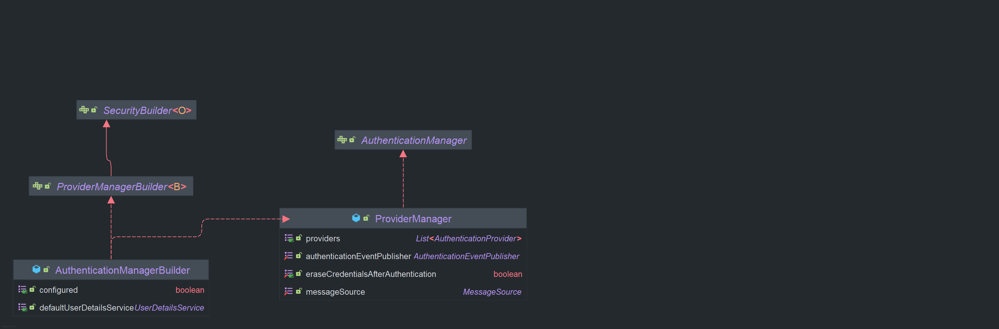

## 흐름도 확인
```scss
사용자 요청 (Request)
|
   v
HTTP 요청 (URL, 메서드, 헤더 등)
|
   v
[DelegatingFilterProxy]
|   (Spring Security의 필터 체인을 서블릿 컨테이너에 연결)
|
   v
[FilterChainProxy]
|   (Security Filter Chain 관리)
|
   v
[Security Filter Chain]
|   (다양한 보안 필터들로 구성)
|    |
|    v
|   UsernamePasswordAuthenticationFilter
|    |   (폼 로그인 인증 처리)
|    v
|   BasicAuthenticationFilter
|    |   (HTTP 기본 인증 처리)
|    v
|   OAuth2LoginAuthenticationFilter
|        (OAuth2 로그인 인증 처리)
[FilterChainProxy] (계속)
|
v
[AuthenticationFilter]
|   (인증 요청을 가로채고 처리)
|
v
[Authentication Manager]
|   (다양한 AuthenticationProvider를 통해 인증 시도)
|
v
[AuthenticationProvider]
|   (실제 인증 로직을 구현)
|    |
|    v
|   [UserDetailsService]
|    |   (사용자 정보를 로드)
|    v
|   [UserDetails]
|        (인증 과정에서 사용되는 사용자 정보)
|
v
[SecurityContextHolder] <- 여기부분
|   (인증된 사용자 정보를 저장)
|
v
[Authentication]
|   (인증된 사용자 정보 및 권한 포함)
[SecurityContextHolder] (계속)
|
v
[AuthorizationFilter]
|   (인가 요청을 가로채고 처리)
|
v
[AuthorizationManager]
|   (인가를 관리하고 접근 권한을 평가)
|
v
[AccessDecisionManager]
|   (AccessDecisionVoter를 사용하여 접근 권한 결정)
|
v
[AuthorizationDecision]
|   (최종적으로 접근 허용 또는 거부 결정)
[AuthorizationDecision] (계속)
|
v
[Handler Mapping]
|   (요청에 대해 적절한 핸들러 매핑)
|
v
[Controller]
|   (비즈니스 로직 처리)
|
v
[View or Response]
|   (결과 반환)
|
v
응답 반환 (Response)

```


### AuthenticationManager
인증 필터로부터 Authentication 객체를 전달 받아 인증을 시도하며 **인증에 성공할 경우 사용자 정보, 권한 등을 포함한 완전히 채워진 Authentication 객체를 반환**한다.  
  
AuthenticationManager 는 **여러 AuthenticationProvider 들을 관리**하며 AuthenticationProvider 목록을 순차적으로 순회하며 인증 요청을 처리힙나디.  
  
AuthenticationProvider는 목록 중에서 **인증 처리 요건에 맞는 적절한 Provider를 찾아 인증처리를 위임**합니다. AuthenticationBuilder에 의해 객체가 생성되며 주로 사용하는 구현체로 ProviderManger가 제공 됩니다.
  
### AuthenticationBuilder
**AuthenticationManager 객체를 생성**하며 UserDetailsService 및 AuthenticationProvider를 추가 할 수 있다. HttpSecurity,getSharedObject(AuthenticationMangerBuilder) 를 통해 객체를 참조할 수 있다.  
  

  
### AuthenticationManger 흐름도

```css
[인증 요청(Authentication Request)]
        |
        v
[AuthenticationManager] ---> [ProviderManager] ------------------------------------
                                                |                                 |
                                                |                                 v
                                                |                   [DaoAuthenticationProvider]
                                                |                                 |
                                                |              [조건에 맞지 않음 -> 다음 Provider]
                                                |                                 |
                                                v                                 v
                                  [JwtAuthenticationProvider] --------> [OAuth2LoginAuthenticationProvider]
                                                |                                 |
                                                |                   [조건에 맞는 Provider 발견]
                                                v                                 |
                                [인증 성공(Authentication Success)] <---- [인증 실패(Authentication Failure)]

```
  

**선택적으로 부모 AuthenticationManger를 구성**할 수 있으며 이 부모 AuthenticationProvider가 인증을 수행할 수 없는 경우에 추가적인 탐색을 진행합니다.  

일반적으로 AuthenticationProvider로 부터 null 이 아닌 응답을 받을 떄 까지 차례대로 시도하며 응답을 받지 못하면 ProviderNotFoundException과 함께 인증이 실패한다.  

```css
[인증 요청(Authentication Request)]
        |
        v
[AuthenticationManager] ---> [ProviderManager] -------------------------------------
                                                |                                   |
                                                |                                   v
                                                |                     [DaoAuthenticationProvider]
                                                |                                   |
                                                |               [조건에 맞지 않음 -> 다음 Provider]
                                                |                                   |
                                                v                                   v
                                  [JwtAuthenticationProvider] ---------> [OAuth2LoginAuthenticationProvider]
                                                |                                   |
                                                |                       [조건에 맞는 Provider 발견]
                                                v                                   |
                            [인증 성공(Authentication Success)] <------ [인증 실패(Authentication Failure)]
                                                |
                                                v
                            [부모 AuthenticationManager(Optional)]
                                                |
                                                v
                         [부모 ProviderManager] -------------------------------------
                                                |                                   |
                                                |                                   v
                                                |                     [DaoAuthenticationProvider]
                                                |                                   |
                                                |               [조건에 맞지 않음 -> 다음 Provider]
                                                |                                   |
                                                v                                   v
                                  [JwtAuthenticationProvider] ---------> [OAuth2LoginAuthenticationProvider]
                                                |                                   |
                                                v                                   |
                            [인증 성공(Authentication Success)] <------ [인증 실패(Authentication Failure)]
                                                |
                                        [ProviderNotFoundException 발생]

```  

### 추가된 흐름 설명:

1. **부모 `AuthenticationManager`**: `ProviderManager`는 선택적으로 부모 `AuthenticationManager`를 구성할 수 있습니다. 만약 모든 `AuthenticationProvider`가 인증에 실패하면, 부모 `ProviderManager`에게 인증을 위임할 수 있습니다.
2. **부모 `ProviderManager`**: 자식 `ProviderManager`와 동일하게 부모 `ProviderManager`도 여러 `AuthenticationProvider`를 가지고 있으며, 자식에서 인증이 실패한 경우 부모에게 인증 요청이 전달됩니다.
  
  
### AuthenticationManager 사용법

### HttpSecurity 사용
`HttpSecurity`를 통해 인증 매니저를 설정할 수 있습니다.

```java
@Configuration
public class SecurityConfig {

    @Bean
    public SecurityFilterChain securityFilterChain(HttpSecurity http) throws Exception {
        // AuthenticationManager를 SecurityFilterChain 내부에서 설정
        AuthenticationManager authenticationManager = http
                .getSharedObject(AuthenticationManagerBuilder.class)
                .userDetailsService(userDetailsService()) // UserDetailsService 설정
                .passwordEncoder(passwordEncoder()) // PasswordEncoder 설정
                .and()
                .build();

        http
                .authenticationManager(authenticationManager) // AuthenticationManager 등록
                .authorizeRequests(authorize -> authorize
                        .anyRequest().authenticated()
                )
                .httpBasic(); // HTTP Basic 인증 설정

        return http.build();
    }

    @Bean
    public PasswordEncoder passwordEncoder() {
        return new BCryptPasswordEncoder(); // 비밀번호 암호화
    }

    @Bean
    public UserDetailsService userDetailsService() {
        return new InMemoryUserDetailsManager(
                User.withUsername("user")
                        .password(passwordEncoder().encode("password"))
                        .roles("USER")
                        .build()
        );
    }
}


```

### **설명**

- `getSharedObject(AuthenticationManagerBuilder.class)`를 사용해 `AuthenticationManagerBuilder` 객체를 가져온 뒤, 이를 이용해 `AuthenticationManager`를 구성합니다.
- 이후, 이 `AuthenticationManager`를 `http.authenticationManager(authenticationManager)`로 등록합니다.

### 직접구현
부모 `AuthenticationManager`를 설정하는 예시입니다. 부모 `AuthenticationManager`를 `ProviderManager`에 구성하여, 자식 `AuthenticationProvider`들이 모두 인증에 실패하면 부모에게 인증 요청을 넘기는 방식입니다.

```java
java
@Configuration
public class SecurityConfig {

    @Bean
    public AuthenticationManager authenticationManager(AuthenticationConfiguration authenticationConfiguration) throws Exception {
        return new ProviderManager(
            Arrays.asList(authenticationProvider()),  // 자식 AuthenticationProvider 리스트
            parentAuthenticationManager(authenticationConfiguration) // 부모 AuthenticationManager 설정
        );
    }

    @Bean
    public AuthenticationManager parentAuthenticationManager(AuthenticationConfiguration authenticationConfiguration) throws Exception {
        // 부모 AuthenticationManager를 생성하여 추가적인 Provider 설정 가능
        return new ProviderManager(
            Arrays.asList(parentAuthenticationProvider()) // 부모 Provider 리스트 설정
        );
    }

    @Bean
    public DaoAuthenticationProvider authenticationProvider() {
        // 자식 DaoAuthenticationProvider 설정
        DaoAuthenticationProvider authProvider = new DaoAuthenticationProvider();
        authProvider.setUserDetailsService(userDetailsService());
        authProvider.setPasswordEncoder(passwordEncoder());
        return authProvider;
    }

    @Bean
    public DaoAuthenticationProvider parentAuthenticationProvider() {
        // 부모 DaoAuthenticationProvider 설정
        DaoAuthenticationProvider parentAuthProvider = new DaoAuthenticationProvider();
        parentAuthProvider.setUserDetailsService(parentUserDetailsService()); // 부모의 UserDetailsService 설정
        parentAuthProvider.setPasswordEncoder(passwordEncoder());
        return parentAuthProvider;
    }

    @Bean
    public PasswordEncoder passwordEncoder() {
        return new BCryptPasswordEncoder();
    }

    @Bean
    public UserDetailsService userDetailsService() {
        // 자식 AuthenticationProvider에 사용할 사용자 정보 설정
        return new InMemoryUserDetailsManager(
            User.withUsername("user")
                .password(passwordEncoder().encode("password"))
                .roles("USER")
                .build()
        );
    }

    @Bean
    public UserDetailsService parentUserDetailsService() {
        // 부모 AuthenticationProvider에 사용할 사용자 정보 설정
        return new InMemoryUserDetailsManager(
            User.withUsername("admin")
                .password(passwordEncoder().encode("adminpass"))
                .roles("ADMIN")
                .build()
        );
    }

    @Bean
    public SecurityFilterChain securityFilterChain(HttpSecurity http) throws Exception {
        // SecurityFilterChain 구성
        http
            .authorizeRequests(authorize -> authorize
                .anyRequest().authenticated()
            )
            .httpBasic(); // HTTP Basic 인증 설정
        return http.build();
    }
}

```

### 핵심 설명:

1. **자식 `AuthenticationManager`**:
    - `authenticationManager()`에서 `ProviderManager`를 구성하고, 자식 `AuthenticationProvider`로 `DaoAuthenticationProvider`를 등록합니다.
    - 인증에 실패하면 부모 `AuthenticationManager`에게 인증을 위임하게 됩니다.
2. **부모 `AuthenticationManager`**:
    - `parentAuthenticationManager()`에서는 부모 `ProviderManager`를 생성하며, 부모 `AuthenticationProvider`로 `parentAuthenticationProvider()`를 등록합니다.
    - 부모는 자식이 인증에 실패할 경우 호출되며, 부모의 `UserDetailsService`와 `PasswordEncoder`를 통해 추가적인 인증을 시도합니다.
3. **`ProviderManager`**:
    - 자식과 부모 모두 `ProviderManager`로 관리됩니다. 자식 `ProviderManager`가 인증에 실패할 경우, 부모 `ProviderManager`에게 인증 요청을 위임합니다.
    - 모든 `ProviderManager`가 인증을 실패하면 `ProviderNotFoundException`이 발생합니다.
