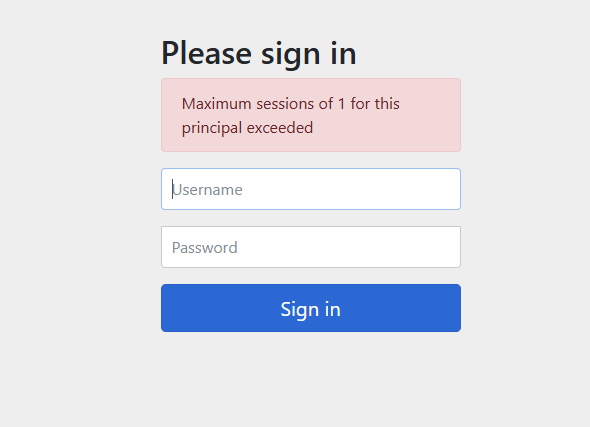

## 동시 세션제어
- 동시 세션 제어는 사용자가 동시에 여러 세션을 생성하는 것을 관리하는 전략
- 사용자의 인증 후에 활성화된 세션의 수가 설정된 maximumSessions 값과 비교하여 제어 여부를 결정

### 세션(Session)이란?

세션은 클라이언트와 서버 간의 상태를 유지하기 위해 사용하는 데이터 구조입니다. HTTP는 기본적으로 **무상태(stateless) 프로토콜**이기 때문에, 클라이언트의 요청과 서버의 응답 사이에 상태를 유지하려면 추가적인 메커니즘이 필요합니다. 세션은 이러한 상태 유지를 가능하게 합니다.

### 세션의 동작 방식

1. **클라이언트의 요청**: 클라이언트가 서버에 로그인 요청을 보냅니다.
2. **세션 생성**: 서버는 사용자를 인증한 후 세션을 생성하고, 고유 식별자(세션 ID)를 부여합니다.
3. **세션 저장**: 서버는 세션 ID를 클라이언트 측 쿠키 또는 URL에 저장하고, 관련 데이터를 서버(메모리, 파일, DB 등)에 저장합니다.
4. **세션 활용**: 클라이언트는 세션 ID를 서버에 계속 전달하며, 서버는 이를 통해 클라이언트의 상태를 확인하고 필요한 데이터를 제공합니다.
5. **세션 종료**: 로그아웃 시 세션을 삭제하거나, 일정 시간이 지나면 세션이 만료됩니다.

### 세션의 주요 특성

- **상태 유지**: 사용자가 로그인한 상태를 유지하거나, 장바구니 데이터를 유지하는 등.
- **유효 기간**: 세션에는 일반적으로 유효 기간이 설정되며, 유효 시간이 지나면 만료됩니다.
- **보안**: 세션 하이재킹(세션 탈취) 방지를 위해 HTTPS와 같은 보안 프로토콜을 사용해야 합니다.

### 예시

- 사용자가 전자상거래 웹사이트에 로그인한 후 상품을 장바구니에 추가한 상태를 유지하는 경우, 서버는 이 데이터를 세션에 저장합니다.
- 브라우저를 닫았다가 다시 열어도 로그인 상태가 유지된다면, 세션이 서버와 브라우저 간에 적절히 동작하고 있다는 의미입니다.
  
  

---  

## **스프링 시큐리티에서의 세션 제어**

Spring Security는 애플리케이션의 인증과 권한 부여를 처리하며, 이를 통해 세션도 관리합니다. 동시 세션 제어는 여러 사용자 세션을 관리하고 제한하는 중요한 기능 중 하나입니다.

### 동시 세션 제어란?

동시 세션 제어는 동일한 사용자가 여러 디바이스 또는 브라우저에서 동시에 로그인하는 것을 허용할지, 아니면 제한할지 결정하는 기능입니다. 예를 들어, 한 사용자가 이미 로그인한 상태에서 다른 브라우저로 다시 로그인하면 이전 세션을 만료시키거나, 새로운 세션 생성을 막을 수 있습니다.

## **동시 세션 제어를 사용하는 이유**

1. **보안 강화**: 한 계정을 여러 사용자가 공유하거나, 세션 하이재킹으로 인한 악용을 방지합니다.
2. **리소스 관리**: 서버 자원을 효율적으로 관리할 수 있습니다.
3. **정책 준수**: 금융, 의료와 같은 특정 산업에서는 동시 세션이 정책적으로 금지되기도 합니다.
  
  
    

---  


  
### 동시 세션제어 유형 2가지  

###  사용자 인증 시도 차단

**시나리오 1: 동일 계정 중복 로그인 제한**  

1. 사용자 A가 브라우저 1에서 로그인하여 세션 1을 생성합니다.
2. 사용자 A가 브라우저 2에서 같은 계정으로 로그인하려고 시도합니다.
3. `maxSessionsPreventsLogin(true)`로 설정된 경우, 브라우저 2의 로그인은 거부됩니다.
  
**`최대 허용 개수만큼 동시 인증이 가능하고 그 외 사용자의 인증 시도를 차단`**  
  


###  사용자 세션 강제 만료

**시나리오 2: 기존 세션 만료 처리**  

1. 사용자 B가 디바이스 1에서 로그인합니다(세션 ID: S1).
2. 사용자 B가 디바이스 2에서 로그인합니다(세션 ID: S2).
3. `maxSessionsPreventsLogin(false)`로 설정된 경우, 디바이스 1의 세션 S1이 만료됩니다.
4. 만료된 세션으로 요청 시, `/session-expired` URL로 리다이렉트됩니다.

**`최대 허용 개수만큼 동시 인증이 가능하고 그 외 이전 사용자의 세션을 만료`**
  

  
### 설정 클레스
```java
@Configuration
@EnableWebSecurity
public class SecurityConfig extends WebSecurityConfigurerAdapter {

    @Override
    protected void configure(HttpSecurity http) throws Exception {
        http
            .authorizeRequests()
                .antMatchers("/public/**").permitAll()
                .anyRequest().authenticated()
                .and()
            .formLogin()
                .loginPage("/login")
                .permitAll()
                .and()
            .logout()
                .permitAll()
                .and()
            .sessionManagement()
                .maximumSessions(1) // 한 사용자당 최대 세션 수 제한
                .maxSessionsPreventsLogin(true) // 추가 로그인 방지(true) 또는 기존 세션 종료(false)
                .expiredUrl("/session-expired"); // 세션 만료 시 리다이렉트 URL
    }
}

```

### 주요 옵션

1. `maximumSessions(int maxSessions)`: 사용자당 허용할 최대 세션 수를 설정합니다. 기본값은 무제한 세션을 허용한다.
2. `maxSessionsPreventsLogin(boolean flag)`:
    - `true`: 새로운 세션 생성을 막음.
    - `false`: 이전 세션을 만료시킴(기본값).
3. `expiredUrl(String url)`: 세션 만료 시 이동할 URL을 설정합니다.
4. `invalidSessionUrl(String url)`: 사용자가 유효하지 않은 세션으로 서버에 접근할 경우, 지정된 URL로 리다이렉트합니다.

### **`expiredUrl`와 `invalidSessionUrl` 비교**

| **옵션** | **`expiredUrl`** | **`invalidSessionUrl`** |
| --- | --- | --- |
| **적용 상황** | 기존 세션이 만료되었을 때 | 유효하지 않은 세션으로 접근했을 때 |
| **주요 발생 원인** | - 동일 계정으로 새로운 세션 생성 시- 세션 시간이 만료된 경우 | - 서버 재시작으로 세션 초기화- 세션이 아예 존재하지 않을 때 |
| **설정 위치** | `sessionManagement().maximumSessions().expiredUrl()` | `sessionManagement().invalidSessionUrl()` |
| **동작 방식** | - 유효하던 세션이 만료되었음을 알려줌- 만료 이후 특정 URL로 리다이렉트 | - 서버가 요청에서 세션을 찾지 못할 경우- 특정 URL로 리다이렉트 |
| **사용자 경험** | 만료된 세션에 대해 사용자에게 알림 제공 | 초기 요청이 잘못되었음을 알려줌 |
| **사용 예제** | "다른 기기에서 로그인하여 세션이 종료되었습니다." 메시지 제공 | "세션이 만료되었습니다. 다시 로그인해주세요." 메시지 제공 |

### **정리**

- **`expiredUrl`**: 기존 세션이 유효했으나 만료된 경우에 대응하는 옵션입니다. 동일 계정으로 새로운 세션이 생성되거나, 세션 시간이 만료된 경우에 유용합니다.
- **`invalidSessionUrl`**: 세션이 유효하지 않을 때 대응하는 옵션입니다. 서버가 세션을 찾지 못할 때나, 사용자가 만료된 세션으로 접근하려고 할 때 사용됩니다.
  
  
## 세션 고정 보호 전략

### **세션 고정 공격(Session Fixation Attack)이란?**

세션 고정 공격은 악의적인 사용자가 미리 생성한 세션 ID를 피해자에게 고정하여 해당 세션을 사용하게 만든 뒤, 이를 통해 피해자의 세션을 탈취하는 공격 방식입니다.

### **공격 과정**

1. **세션 ID 생성**: 공격자가 애플리케이션에서 유효한 세션 ID를 미리 생성합니다.
2. **세션 ID 고정**: 공격자가 이 세션 ID를 URL 파라미터나 쿠키를 통해 피해자에게 전달하여 강제로 사용하게 합니다.
3. **세션 탈취**: 피해자가 해당 세션 ID로 로그인하면, 공격자는 동일한 세션 ID를 사용해 피해자의 세션에 접근할 수 있게 됩니다.

---

### **세션 고정 보호란?**

세션 고정 공격을 방지하기 위해, `Spring Security`는 로그인 과정에서 기존 세션을 무효화하거나, 새로운 세션 ID를 생성하여 세션 ID를 고정할 수 없게 합니다.


### **Spring Security에서의 세션 고정 보호 전략**

Spring Security는 세션 고정 공격에 대한 방어를 자동으로 제공합니다. 이를 통해 세션 ID를 안전하게 관리하며, 다양한 전략으로 보호 설정을 변경할 수 있습니다.

### **세션 고정 보호 전략 옵션**

Spring Security는 `sessionFixation().strategy()`를 통해 다음과 같은 전략을 제공합니다.

| **전략** | **설명**                                                                            |
| --- |-----------------------------------------------------------------------------------|
| **`changeSessionId`** | (기본값)기존 세션을 유지하며 세션 ID만 변경합니다. 데이터 보존과 성능 최적화를 동시에 제공합니다(Java Servlet 3.1 이상 필요). |
| **`migrateSession`** | 기존 세션을 새로운 세션 ID로 교체하고, 세션 데이터를 보존합니다.                                            |
| **`newSession`** | 새로운 세션 ID를 생성하며, 기존 세션 데이터를 제거합니다.                                                |
| **`none`** | 세션 고정 보호를 비활성화합니다. 기존 세션 ID가 그대로 유지되며 보안에 취약할 수 있습니다.                             |

### **세션 고정 보호 전략 설정**

### **세션 ID만 변경(`changeSessionId`)**

새로운 세션을 생성하지 않고, 기존 세션 데이터는 그대로 유지한 채로 세션 ID만 교체합니다. 이는 migrateSession()의 동작과 유사하지만, 보다 가벼운 방식으로 동작합니다.

```java
import org.springframework.context.annotation.Bean;
import org.springframework.security.config.annotation.web.builders.HttpSecurity;
import org.springframework.security.web.SecurityFilterChain;

@Configuration
public class SecurityConfig {

    @Bean
    public SecurityFilterChain securityFilterChain(HttpSecurity http) throws Exception {
        http
            .authorizeHttpRequests(auth -> auth
                .anyRequest().authenticated()
            )
            .formLogin(form -> form
                .loginPage("/login")
                .permitAll()
            )
            .sessionManagement(session -> session
                .sessionFixation(sessionFixation -> sessionFixation
                    .changeSessionId() // 세션 ID만 변경, 데이터 유지
                )
            );

        return http.build();
    }
}

```


`세션ID`를 동일하게 설정해도 `세션ID`가 변경된 것을 확인할 수 있다.  
  
### 스프링 기본 설정
```java
    @Bean({"org.springframework.security.config.annotation.web.configuration.HttpSecurityConfiguration.httpSecurity"})
    @Scope("prototype")
    HttpSecurity httpSecurity() throws Exception {
        LazyPasswordEncoder passwordEncoder = new LazyPasswordEncoder(this.context);
        AuthenticationManagerBuilder authenticationBuilder = new DefaultPasswordEncoderAuthenticationManagerBuilder(this.objectPostProcessor, passwordEncoder);
        authenticationBuilder.parentAuthenticationManager(this.authenticationManager());
        authenticationBuilder.authenticationEventPublisher(this.getAuthenticationEventPublisher());
        HttpSecurity http = new HttpSecurity(this.objectPostProcessor, authenticationBuilder, this.createSharedObjects());
        WebAsyncManagerIntegrationFilter webAsyncManagerIntegrationFilter = new WebAsyncManagerIntegrationFilter();
        webAsyncManagerIntegrationFilter.setSecurityContextHolderStrategy(this.securityContextHolderStrategy);
        http.csrf(Customizer.withDefaults())
                .addFilter(webAsyncManagerIntegrationFilter)
                .exceptionHandling(Customizer.withDefaults())
                .headers(Customizer.withDefaults())
                .sessionManagement(Customizer.withDefaults()) //기본설정
                .securityContext(Customizer.withDefaults())
                .requestCache(Customizer.withDefaults())
                .anonymous(Customizer.withDefaults())
                .servletApi(Customizer.withDefaults())
                .apply(new DefaultLoginPageConfigurer());
        http.logout(Customizer.withDefaults());
        this.applyCorsIfAvailable(http);
        this.applyDefaultConfigurers(http);
        return http;
    }

```

`SessionManagementConfigurer`의 초기화 부분을 살펴보면:  
```java
    public void init(H http) {
        SecurityContextRepository securityContextRepository = (SecurityContextRepository)http.getSharedObject(SecurityContextRepository.class);
        boolean stateless = this.isStateless();
        if (securityContextRepository == null) {
            if (stateless) {
                http.setSharedObject(SecurityContextRepository.class, new RequestAttributeSecurityContextRepository());
                this.sessionManagementSecurityContextRepository = new NullSecurityContextRepository();
            } else {
                HttpSessionSecurityContextRepository httpSecurityRepository = new HttpSessionSecurityContextRepository();
                httpSecurityRepository.setDisableUrlRewriting(!this.enableSessionUrlRewriting);
                httpSecurityRepository.setAllowSessionCreation(this.isAllowSessionCreation());
                AuthenticationTrustResolver trustResolver = (AuthenticationTrustResolver)http.getSharedObject(AuthenticationTrustResolver.class);
                if (trustResolver != null) {
                    httpSecurityRepository.setTrustResolver(trustResolver);
                }

                this.sessionManagementSecurityContextRepository = httpSecurityRepository;
                DelegatingSecurityContextRepository defaultRepository = new DelegatingSecurityContextRepository(new SecurityContextRepository[]{httpSecurityRepository, new RequestAttributeSecurityContextRepository()});
                http.setSharedObject(SecurityContextRepository.class, defaultRepository);
            }
        } else {
            this.sessionManagementSecurityContextRepository = securityContextRepository;
        }

        RequestCache requestCache = (RequestCache)http.getSharedObject(RequestCache.class);
        if (requestCache == null && stateless) {
            http.setSharedObject(RequestCache.class, new NullRequestCache());
        }

        http.setSharedObject(SessionAuthenticationStrategy.class, this.getSessionAuthenticationStrategy(http));
        http.setSharedObject(InvalidSessionStrategy.class, this.getInvalidSessionStrategy());
    }
private SessionAuthenticationStrategy getSessionAuthenticationStrategy(H http) {
   if (this.sessionAuthenticationStrategy != null) {
      return this.sessionAuthenticationStrategy;
   } else {
      List<SessionAuthenticationStrategy> delegateStrategies = this.sessionAuthenticationStrategies;
      SessionAuthenticationStrategy defaultSessionAuthenticationStrategy;
      if (this.providedSessionAuthenticationStrategy == null) {
         defaultSessionAuthenticationStrategy = (SessionAuthenticationStrategy)this.postProcess(this.sessionFixationAuthenticationStrategy); // null 일때 기본값으로 sessionFixationAuthenticationStrategy 전략을 설정
      } else {
         defaultSessionAuthenticationStrategy = this.providedSessionAuthenticationStrategy;
      }

      if (this.isConcurrentSessionControlEnabled()) {
         SessionRegistry sessionRegistry = this.getSessionRegistry(http);
         ConcurrentSessionControlAuthenticationStrategy concurrentSessionControlStrategy = new ConcurrentSessionControlAuthenticationStrategy(sessionRegistry);
         concurrentSessionControlStrategy.setMaximumSessions(this.maximumSessions);
         concurrentSessionControlStrategy.setExceptionIfMaximumExceeded(this.maxSessionsPreventsLogin);
         concurrentSessionControlStrategy = (ConcurrentSessionControlAuthenticationStrategy)this.postProcess(concurrentSessionControlStrategy);
         RegisterSessionAuthenticationStrategy registerSessionStrategy = new RegisterSessionAuthenticationStrategy(sessionRegistry);
         registerSessionStrategy = (RegisterSessionAuthenticationStrategy)this.postProcess(registerSessionStrategy);
         delegateStrategies.addAll(Arrays.asList(concurrentSessionControlStrategy, defaultSessionAuthenticationStrategy, registerSessionStrategy));
      } else {
         delegateStrategies.add(defaultSessionAuthenticationStrategy);
      }

      this.sessionAuthenticationStrategy = (SessionAuthenticationStrategy)this.postProcess(new CompositeSessionAuthenticationStrategy(delegateStrategies));
      return this.sessionAuthenticationStrategy;
   }
}
```   


### **새로운 세션 ID로 교체(migrateSession)**

`Spring Security`는 기본적으로 세션 고정 보호를 활성화하며, `migrateSession` 전략을 사용합니다. 기존 세션 ID는 무효화되고, 새로운 세션 ID가 생성됩니다. 그러나 세션에 저장된 데이터는 유지됩니다.

```java
import org.springframework.context.annotation.Bean;
import org.springframework.security.config.annotation.web.builders.HttpSecurity;
import org.springframework.security.web.SecurityFilterChain;

@Configuration
public class SecurityConfig {

   @Bean
   public SecurityFilterChain securityFilterChain(HttpSecurity http) throws Exception {
      http
              .authorizeHttpRequests(auth -> auth
                      .anyRequest().authenticated()
              )
              .formLogin(form -> form
                      .loginPage("/login")
                      .permitAll()
              )
              .sessionManagement(session -> session
                      .sessionFixation(sessionFixation -> sessionFixation
                              .migrateSession() // 세션 ID 교체, 데이터 유지
                      )
              );

      return http.build();
   }
}


```

### **새로운 세션 생성(`newSession`)**

기존 세션 ID뿐만 아니라 세션 데이터도 모두 제거합니다. 민감 데이터가 세션에 저장된 경우 사용을 고려할 수 있습니다.

```java
import org.springframework.context.annotation.Bean;
import org.springframework.security.config.annotation.web.builders.HttpSecurity;
import org.springframework.security.web.SecurityFilterChain;

@Configuration
public class SecurityConfig {

   @Bean
   public SecurityFilterChain securityFilterChain(HttpSecurity http) throws Exception {
      http
              .authorizeHttpRequests(auth -> auth
                      .anyRequest().authenticated()
              )
              .formLogin(form -> form
                      .loginPage("/login")
                      .permitAll()
              )
              .sessionManagement(session -> session
                      .sessionFixation(sessionFixation -> sessionFixation
                              .newSession() // 새로운 세션 생성, 기존 데이터 제거
                      )
              );

      return http.build();
   }
}


```

### **보호 비활성화(`none`)**

세션 고정 보호를 비활성화하여 기존 세션 ID를 그대로 유지합니다. 이 옵션은 보안에 취약하며 일반적으로 사용하지 않는 것이 좋습니다.

```java
import org.springframework.context.annotation.Bean;
import org.springframework.security.config.annotation.web.builders.HttpSecurity;
import org.springframework.security.web.SecurityFilterChain;

@Configuration
public class SecurityConfig {

   @Bean
   public SecurityFilterChain securityFilterChain(HttpSecurity http) throws Exception {
      http
              .authorizeHttpRequests(auth -> auth
                      .anyRequest().authenticated()
              )
              .formLogin(form -> form
                      .loginPage("/login")
                      .permitAll()
              )
              .sessionManagement(session -> session
                      .sessionFixation(sessionFixation -> sessionFixation
                              .none() // 세션 고정 보호 비활성화 (비추천)
                      )
              );

      return http.build();
   }
}


```
  
    
  

동일한 `세션ID`를 가질 수 있다. 이후에는 공격자의 브라우저에서 별도의 인증없이 로그인하여 정보를 취득할 수 있다.
  

---

### **세션 고정 보호 전략에 따른 동작 비교**

| **옵션** | **동작** | **세션 ID 변경 여부** | **세션 데이터 유지 여부** | **주요 사용 사례** |
| --- | --- | --- | --- | --- |
| `migrateSession` | 새로운 세션 생성, 기존 데이터 이관 | **변경됨** | **유지** | 보안이 중요하면서도 기존 세션 데이터를 유지해야 할 때. |
| `newSession` | 새로운 세션 생성, 기존 데이터 제거 | **변경됨** | **제거됨** | 민감 데이터를 삭제하고 세션을 완전히 초기화할 때. |
| `none` | 세션 고정 보호 비활성화 | **변경되지 않음** | **유지** | 테스트 환경 등 특별한 요구가 있을 때. |
| `changeSessionId` | **세션 ID만 변경**, 기존 데이터 유지 | **변경됨** | **유지** | 성능이 중요하고 기본 보안을 유지해야 할 때. |

  
## 세션 생성 정책
Spring Security는 세션 관리를 통해 사용자의 인증 상태와 세션 동작을 제어합니다. 최신 Spring Security(6.x 기준)에서는 세션 정책을 설정하여 세션 생성과 처리 방식을 세밀하게 제어할 수 있습니다.  
  
이 정책은 보안 요구 사항과 애플리케이션의 상태 관리 방식에 따라 유연하게 설정할 수 있습니다.

## **세션 정책(Session Creation Policy)의 종류**

Spring Security는 **`SessionCreationPolicy`** 열거형(Enum)을 사용하여 세션 생성과 관련된 정책을 정의합니다. 아래는 지원하는 정책과 설명입니다:

| **정책** | **설명** |
| --- | --- |
| **`ALWAYS`** | 인증이 성공할 때마다 세션을 항상 생성합니다. |
| **`IF_REQUIRED`** (기본값) | 세션이 필요할 때만 생성합니다. 예를 들어, 애플리케이션이 세션을 요구하는 경우에만 생성합니다. |
| **`NEVER`** | 세션을 생성하지 않습니다. 하지만, 이미 존재하는 세션이 있다면 이를 사용합니다. |
| **`STATELESS`** | 세션을 생성하거나 사용하지 않습니다. REST API와 같은 무상태(stateless) 애플리케이션에서 사용됩니다. |

### **SecurityFilterChain을 통한 설**

Spring Security에서 `HttpSecurity.sessionManagement()`를 사용하여 세션 정책을 설정할 수 있습니다.

### **기본값(`IF_REQUIRED`)**

기본적으로 세션은 필요할 때만 생성됩니다. 이는 일반적인 웹 애플리케이션에서 가장 많이 사용하는 정책입니다.

```java

import org.springframework.context.annotation.Bean;
import org.springframework.security.config.annotation.web.builders.HttpSecurity;
import org.springframework.security.web.SecurityFilterChain;

@Configuration
public class SecurityConfig {

    @Bean
    public SecurityFilterChain securityFilterChain(HttpSecurity http) throws Exception {
        http
            .authorizeHttpRequests(auth -> auth
                .anyRequest().authenticated()
            )
            .sessionManagement(session -> session
                .sessionCreationPolicy(SessionCreationPolicy.IF_REQUIRED) // 기본값
            );

        return http.build();
    }
}

```
  

  

---

### **`ALWAYS`**

이 정책은 인증이 성공할 때마다 세션을 강제로 생성합니다. 인증과 세션 상태를 반드시 유지해야 하는 애플리케이션에서 사용됩니다.

```java
http
    .sessionManagement(session -> session
        .sessionCreationPolicy(SessionCreationPolicy.ALWAYS)
    );

```

익명 사용자로 요청해도 세션 생성:


해당 옵션을 추가하게 되면 자동적으로 `ForceEagerSessionCreationFilter`가 추가된다.  

```java
public class ForceEagerSessionCreationFilter extends OncePerRequestFilter {
    public ForceEagerSessionCreationFilter() {
    }

    protected void doFilterInternal(HttpServletRequest request, HttpServletResponse response, FilterChain filterChain) throws ServletException, IOException {
        HttpSession session = request.getSession(); // 무조건 세션을 생성하고 다음 필터로!
        if (this.logger.isDebugEnabled() && session.isNew()) {
            this.logger.debug(LogMessage.format("Created session eagerly", new Object[0]));
        }

        filterChain.doFilter(request, response);
    }
}
```

  
FilterChainProxy 에서 `ForceEagerSessionCreationFilter` 해당 필터 가 추가되었는지 확인:  


---

**`NEVER`**

이 정책은 세션을 생성하지 않지만, **이미 존재하는 세션이 있다면 이를 사용**합니다(WAS에 생성할 수 있음). 세션 생성은 직접 관리하고, Spring Security가 관여하지 않도록 설정할 때 유용합니다.

```java
http
    .sessionManagement(session -> session
        .sessionCreationPolicy(SessionCreationPolicy.NEVER)
    );

```

---

### **`STATELESS`**

이 정책은 **세션을 전혀 사용하지 않습니다.** REST API와 같은 무상태(stateless) 애플리케이션에서 사용됩니다.   
  
JWT와 같은 세션을 사용하지 않는 방식으로 인증을 관리할 때 유용할 수 있다.  
  
SecurityContextHolderFilter는 세션 단위가 아닌 요청단위로 항상 새로운 SecurityContext 객체를 생성하므로 컨텍스트 영속성이 유지되지 않는다.
  


```java
http
    .sessionManagement(session -> session
        .sessionCreationPolicy(SessionCreationPolicy.STATELESS)
    );

```
해당 인증전략을 사용하게 되면 `NullSecurityContextRepository`를 사용하게 된다.  
  

  
### STATELESS 설정에도 세션이 생성될 수 있다.
스프링 시큐리티에서 CSRF 기능이 활성화 되어 있고 CSRF 기능이 수행될 경우 사용자의 세션을 생성해서 CSRF 토큰을 저장하게된다.  
즉 세션은 생성되지만 CSRF 기능을 위해서 사용될 뿐 인증 프로세스의 SecurityContext 영속성에 여향을 미치지 않는다.
  
**`인증 처리와 관련된 작업에서는 세션을 사용하지 않는다.`**  
  
```java
    protected void doFilterInternal(HttpServletRequest request, HttpServletResponse response, FilterChain filterChain) throws ServletException, IOException {
        DeferredCsrfToken deferredCsrfToken = this.tokenRepository.loadDeferredToken(request, response); //이 부분
        request.setAttribute(DeferredCsrfToken.class.getName(), deferredCsrfToken);
        CsrfTokenRequestHandler var10000 = this.requestHandler;
        Objects.requireNonNull(deferredCsrfToken);
        var10000.handle(request, response, deferredCsrfToken::get);
        if (!this.requireCsrfProtectionMatcher.matches(request)) {
            if (this.logger.isTraceEnabled()) {
                this.logger.trace("Did not protect against CSRF since request did not match " + this.requireCsrfProtectionMatcher);
            }

            filterChain.doFilter(request, response);
        } else {
            CsrfToken csrfToken = deferredCsrfToken.get();
            String actualToken = this.requestHandler.resolveCsrfTokenValue(request, csrfToken);
            if (!equalsConstantTime(csrfToken.getToken(), actualToken)) {
                boolean missingToken = deferredCsrfToken.isGenerated();
                this.logger.debug(LogMessage.of(() -> "Invalid CSRF token found for " + UrlUtils.buildFullRequestUrl(request)));
                AccessDeniedException exception = (AccessDeniedException)(!missingToken ? new InvalidCsrfTokenException(csrfToken, actualToken) : new MissingCsrfTokenException(actualToken));
                this.accessDeniedHandler.handle(request, response, exception);
            } else {
                filterChain.doFilter(request, response);
            }
        }
    }
```
  

```java
public final class HttpSessionCsrfTokenRepository implements CsrfTokenRepository {
    private static final String DEFAULT_CSRF_PARAMETER_NAME = "_csrf";
    private static final String DEFAULT_CSRF_HEADER_NAME = "X-CSRF-TOKEN";
    private static final String DEFAULT_CSRF_TOKEN_ATTR_NAME = HttpSessionCsrfTokenRepository.class.getName().concat(".CSRF_TOKEN");
    private String parameterName = "_csrf";
    private String headerName = "X-CSRF-TOKEN";
    private String sessionAttributeName;

    public HttpSessionCsrfTokenRepository() {
        this.sessionAttributeName = DEFAULT_CSRF_TOKEN_ATTR_NAME;
    }

    public void saveToken(CsrfToken token, HttpServletRequest request, HttpServletResponse response) {
        if (token == null) { // 여기서 토큰이 없으면 세션을 생성
            HttpSession session = request.getSession(false);// 세션이 있다면 가져오고 없으면 생성:false
            if (session != null) {
                session.removeAttribute(this.sessionAttributeName);
            }
        } else { // 토큰이 있다면 
            HttpSession session = request.getSession();  //무조건 세션을 생성해서 
            session.setAttribute(this.sessionAttributeName, token); //토큰을 세션에 저장
        }

    }
}

```

---

## **3. 세션 정책별 비교**

| **정책** | **세션 생성 여부** | **세션 사용 여부** | **주요 사용 사례** |
| --- | --- | --- | --- |
| **`ALWAYS`** | 항상 생성 | 항상 사용 | 전통적인 웹 애플리케이션, 인증 정보를 항상 유지해야 하는 경우. |
| **`IF_REQUIRED`** | 필요 시 생성 (기본값) | 필요 시 사용 | 대부분의 애플리케이션에서 기본적으로 적합. |
| **`NEVER`** | 생성하지 않음 | 이미 존재하면 사용 | 세션 생성을 제한해야 하지만, 기존 세션을 활용할 수 있는 경우. |
| **`STATELESS`** | 생성하지 않음 | 사용하지 않음 | RESTful API, JWT 기반 인증. |

---
  
### 세션 생성 확인

HttpSessionSecurityContextRepository:  

```java
    private SecurityContext readSecurityContextFromSession(HttpSession httpSession) {
        if (httpSession == null) {
            this.logger.trace("No HttpSession currently exists");
            return null;
        } else {
            Object contextFromSession = httpSession.getAttribute(this.springSecurityContextKey);
            if (contextFromSession == null) {
                if (this.logger.isTraceEnabled()) {
                    this.logger.trace(LogMessage.format("Did not find SecurityContext in HttpSession %s using the SPRING_SECURITY_CONTEXT session attribute", httpSession.getId()));
                }

                return null;
            } else if (!(contextFromSession instanceof SecurityContext)) {
                this.logger.warn(LogMessage.format("%s did not contain a SecurityContext but contained: '%s'; are you improperly modifying the HttpSession directly (you should always use SecurityContextHolder) or using the HttpSession attribute reserved for this class?", this.springSecurityContextKey, contextFromSession));
                return null;
            } else {
                if (this.logger.isTraceEnabled()) {
                    this.logger.trace(LogMessage.format("Retrieved %s from %s", contextFromSession, this.springSecurityContextKey));
                } else if (this.logger.isDebugEnabled()) {
                    this.logger.debug(LogMessage.format("Retrieved %s", contextFromSession));
                }

                return (SecurityContext)contextFromSession;
            }
        }
    }
```


## **4. 주의사항 및 권장사항**

1. **`STATELESS` 사용 시**:
   - 세션을 사용하지 않으므로, 모든 요청은 독립적이어야 합니다.
   - JWT, OAuth2와 같은 토큰 기반 인증 방식을 사용해야 합니다.
2. **`ALWAYS` 사용 시**:
   - 인증 요청마다 세션이 생성되므로 서버 리소스 사용량이 증가할 수 있습니다.
   - 세션 수명 관리와 성능 모니터링이 중요합니다.
3. **보안 강화**:
   - HTTPS 사용을 강제하여 세션 탈취를 방지하세요.
   - `HttpOnly`, `Secure` 속성을 세션 쿠키에 적용하세요.
   - 세션 고정 보호 전략(`migrateSession`, `changeSessionId` 등)과 함께 사용하는 것이 좋습니다.