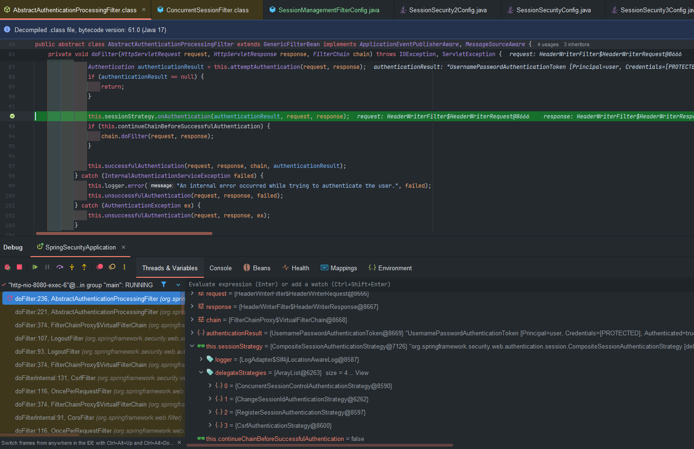
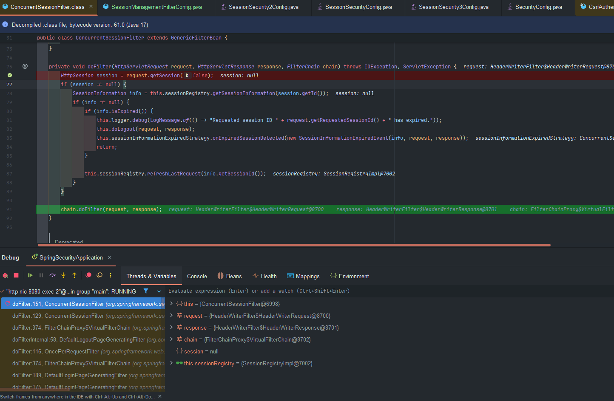
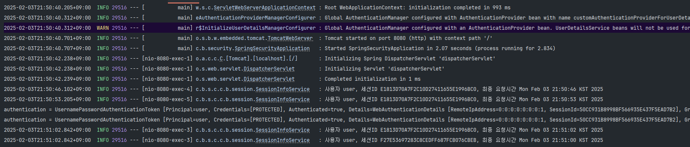

## 세션관리

스프링 시큐리티(Spring Security)에서는 사용자의 세션을 관리하거나(세션 생성, 세션 만료 처리, 동시 세션 제어 등) 보안 관련 검증 로직을 수행하기 위해 여러 가지 필터를 제공합니다. 그중 **SessionManagementFilter**와 **ConcurrentSessionFilter**는 사용자 세션과 관련된 보안 정책을 적용하는 데 중요한 역할을 합니다.

---

## **SessionManagementFilter**

1. **세션 관리**: 사용자 인증 시 세션 정보를 등록, 조회, 삭제하는 등 세션 이력을 관리합니다.
2. **동시적 세션 제어**: 동일 계정으로 접속 가능한 최대 세션 수를 제한합니다.
3. **세션 고정 보호**: 인증할 때마다 새로운 세션 쿠키를 발급하여 공격자의 쿠키 조작을 방지합니다.
4. **세션 생성 정책**: **Always**, **If_Required**, **Never**, **Stateless** 등의 정책을 설정할 수 있습니다.
    - `ALWAYS` - 스프링 시큐리티 요청 시 매번 세션 생성
    - `IF_REQUIRED` - 세션이 필요할 때만 생성(기본값)
    - `NEVER` - 스프링 시큐리티가 세션을 생성하지 않지만 이미 존재하는 세션은 사용
    - `STATELESS` - 세션을 전혀 사용하지 않음(REST API 등에서 무상태성 유지 시)

SessionManagementFilter는 SecurityContextRepository를 확인하여 사용자가 인증되었는지 결정합니다. 인증된 경우 **`SessionAuthenticationStrategy`**를 호출하여 세션 관리 작업을 수행합니다

스프링 시큐리티 6이상에서 SessionManagementFilter가 기본적으로 설정되지않으며 세션관리 API를 설정틀 통해 생성할 수 있다.

### 세션 구성 요서

SessionAuthentcationStragey의 4가지 전략

**AuthenticaionStrategy**:

1. **ChangedSessionId** : 세션 아이디 변경
2. **ConcurrentSessionControl**: 동시 세션 제어
3. **RegisterSession**: 세션정보 관리
4. **SessionFixation**: 세션 고정보호

---

### **SessionManagementFilter 역할**

1. **세션 만료 체크**: 매 요청마다 현재 사용자의 세션 만료 여부를 확인합니다.
2. **만료된 세션 처리**: 세션이 만료된 경우 즉시 로그아웃 처리하고 오류 페이지를 응답합니다.

ConcurrentSessionFilter는 SessionRegistry를 사용하여 세션 정보를 관리합니다. 세션이 만료되면 "This session has been expired" 메시지와 함께 오류 페이지를 반환합니다

## **동작 예시**

1. User1이 로그인합니다.
2. SessionManagementFilter가 세션을 생성하고 관리합니다.
3. User1이 다른 기기에서 로그인을 시도합니다.
4. SessionManagementFilter가 최대 세션 수를 확인하고, 초과 시 이전 세션을 만료시킵니다.
5. ConcurrentSessionFilter가 이후 요청에서 만료된 세션을 감지하고 로그아웃 처리합니다

---

### 설정 예시

다음과 같이 Spring Security를 설정할 때 `.sessionManagement()`를 통해 `SessionManagementFilter`를 제어할 수 있습니다.

```java

@Configuration
@EnableWebSecurity
public class SecurityConfig extends WebSecurityConfigurerAdapter {

    @Override
    protected void configure(HttpSecurity http) throws Exception {
        http
            .authorizeRequests()
                .antMatchers("/login", "/error").permitAll()
                .anyRequest().authenticated()
                .and()
            .formLogin()
                .loginPage("/login")
                .permitAll()
                .and()

            // 세션 관리 설정
            .sessionManagement()
                // 세션 생성 정책
                .sessionCreationPolicy(SessionCreationPolicy.IF_REQUIRED)

                // 동시 세션 제어
                .maximumSessions(1)
                // true로 설정하면 새로운 로그인 시도가 있을 경우 기존 세션 로그인 불가
                // false로 설정하면 이전 세션을 만료시킴
                .maxSessionsPreventsLogin(true)

                // 세션 만료 시 이동할 URL
                .expiredUrl("/login?expired");
    }
}

```

- **`sessionCreationPolicy`**:
    - `ALWAYS` - 스프링 시큐리티 요청 시 매번 세션 생성
    - `IF_REQUIRED` - 세션이 필요할 때만 생성(기본값)
    - `NEVER` - 스프링 시큐리티가 세션을 생성하지 않지만 이미 존재하는 세션은 사용
    - `STATELESS` - 세션을 전혀 사용하지 않음(REST API 등에서 무상태성 유지 시)
- **`maximumSessions(1)`**: 한 계정당 동시 세션 최대 개수를 1로 제한.
- **`maxSessionsPreventsLogin(false)`**: 새로운 로그인이 발생하면 기존 세션을 만료시킴(`true`면 새로운 로그인을 차단하고 기존 세션 유지).
- **`expiredUrl("/login?expired")`**: 세션이 만료되었을 때 이동할 URL 설정.

`SessionManagementFilter`는 위 설정값을 바탕으로 세션 관련 정책을 적용하고, 이후 필터 체인에서 인증/인가 처리 흐름이 이어집니다.

---

### ConcurrentSessionFilter

ConcurrentSessionFilter는 다음과 같은 역할을 수행합니다

1. **세션 만료 체크**: 매 요청마다 현재 사용자의 세션 만료 여부를 확인합니다.
2. **만료된 세션 처리**: 세션이 만료된 경우 즉시 로그아웃 처리하고 오류 페이지를 응답합니다.

ConcurrentSessionFilter는 **`SessionRegistry`**를 사용하여 세션 정보를 관리합니다. 세션이 만료되면 "This session has been expired" 메시지와 함께 오류 페이지를 반환합니다. **`SessionRegistry.refreshLastRequest(String)`** 를 호출하여 항상 마지막 업데이트 날짜/시간을 가지도록 한다.

### 동작 과정 개요

1. **사용자 요청 시점**에 필터가 세션이 유효한지 확인.
2. **만료된 세션**(또는 로그인 제한을 넘어선 세션)이라면 해당 요청을 차단하거나 적절한 에러/리다이렉트 처리를 수행.
3. 세션이 유효하다면 다른 필터에게 제어를 넘김.

즉, `ConcurrentSessionFilter`는 이미 “동시 세션 제한”에 의해 만료 대상이 된 세션에 대한 최종 처리(차단 또는 예외 발생 등)를 수행하는 필터입니다.

## **동작 예시**

1. User1이 로그인합니다.
2. SessionManagementFilter가 세션을 생성하고 관리합니다.
3. User1이 다른 기기에서 로그인을 시도합니다.
4. SessionManagementFilter가 최대 세션 수를 확인하고, 초과 시 이전 세션을 만료시킵니다.
5. ConcurrentSessionFilter가 이후 요청에서 만료된 세션을 감지하고 로그아웃 처리합니다

---

### 설정 예시

일반적으로 `ConcurrentSessionFilter`를 직접 코딩으로 추가하지 않아도, `HttpSecurity.sessionManagement().maximumSessions()` 설정을 하면 내부적으로 동시 세션 관리를 위한 구성이 활성화됩니다. 그러나 직접 필터를 Bean으로 등록하거나 확장해 커스터마이징할 수 있습니다.

```java

@Bean
public ConcurrentSessionFilter concurrentSessionFilter() {
    // 로그아웃 핸들러를 커스터마이징하거나
    // 세션 레지스트리를 주입할 수 있음
    return new ConcurrentSessionFilter(sessionRegistry(), "/login?sessionInvalid");
}

@Bean
public SessionRegistry sessionRegistry() {
    return new SessionRegistryImpl();
}

```

위와 같이 `ConcurrentSessionFilter`를 Bean 등록할 때 만료된 세션이 감지되면 이동할 URL(`/login?sessionInvalid`)을 직접 설정할 수도 있습니다. 그리고 `SessionRegistry`는 현재 인증된 사용자의 세션 정보를 추적하는 데 사용됩니다.

만약 커스텀 필터 체인으로 직접 추가한다면,

```java
@Override
protected void configure(HttpSecurity http) throws Exception {
    http
        .addFilterBefore(concurrentSessionFilter(), ConcurrentSessionFilter.class) // 혹은 적절한 위치
        .authorizeRequests()
            .anyRequest().authenticated()
        .and()
        .formLogin()
        .and()
        .sessionManagement()
            .sessionCreationPolicy(SessionCreationPolicy.IF_REQUIRED)
            .maximumSessions(1)
            .sessionRegistry(sessionRegistry())
            .expiredUrl("/login?expired");
}

```

이처럼 `SessionRegistry`와 `ConcurrentSessionFilter`를 연동하면, 최대 세션 수를 초과하는 로그인이 발생했을 때 이전 세션을 무효화하고 요청을 `/login?expired`나 `/login?sessionInvalid`로 리다이렉트 하는 등의 정책을 쉽게 구현할 수 있습니다.

---

## 간단 흐름 요약

1. **인증 정보 저장(로그인 시)**
    - 스프링 시큐리티는 기본적으로 `SecurityContextHolder`를 통해 인증 정보를 저장하고, 필요하다면 `HttpSession`에 `SecurityContext`를 저장합니다.
2. **세션 관리 설정(`SessionManagementFilter`)**
    - 세션 생성 정책(Session Creation Policy)에 따라 세션이 생성되거나 존재 여부를 확인.
    - 최대 세션 개수 설정, 기존 세션 만료 전략, 만료 시 이동할 URL 등을 구성.
3. **동시 세션 체크(`ConcurrentSessionFilter`)**
    - 매 요청 시점에 만료된 세션인지, 동시 세션 제한을 초과했는지를 확인.
    - 만료된 세션이라면 해당 요청을 중단하고 로그아웃 처리 또는 특정 페이지로 이동.
4. **정상 세션이라면 후속 필터로 제어 이동**
    - 이후 `UsernamePasswordAuthenticationFilter`(로그인 처리), `BasicAuthenticationFilter`(Basic Auth 처리), `ExceptionTranslationFilter`(인증/인가 예외 처리), `FilterSecurityInterceptor`(최종 인가 결정) 순으로 진행.

---

## 주의사항 및 활용 팁

1. **무상태 애플리케이션(REST API 등)에서는 세션 자체를 사용하지 않는** 경우가 많습니다. 이때는 `sessionCreationPolicy(SessionCreationPolicy.STATELESS)`로 설정하고 JWT 토큰 등을 활용합니다.
2. **동시 세션 제어**: 웹 어플리케이션에서 한 계정으로 너무 많이 접속하는 것을 방지하거나, 보안상 특정 기기 1대에서만 접속을 허용해야 할 때 유용합니다.
3. **세션 만료 처리**: 만료된 세션에 대해 어떤 뷰를 보여줄 것인지, 강제로 로그아웃시킬 것인지(다른 브라우저 탭/창의 영향 고려) 등을 주의 깊게 설계해야 합니다.
4. **세션 레지스트리(SessionRegistry)**: 현재 활동 중인 사용자 목록, 해당 사용자가 가진 세션 목록 등을 확인하거나, 특정 시점에 세션을 강제로 만료시키는 등의 기능을 구현할 때 사용합니다.

---

## 결론

- **`SessionManagementFilter`**:세션 생성/관리/만료/제한 정책 등의 **전체적인 세션 관리 로직**을 담당하는 필터.
- **`ConcurrentSessionFilter`**:동시 세션 제한을 설정했을 때 **이미 만료 대상이 된 세션**이 실제 요청을 시도하는 경우 이를 필터링하고, 적절한 후속 처리를 수행하는 필터.

이 두 필터는 대부분의 웹 기반 스프링 시큐리티 환경에서 자동으로 등록되어 작동하지만, 필요한 경우 세부 설정이나 커스텀 빈 등록을 통해 동작을 수정할 수 있습니다. 동시 세션 제어가 필요한 웹 애플리케이션에서는 이 두 필터의 동작 방식을 잘 이해하고 적절한 설정을 통해 보안 요구사항을 충족시킬 수 있습니다.


---  

### 실제 코드
  
스프링 시큐리티6버전 이상부터는 `sessionManagement`를 설정하지 않으면 기본적으로 세션관리를 할 수 있는 필터를 생성하지 않는다.
```java

@Slf4j
@Configuration
public class SessionManagementFilterConfig {

    public SecurityFilterChain securityFilterChain(HttpSecurity http) throws Exception {

        http.authorizeRequests(auth -> auth
                        .anyRequest().authenticated()
                )
                .formLogin(Customizer.withDefaults())
                .sessionManagement(session ->
                        session.maximumSessions(1) // 한 사용자당 최대 세션 수 제한
                                .maxSessionsPreventsLogin(true) // 추가 로그인 방지(true) 또는 기존 세션 종료(false)
                )
        ;

        return http.build();
    }
    
}

```
**session.maximumSessions(1)**: 기본적으로 **`maximumSessions`** 을 설정하지 않으면 시큐리티6이상부터는 동시적 세션관리를 위한 필터, 클레스, 인증전략등이 생성이 되지 않거나 수행되지 않는다.
```java
    public SessionManagementConfigurer<H>.ConcurrencyControlConfigurer maximumSessions(int maximumSessions) {
        this.maximumSessions = maximumSessions; //위에 설정에서 설정한 maximumSessions 저장하고 있다.
        this.propertiesThatRequireImplicitAuthentication.add("maximumSessions = " + maximumSessions); //private Set<String> propertiesThatRequireImplicitAuthentication;
        return new ConcurrencyControlConfigurer();
    }
```
  
초기화:
```java
 public void init(H http) {
        SecurityContextRepository securityContextRepository = (SecurityContextRepository)http.getSharedObject(SecurityContextRepository.class);
        boolean stateless = this.isStateless();
        if (securityContextRepository == null) {
            if (stateless) {
                http.setSharedObject(SecurityContextRepository.class, new RequestAttributeSecurityContextRepository());
                this.sessionManagementSecurityContextRepository = new NullSecurityContextRepository();
            } else {
                HttpSessionSecurityContextRepository httpSecurityRepository = new HttpSessionSecurityContextRepository();
                httpSecurityRepository.setDisableUrlRewriting(!this.enableSessionUrlRewriting);
                httpSecurityRepository.setAllowSessionCreation(this.isAllowSessionCreation());
                AuthenticationTrustResolver trustResolver = (AuthenticationTrustResolver)http.getSharedObject(AuthenticationTrustResolver.class);
                if (trustResolver != null) {
                    httpSecurityRepository.setTrustResolver(trustResolver);
                }

                this.sessionManagementSecurityContextRepository = httpSecurityRepository;
                DelegatingSecurityContextRepository defaultRepository = new DelegatingSecurityContextRepository(new SecurityContextRepository[]{httpSecurityRepository, new RequestAttributeSecurityContextRepository()});
                http.setSharedObject(SecurityContextRepository.class, defaultRepository);
            }
        } else {
            this.sessionManagementSecurityContextRepository = securityContextRepository;
        }

        RequestCache requestCache = (RequestCache)http.getSharedObject(RequestCache.class);
        if (requestCache == null && stateless) {
            http.setSharedObject(RequestCache.class, new NullRequestCache());
        }

        http.setSharedObject(SessionAuthenticationStrategy.class, this.getSessionAuthenticationStrategy(http));
        http.setSharedObject(InvalidSessionStrategy.class, this.getInvalidSessionStrategy());
    }
```

### 1.1 `securityContextRepository`가 이미 존재하는지 확인

```java
SecurityContextRepository securityContextRepository = (SecurityContextRepository)http.getSharedObject(SecurityContextRepository.class);

```

- Spring Security는 `HttpSecurity` 구성 과정에서 **공유 객체(Shared Object)** 를 통해 서로 다른 설정(Configurer) 간 필요한 컴포넌트를 전달받습니다.
- 여기서는 `HttpSecurity`로부터 `SecurityContextRepository`를 가져옵니다.
- 만약 해당 객체가 **null**이라면(= 아직 설정된 적이 없다면), 아래 로직을 통해 새로 설정합니다.

### 1.2 `stateless` 여부 확인

```java
boolean stateless = this.isStateless();

```

- `SessionCreationPolicy.STATELESS` 등으로 세션을 전혀 사용하지 않는(무상태) 방식인지 여부를 반환합니다.

### 1.3 `securityContextRepository == null` 인 경우

### 1) 무상태(`stateless == true`)

```java
if (stateless) {
    http.setSharedObject(SecurityContextRepository.class, new RequestAttributeSecurityContextRepository());
    this.sessionManagementSecurityContextRepository = new NullSecurityContextRepository();
}

```

- `SecurityContextRepository`로 **`RequestAttributeSecurityContextRepository`*를 등록합니다.
    - **`RequestAttributeSecurityContextRepository`**: 세션이나 영속적 저장소를 사용하지 않고, 단순히 **HTTP 요청(Request)** 속성에만 `SecurityContext`를 저장하는 매우 짧은 라이프사이클 전략입니다.
    - 즉, 요청마다 `SecurityContext`를 저장하고 꺼낼 뿐, 요청이 끝나면 사라지므로 세션을 사용하지 않는 무상태(Stateless) 아키텍처에 적합합니다.
- 동시에, `sessionManagementSecurityContextRepository`는 **`NullSecurityContextRepository`*로 설정합니다.
    - `NullSecurityContextRepository`는 `SecurityContext`를 “아무 데도 저장하지 않는” 역할을 합니다.

즉, **무상태 모드**일 때는 실제로 세션을 생성하거나 사용하지 않도록, RequestAttribute/Null 저장소를 통해 **상태를 유지하지 않는** 방향으로 설정합니다.

### 2) 유상태(`stateless == false`)

```java
else {
    HttpSessionSecurityContextRepository httpSecurityRepository = new HttpSessionSecurityContextRepository();
    httpSecurityRepository.setDisableUrlRewriting(!this.enableSessionUrlRewriting);
    httpSecurityRepository.setAllowSessionCreation(this.isAllowSessionCreation());

    AuthenticationTrustResolver trustResolver = (AuthenticationTrustResolver)http.getSharedObject(AuthenticationTrustResolver.class);
    if (trustResolver != null) {
        httpSecurityRepository.setTrustResolver(trustResolver);
    }

    this.sessionManagementSecurityContextRepository = httpSecurityRepository;

    DelegatingSecurityContextRepository defaultRepository =
        new DelegatingSecurityContextRepository(
            new SecurityContextRepository[]{
                httpSecurityRepository,
                new RequestAttributeSecurityContextRepository()
            }
        );
    http.setSharedObject(SecurityContextRepository.class, defaultRepository);
}

```

- *`HttpSessionSecurityContextRepository`*를 생성하고 기본 설정을 해줍니다.
    - `setDisableUrlRewriting(...)`: URL 뒤에 세션 ID(`;jsessionid=...`)가 노출되는 것을 막기 위해 URL Rewriting(세션 ID를 URL에 포함시키는 기술)을 비활성화할지를 설정.
    - `setAllowSessionCreation(...)`: 필요 시 세션을 생성해도 되는지 여부를 결정.
    - `setTrustResolver(...)`: 익명 사용자(Anonymous) 여부 판별 시 사용할 `AuthenticationTrustResolver` 주입 가능.
- 이후 `this.sessionManagementSecurityContextRepository`에 `httpSecurityRepository`를 지정하고,
- *`DelegatingSecurityContextRepository`*를 통해
    - `HttpSessionSecurityContextRepository` + `RequestAttributeSecurityContextRepository`를 **순차적으로 위임**하여 `SecurityContext`를 가져오거나 저장하도록 구성합니다.
    - 그리고 `HttpSecurity`의 공유 객체로 **이 DelegatingSecurityContextRepository**를 최종 등록합니다.

즉, **유상태 모드**일 때는 기본적으로 **`HttpSession`**을 사용하여 `SecurityContext`를 저장하고, 요청 범위 내에서는 **`RequestAttribute`**를 통해 간단히 가져다 쓰도록 하는 **Delegating** 구성을 합니다.

### 1.4 `securityContextRepository != null`인 경우

```java
} else {
    this.sessionManagementSecurityContextRepository = securityContextRepository;
}

```

- 이미 `SecurityContextRepository`가 다른 설정에서 등록되어 있었다면, 별도로 새로 등록하지 않고 그 객체를 그대로 사용합니다.

## `RequestCache` 설정

```java
RequestCache requestCache = (RequestCache)http.getSharedObject(RequestCache.class);
if (requestCache == null && stateless) {
    http.setSharedObject(RequestCache.class, new NullRequestCache());
}

```

- *`RequestCache`*는 사용자가 원래 요청하려던 URL을 저장해 두었다가, 인증 후 다시 해당 URL로 리다이렉트해 주는 기능 등에 사용됩니다.
- 만약 `RequestCache`가 아직 등록되지 않았고, 현재 모드가 **stateless**라면(**세션을 사용하지 않을 때**), **`NullRequestCache`*를 사용하도록 등록합니다.
    - 즉, “원래 요청 주소를 세션 등에 기억해 두었다가 로그인 후 이동하는” 기능을 무효화합니다.

---

## 3. 나머지 공유 객체 설정

```java
http.setSharedObject(SessionAuthenticationStrategy.class, this.getSessionAuthenticationStrategy(http));
http.setSharedObject(InvalidSessionStrategy.class, this.getInvalidSessionStrategy());

```

- 세션 인증 전략(**SessionAuthenticationStrategy**)과 **InvalidSessionStrategy**(세션이 무효할 때 대응 전략)도 `HttpSecurity` 공유 객체로 등록합니다.
- 이 설정들은 이후 다른 필터(`SessionManagementFilter`, `ConcurrentSessionFilter` 등)나 로직에서 가져와 사용될 수 있습니다.
  
```java
 private SessionAuthenticationStrategy getSessionAuthenticationStrategy(H http) {
    // 1) 이미 sessionAuthenticationStrategy가 설정되어 있으면 그대로 반환
    if (this.sessionAuthenticationStrategy != null) {
        return this.sessionAuthenticationStrategy;
    } else {
        // 2) 위에서 지정될 SessionAuthenticationStrategy들을 담을 리스트
        List<SessionAuthenticationStrategy> delegateStrategies = this.sessionAuthenticationStrategies;

        // 3) 기본적으로 사용할 SessionAuthenticationStrategy 결정
        SessionAuthenticationStrategy defaultSessionAuthenticationStrategy;
        if (this.providedSessionAuthenticationStrategy == null) {
            // sessionFixationAuthenticationStrategy를 postProcess()로 후처리하여 사용
            defaultSessionAuthenticationStrategy =
                    (SessionAuthenticationStrategy) this.postProcess(this.sessionFixationAuthenticationStrategy);
        } else {
            // 만약 외부에서 따로 주입한 providedSessionAuthenticationStrategy가 있다면 그것을 사용
            defaultSessionAuthenticationStrategy = this.providedSessionAuthenticationStrategy;
        }

        // 4) 동시 세션 제어가 활성화되어 있는지 확인
        if (this.isConcurrentSessionControlEnabled()) {
            // 4-1) SessionRegistry 준비
            SessionRegistry sessionRegistry = this.getSessionRegistry(http);

            // 4-2) ConcurrentSessionControlAuthenticationStrategy 생성
            ConcurrentSessionControlAuthenticationStrategy concurrentSessionControlStrategy =
                    new ConcurrentSessionControlAuthenticationStrategy(sessionRegistry);
            concurrentSessionControlStrategy.setMaximumSessions(this.maximumSessions);
            concurrentSessionControlStrategy.setExceptionIfMaximumExceeded(this.maxSessionsPreventsLogin);
            //최대 세션의 개수 초과시 예외를 발생

            // postProcess()로 Spring Security 내 Bean 후처리 적용
            concurrentSessionControlStrategy = (ConcurrentSessionControlAuthenticationStrategy)
                    this.postProcess(concurrentSessionControlStrategy);

            // 4-3) RegisterSessionAuthenticationStrategy 생성
            RegisterSessionAuthenticationStrategy registerSessionStrategy =
                    new RegisterSessionAuthenticationStrategy(sessionRegistry);
            registerSessionStrategy = (RegisterSessionAuthenticationStrategy)
                    this.postProcess(registerSessionStrategy);

            // 4-4) 위 전략들을 순서대로 추가
            delegateStrategies.addAll(
                    Arrays.asList(
                            concurrentSessionControlStrategy,
                            defaultSessionAuthenticationStrategy,
                            registerSessionStrategy
                    )
            );
        } else {
            // 5) 동시 세션 제어가 비활성화된 경우 기본 전략만 사용
            delegateStrategies.add(defaultSessionAuthenticationStrategy);
        }

        // 6) CompositeSessionAuthenticationStrategy로 합쳐서 최종 sessionAuthenticationStrategy 생성
        this.sessionAuthenticationStrategy =
                (SessionAuthenticationStrategy) this.postProcess(
                        new CompositeSessionAuthenticationStrategy(delegateStrategies)
                );

        return this.sessionAuthenticationStrategy;
    }
}

```

## 1. 캐싱된 `sessionAuthenticationStrategy` 여부 확인

```java
if (this.sessionAuthenticationStrategy != null) {
    return this.sessionAuthenticationStrategy;
}

```

- 이미 이 `SessionManagementConfigurer` 객체가 **`sessionAuthenticationStrategy`*를 한 번 구성해놓았다면, 그 인스턴스를 그대로 반환하고 종료합니다.
- 즉, 메서드가 여러 번 불려도 **중복 생성**하지 않도록 캐싱 메커니즘을 구현한 것.

---

## 2. `delegateStrategies` 초기화

```java
List<SessionAuthenticationStrategy> delegateStrategies = this.sessionAuthenticationStrategies;

```

- 여러 개의 `SessionAuthenticationStrategy`들을 모아둘 리스트입니다.
- 이 리스트에 필요한 전략들을 순서대로 추가한 뒤, 최종적으로 `CompositeSessionAuthenticationStrategy`를 만들어낼 계획입니다.

---

## 3. 기본 SessionAuthenticationStrategy 결정

```java
SessionAuthenticationStrategy defaultSessionAuthenticationStrategy;
if (this.providedSessionAuthenticationStrategy == null) {
    defaultSessionAuthenticationStrategy =
        (SessionAuthenticationStrategy) this.postProcess(this.sessionFixationAuthenticationStrategy);
} else {
    defaultSessionAuthenticationStrategy = this.providedSessionAuthenticationStrategy;
}

```

- **`providedSessionAuthenticationStrategy`**: 사용자가 직접(커스텀) 설정한 `SessionAuthenticationStrategy`.
    - 있으면 그 전략을 그대로 쓰고,
    - 없으면 스프링 시큐리티가 기본으로 제공하는 **`sessionFixationAuthenticationStrategy`*를 사용.
- 기본적으로는 **“세션 고정 공격(session fixation) 방지”**를 위한 전략(세션 아이디 변경 등)을 수행하는 `SessionFixationProtectionStrategy`가 할당됩니다.
- `postProcess(...)`는 스프링 시큐리티의 내부 후처리 로직(Bean 후처리 등)을 적용하기 위함입니다.

---

## 4. 동시 세션 제어(Concurrent Session Control) 전략 추가

```java
if (this.isConcurrentSessionControlEnabled()) {
    SessionRegistry sessionRegistry = this.getSessionRegistry(http);

    ConcurrentSessionControlAuthenticationStrategy concurrentSessionControlStrategy =
        new ConcurrentSessionControlAuthenticationStrategy(sessionRegistry);
    concurrentSessionControlStrategy.setMaximumSessions(this.maximumSessions);
    concurrentSessionControlStrategy.setExceptionIfMaximumExceeded(this.maxSessionsPreventsLogin);
    concurrentSessionControlStrategy =
        (ConcurrentSessionControlAuthenticationStrategy)this.postProcess(concurrentSessionControlStrategy);

    RegisterSessionAuthenticationStrategy registerSessionStrategy =
        new RegisterSessionAuthenticationStrategy(sessionRegistry);
    registerSessionStrategy =
        (RegisterSessionAuthenticationStrategy)this.postProcess(registerSessionStrategy);

    delegateStrategies.addAll(Arrays.asList(
        concurrentSessionControlStrategy,
        defaultSessionAuthenticationStrategy,
        registerSessionStrategy
    ));
} else {
    delegateStrategies.add(defaultSessionAuthenticationStrategy);
}

```

1. **`isConcurrentSessionControlEnabled()`**: `sessionManagement().maximumSessions()` 등으로 **동시 세션 제한**이 활성화되어 있는지 여부를 반환합니다.
2. **`ConcurrentSessionControlAuthenticationStrategy`**
    - 동시 로그인 최대 개수(`maximumSessions`) 설정,
    - 세션 초과 시 새 로그인 거부(`exceptionIfMaximumExceeded == true`) 또는 **기존 세션 만료**(`exceptionIfMaximumExceeded == false`) 등을 결정.
    - 내부적으로 **`SessionRegistry`*를 사용하여, 현재 사용자별로 어떤 세션이 있는지 추적합니다.
3. **`RegisterSessionAuthenticationStrategy`**
    - 새롭게 인증 성공한 사용자를 **세션 레지스트리(sessionRegistry)에 등록**하는 역할.
4. **전략들의 순서**:
    - `ConcurrentSessionControlAuthenticationStrategy` → `defaultSessionAuthenticationStrategy(주로 SessionFixation)` → `RegisterSessionAuthenticationStrategy`.
    - 즉, **동시 세션 개수**를 먼저 체크하고, **세션 고정 공격 방지**(또는 사용자가 제공한 전략) 적용, 마지막으로 **세션 레지스트리에 등록**하는 식으로 동작합니다.
5. 만약 동시 세션 제어를 사용하지 않는다면, **기본 전략**(`defaultSessionAuthenticationStrategy`)만 리스트에 추가합니다.

---

## 5. `CompositeSessionAuthenticationStrategy` 생성

```java
this.sessionAuthenticationStrategy = (SessionAuthenticationStrategy)
    this.postProcess(new CompositeSessionAuthenticationStrategy(delegateStrategies));

```

- `CompositeSessionAuthenticationStrategy`는 리스트에 있는 여러 개의 전략을 **순차적으로** 실행하는 **Wrapper**입니다.
- 최종으로 생성된 `CompositeSessionAuthenticationStrategy` 객체를 다시 `postProcess()`로 후처리한 뒤, 필드(`this.sessionAuthenticationStrategy`)에 캐시합니다.
- 이후 동일 객체를 반환.

   
### 인증 시도
 

  
### sessionRegistry
sessionRegistry 를 통해서 세션 정보에 대한 검색및 관리가 가능하다.  

```java
    @Bean
    public SessionRegistry sessionRegistry() {
        return new SessionRegistryImpl();
    }
```
```java
@Service
public class SessionInfoService {

    private final SessionRegistry sessionRegistry;

    public void sessionInfo() {
        List<Object> allPrincipals = sessionRegistry.getAllPrincipals();
        for (Object principal : allPrincipals) {
            List<SessionInformation> allSessions = sessionRegistry.getAllSessions(principal, false);
            for (SessionInformation session : allSessions) {
                log.info("사용자 {}, 세션ID {}, 최종 요청시간 {}", principal, session.getSessionId(), session.getLastRequest());
            }

        }
    }
}

```


