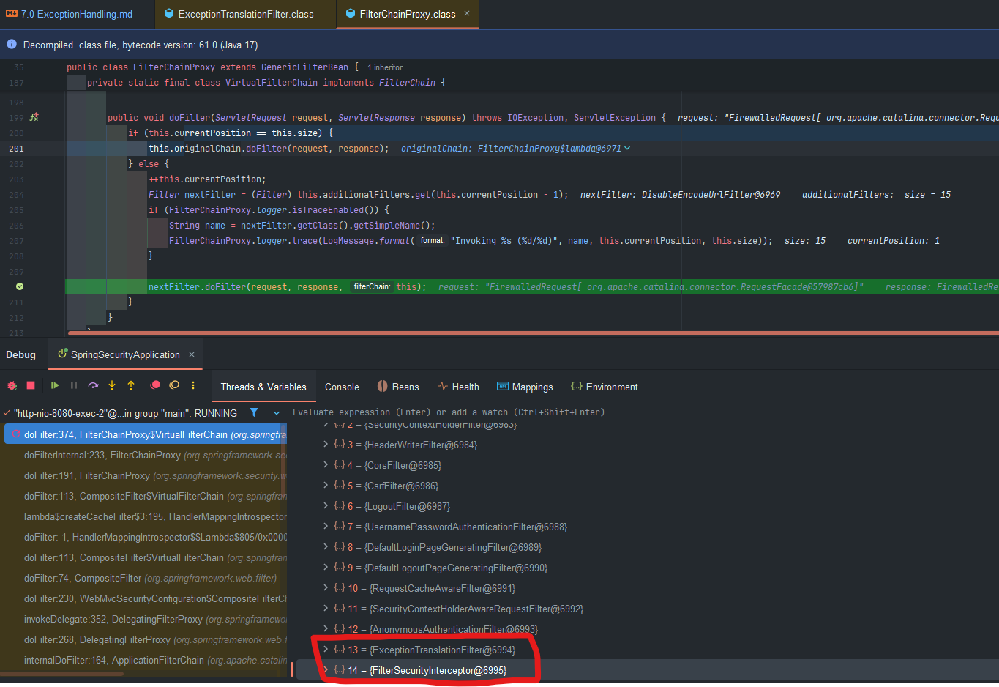

## 예외 처리
예외 처리는 필터 체인 내에서 발생하는 예외를 의미하며 크게 **인증 예외(AuthenticationException)** 과 **인가예외(AccessDeniedException)** 로 나울 수 있다.  
  
예외를 처리하는 필터로서 **Exception TranslationFilter**가 사용 되며 사용자의 인증 및 인가 상태에 따라 로그인 재시도, 401, 403 코드 등으로 응답할 수 있다.  
  
### 예외 처리 유형
스프링 시큐리티에서 exceptionHandling()은 보안 필터 체인 내에서 발생하는 인증(Authentication) 및 인가(Authorization) 관련 예외를 어떻게 처리할지를 설정하는 핵심 메서드입니다.  
  

---
  
### AuthenticationException

보호된 리소스에 인증되지 않은 사용자가 접근할 경우 발생합니다.  

1. **SecurityContext 에서 인증 정보 삭제** - 기존 Authentication이 더 이상 유효하지 않다고 판단하고 Authentication 을 초기화 한다.
2. **AuthenticationEntryPoint 호출:**
   - `AuthenticationException`이 감지되면 필터는 `authenticationEntryPoint`를 실행하고 이를 통해 인증 실패를 공통적으로 처리할 수 있으며 일반적으로 인증을 시도할 수 있는 화면으로 이동한다.(예: HTTP 401)
3. **인증 프로세스의 요청 정보를 저장하고 검색**
   - RequestCache & SavedRequest - 인증 프로세스 동안 전달되는 요청을 세션 혹은 쿠키에 저장
   - 사용자가 인증을 완료한 후 요청을 검색하여 재 사용할 수 있다. 기본 구현 `HttpSessionRequestCache` 이다.
  
---
  
### AccessDeniedException
인증은 되었지만 권한이 부족한 사용자가 접근할 경우 발생합니다.  
  
- `AccessDeniedHandler` 호출
  - `AccessDeniedException`이 감지되면 필터는 사용자가 익명 사용자인지 여부를 판단하고 익명 사용자인 경우 인증예외처리가 실행되고 익명사용자가 아닌 경우 필터는 AccessDeniedHandler 에게 위임한다.
  
  

---
  
### exceptionHandling() API
  
```java
@Bean
    public SecurityFilterChain securityFilterChain(org.springframework.security.config.annotation.web.builders.HttpSecurity http) throws Exception {
        http
            // 예외 처리 설정
            .exceptionHandling(exception -> exception
                // 인증되지 않은 사용자 접근 시 처리 (HTTP 401)
                .authenticationEntryPoint(customAuthenticationEntryPoint())
                // 인증은 되었으나 권한이 없는 경우 처리 (HTTP 403)
                .accessDeniedHandler(customAccessDeniedHandler())
            )
            // 예시로 폼 로그인도 설정 (필요에 따라 추가)
            .formLogin(Customizer.withDefaults());

        return http.build();
```

- **AuthenticationEntryPoint**
    - **역할**: 인증되지 않은 사용자가 보호된 리소스에 접근할 때 호출되어, 인증 절차(예: 로그인 페이지로 리다이렉트하거나 JSON 형태의 에러 응답)를 시작하는 역할을 합니다.
    - **예시**: REST API에서는 주로 HTTP 401 응답을 반환하거나, 웹 애플리케이션에서는 로그인 페이지로 리다이렉트합니다.
    - 인증 프로세스마다 기본적으로 제공되는 설정 클래스들이 설정된다.
      - UsernamePasswordAuthenticationFilter - LoginUrlAuthenticationEntryPoint
      - BasicAuthenticationFilter - BasicAuthenticationEntryPoint
      - 아무런 인증 프로세스가 설정 되지 않으면 기본적으로 Http403ForbiddenEntryPoint
      - 사용자 정의 AuthenticationEntryPoint 구현이 가장 우선적으로 수행되며 이때 기본 로기은 페이지 생성이 무시됨
- **AccessDeniedHandler** 는 기본적으로 `AccessDeniedHandlerImpl` 클래스가 사용
    - **역할**: 인증은 되었으나, 특정 리소스에 접근할 권한이 부족한 경우 호출됩니다.
    - **예시**: 권한 부족 시 HTTP 403 응답을 반환하거나, 사용자 정의 에러 페이지로 이동시킵니다.

---

### 기본 동작 과정

1. **사용자 요청**: 보호된 리소스에 접근 시도
2. **필터 체인 내 예외 감지**:
    - 인증되지 않은 경우 → `AuthenticationEntryPoint` 호출
    - 인증은 되었으나 권한이 부족한 경우 → `AccessDeniedHandler` 호출
3. **예외 처리 결과**:
    - 예를 들어, JSON 응답 혹은 리다이렉트 URL로 응답

즉, ExceptionTranslationFilter가 발생한 예외를 감지한 후, 적절한 핸들러를 통해 사용자에게 에러 상태를 전달합니다.


# **ExceptionTranslationFilter**

스프링 시큐리티의 **필터 체인**에서 보안 예외(`AuthenticationException`, `AccessDeniedException`)가 발생했을 때, 이를 **인증되지 않은 경우**인지 혹은 **권한이 부족한 경우**인지 분류하고 적절한 후속 조치를(인증 요청, 접근 거부 페이지 등) 수행해 주는 필터입니다.

## 1. 주요 기능

1. **AuthenticationException 처리**
    - 인증되지 않은 상태에서 보안 자원(예: `/admin`)에 접근하려고 하면 `AuthenticationException`이 발생합니다.
    - 이때 ExceptionTranslationFilter는 **AuthenticationEntryPoint**를 호출하여 로그인 페이지로 리다이렉트하거나(웹 애플리케이션), 401(UNAUTHORIZED) 에러를 반환하는(REST API) 등의 처리를 수행합니다.
2. **AccessDeniedException 처리**
    - 이미 인증(로그인)은 되었지만, 필요한 권한이 부족한 상태에서 특정 자원에 접근하려 할 경우 `AccessDeniedException`이 발생합니다.
    - ExceptionTranslationFilter는 이를 잡아서 **AccessDeniedHandler**에게 처리를 위임합니다. 기본적으로는 **403(Forbidden) 에러 페이지**를 띄우거나, JSON 형태의 응답을 반환하도록 설정할 수 있습니다.
3. **요청 캐싱 (RequestCache)**
    - 인증이 필요해 로그인 페이지 등으로 리다이렉트된 후, 다시 원래 요청 경로로 돌아올 수 있도록, 미리 요청 정보를 세션 등에 저장할 수 있습니다.
    - 무상태(Stateless) 설정이 아니라면 `RequestCache`(기본 `HttpSessionRequestCache`)에 요청 정보를 잠시 저장하여 **로그인 성공 후** 원래 요청으로 복귀하도록 지원합니다.

---

## 2. 작동 흐름(메커니즘)

### 2.1 필터 체인에서의 위치

스프링 시큐리티의 필터 체인은 대략적으로 다음 순서로 동작합니다(버전에 따라 세부 사항 조금씩 상이):

1. **SecurityContextPersistenceFilter** (시큐리티 컨텍스트 초기화)
2. **Authentication Filters** (예: UsernamePasswordAuthenticationFilter, BasicAuthenticationFilter 등)
3. **SessionManagementFilter** / **ConcurrentSessionFilter** (동시 세션 제어, 세션 생성/관리 등)
4. **`ExceptionTranslationFilter`** ← **(여기서 보안 예외를 후속 처리)**
5. **FilterSecurityInterceptor** (최종 인가 결정. 내부적으로 AccessDecisionManager 호출)
6. 그 외 필터들...

ExceptionTranslationFilter는 **FilterSecurityInterceptor** 전후로 **보안 예외가 발생할 수 있는 구간**을 모니터링합니다.

- `FilterSecurityInterceptor`에서 인증/인가 검사 중 `AccessDeniedException` 혹은 `AuthenticationException`이 발생하면, 이 예외를 `ExceptionTranslationFilter`가 가로채 처리합니다.

  
### 인증, 인가 필터와 ExceptionTranslationFilter가 인접해 있는 이유는?
### Spring Security 필터 체인 개요

Spring Security는 `FilterChainProxy`가 관리하는 여러 **보안 필터**들을 순서에 따라 실행하는 구조를 가집니다. 이 구조는 사실상 **Chain of Responsibility(책임 연쇄)** 패턴으로, 각각의 필터는 특정 보안 작업(인증, 인가, 세션 관리, 예외 처리 등)을 담당하고, 처리가 끝나면 체인의 다음 필터로 요청을 넘깁니다.

> 대표 필터 예시:
>
> - `SecurityContextPersistenceFilter`
> - `ConcurrentSessionFilter`
> - `HeaderWriterFilter`
> - `CsrfFilter`
> - **`ExceptionTranslationFilter`**
> - **`AuthorizationFilter`** (또는 `FilterSecurityInterceptor` 계열)
> - … 등등

버전별로 필터 이름이나 순서가 조금씩 다를 수 있지만, **인가(Authorization)를 체크**하는 필터와 **예외를 처리**하는 필터가 서로 근접해 있는 흐름 자체는 크게 변하지 않습니다.

---

### 2. 인가(Authorization)와 예외 처리(Translation)의 관계

스프링 시큐리티에서 **인가(Authorization)** 과정을 수행할 때, 만약 권한이 없는 사용자가 보호된 자원에 접근하면 `AccessDeniedException`이 발생합니다. 또는 인증되지 않은 사용자가 접근할 경우 `AuthenticationException`이 발생하기도 합니다.

- **AuthorizationFilter** (또는 `FilterSecurityInterceptor`)
    - 실제 인가 로직(AccessDecisionManager 등)을 호출하여 “권한이 충분한지” 확인
    - 만족하지 않으면 `AccessDeniedException`(권한 부족) 또는 `AuthenticationException`(아예 인증 없음) 발생
- **ExceptionTranslationFilter**
    - **인가 과정에서 발생한 예외**(`AccessDeniedException`, `AuthenticationException`)를 받아서 처리
        - 인증이 필요한 경우 → **AuthenticationEntryPoint** 호출(로그인 페이지 유도, 401 응답 등)
        - 권한 부족인 경우 → **AccessDeniedHandler** 호출(403 응답 처리, 에러 페이지 이동 등)

즉, **인가 로직이 예외를 던지고**, **예외 처리 필터**가 그 예외를 잡아 후속 조치를 취하는 구조입니다.

### 결론적으로,

1. **AuthorizationFilter**는 권한이 맞는지 검사 → 예외 발생 지점
2. **ExceptionTranslationFilter**는 발생한 예외를 받아 처리 → 예외 처리 지점

이 두 필터가 서로 **멀리 떨어져** 있으면, 이미 다른 필터에서 예외가 튕겨 나가거나, 혹은 자원 접근 시점에서 예외가 제대로 처리되지 않고 톰캣 기본 오류 페이지가 떠버릴 수도 있습니다.

그래서 Spring Security는 **Authorization**과 **ExceptionTranslation** 단계를 **연접(인접) 시켜**, 접근 권한 검사에서 발생하는 예외를 즉시 `ExceptionTranslationFilter`가 처리하게 합니다.

---

### 3. 실제 흐름 예시 (Spring Security 전형적인 순서)

아래는 과거 버전(5.x)부터 현재(6.x)까지 크게 변하지 않은 주요 필터들의 대략적 순서(일부 필터는 생략)입니다. 버전에 따라 필터 이름이나 위치가 조금씩 다를 수 있습니다.

1. **SecurityContextPersistenceFilter**: SecurityContextHolder를 초기화/복원
2. **(인증용 필터들)**: `UsernamePasswordAuthenticationFilter`, `BasicAuthenticationFilter` 등
3. **SessionManagementFilter**, **ConcurrentSessionFilter**: 세션 관리, 동시 세션 제어 등
4. **ExceptionTranslationFilter**: **예외 처리** (AccessDenied, Authentication)
5. **FilterSecurityInterceptor(=AuthorizationFilter)**: **인가(권한 체크)** 담당
6. 그 외 추가 필터…

> 일부 문서나 버전에서 FilterSecurityInterceptor를 AuthorizationFilter로 명명하거나, 별도 AuthorizationFilter로 분리하기도 합니다.
>

### “ExceptionTranslationFilter가 꼭 인접해 있다?”

- 예전(5.x) 문서 기준: **ExceptionTranslationFilter** → **FilterSecurityInterceptor** 순서로 배치되었다고 명시.
- Spring Security 6+에서는 `AuthorizationFilter`가 기존 `FilterSecurityInterceptor` 역할을 일부 흡수하거나, 구성 방식이 변경되는 케이스가 있지만, “**인가**(Authorization) → **예외**(Exception) 처리”라는 메커니즘은 유사합니다.

### 실제 이유

- 인가 로직(AuthorizationFilter, FilterSecurityInterceptor)에서 예외가 터져야, 바로 다음 단계(또는 바로 앞 단계)에서 **ExceptionTranslationFilter**가 이를 잡고 적절한 처리를 수행하기 때문입니다.
- **너무 앞쪽**에 배치되면 아직 예외가 발생도 안 했는데 예외 처리 필터가 끝나버리고,
- **너무 뒤쪽**에 배치되면 이미 예외가 서블릿 컨테이너(톰캣 등)까지 전달되어 버려, 스프링 시큐리티 차원에서 처리하기 어렵게 됩니다.

---

## 4. 간단한 그림으로 표현

```

   [ ... Other Security Filters ... ]
            v
[ ExceptionTranslationFilter ]
            v
[ AuthorizationFilter or FilterSecurityInterceptor ]
            v
    (AccessDeniedException 발생)
            ^ (예외 전파)
            |
[ ExceptionTranslationFilter (catch the exception, handle) ]
            v
       (Redirect / 403 / etc)

```

1. 요청이 FilterSecurityInterceptor(또는 AuthorizationFilter)에 도달
2. 해당 필터가 “권한 부족” 판정 시 예외 발생
3. 예외가 던져질 때, **ExceptionTranslationFilter**가 catch
4. ExceptionTranslationFilter가 AccessDeniedHandler, AuthenticationEntryPoint 등을 호출하여 처리를 수행

> 실제 소스 레벨로 들어가 보면, FilterSecurityInterceptor가 try-catch 없이 예외를 직접 던지고, 바로 위(또는 옆) 레벨의 ExceptionTranslationFilter가 AccessDeniedException/AuthenticationException를 잡도록 되어 있습니다.
>


### 2.2 처리 로직

1. **FilterSecurityInterceptor** 등에 의해 `AccessDeniedException` 또는 `AuthenticationException`이 던져진다.
2. **ExceptionTranslationFilter**가 이를 try-catch로 감싸 받아 처리한다.
3. 예외 타입에 따라 아래 중 하나를 진행:
    1. **AuthenticationException** → **AuthenticationEntryPoint** 호출
        - 로그인 페이지 리다이렉트, 401 에러 반환 등
        - RequestCache에 원래 요청을 저장했다면, 로그인 성공 후 원래 URL로 복귀 가능
    2. **AccessDeniedException** → **AccessDeniedHandler** 호출
        - 사용자에게 403 에러 페이지 보여주거나, JSON 형태의 `{ "error": "access denied" }` 응답 전송 등

### 2.3 예외 처리 예시

- **인증되지 않은 사용자가 `/admin` 페이지 접근**
    - `AuthenticationException` 발생 → `ExceptionTranslationFilter` → `AuthenticationEntryPoint` → 로그인 페이지(또는 401 Unauthorized).
- **로그인 사용자가 `/admin` 페이지 접근. 그러나 ROLE_ADMIN이 아님**
    - `AccessDeniedException` 발생 → `ExceptionTranslationFilter` → `AccessDeniedHandler` → 403 Forbidden 페이지 또는 커스텀 에러 응답.

---

## 3. 설정 방법

스프링 시큐리티에서 **ExceptionTranslationFilter**를 별도로 Bean 등록할 일은 많지 않지만, 대신에 **`.exceptionHandling()`** 설정을 통해 내부적으로 이 필터를 커스터마이징할 수 있습니다.

### 3.1 예외 처리 설정 예시 (스프링 시큐리티 6+)

Gradle 프로젝트 기준, Spring Boot 3+ 혹은 Spring Security 6+ 사용 시:

```java
@Configuration
@EnableWebSecurity
public class SecurityConfig {

    @Bean
    public SecurityFilterChain securityFilterChain(HttpSecurity http) throws Exception {

        // (1) 인증/인가 설정
        http.authorizeHttpRequests(auth -> auth
                .requestMatchers("/login", "/public/**").permitAll()
                .anyRequest().authenticated()
            )
            // (2) 로그인 폼 설정
            .formLogin(login -> login
                .loginPage("/login")            // 커스텀 로그인 페이지
                .defaultSuccessUrl("/")         // 로그인 성공 시 이동할 페이지
                .permitAll()
            )
            // (3) 예외 처리
            .exceptionHandling(ex -> ex
                // 인증되지 않은 사용자가 보호 자원 접근 시
                .authenticationEntryPoint((request, response, authException) -> {
                    // 예: REST API라면 401을 JSON으로 응답
                    response.sendError(HttpServletResponse.SC_UNAUTHORIZED, "인증이 필요합니다.");
                })

                // 접근 권한이 부족한 사용자가 접근 시
                .accessDeniedHandler((request, response, accessDeniedException) -> {
                    // 예: 일반 웹 페이지라면 403 에러 페이지로 이동
                    response.sendRedirect("/accessDenied");
                })
            );

        return http.build();
    }
}

```

- **`exceptionHandling()`**: 내부적으로 `ExceptionTranslationFilter`를 활성화합니다.
- `.authenticationEntryPoint(...)`: `AuthenticationException`이 발생했을 때의 처리 로직 지정.
- `.accessDeniedHandler(...)`: `AccessDeniedException`이 발생했을 때의 처리 로직 지정.
- 별도의 설정을 하지 않으면 **기본** `LoginUrlAuthenticationEntryPoint`(로그인 페이지 이동)와 `AccessDeniedHandlerImpl`(403 접근 거부 페이지 표시)이 적용됩니다.

### 3.2 AccessDenied 페이지 설정

만약 단순히 403 페이지로 바로 이동시키고 싶다면:

```java
.exceptionHandling(ex -> ex
    .accessDeniedPage("/denied")
)

```

이렇게 작성할 수 있습니다. 내부적으로 `AccessDeniedHandlerImpl`의 `errorPage` 속성을 `/denied`로 설정해 두는 방식입니다.

---

## 4. 내부 구현 (간략)
  

  

```java
public class ExceptionTranslationFilter extends GenericFilterBean {

    private final AuthenticationEntryPoint authenticationEntryPoint;
    private AccessDeniedHandler accessDeniedHandler = new AccessDeniedHandlerImpl();

    @Override
    public void doFilter(ServletRequest request, ServletResponse response, FilterChain chain)
            throws IOException, ServletException {
        try {
            chain.doFilter(request, response); //별다른 작업을 하지 않고 다음 Filter호출(AuthorizationFilter)
        } catch (IOException ex) {
            throw ex;
        } catch (Exception ex) {
            // 1. 예외 타입 검사
            Throwable[] causeChain = this.throwableAnalyzer.determineCauseChain(ex);
            // AuthenticationException 인가?
            AuthenticationException authException = (AuthenticationException)
                   this.throwableAnalyzer.getFirstThrowableOfType(AuthenticationException.class, causeChain);

            if (authException != null) {
                // 2. 인증 예외 처리
                handleSpringSecurityException(request, response, chain, authException);
                return;
            }

            // AccessDeniedException 인가?
            AccessDeniedException accessDeniedException = (AccessDeniedException)
                   this.throwableAnalyzer.getFirstThrowableOfType(AccessDeniedException.class, causeChain);

            if (accessDeniedException != null) {
                // 3. 접근 거부 예외 처리
                handleSpringSecurityException(request, response, chain, accessDeniedException);
                return;
            }

            // 4. 다른 예외라면 그대로 throw
            if (ex instanceof ServletException) {
                throw (ServletException) ex;
            } else if (ex instanceof RuntimeException) {
                throw (RuntimeException) ex;
            } else {
                throw new RuntimeException(ex);
            }
        }
    }

    private void handleSpringSecurityException(
        ServletRequest req, ServletResponse res, FilterChain chain, RuntimeException e)
        throws IOException, ServletException {

        if (e instanceof AuthenticationException) {
            // 1) 인증 예외: AuthenticationEntryPoint 호출
            sendStartAuthentication(req, res, chain, (AuthenticationException) e);
        } else if (e instanceof AccessDeniedException) {
            // 2) 접근 거부 예외
            AccessDeniedException ade = (AccessDeniedException) e;
            // 이미 인증된 상태가 맞는지 여부 확인
            if (SecurityContextHolder.getContext().getAuthentication() == null
                    || !SecurityContextHolder.getContext().getAuthentication().isAuthenticated()) {
                // 인증정보가 없다면 AuthenticationEntryPoint로 보냄
                sendStartAuthentication(req, res, chain, new InsufficientAuthenticationException("Full authentication is required"));
            } else {
                // 인증은 되었으나 권한 부족
                this.accessDeniedHandler.handle(req, res, ade);
            }
        }
    }

    private void sendStartAuthentication(ServletRequest req, ServletResponse res, FilterChain chain,
                                         AuthenticationException authException) throws IOException, ServletException {
        // RequestCache에 요청정보 저장(세션 등)
        if (this.requestCache != null) {
            this.requestCache.saveRequest((HttpServletRequest) req, (HttpServletResponse) res);
        }
        // AuthenticationEntryPoint 호출
        this.authenticationEntryPoint.commence(req, res, authException);
    }
}

```

위 코드는 단순화/발췌본이며, 핵심 로직은 다음과 같이 요약됩니다:

1. **체인 실행 중** 예외가 발생하면 **`ThrowableAnalyzer`*로 예외의 원인(`causeChain`)을 분석합니다.
2. **`AuthenticationException`** 발견 시 → **`AuthenticationEntryPoint`*를 호출하여 인증 절차로 유도.
3. **`AccessDeniedException`** 발견 시 → 현재 사용자가 인증되었는지 확인 후,
    - 인증되지 않은 상태면 다시 로그인(인증) 로직으로 유도
    - 인증되었으나 권한이 부족하다면 `AccessDeniedHandler`로 처리 (403 에러 등)
4. **그 외 예외**는 필터가 직접 처리할 대상이 아니므로 재던짐(throw).

---

## 5. 예외 발생 시 시나리오

1. **인증되지 않은 사용자 → `/secure` 접근**
    - `FilterSecurityInterceptor`에서 필요 권한 체크 → `SecurityContextHolder`에 인증 정보가 없으므로 `AuthenticationException`(InsufficientAuthenticationException) 발생
    - `ExceptionTranslationFilter`가 잡아 `AuthenticationEntryPoint` 실행
    - `HttpSessionRequestCache`에 요청 정보를 저장 후 로그인 페이지(`/login`)로 이동
2. **인증된 사용자(ROLE_USER) → `/admin` 접근**
    - `FilterSecurityInterceptor`에서 `ROLE_ADMIN` 요구
    - 현재 권한 부족 → `AccessDeniedException` 발생
    - `ExceptionTranslationFilter`가 잡아 `AccessDeniedHandler` 실행
    - `AccessDeniedHandlerImpl` 사용 시 403 에러 페이지로 이동

---

## 6. 예외 발생 시 해결 방법

1. **`AuthenticationEntryPoint`가 null이어서 `NullPointerException` 발생**
    - 발생 위치: `ExceptionTranslationFilter.sendStartAuthentication(...)`에서 `this.authenticationEntryPoint.commence(...)` 호출 시
    - 해결 방법: `.exceptionHandling().authenticationEntryPoint(...)`로 인증 진입 지점을 정확히 설정하거나, 기본 로그인 페이지 설정을 해둬야 합니다.
2. **`AccessDeniedHandler`가 null 혹은 커스텀 로직 미설정으로 인한 에러**
    - 발생 위치: `handleSpringSecurityException()` 내 `this.accessDeniedHandler.handle(...)` 호출 시
    - 해결 방법: `.exceptionHandling().accessDeniedHandler(...)`를 통해 명시적으로 등록 또는 `.accessDeniedPage("/403")` 등으로 지정합니다.
3. **REST API인데 기본 설정으로 인해 HTML 기반 에러 페이지가 반환**
    - Default `LoginUrlAuthenticationEntryPoint`는 **HTML 리다이렉트**를 수행합니다.
    - 해결 방법: `.authenticationEntryPoint((req, res, ex) -> res.sendError(HttpServletResponse.SC_UNAUTHORIZED))` 식으로 **JSON 응답** 또는 401만 떨어뜨리도록 커스터마이징.

---

## 7. 활용 팁

- **REST API**라면 `.authenticationEntryPoint((req,res,ex)->...)`와 `.accessDeniedHandler((req,res,ex)->...)`를 **직접 람다로 구현**하여 401/403 JSON 또는 메시지를 보내도록 커스터마이징하세요.
- **브라우저 기반 웹**은 `.formLogin()`이나 `.loginPage()`, `.accessDeniedPage()` 등을 설정해 좀 더 친화적인 UI를 제공할 수 있습니다.
- **RequestCache**를 통한 원래 요청 복귀 로직은 세션이 필요하므로, 무상태(STATELESS) 애플리케이션에는 적용되지 않습니다.
- **동시 세션 제어나 세션 만료**와는 직접 연관이 없지만, **인가 과정 중** 예외가 발생했을 때 후속 조치를 담당하므로, **SessionManagementFilter** → **ConcurrentSessionFilter** → **ExceptionTranslationFilter** → **FilterSecurityInterceptor** 순서 및 역할을 함께 이해하면 좋습니다.

---

## 8. 최종 정리

1. *`ExceptionTranslationFilter`*는 스프링 시큐리티 필터 체인에서 **보안 예외 처리**를 담당한다.
2. **인증 관련 예외**(`AuthenticationException`) 시 → **AuthenticationEntryPoint**로 유도(로그인 페이지 리다이렉트, 401 응답 등).
3. **권한 관련 예외**(`AccessDeniedException`) 시 → **AccessDeniedHandler**로 권한 부족 처리(403 Forbidden 에러 페이지 등).
4. `.exceptionHandling()` 설정을 통해 ExceptionTranslationFilter 내부 로직(EntryPoint, DeniedHandler)을 쉽게 커스터마이징 가능하다.
5. 세션 기반 요청이라면 **RequestCache**를 사용해 인증 후 이전 요청으로 복귀할 수 있고, **Stateless** 환경에서는 보통 JWT나 토큰 인증과 함께 JSON 에러(401, 403)로 대응한다.
6. 예외가 발생하는 지점(FilterSecurityInterceptor, 메서드 보안 등)에서 던져진 예외를 ExceptionTranslationFilter가 가로채어 최종 처리를 하므로, 정확한 **EntryPoint**와 **DeniedHandler** 설정이 중요하다.

위 내용을 기반으로, 웹 애플리케이션/REST API에서 로그인/권한 문제를 어떻게 처리해야 하는지 **ExceptionTranslationFilter**의 동작 방식을 이해하고 적절히 설정하시면 됩니다.

---

### 추가 Java 코드 (디자인 패턴 응용 예시)

스프링 시큐리티 필터 체인은 전형적인 **Chain of Responsibility(책임 연쇄)** 패턴을 사용합니다. 예외 처리는 **Strategy(전략)** 패턴처럼 **AuthenticationEntryPoint**와 **AccessDeniedHandler**를 **교체 가능**한 방식으로 제공하고 있습니다.

> **Chain of Responsibility(책임 연쇄) 패턴**  
> **GoF 디자인 패턴** 중 하나로, **하나 이상의 요청 처리 객체를 체인(연쇄)으로 묶어서** 순서대로 요청을 처리하도록 하는 패턴입니다. 클라이언트(Client)가 요청(Request)을 하면, 이 요청은 체인에 속한 각 핸들러(Handler)를 차례대로 거쳐 가면서 처리 가능 여부를 검사하게 됩니다.
> - **핵심 아이디어**
    - 요청을 처리할 수 있는 핸들러가 누구인지 명시하지 않고, 여러 핸들러를 일렬로 연결한다(연쇄).
    - 각 핸들러는 **“내가 처리할 수 있으면 처리”**하고, 그렇지 않으면 **다음 핸들러로 넘긴다**.
    - 클라이언트는 어떤 핸들러가 실제로 처리하는지 모른 채, 체인에 요청만 전달하면 된다.  
> 
> 이 패턴을 사용하면 **결합도**가 줄어들고, **확장성**이 높아집니다. 새로운 핸들러를 추가할 때 기존 핸들러 코드를 크게 수정할 필요 없이 체인에만 삽입하면 되기 때문입니다.


```java
@Slf4j
@Component
public class CustomAccessDeniedHandler implements AccessDeniedHandler {

    @Override
    public void handle(HttpServletRequest request, HttpServletResponse response,
                       AccessDeniedException accessDeniedException) throws IOException {

        // 접근 권한 없음 로그
        log.error("[CustomAccessDeniedHandler] 접근 권한이 없습니다. 메시지: {}", accessDeniedException.getMessage());

        // 403 에러 페이지 또는 JSON 반환
        response.sendError(HttpServletResponse.SC_FORBIDDEN, "접근 권한이 없습니다.");
    }
}

```

```java
@Slf4j
@Component
public class CustomAuthenticationEntryPoint implements AuthenticationEntryPoint {

    @Override
    public void commence(HttpServletRequest request, HttpServletResponse response,
                         AuthenticationException authException) throws IOException {

        log.error("[CustomAuthenticationEntryPoint] 인증이 필요한 요청입니다. 메시지: {}", authException.getMessage());
        response.sendError(HttpServletResponse.SC_UNAUTHORIZED, "인증이 필요합니다.");
    }
}

```

```java
@Configuration
@EnableWebSecurity
public class SecurityConfig {

    @Bean
    public SecurityFilterChain securityFilterChain(HttpSecurity http,
                                                   CustomAccessDeniedHandler accessDeniedHandler,
                                                   CustomAuthenticationEntryPoint authEntryPoint) throws Exception {
        http
            .authorizeHttpRequests(authorize -> authorize
                .requestMatchers("/login", "/error").permitAll()
                .anyRequest().authenticated()
            )
            .formLogin(Customizer.withDefaults())
            .exceptionHandling(ex -> ex
                .accessDeniedHandler(accessDeniedHandler)
                .authenticationEntryPoint(authEntryPoint)
            );

        return http.build();
    }
}

```

- 위와 같은 식으로 **AccessDeniedHandler**와 **AuthenticationEntryPoint**를 직접 구현(전략 패턴)한 뒤, `SecurityFilterChain` 설정 시 주입하면, 예외 발생 시 **ExceptionTranslationFilter**가 두 전략으로 분기하여 보안 예외를 처리합니다.

---

> 정리
>
> - **ExceptionTranslationFilter**는 인증/인가 과정에서 발생하는 예외를 최종적으로 처리(로그인 유도 or 403 에러)하는 핵심 필터입니다.
> - `.exceptionHandling()` 구성 요소(EntryPoint, DeniedHandler)를 알맞게 설정하거나 커스터마이징하면, 원하는 방식으로 보안 예외 대응 로직을 구현할 수 있습니다.
> - 세션 기반 애플리케이션에서는 RequestCache와 함께 로그인 후 원래 페이지로 돌아가는 기능도 쉽게 붙일 수 있습니다.
> - REST API 환경에서는 HTML이 아닌 JSON/에러 코드를 던지는 식으로 커스터마이징하여, 사용자/클라이언트가 에러 상태를 명확히 인지할 수 있도록 해주어야 합니다.