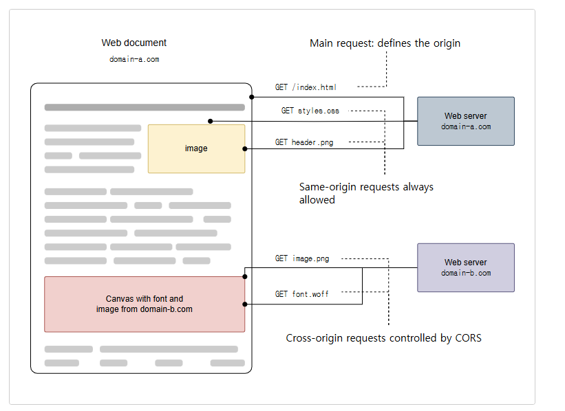
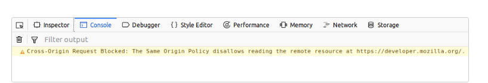

## CORS

스프링 시큐리티에서 CORS 설정은 **웹 애플리케이션**이나 **REST API**가 서로 다른 출처(Origin)에서 요청을 받을 때, 보안상 제한 사항을 완화하도록 도와줍니다.

아래에서는 CORS의 개념부터 스프링 시큐리티에서의 통합 설정, 내부 동작 방식, 그리고 최신 JDK/스프링 부트 환경에서의 예제 코드와 함께 자세하게 설명하겠습니다.

---

## 1. CORS(Cross-Origin Resource Sharing)란?

- **기본 개념**:

  기본적으로 한 웹페이지(출처A)에서 다른 웹페이지(출처B)의 데이터를 직접 불러오는 것을 제한하는데  이를 **동일 출처 정책(Same-Origin Policy)**이라고 한다.

  웹 브라우저는 **동일 출처 정책(Same-Origin Policy)**을 기본으로 하여, 다른 도메인, 프로토콜, 혹은 포트의 리소스 요청을 제한합니다.

  CORS는 서버가 특정 출처에 대해 리소스를 접근을 허용할 수 있도록 **HTTP 헤더**를 통해 한 웹페이지가 다른 출처의 리소스에게 접근할 수 있도록 `허가` 를 구하는 방법이라 할 수 있다.

  즉, 다른 출처의 리소스를 사용하고자 할때 브라우저가 그 요청을 대신해서 해당 데이터를 사용해도 되는지 다른 출처에게 물어보는 것이라고 할 수 있다.

  이 출처를 비교하는 로직은 서버에 구현된 스펙이 아닌 브라우저에 구현된 스펙 기준으로 처리되며 브라우저는 클라이언트의 요청(출처 A) 헤더와 서버(출처 B)의 응답헤더를 비교해서 최종 응답을 결정한다.

  비교 방법은 URL의 구성요소 중 **Protocol, Host, Port 이 세가지가 동일한지 확인하면 되고 나머지는 틀려도 상관 없다.**

- **주요 목적**:
   - **보안 유지**: 악의적인 도메인에서의 무분별한 요청을 차단
   - **유연성 제공**: REST API나 SPA(Single Page Application) 등에서 다양한 출처의 클라이언트와 안전하게 통신할 수 있도록 지원


   

  

이미지 출처: https://developer.mozilla.org/ko/docs/Web/HTTP/Guides/CORS/Errors  
  
* **domain-a.com**의 프론트 엔드 Javascript 코드가 **XMLHttpRequest**를 사용하여 리소스에 접근시, 브라우저는 스크립트에 시작한 교차 출처 HTTP 요청을 제한한다.
* **XMLHttpRequest**와 **Fetch API**는 동일 출처 정책을 따르기 때문에 해당 API를 사용하는 웹 애플리케이션은 자신의 출처와 동일한 리소스만 불러올 수 있으며, 다른 출처의 리소스를 불러오려면 그 출처에 올바른 CORS 헤더를 포함한 응답을 반환해야 한다.

---

## 2. CORS의 종류

CORS 요청은 클라이언트(브라우저)와 서버 간에 발생하는 교차 출처 요청의 특성에 따라 여러 유형으로 나뉩니다. 각각의 유형은 브라우저가 요청을 보내기 전이나 보내는 방식에 차이가 있으며, 이에 따라 서버에서의 CORS 정책 적용도 달라집니다.

---

## 2.1. 단순 요청 (Simple Request)

- **조건**
   - HTTP 메서드가 GET, HEAD, 또는 POST여야 합니다.
   - POST의 경우, Content-Type은 `application/x-www-form-urlencoded`, `multipart/form-data`, `text/plain` 중 하나여야 합니다.
   - 헤더는 Accept, Accept-Language, Content-Language, Content-Type, DPR, DownLink, Save-Data, Viewport-Width Width만 가능
     - 커스텀 헤더나 기타 안전하지 않은 헤더가 포함되지 않아야 합니다.
- **특징**
   - 브라우저는 별도의 Preflight(예비) 요청 없이 바로 실제 요청을 전송합니다.
   - 서버는 단순 요청에 대해 CORS 응답 헤더(예: `Access-Control-Allow-Origin`)만 포함하면 됩니다.
- **예시**
   - 일반적인 GET 요청 또는 위 조건을 만족하는 POST 요청

---

## 2.2. 예비 요청 (Preflight Request)

- **조건**
   - HTTP 메서드가 GET, HEAD, POST 외의 메서드(PUT, DELETE, PATCH 등)를 사용하거나,
   - 요청 헤더에 커스텀 헤더(예: `X-Custom-Header`) 또는 Content-Type이 위에서 언급한 단순 타입이 아닌 경우
- **특징**
   - 브라우저는 실제 요청 전에 OPTIONS 메서드를 사용하여 **예비 요청**(Preflight Request)을 보냅니다.
   - 이 OPTIONS 요청은 서버에게 실제 요청을 보내도 되는지(CORS 정책에 따라 허용 여부)를 미리 확인하는 용도입니다.
   - 서버가 올바른 CORS 응답 헤더(예: `Access-Control-Allow-Methods`, `Access-Control-Allow-Headers`, `Access-Control-Allow-Origin`)를 반환하면, 브라우저는 실제 요청을 전송합니다.
- **예시**
   - PUT 요청, DELETE 요청 또는 커스텀 헤더를 포함하는 POST 요청
  
>HTTP 메서드: OPTIONS  
> HTTP의 OPTIONS 메서드는 클라이언트가 서버에 대해 지원하는 HTTP 메서드를 질의하는 데 사용됩니다. 이는 주로 `CORS(Cross-Origin Resource Sharing)`에서 프리플라이트 요청(Preflight Request)으로 사용됩니다.
 
 
 ### 2.3 CORS 해결 - 서버에서 Access-Control-Allow-*
- **Access-Control-Allow-Origin**: 헤더에 작성된 출처만 브라우저가 리소스를 접근할 수 있도록 허용한다.
  - *, https:sample.io
- **Access-Control-Allow-Method**: Preflight Request 에 대한 응답으로 실제 요청 중에서 사용할 수 있는 메서드를 나타낸다.
  - 기본값은 GET, POST, HEAD, OPTIONS, *
- **Access-Control-Allow-Headers**: Preflight Request 에 대한 응답으로 실제 요청 중에서 사용할 수 있는 **헤더 필드**를 나타낸다.
  - 기본값은 Origin, Accept, X-Requested-With, Content-Type, Access-Control-Request, Method, Access-Control-Request-Header, Custom Header, *
- **Access-Control-Allow-Credentials**: 실제 요청에 쿠키나 인증 등의 사용자 자격 증명이 포함될 수 있음을 나타낸다, `Client`의 `credentials:include` 옵션일 경우 `true`는 필수
- **Access-Control-Max-Age**: Preflight 요청 결과를 캐시 할 수 있는 시간을 나타내는 것으로 해당 시간동안은 Preflight 요청을 다시 하지 않게 된다.

## 3. Spring Security에서의 CORS 설정

스프링 시큐리티는 기본적으로 CORS 관련 처리를 지원합니다.

이때 `CORS`의 사전 요청에는 쿠키(JSESSIONID)가 포함되어 있지 않기 때문에 Spring Security 이전에 처리되어야 한다.

만약 Spring MVC 에 해당 CORS 기능을 구현하게 되면 사전 요청에 쿠키가 없고 Spring Security가 먼저 처리되면 해당요청은 사용자가 인증되지 않았다고 판단하고 거부할 수 있다.  
  
따라서 CORS가 먼저 처리되도록 하기 위해서 CorsFilter를 사용할 수 있으며 CorsFilter에 CorsConfiguration를 제공함으로써 Spring Security와 통합할 수 있다.

`HttpSecurity` 설정에서 `.cors()`를 활성화하면, 스프링은 애플리케이션 컨텍스트 내에 존재하는 `CorsConfigurationSource` 빈을 찾아 CORS 정책을 적용합니다.

- **설정 포인트**:
   - **HttpSecurity.cors()**: 시큐리티 필터 체인 내에서 CORS 처리 필터를 등록
   - **CorsConfigurationSource**: CORS 정책(허용 출처, HTTP 메서드, 헤더 등)을 제공하는 전략 빈
   - **CSRF와의 관계**: REST API에서는 주로 CSRF를 비활성화하는 경우가 많은데, CORS와 함께 사용 시 주의가 필요합니다.
  
---

## 3. 내부 동작 방식 및 처리 흐름

1. **요청 진입**
   - 클라이언트가 cross-origin 요청을 보내면, 브라우저는 **Preflight 요청(OPTIONS)**을 먼저 전송합니다.
2. **CorsFilter 적용**
   - 스프링 시큐리티는 `http.cors()` 활성화를 통해 `CorsFilter`를 필터 체인에 등록합니다.
   - `CorsFilter`는 요청의 `Origin` 헤더와 메서드, 헤더 정보를 `CorsConfigurationSource`를 통해 설정된 정책과 비교합니다.
3. **CORS 검증 및 응답**
   - **허용**: 요청의 `Origin`이 허용된 목록에 있다면, 적절한 `Access-Control-Allow-*` 헤더를 응답에 추가하고, 실제 요청으로 진행시킵니다.
   - **비허용**: 허용되지 않은 출처의 경우, 브라우저는 요청 자체를 차단하게 됩니다.
4. **시큐리티 필터 체인 연계**
   - CORS 검증이 완료되면, 이후 필터(예: 인증, 인가 필터)가 실행되며 정상적인 보안 검증 로직이 진행됩니다.
   - **순서**: `CorsFilter`는 보통 인증 필터보다 앞쪽에 위치하여, CORS 관련 문제가 발생하기 전에 미리 처리됩니다.

---

## 4. Spring Security CORS 설정 예제 (Spring Boot 3 / Spring Security 6+)

Gradle 기반의 최신 프로젝트에서, 스프링 시큐리티와 함께 CORS를 설정하는 예제입니다.

```java
import org.springframework.context.annotation.Bean;
import org.springframework.context.annotation.Configuration;
import org.springframework.security.config.Customizer;
import org.springframework.security.config.annotation.web.configuration.EnableWebSecurity;
import org.springframework.security.config.annotation.web.builders.HttpSecurity;
import org.springframework.security.web.SecurityFilterChain;
import org.springframework.web.cors.CorsConfiguration;
import org.springframework.web.cors.CorsConfigurationSource;
import org.springframework.web.cors.UrlBasedCorsConfigurationSource;

import java.util.List;

@Configuration
@EnableWebSecurity
public class SecurityConfig {

    @Bean
    public SecurityFilterChain securityFilterChain(HttpSecurity http,
                                                   CustomAccessDeniedHandler accessDeniedHandler,
                                                   CustomAuthenticationEntryPoint authEntryPoint) throws Exception {
        http
            // 1. CORS 설정 활성화 (CorsFilter가 필터 체인에 추가됨)
            .cors(Customizer.withDefaults())
            // 2. CSRF 비활성화 (주로 REST API에서는 사용하지 않음)
            .csrf(csrf -> csrf.disable())
            // CORS 설정
            .csrf(csrf -> csrf.configurationSource(corsConfigurationSource()))
            // 3. 인가 설정
            .authorizeHttpRequests(authorize -> authorize
                .requestMatchers("/login", "/error").permitAll()
                .anyRequest().authenticated()
            )
            // 4. 폼 로그인 등 기타 설정
            .formLogin(Customizer.withDefaults())
            // 5. 예외 처리 (인증/인가 실패시 처리)
            .exceptionHandling(ex -> ex
                .accessDeniedHandler(accessDeniedHandler)
                .authenticationEntryPoint(authEntryPoint)
            );

        return http.build();
    }

    // CORS 정책 설정을 위한 CorsConfigurationSource 빈 등록
    @Bean
    public CorsConfigurationSource corsConfigurationSource() {
        CorsConfiguration config = new CorsConfiguration();
        // 허용할 출처를 명시 (실제 운영 환경에서는 신뢰할 수 있는 출처만 설정)
        config.setAllowedOrigins(List.of("https://example.com", "http://localhost:3000"));
        // 허용할 HTTP 메서드 설정
        config.setAllowedMethods(List.of("GET", "POST", "PUT", "DELETE", "OPTIONS"));
        // 허용할 헤더 설정
        config.setAllowedHeaders(List.of("*"));
        // 인증 정보(쿠키 등) 허용 여부
        config.setAllowCredentials(true);

        // 모든 경로에 대해 위 CORS 정책을 적용
        UrlBasedCorsConfigurationSource source = new UrlBasedCorsConfigurationSource();
        source.registerCorsConfiguration("/**", config);

        return source;
    }
}

```

> 설명:
>
> - **.cors(Customizer.withDefaults())**: 스프링 시큐리티가 내부적으로 등록한 `CorsFilter`가 `CorsConfigurationSource`를 통해 설정된 정책을 읽어 적용합니다.
> - **CorsConfigurationSource**: 개발자가 원하는 출처, 메서드, 헤더, 그리고 인증 정보 허용 여부를 설정하여 CORS 정책을 유연하게 관리할 수 있습니다.