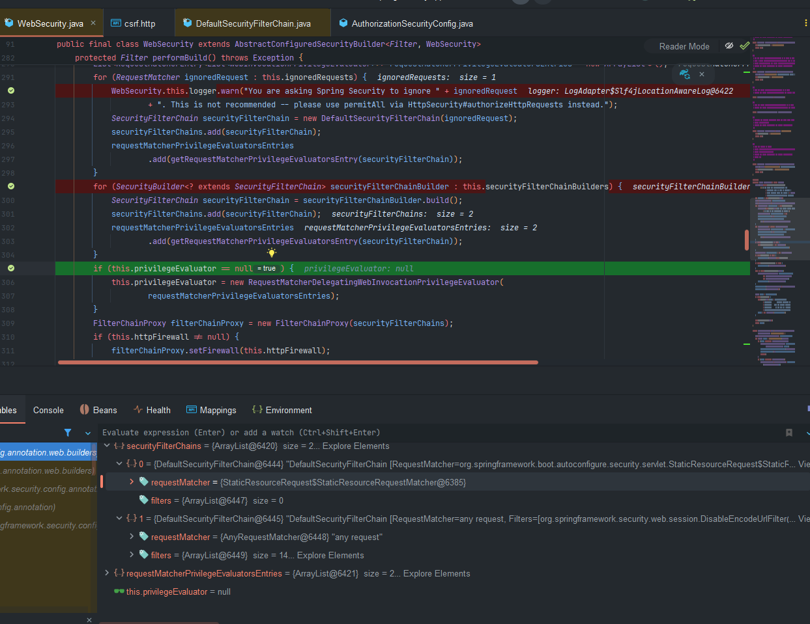

## 정적 자원 보호
스프링 시큐리티에서 RequestMatcher 인스턴스를 등록하여 무시해야할 요청을 지정할 수 있다.  
  
주로 정적자원(이미지, CSS, JavaScript)에 대한 요청이나 특정 엔드포인트가 보안 필터를 거치지지 않도록 설정할 때 사용된다.  
  
### 사용 방법
```java
@Bean
public WebSecurityCustomizer webSecurityCustomizer(){
    return (webSecurity) -> {
        webSecurity.ignoring().requestMatchers(PathRequest.toStaticResources().atCommonLocations());
    };
    
}


```
  
**StaticResourceLocation**  
```java 
CSS("/css/**"),
    
JAVA_SCRIPT("/js/**"),
    
IMAGES("/images/**"),
    
WEB_JARS("/webjars/**"),
    
FAVICON("/favicon.*", "/*/icon-*");

```
  
### ignoring 보다 permitAll 권장
```java
   http
        .authorizeHttpRequests(authorize -> authorize
        .requestMatchers("/css/**","/js/**","/images/**","/webjars/**","/favicon.*", "/*/icon-*").permitAll()
        .requestMatchers(PathRequest.toStaticResources().atCommonLocations()).permitAll()
        .anyRequest().authenticated());
```
이전에는 **모든 요청마다 세션을 확인해야 해서 성능 저하**가 있었지만, 시큐리티 6부터 권한 부여 규칙에서 필요한 경우를 제외하고느 세션을 확인하지 않는다.  
  
성능 문제가 해결되었기 때문에 모든 요청에 대해서 permitAll 을 사용할 것을 권장하며 정적 자원에 대한 요청일지라도 안전한 헤더를 작성할 수 있어서 더 안전한다.

>  보안 헤더 적용  
> Spring Security가 자동으로 추가하는 중요한 보안 헤더들:  
> - **X-Content-Type-Options**: MIME 스니핑 방지
> - **X-Frame-Options**: 클릭재킹 공격 방지
> - **X-XSS-Protection**: 크로스 사이트 스크립팅 공격 방지
> - **Content-Security-Policy**: 컨텐츠 보안 정책 설정
> - **Cache-Control**: 브라우저 캐싱 제어
> - **Strict-Transport-Security (HSTS)**: HTTPS 강제 적용  

## 왜 permitAll이 더 권장되는가?

1. **보안성 향상**:
    - 정적 자원에도 보안 헤더가 적용되어 전체적인 보안 수준 상승
    - XSS, 클릭재킹 등 다양한 웹 공격으로부터 보호 가능
2. **성능 문제 해결**:
    - Spring Security 6에서는 효율적인 필터 처리로 성능 오버헤드 해결
    - 세션 확인 최적화로 불필요한 세션 조회 제거
3. **일관성 있는 보안 정책**:
    - 모든 응답에 일관된 보안 정책을 적용할 수 있음
    - 애플리케이션 전체의 보안 구성을 단순화
  
### 구현코드  
```java
    @Bean
    public WebSecurityCustomizer webSecurityCustomizer() {
        return (web) -> {
            web.ignoring().requestMatchers(PathRequest.toStaticResources().atCommonLocations());
        };
    }


    @Bean
    public SecurityFilterChain securityFilterChain(HttpSecurity http, ApplicationContext context) throws Exception {

        http
                .authorizeHttpRequests(authorize -> authorize
                        .anyRequest().permitAll())
                .formLogin(Customizer.withDefaults())
                .csrf(AbstractHttpConfigurer::disable);

        return http.build();
    }

```


`SecurityFilterChain`내부 적으로  
```java
public final class DefaultSecurityFilterChain implements SecurityFilterChain {

    private static final Log logger = LogFactory.getLog(DefaultSecurityFilterChain.class);

    private final RequestMatcher requestMatcher;

    private final List<Filter> filters;
}
```
`requestMatcher` 와 `filters` 정보를 가지고 있어서 클라이언트의 요청에따라 적절하게 처리해야할 필터를 판단할 수 있다. 그리고 이 필터 체인을 사용하는 클레스가 FilterChainProxy 클레스이다.  
그래서 내부적으로 생성할때  
```java
@Override
	protected Filter performBuild() throws Exception {
    Assert.state(!this.securityFilterChainBuilders.isEmpty(),
            () -> "At least one SecurityBuilder<? extends SecurityFilterChain> needs to be specified. "
                    + "Typically this is done by exposing a SecurityFilterChain bean. "
                    + "More advanced users can invoke " + WebSecurity.class.getSimpleName()
                    + ".addSecurityFilterChainBuilder directly");
    int chainSize = this.ignoredRequests.size() + this.securityFilterChainBuilders.size();
    List<SecurityFilterChain> securityFilterChains = new ArrayList<>(chainSize);
    List<RequestMatcherEntry<List<WebInvocationPrivilegeEvaluator>>> requestMatcherPrivilegeEvaluatorsEntries = new ArrayList<>();
    for (RequestMatcher ignoredRequest : this.ignoredRequests) {
        WebSecurity.this.logger.warn("You are asking Spring Security to ignore " + ignoredRequest
                + ". This is not recommended -- please use permitAll via HttpSecurity#authorizeHttpRequests instead.");
        SecurityFilterChain securityFilterChain = new DefaultSecurityFilterChain(ignoredRequest);
        securityFilterChains.add(securityFilterChain);
        requestMatcherPrivilegeEvaluatorsEntries
                .add(getRequestMatcherPrivilegeEvaluatorsEntry(securityFilterChain));
    }
   for (SecurityBuilder<? extends SecurityFilterChain> securityFilterChainBuilder : this.securityFilterChainBuilders) {
      SecurityFilterChain securityFilterChain = securityFilterChainBuilder.build();
      securityFilterChains.add(securityFilterChain);
      requestMatcherPrivilegeEvaluatorsEntries
              .add(getRequestMatcherPrivilegeEvaluatorsEntry(securityFilterChain));
   }
    //....
}

```  
  
위에서 보면 우리가 자바에서 설정한 빈들이 등록되어 있는 것을 확인할 수 있고   

여기서 첫번째에는 requestMatcher 속성은 존재하지만 필터 속성이 존재하지 않는 것을 확인할 수 있다.  
  
이는 만약 사용자의 요청이 해당 경로 부합하게 된다면 이에 해당하는 필터를 가져와서 요청을 처리하기 되는데 이때 필터가 존재하지 않기때문에 필터에 대한 보안처리를 할 수 없다.  
  
따라서 위에서 permitAll을 사용하는 이유중 하나가 된다.
  
  
### 그러면 왜 permitAll 인가
**RequestMatcherDelegatingAuthorizationManager**인가를 담당하는 해당 클레스에서 인가에 처리를 진행하게 된다.  
  
이때 `manager.check`를 보면 많은 구현체가 있고 이중 하나만 들어가서 확인해 봐도 알 수 있다.  
```java
	@Override
	public AuthorityAuthorizationDecision check(Supplier<Authentication> authentication,
			Collection<String> authorities) {
		boolean granted = isGranted(authentication.get(), authorities);
		return new AuthorityAuthorizationDecision(granted, AuthorityUtils.createAuthorityList(authorities));
	}

```
이 check 메서드의 인자값의 객체를 불러오기 위해서는, 정상적으로 인증을 받았다면 해당 객체 정보들은 `SecurityContext`안에 있고 이 컨텍스트는 세션에 존재하게 되는데  
  
스프링 시큐리티 최신버전 부터는 이 실행이 지연되었다 하더라도 이 처리를 하는데에는 많은 리소스가 사용되게 된다.(물론 이전 버전에서는 이 지연되는 코드 조차 없었다.)  
  
하지만 최신 스프링 시큐리티 permitAll은 최종적으로는 실제 세션에 정보를 가져오는 것이 아니라   `new AuthorizationDecision(true);` 해당 코드를 통해 세션을 통한 작업 자체가 없기 때문이다(오버헤드가 없다).
```java 

public final class AuthorizeHttpRequestsConfigurer<H extends HttpSecurityBuilder<H>>
		extends AbstractHttpConfigurer<AuthorizeHttpRequestsConfigurer<H>, H> {

    static final AuthorizationManager<RequestAuthorizationContext> permitAllAuthorizationManager = (a,
                                                                                                    o) -> new AuthorizationDecision(true);
}
```
