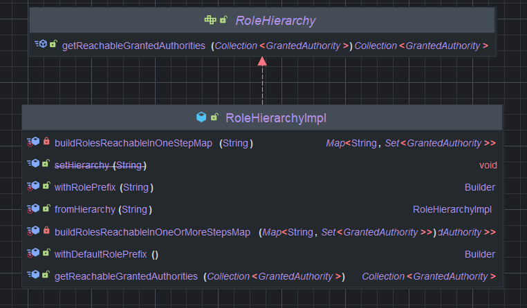

## 계층적 권한
기본적으로 스프링 시큐리티에서 권한과 역할은 계층적이거나 상화관계로 구분하지 않는다.  

스프링 시큐리티에서는 기본적으로 권한과 역할이 동등한 수준으로 취급됩니다. 즉, 기본 설정에서는 하나의 권한이 다른 권한을 자동으로 포함하지 않습니다. 예를 들어:

- 사용자에게 'ROLE_ADMIN' 역할이 있다고 해서 자동으로 'ROLE_USER' 권한을 가지는 것은 아닙니다.
- 각 권한은 독립적으로 관리되며, 사용자는 필요한 모든 권한을 명시적으로 부여받아야 합니다.

이러한 설계는 단순하고 명확하지만, 권한 관리가 복잡해지는 단점이 있습니다.
그래서 인증 주체가 다양한 역할과 권한을 부여받아야한다. `RoleHierarchy`는 역할 간의 계층 구조를 정의하고 관리하는데 사용되며, 역할 간의 계층 구조를 설정하고 이를 기반으로 사용자에 대한 엑세스 규칙을 정의할 수 있다.  

### Role Hierarchy 구조
  

**1. setHierarchy(String roleHierarchyStringRepresentation)**

**기능**: 역할 계층 구조를 문자열로 설정합니다.

**2. getReachableGrantedAuthorities(Collection<? extends GrantedAuthority> authorities)**

**기능**: 모든 도달 가능한 권한의 배열을 반환한다.

여기서 도달 가능한 권한은 직접 할당된 권한에 더해 역할 계층에서 이들로부터 도달 가능한 모든 권한을 의미한다.


### Role Hierarchy(역할 계층) 개념

`RoleHierarchy`는 이러한 한계를 극복하기 위해 도입된 기능으로, 역할 간의 계층 구조를 정의할 수 있게 해줍니다. 역할 계층을 사용하면:

1. 상위 역할이 하위 역할의 모든 권한을 자동으로 상속받습니다.
2. 권한 체계를 더 직관적이고 관리하기 쉽게 구성할 수 있습니다.
3. 사용자에게 불필요하게 많은 권한을 명시적으로 부여하지 않아도 됩니다.
  
```java


   /**
     * 역할 계층 구조 정의
     */
    @Bean
    public RoleHierarchy roleHierarchy() {
        RoleHierarchyImpl roleHierarchy = new RoleHierarchyImpl();
        // 계층 구조 문자열 설정
        // ADMIN > MANAGER, MANAGER > USER 의미
        roleHierarchy.setHierarchy("ROLE_ADMIN > ROLE_MANAGER\n" +
                                   "ROLE_MANAGER > ROLE_USER");
        return roleHierarchy;
    }
    
    /**
     * 웹 보안 표현식 핸들러에 역할 계층 구조 설정
     */
    @Bean
    public DefaultWebSecurityExpressionHandler webSecurityExpressionHandler() {
        DefaultWebSecurityExpressionHandler expressionHandler = new DefaultWebSecurityExpressionHandler();
        expressionHandler.setRoleHierarchy(roleHierarchy());
        return expressionHandler;
    }

 ```

## 역할 계층 구문 설명

역할 계층 구조는 문자열로 정의하며, 다음과 같은 형식을 사용합니다:

```

상위역할 > 하위역할

```

여러 계층은 줄바꿈(\n)으로 구분합니다:

```

ROLE_ADMIN > ROLE_MANAGER
ROLE_MANAGER > ROLE_USER

```

이 정의에 따르면:

- ROLE_ADMIN은 ROLE_MANAGER의 모든 권한을 상속
- ROLE_MANAGER는 ROLE_USER의 모든 권한을 상속
- 결과적으로 ROLE_ADMIN은 ROLE_USER의 모든 권한도 상속

## 다양한 계층 구조 예제

### 1. 단순 계층 구조

```

ROLE_ADMIN > ROLE_MANAGER
ROLE_MANAGER > ROLE_USER

```

### 2. 복잡한 계층 구조

```

ROLE_ADMIN > ROLE_MANAGER
ROLE_MANAGER > ROLE_USER
ROLE_ADMIN > ROLE_SYSTEM_ADMIN
ROLE_SYSTEM_ADMIN > ROLE_DEVELOPER
ROLE_DEVELOPER > ROLE_USER

```

### 3. 동등한 권한 설정

```

ROLE_ADMIN > ROLE_MANAGER
ROLE_ADMIN > ROLE_AUDITOR
ROLE_MANAGER > ROLE_USER
ROLE_AUDITOR > ROLE_USER

```

이 설정에서 ROLE_ADMIN은 ROLE_MANAGER와 ROLE_AUDITOR 모두의 권한을 가집니다.  

### 장점

1. **권한 관리 간소화**: 상위 역할에 권한을 부여하면 하위 역할에 자동으로 적용됩니다.
2. **유지보수 용이성**: 역할 구조가 변경되어도 코드 수정이 최소화됩니다.
3. **가독성 향상**: 권한 구조를 명확하게 표현할 수 있습니다.
4. **확장성**: 새로운 역할과 권한을 쉽게 추가할 수 있습니다.

### 단점

1. **복잡성 증가**: 계층 구조가 복잡해지면 추적하기 어려울 수 있습니다.
2. **성능 영향**: 매우 복잡한 계층 구조는 권한 확인 성능에 영향을 줄 수 있습니다.
3. **디버깅 어려움**: 문제 발생 시 어떤 계층에서 권한이 부여되었는지 찾기 어려울 수 있습니다.

## 실무 적용 팁

1. **명확한 계층 설계**: 역할 계층을 설계할 때 직관적이고 명확하게 구성하세요.
2. **문서화**: 역할 계층 구조를 명확히 문서화하여 팀원들이 쉽게 이해할 수 있게 하세요.
3. **테스트 작성**: 역할 계층에 대한 테스트 코드를 작성하여 예상대로 작동하는지 확인하세요.
4. **모니터링**: 운영 환경에서 역할 계층 구조가 제대로 작동하는지 모니터링하세요.
5. **정기적 검토**: 비즈니스 요구사항 변화에 따라 역할 계층 구조를 정기적으로 검토하고 업데이트하세요.