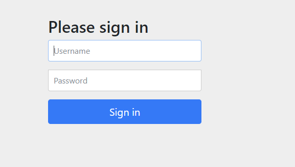
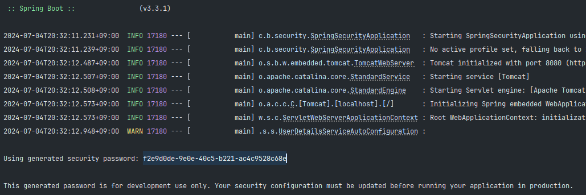
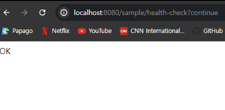

## Spring Security
스프링에서는 서버가 기동하면 스프링 시큐리티의 초기화 작업 및 보안 설정이 이루어지는데 이는 별도 설정이나 코드를 작성하지 않아도 **기본적인 웹 보안 기능이 현재 시스템에 연동되어 작동**한다.
- **기본 로그인 페이지 제공**:
    - 스프링 시큐리티는 기본 로그인 페이지를 제공합니다. 사용자가 특정 URL에 접근할 때 인증이 필요하면 자동으로 이 페이지로 리다이렉트됩니다.
- **기본 사용자 계정 생성**:
    - 기본적으로 "user"라는 사용자 이름과 애플리케이션 시작 시 생성되는 랜덤 패스워드를 사용하여 로그인을 할 수 있습니다. 이 패스워드는 콘솔에 출력됩니다.
- **기본적인 HTTP 보안 설정**:
    - 모든 요청은 인증을 필요로 합니다.
    - 특정 URL 패턴에 대해 기본 접근 제어가 적용됩니다. 예를 들어, "/css/**", "/js/**" 등 정적 리소스는 보통 인증 없이 접근 가능하게 설정됩니다.
- **CSRF (Cross-Site Request Forgery) 보호**:
    - 기본적으로 CSRF 보호가 활성화되어 있습니다. 이는 폼 기반 로그인, 로그아웃, 기타 상태 변경 요청에 대해 CSRF 토큰이 필요함을 의미합니다.
- **세션 관리**:
    - 세션 고정 보호(Session Fixation Protection)가 활성화됩니다. 이는 사용자가 인증된 후 세션 아이디가 변경됨을 보장하여 세션 하이재킹을 방지합니다.
- **디폴트 로그아웃 기능**:
    - "/logout" URL을 통해 로그아웃할 수 있는 기본 로그아웃 기능이 제공됩니다. 로그아웃 후에는 세션이 무효화되고 사용자는 로그인 페이지로 리다이렉트됩니다.
- **비밀번호 암호화**:
    - 기본적으로 비밀번호는 BCryptPasswordEncoder를 사용하여 암호화됩니다. 이는 보안 강화를 위해 비밀번호를 해시 처리하여 저장합니다.

스프링 부트가 기동될 때 위와 같은 기본 보안 설정은 `SpringBootWebSecurityConfiguration` 클래스를 통해 설정됩니다. 이 클래스는 스프링 시큐리티의 자동 구성(auto-configuration) 기능을 이용하여 기본적인 보안 설정을 자동으로 적용합니다.

### 기본 인증 방식 form, httpBasic
| 항목 | Form-based Authentication | HTTP Basic Authentication |
| --- | --- | --- |
| 인증 방식 | HTML 폼을 통한 사용자 이름과 비밀번호 입력 | HTTP 헤더에 사용자 이름과 비밀번호 포함 |
| 사용자 인터페이스 | 사용자 정의 로그인 페이지 제공 가능 | 브라우저 기본 인증 팝업 사용 |
| 보안 수준 | 상대적으로 높은 보안, 비밀번호 암호화 가능 | 보안이 낮음, 비밀번호가 Base64로 인코딩되어 전송 |
| CSRF 보호 | 기본적으로 CSRF 보호 활성화 | CSRF 보호를 위한 추가 설정 필요 |
| 세션 관리 | 세션 관리 가능, 세션 고정 보호 설정 가능 | 세션 관리 없음, 매 요청마다 자격 증명 필요 |
| 기본 설정 여부 | 스프링 시큐리티에서 기본 제공 | 스프링 시큐리티에서 기본 제공 |
| 비밀번호 암호화 | 가능, BCrypt 등 다양한 암호화 알고리즘 사용 가능 | 불가능, 기본적으로 Base64 인코딩만 사용 |
| 사용 사례 | 웹 애플리케이션에서 주로 사용 | 간단한 API 또는 내부 시스템 간 통신에서 사용 |
| 커스터마이징 | 로그인 페이지, 오류 페이지 등 커스터마이징 가능 | 커스터마이징 거의 불가능 |
| 상태 | 상태 기반 인증 (세션 또는 JWT 사용 가능) | 상태 비저장 (stateless) 인증 |

  
### 기본 설정기능을 확인해 보기
기본적으로 자원에 접근하려 시도하면 인증을 요청한다.  
  
  
기본적으로 user 계정과 password를 생성한다.  
  
  
제공되는 password로 로그인에 성공하게 되면 자원에 접근할 수 있게 된다.  
  
  
해당 기본 계정은 `SecurityProperties` 클레스에서 생성해준다.  
```java
@ConfigurationProperties(
    prefix = "spring.security"
)
public class SecurityProperties {
    public static final int BASIC_AUTH_ORDER = 2147483642;
    public static final int IGNORED_ORDER = Integer.MIN_VALUE;
    public static final int DEFAULT_FILTER_ORDER = -100;
    private final Filter filter = new Filter();
    private final User user = new User();

    public SecurityProperties() {
    }

    public User getUser() {
        return this.user;
    }
  //....
  public static class User {
      private String name = "user";
      private String password = UUID.randomUUID().toString();
      private List<String> roles = new ArrayList();
      private boolean passwordGenerated = true;

      public User() {
      }
      //...
  }
}
```
이렇게 사용자를 자동으로 만들고 우리가 특정 자원에 접근하려할때 로그인 페이지로 인증을 해야하는데 이를 담당하는 클레스가 `SpringBootWebSecurityConfiguration` 이다.  
위 클래스에서 SpringBootWebSecurityConfiguration를 가져옵니다. 이 클래스는 기본 보안 설정을 담당합니다. 예를 들어, 기본 사용자 계정 생성, 기본 로그인 페이지 제공, CSRF 보호 활성화 등의 설정이 여기에 포함됩니다.  

해당 클레스 해서 생성하는 빈 : defaultSecurityFilterChain
```java

@Bean
@Order(2147483642)
SecurityFilterChain defaultSecurityFilterChain(HttpSecurity http) throws Exception {
  http.authorizeHttpRequests((requests) -> {
    ((AuthorizeHttpRequestsConfigurer.AuthorizedUrl)requests.anyRequest()).authenticated();
  });
  http.formLogin(Customizer.withDefaults());
  http.httpBasic(Customizer.withDefaults());
  return (SecurityFilterChain)http.build();
}
```
위 예시는 기본 사용자 계정 설정, 모든 요청에 대한 인증 요구, 기본 로그인 폼 제공, 기본 HTTP 기본 인증 제공 등의 설정을 포함합니다. BCryptPasswordEncoder를 사용하여 비밀번호 암호화도 설정됩니다.

스프링 부트의 자동 구성은 이러한 설정을 기본으로 제공하여 별도의 추가 설정 없이도 기본적인 보안 기능을 사용할 수 있도록 해줍니다. 